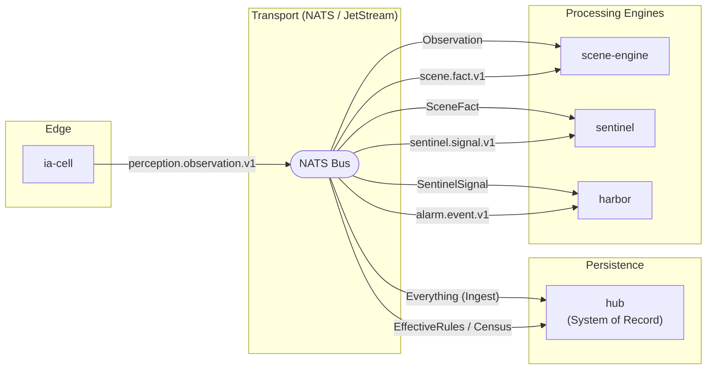
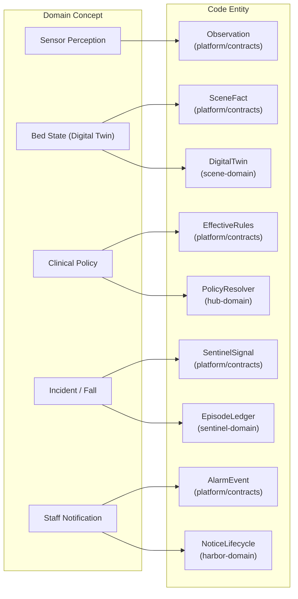

# mana-hive Overview

Relevant source files

- [](https://github.com/kerrvisiona-sudo/hive2/blob/f8142c8f/.gitignore)
- [](https://github.com/kerrvisiona-sudo/hive2/blob/f8142c8f/README.md?plain=1)
- [](https://github.com/kerrvisiona-sudo/hive2/blob/f8142c8f/settings.gradle.kts)

The **mana-hive** platform is a distributed, event-driven night-watch care monitoring system. Its primary mission is to ensure that "the right person reaches the right room in time, with the fewest false alarms possible" while maintaining a complete, machine-reproducible audit trail of every decision made by the system [README.md3-5](https://github.com/kerrvisiona-sudo/hive2/blob/f8142c8f/README.md?plain=1#L3-L5)

The platform transitions from raw sensor data (perception) to high-level clinical incidents (sentinel) and finally to managed human alerts (harbor/harbor), using **NATS JetStream** as the central nervous system and a **Postgres-backed Hub** as the immutable System of Record [README.md14-33](https://github.com/kerrvisiona-sudo/hive2/blob/f8142c8f/README.md?plain=1#L14-L33)

### Core Philosophy

- **Event-Driven Architecture:** All communication between subsystems happens via versioned event contracts over NATS JetStream [README.md16-32](https://github.com/kerrvisiona-sudo/hive2/blob/f8142c8f/README.md?plain=1#L16-L32)
- **Purity at the Core:** Engines are built using a "pure domain" approach (enforced by the `manahive.pure-domain` Gradle plugin), where core logic is isolated from infrastructure [README.md68-70](https://github.com/kerrvisiona-sudo/hive2/blob/f8142c8f/README.md?plain=1#L68-L70)
- **Machine Reproducibility:** Every decision includes fingerprints of the engine version, rules, and input state, allowing the Hub to answer exactly why an alarm did or did not ring at a specific time [README.md42-49](https://github.com/kerrvisiona-sudo/hive2/blob/f8142c8f/README.md?plain=1#L42-L49)

---

### System Context Diagram

This diagram maps the conceptual flow of information to the specific code entities and NATS subjects used in the platform.

**High-Level Data Pipeline**



```mermaid
ia-cell
   │
   │ perception.observation.v1
   ▼
NATS / JetStream
   ├── Everything (Ingest) ──────────► hub
   ├── EffectiveRules / Census ───────► hub
   │
   ├── Observation ───────────────────► scene-engine
   │                                      │
   │◄──── scene.fact.v1 ──────────────────┘
   │
   ├── SceneFact ─────────────────────► sentinel
   │                                      │
   │◄──── sentinel.signal.v1 ─────────────┘
   │
   ├── SentinelSignal ────────────────► harbor
   │
   └── alarm.event.v1 ────────────────► harbor
```

**Sources:** [README.md13-33](https://github.com/kerrvisiona-sudo/hive2/blob/f8142c8f/README.md?plain=1#L13-L33) [settings.gradle.kts22-50](https://github.com/kerrvisiona-sudo/hive2/blob/f8142c8f/settings.gradle.kts#L22-L50)

---

### Key Subsystems

The platform is organized into three main layers: the **Platform Layer** (shared kernels), the **Engines** (specialized processors), and the **Hub** (the ledger).

|Subsystem|Role|Key Code Entities|
|---|---|---|
|**Scene Engine**|Digital Twin tracking. Converts raw observations into bed-occupancy states and movement facts.|`DigitalTwin`, `SceneInterpreter`, `ClockSweeper`|
|**Sentinel**|Clinical Judgment. Evaluates scene facts against resident-specific policies to identify incidents.|`SentinelEvaluator`, `EpisodeLedger`, `FatigueBudget`|
|**Harbor**|Alert Delivery. Manages the lifecycle of a notification, including routing and escalation.|`NoticeLifecycle`, `NoticeRouter`, `HarborEngine`|
|**Politica**|Policy Translation. Converts administrative settings from the Hub into engine-readable calibrations.|`PolicyResolver`, `CalibrationProvider`|
|**Hub**|System of Record. Stores the global event ledger and manages census/policy data.|`EventStore`, `LedgerController`, `NatsIngestListener`|

**Sources:** [README.md53-66](https://github.com/kerrvisiona-sudo/hive2/blob/f8142c8f/README.md?plain=1#L53-L66) [settings.gradle.kts22-50](https://github.com/kerrvisiona-sudo/hive2/blob/f8142c8f/settings.gradle.kts#L22-L50)

---

### Logical Component Mapping

This diagram bridges the "Natural Language Space" of the care domain to the "Code Entity Space" of the repository.

**Domain-to-Code Mapping**

```
Sensor Perception
        │
        └── Observation


Bed State (Digital Twin)
        ├── SceneFact
        └── DigitalTwin


Clinical Policy
        ├── EffectiveRules
        └── PolicyResolver


Incident / Fall
        ├── SentinelSignal
        └── EpisodeLedger


Staff Notificationprodu`````````
        ├── AlarmEvent
        └── NoticeLifecycle
```


**Sources:** [README.md35-43](https://github.com/kerrvisiona-sudo/hive2/blob/f8142c8f/README.md?plain=1#L35-L43) [README.md53-65](https://github.com/kerrvisiona-sudo/hive2/blob/f8142c8f/README.md?plain=1#L53-L65)

---

### Detailed Documentation Sections

For deeper technical information, refer to the following child pages:

#### [System Architecture & Data Flow](https://deepwiki.com/kerrvisiona-sudo/hive2/1.1-system-architecture-and-data-flow)

Details the pipe-and-filter architecture, the NATS JetStream transport topology, and a step-by-step walkthrough of a resident fall incident from detection to resolution.

#### [Getting Started & Build System](https://deepwiki.com/kerrvisiona-sudo/hive2/1.2-getting-started-and-build-system)

Instructions on setting up the development environment, using the Gradle convention plugins (`manahive.pure-domain`, `manahive.spring-service`), and understanding the multi-module project structure defined in `settings.gradle.kts`.

---

**Sources:** [README.md1-85](https://github.com/kerrvisiona-sudo/hive2/blob/f8142c8f/README.md?plain=1#L1-L85) [settings.gradle.kts1-50](https://github.com/kerrvisiona-sudo/hive2/blob/f8142c8f/settings.gradle.kts#L1-L50)


### On this page

- [mana-hive Overview](https://deepwiki.com/kerrvisiona-sudo/hive2/1-mana-hive-overview#mana-hive-overview)
- [Core Philosophy](https://deepwiki.com/kerrvisiona-sudo/hive2/1-mana-hive-overview#core-philosophy)
- [System Context Diagram](https://deepwiki.com/kerrvisiona-sudo/hive2/1-mana-hive-overview#system-context-diagram)
- [Key Subsystems](https://deepwiki.com/kerrvisiona-sudo/hive2/1-mana-hive-overview#key-subsystems)
- [Logical Component Mapping](https://deepwiki.com/kerrvisiona-sudo/hive2/1-mana-hive-overview#logical-component-mapping)
- [Detailed Documentation Sections](https://deepwiki.com/kerrvisiona-sudo/hive2/1-mana-hive-overview#detailed-documentation-sections)
- [[System Architecture & Data Flow](#1.1)](https://deepwiki.com/kerrvisiona-sudo/hive2/1-mana-hive-overview#system-architecture-data-flow11)
- [[Getting Started & Build System](#1.2)](https://deepwiki.com/kerrvisiona-sudo/hive2/1-mana-hive-overview#getting-started-build-system12)

