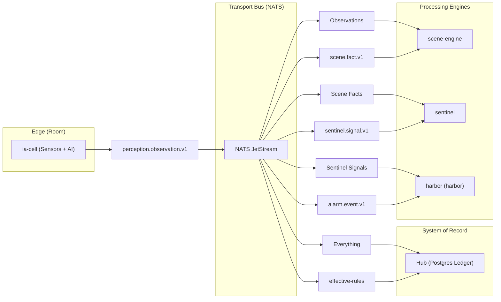
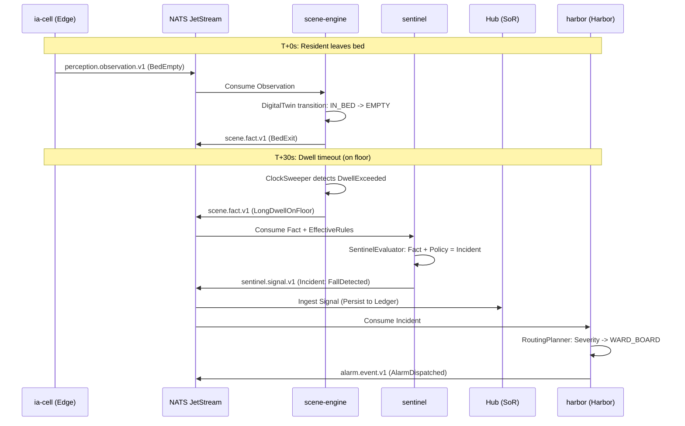

# System Architecture & Data Flow

Relevant source files

- 
- 
- 
- 

This page describes the end-to-end event pipeline of the **mana-hive** platform. The system follows a **pipe-and-filter** architectural pattern where specialized engines process streams of immutable events, coordinated by a central message bus and backed by a permanent System of Record.

## Architectural Principles

The architecture is built on three core pillars:

1. **Event-Driven Pipe-and-Filter**: Data flows through a series of transformations. Each "filter" (Engine) is a pure domain model wrapped in a thin infrastructure shell.
2. **NATS JetStream as Transport**: The bus acts as a high-performance buffer and transport mechanism with limits-based retention [platform/messaging/src/main/kotlin/com/manahive/messaging/NatsTopology.kt14-16](https://github.com/kerrvisiona-sudo/hive2/blob/f8142c8f/platform/messaging/src/main/kotlin/com/manahive/messaging/NatsTopology.kt#L14-L16)
3. **Hub as System of Record (SoR)**: While engines use the bus for real-time coordination, the Hub ingests every event into a permanent Postgres ledger for audit, clinical review, and state reconstruction [README.md45-49](https://github.com/kerrvisiona-sudo/hive2/blob/f8142c8f/README.md?plain=1#L45-L49)

### High-Level Component Map

The following diagram illustrates the relationship between physical edge devices, the processing engines, and the Hub.

**Diagram: System Component Overview**

**Sources:** [README.md13-33](https://github.com/kerrvisiona-sudo/hive2/blob/f8142c8f/README.md?plain=1#L13-L33) [platform/messaging/src/main/kotlin/com/manahive/messaging/NatsTopology.kt20-25](https://github.com/kerrvisiona-sudo/hive2/blob/f8142c8f/platform/messaging/src/main/kotlin/com/manahive/messaging/NatsTopology.kt#L20-L25)

---

## Data Flow & Subject Taxonomy

The system uses a strictly versioned subject taxonomy. Breaking changes in event schemas result in new subject versions (e.g., `v1` to `v2`), allowing for blue-green deployments of engines [platform/messaging/src/main/kotlin/com/manahive/messaging/Subjects.kt8-10](https://github.com/kerrvisiona-sudo/hive2/blob/f8142c8f/platform/messaging/src/main/kotlin/com/manahive/messaging/Subjects.kt#L8-L10)

### The Event Pipeline

1. **Perception**: The `ia-cell` emits `perception.observation.v1` events containing raw sensor data (e.g., "motion detected in bed") [platform/messaging/src/main/kotlin/com/manahive/messaging/Subjects.kt12](https://github.com/kerrvisiona-sudo/hive2/blob/f8142c8f/platform/messaging/src/main/kotlin/com/manahive/messaging/Subjects.kt#L12-L12)
2. **Scene Fact**: The `scene-engine` consumes observations to update a **Digital Twin**. It emits `scene.fact.v1` events representing high-level states like `OccupantPresent`, `BedExit`, or `StaffInRoom` [README.md35-37](https://github.com/kerrvisiona-sudo/hive2/blob/f8142c8f/README.md?plain=1#L35-L37) [platform/messaging/src/main/kotlin/com/manahive/messaging/Subjects.kt13](https://github.com/kerrvisiona-sudo/hive2/blob/f8142c8f/platform/messaging/src/main/kotlin/com/manahive/messaging/Subjects.kt#L13-L13)
3. **Sentinel Signal**: The `sentinel` engine evaluates Scene Facts against resident-specific `EffectiveRules`. It emits `sentinel.signal.v1`, which categorizes events as `Incidents` (potential alarms) or `Occurrences` (clinical data) [README.md37-39](https://github.com/kerrvisiona-sudo/hive2/blob/f8142c8f/README.md?plain=1#L37-L39) [platform/messaging/src/main/kotlin/com/manahive/messaging/Subjects.kt14](https://github.com/kerrvisiona-sudo/hive2/blob/f8142c8f/platform/messaging/src/main/kotlin/com/manahive/messaging/Subjects.kt#L14-L14)
4. **Alarm Event**: The `harbor` (harbor) engine manages the human-facing alert lifecycle, emitting `alarm.event.v1` to track delivery, acknowledgments, and escalations [README.md39-41](https://github.com/kerrvisiona-sudo/hive2/blob/f8142c8f/README.md?plain=1#L39-L41) [platform/messaging/src/main/kotlin/com/manahive/messaging/Subjects.kt15](https://github.com/kerrvisiona-sudo/hive2/blob/f8142c8f/platform/messaging/src/main/kotlin/com/manahive/messaging/Subjects.kt#L15-L15)

### Transport Configuration

NATS JetStream is configured with **Limits-based retention**. The bus is not the source of truth; it is a buffer for active processing [platform/messaging/src/main/kotlin/com/manahive/messaging/NatsTopology.kt32](https://github.com/kerrvisiona-sudo/hive2/blob/f8142c8f/platform/messaging/src/main/kotlin/com/manahive/messaging/NatsTopology.kt#L32-L32)

|Stream Name|Subjects|Purpose|
|---|---|---|
|`PERCEPTION`|`perception.observation.v1.>`|Raw sensor observations from edge.|
|`SCENE`|`scene.fact.v1.>`|State transitions from Digital Twins.|
|`SENTINEL`|`sentinel.signal.v1.>`|Judgments based on clinical policy.|
|`ALARM`|`alarm.event.v1.>`|Alert lifecycle and delivery status.|

**Sources:** [platform/messaging/src/main/kotlin/com/manahive/messaging/NatsTopology.kt20-35](https://github.com/kerrvisiona-sudo/hive2/blob/f8142c8f/platform/messaging/src/main/kotlin/com/manahive/messaging/NatsTopology.kt#L20-L35) [platform/messaging/src/main/kotlin/com/manahive/messaging/Subjects.kt20-24](https://github.com/kerrvisiona-sudo/hive2/blob/f8142c8f/platform/messaging/src/main/kotlin/com/manahive/messaging/Subjects.kt#L20-L24)

---

## Incident Walkthrough: Resident Fall

To illustrate the architecture, here is the sequence of events and code entities involved in a "Resident Fall" incident.

**Scenario:** A resident exits the bed at 03:00 and remains on the floor (dwell time exceeded).

**Diagram: Fall Incident Sequence**

### Key Code Entities in the Flow

- **`DigitalTwin`**: Maintains the state of a single bed in `scene-engine` [README.md60](https://github.com/kerrvisiona-sudo/hive2/blob/f8142c8f/README.md?plain=1#L60-L60)
- **`ClockSweeper`**: A periodic process in `scene-engine` that triggers facts based on time (e.g., a resident staying too long in a "fallen" state) [README.md60-61](https://github.com/kerrvisiona-sudo/hive2/blob/f8142c8f/README.md?plain=1#L60-L61)
- **`SentinelEvaluator`**: A pure function that takes a `SceneFact` and the resident's `EpisodeLedger` to produce a `SentinelVerdict` [README.md62](https://github.com/kerrvisiona-sudo/hive2/blob/f8142c8f/README.md?plain=1#L62-L62)
- **`PolicyResolver`**: Resides in the Hub; resolves layered clinical policies into the `EffectiveRules` used by Sentinel [README.md58](https://github.com/kerrvisiona-sudo/hive2/blob/f8142c8f/README.md?plain=1#L58-L58)
- **`AlertLifecycle`**: A `Decider` in Harbor that tracks the state machine of an alert (Created -> Dispatched -> Seen -> Resolved) [README.md64](https://github.com/kerrvisiona-sudo/hive2/blob/f8142c8f/README.md?plain=1#L64-L64)

**Sources:** [README.md35-43](https://github.com/kerrvisiona-sudo/hive2/blob/f8142c8f/README.md?plain=1#L35-L43) [README.md58-65](https://github.com/kerrvisiona-sudo/hive2/blob/f8142c8f/README.md?plain=1#L58-L65) [platform/messaging/src/main/kotlin/com/manahive/messaging/Subjects.kt12-16](https://github.com/kerrvisiona-sudo/hive2/blob/f8142c8f/platform/messaging/src/main/kotlin/com/manahive/messaging/Subjects.kt#L12-L16)

---

## The Hub: System of Record

The Hub is the final destination for every event on the bus. It serves as the **Administrative Truth** and the **Chronicle** of the system [README.md41-43](https://github.com/kerrvisiona-sudo/hive2/blob/f8142c8f/README.md?plain=1#L41-L43)

### Ledger and Reproducibility

Every decision made by an engine includes a `DecisionRecord`. This record contains fingerprints of the engine version, the rules applied, and the input stimulus [README.md47-49](https://github.com/kerrvisiona-sudo/hive2/blob/f8142c8f/README.md?plain=1#L47-L49) Because the Hub stores the global sequence of events in its Postgres ledger, any clinical decision can be machine-reproduced by replaying the exact same inputs through the same engine version [README.md48-49](https://github.com/kerrvisiona-sudo/hive2/blob/f8142c8f/README.md?plain=1#L48-L49)

**Sources:** [README.md7-9](https://github.com/kerrvisiona-sudo/hive2/blob/f8142c8f/README.md?plain=1#L7-L9) [README.md45-49](https://github.com/kerrvisiona-sudo/hive2/blob/f8142c8f/README.md?plain=1#L45-L49)

### On this page

- [System Architecture & Data Flow](https://deepwiki.com/kerrvisiona-sudo/hive2/1.1-system-architecture-and-data-flow#system-architecture-data-flow)
- [Architectural Principles](https://deepwiki.com/kerrvisiona-sudo/hive2/1.1-system-architecture-and-data-flow#architectural-principles)
- [High-Level Component Map](https://deepwiki.com/kerrvisiona-sudo/hive2/1.1-system-architecture-and-data-flow#high-level-component-map)
- [Data Flow & Subject Taxonomy](https://deepwiki.com/kerrvisiona-sudo/hive2/1.1-system-architecture-and-data-flow#data-flow-subject-taxonomy)
- [The Event Pipeline](https://deepwiki.com/kerrvisiona-sudo/hive2/1.1-system-architecture-and-data-flow#the-event-pipeline)
- [Transport Configuration](https://deepwiki.com/kerrvisiona-sudo/hive2/1.1-system-architecture-and-data-flow#transport-configuration)
- [Incident Walkthrough: Resident Fall](https://deepwiki.com/kerrvisiona-sudo/hive2/1.1-system-architecture-and-data-flow#incident-walkthrough-resident-fall)
- [Key Code Entities in the Flow](https://deepwiki.com/kerrvisiona-sudo/hive2/1.1-system-architecture-and-data-flow#key-code-entities-in-the-flow)
- [The Hub: System of Record](https://deepwiki.com/kerrvisiona-sudo/hive2/1.1-system-architecture-and-data-flow#the-hub-system-of-record)
- [Ledger and Reproducibility](https://deepwiki.com/kerrvisiona-sudo/hive2/1.1-system-architecture-and-data-flow#ledger-and-reproducibility)

