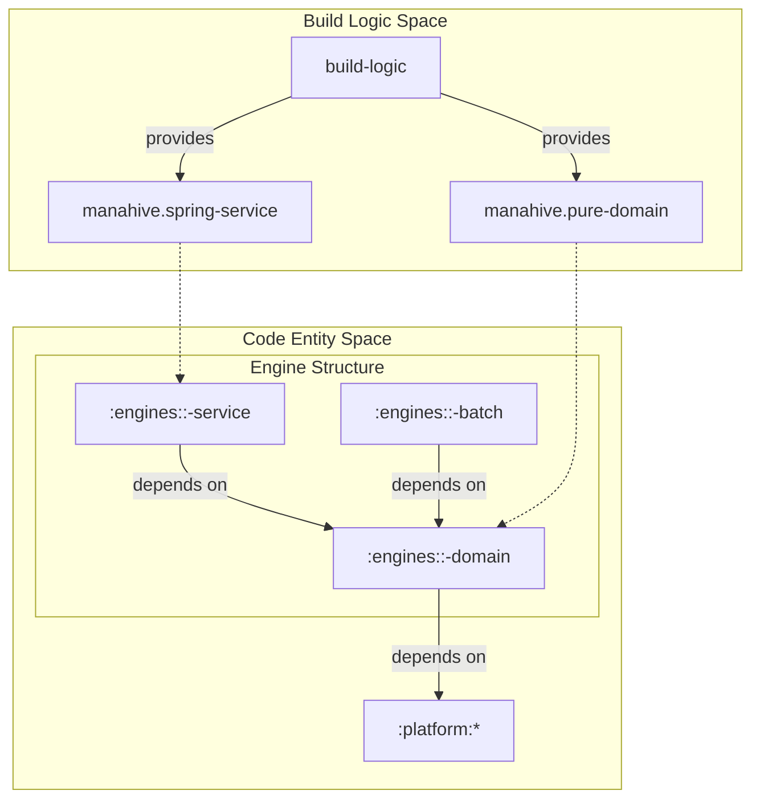
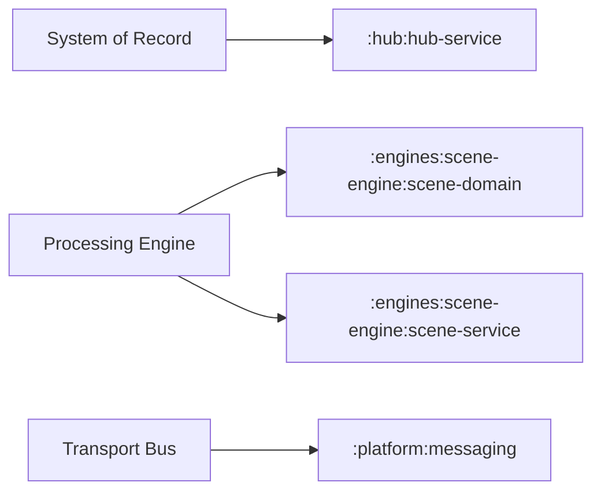

# Getting Started & Build System

Relevant source files

- 
- 
- 
- 
- 

This page details the development environment, build lifecycle, and project structure of the `mana-hive` platform. It covers the Gradle-based build system, the use of convention plugins to enforce architectural boundaries, and local configuration management.

## Build System Overview

The project uses **Gradle** as its primary build tool, utilizing the Kotlin DSL (`.gradle.kts`) for build scripts. To ensure build reproducibility across different environments, the project includes the Gradle Wrapper [gradlew1-83](https://github.com/kerrvisiona-sudo/hive2/blob/f8142c8f/gradlew#L1-L83)

### Performance Configuration

The build is optimized for developer productivity through several flags defined in `gradle.properties`:

- **Configuration Caching**: `org.gradle.configuration-cache=true` speeds up build initialization by reusing the result of the configuration phase [gradle.properties1](https://github.com/kerrvisiona-sudo/hive2/blob/f8142c8f/gradle.properties#L1-L1)
- **Build Caching**: `org.gradle.caching=true` allows Gradle to reuse outputs from previous builds [gradle.properties2](https://github.com/kerrvisiona-sudo/hive2/blob/f8142c8f/gradle.properties#L2-L2)
- **Parallel Execution**: `org.gradle.parallel=true` enables concurrent execution of independent modules [gradle.properties3](https://github.com/kerrvisiona-sudo/hive2/blob/f8142c8f/gradle.properties#L3-L3)

### Project Structure

The repository is organized into four main functional areas defined in `settings.gradle.kts` [settings.gradle.kts22-50](https://github.com/kerrvisiona-sudo/hive2/blob/f8142c8f/settings.gradle.kts#L22-L50):

|Area|Purpose|Modules|
|---|---|---|
|**Platform**|Shared kernel, contracts, and NATS infrastructure|`:platform:domain-kernel`, `:platform:contracts`, etc.|
|**Hub**|The System of Record and persistence layer|`:hub:hub-domain`, `:hub:hub-service`, `:hub:hub-batch`|
|**Engines**|Processing units (Scene, Sentinel, Harbor, etc.)|`:engines::<domain|
|**Tooling**|Offline testing and simulation|`:simulator`|

**Sources:** [settings.gradle.kts1-50](https://github.com/kerrvisiona-sudo/hive2/blob/f8142c8f/settings.gradle.kts#L1-L50) [gradle.properties1-4](https://github.com/kerrvisiona-sudo/hive2/blob/f8142c8f/gradle.properties#L1-L4)

---

## Build Logic & Convention Plugins

`mana-hive` employs an "Included Build" strategy for its build logic. The `build-logic` directory contains standalone Gradle plugins that encapsulate shared configuration [settings.gradle.kts1-7](https://github.com/kerrvisiona-sudo/hive2/blob/f8142c8f/settings.gradle.kts#L1-L7) This prevents duplication and enforces the "Pure Core + Thin Shell" architectural pattern.

### Key Convention Plugins

1. **`manahive.pure-domain`**
    - **Applied to**: All `*-domain` modules.
    - **Constraints**: These modules are restricted from depending on heavy frameworks (like Spring) or infrastructure (like NATS/Postgres). They focus on pure functions and event-sourced logic.
2. **`manahive.spring-service`**
    - **Applied to**: All `*-service` modules.
    - **Function**: Configures the Spring Boot runtime, dependency injection, and health checks. These modules act as the "shell" that hosts the pure domain logic.

### Dependency Flow Diagram

The following diagram illustrates how the build system enforces the relationship between different module types.

**Build System Entity Relationship**

**Sources:** [settings.gradle.kts1-7](https://github.com/kerrvisiona-sudo/hive2/blob/f8142c8f/settings.gradle.kts#L1-L7) [settings.gradle.kts22-48](https://github.com/kerrvisiona-sudo/hive2/blob/f8142c8f/settings.gradle.kts#L22-L48)

---

## Local Configuration (`local.properties`)

The system supports environment-specific overrides through a `local.properties` file. This file is explicitly excluded from version control to prevent sensitive data or machine-specific paths from being leaked [.gitignore6](https://github.com/kerrvisiona-sudo/hive2/blob/f8142c8f/%20.gitignore#L6-L6)

### Usage Patterns

- **NATS Connection**: Overriding the default NATS URL for local development.
- **Database Credentials**: Providing local Postgres credentials for `hub-service`.
- **Simulator Paths**: Pointing the `simulator` or `batch` tools to local scenario files.

The infrastructure layer (specifically in `platform:infrastructure`) is responsible for merging these local properties with the default TOML-based configurations.

**Sources:** [.gitignore1-11](https://github.com/kerrvisiona-sudo/hive2/blob/f8142c8f/.gitignore#L1-L11)

---

## Module Hierarchy & Data Flow

The `settings.gradle.kts` file defines a hierarchical structure that reflects the system's event-driven pipeline. Engines are split into three distinct sub-modules to maintain a clean separation of concerns.

### Engine Module Breakdown

|Module Suffix|Role|Dependencies|
|---|---|---|
|`*-domain`|Pure business logic, `Decider` implementations, and state transitions.|`platform:domain-kernel`, `platform:contracts`|
|`*-service`|Spring Boot application, NATS listeners, and REST controllers.|`*-domain`, `platform:messaging`|
|`*-batch`|CLI tool for replaying events and verifying logic offline.|`*-domain`, `platform:infrastructure`|

### System Assembly Map

This diagram maps the natural language "System Components" to their specific code identifiers in the Gradle project.

**System Component Mapping**

**Sources:** [settings.gradle.kts22-50](https://github.com/kerrvisiona-sudo/hive2/blob/f8142c8f/settings.gradle.kts#L22-L50)

