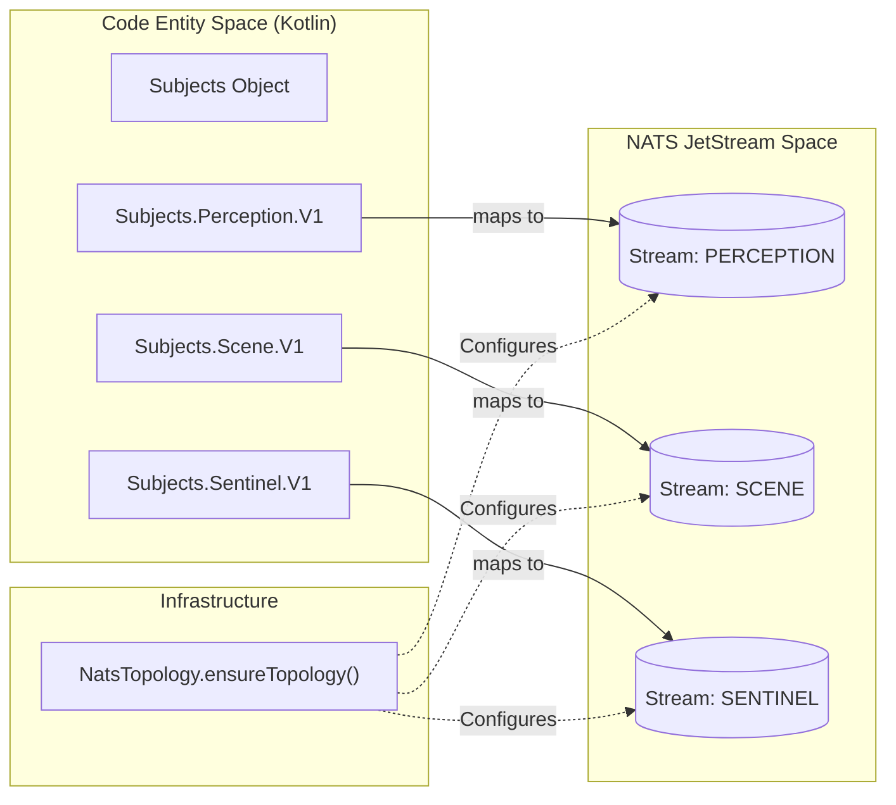
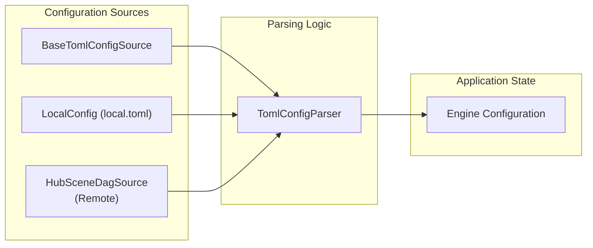

# Platform Layer

Relevant source files

- 
- 
- 

The **Platform Layer** consists of the foundational modules that underpin the entire Hive2 ecosystem. It establishes the "Published Language" for communication between engines, defines the core mathematical and logical abstractions for event-sourced processing, and provides the infrastructure for messaging and configuration.

All engines (Scene, Sentinel, Harbor, etc.) and services (Hub) depend on these shared modules to ensure architectural consistency and type safety across the distributed system.

### Core Modules Overview

|Module|Purpose|Key Abstractions|
|---|---|---|
|`platform:domain-kernel`|Pure logic abstractions and value types.|`Engine`, `Decider`, `DecisionRecord`, `BedId`|
|`platform:contracts`|The schema for all inter-engine events.|`EventEnvelope`, `Observation`, `SceneFact`|
|`platform:messaging`|NATS JetStream transport implementation.|`NatsTopology`, `Subjects`, `EventSerializer`|
|`platform:infrastructure`|Shared configuration and I/O utilities.|`TomlConfigParser`, `HubSceneDagSource`|

---

### 2.1 Domain Kernel

The `domain-kernel` module is the bedrock of the system, containing only pure Kotlin code with no external dependencies [platform/domain-kernel/build.gradle.kts1](https://github.com/kerrvisiona-sudo/hive2/blob/f8142c8f/platform/domain-kernel/build.gradle.kts#L1-L1) It defines the interfaces that enforce the "Pure Domain" pattern used throughout Hive2.

- **The Engine Interface**: A functional contract for processing a stimulus and state into a set of effects [platform/domain-kernel/src/main/kotlin/mana/hive/platform/kernel/Engine.kt6-10](https://github.com/kerrvisiona-sudo/hive2/blob/f8142c8f/platform/domain-kernel/src/main/kotlin/mana/hive/platform/kernel/Engine.kt#L6-L10)
- **The Decider Interface**: The core of Hive2's event-sourcing, managing state transitions based on incoming commands [platform/domain-kernel/src/main/kotlin/mana/hive/platform/kernel/Decider.kt3-12](https://github.com/kerrvisiona-sudo/hive2/blob/f8142c8f/platform/domain-kernel/src/main/kotlin/mana/hive/platform/kernel/Decider.kt#L3-L12)
- **Strongly Typed IDs**: Value classes like `BedId`, `ResidentId`, and `EpisodeId` prevent primitive obsession and ensure type safety across the pipeline [platform/domain-kernel/src/main/kotlin/mana/hive/platform/kernel/Ids.kt3-15](https://github.com/kerrvisiona-sudo/hive2/blob/f8142c8f/platform/domain-kernel/src/main/kotlin/mana/hive/platform/kernel/Ids.kt#L3-L15)
- **Audit Telemetry**: The `DecisionRecord` captures the "why" behind every engine output, including input fingerprints and reasoning strings [platform/domain-kernel/src/main/kotlin/mana/hive/platform/kernel/DecisionRecord.kt5-15](https://github.com/kerrvisiona-sudo/hive2/blob/f8142c8f/platform/domain-kernel/src/main/kotlin/mana/hive/platform/kernel/DecisionRecord.kt#L5-L15)

For detailed interface definitions and value type usage, see **[Domain Kernel](https://deepwiki.com/kerrvisiona-sudo/hive2/2.1-domain-kernel)**.

**Sources:** [platform/domain-kernel/build.gradle.kts1](https://github.com/kerrvisiona-sudo/hive2/blob/f8142c8f/platform/domain-kernel/build.gradle.kts#L1-L1) [platform/domain-kernel/src/main/kotlin/mana/hive/platform/kernel/Engine.kt6-10](https://github.com/kerrvisiona-sudo/hive2/blob/f8142c8f/platform/domain-kernel/src/main/kotlin/mana/hive/platform/kernel/Engine.kt#L6-L10) [platform/domain-kernel/src/main/kotlin/mana/hive/platform/kernel/Decider.kt3-12](https://github.com/kerrvisiona-sudo/hive2/blob/f8142c8f/platform/domain-kernel/src/main/kotlin/mana/hive/platform/kernel/Decider.kt#L3-L12) [platform/domain-kernel/src/main/kotlin/mana/hive/platform/kernel/Ids.kt3-15](https://github.com/kerrvisiona-sudo/hive2/blob/f8142c8f/platform/domain-kernel/src/main/kotlin/mana/hive/platform/kernel/Ids.kt#L3-L15) [platform/domain-kernel/src/main/kotlin/mana/hive/platform/kernel/DecisionRecord.kt5-15](https://github.com/kerrvisiona-sudo/hive2/blob/f8142c8f/platform/domain-kernel/src/main/kotlin/mana/hive/platform/kernel/DecisionRecord.kt#L5-L15)

---

### 2.2 Event Contracts (Published Language)

The `contracts` module defines the **Published Language** of the system. Every event emitted onto the NATS bus must be defined here to ensure that producers and consumers remain synchronized.

- **EventEnvelope**: Every message is wrapped in an `EventEnvelope`, providing a uniform wire format that includes an `idempotencyKey`, `version`, and `occurredAt` timestamp [platform/contracts/src/main/kotlin/mana/hive/platform/contracts/EventEnvelope.kt5-15](https://github.com/kerrvisiona-sudo/hive2/blob/f8142c8f/platform/contracts/src/main/kotlin/mana/hive/platform/contracts/EventEnvelope.kt#L5-L15)
- **Domain Events**: Specific schemas for `Observation` (from sensors), `SceneFact` (from Scene Engine), and `SentinelSignal` (from Sentinel) [platform/contracts/src/main/kotlin/mana/hive/platform/contracts/scene/SceneFact.kt7-12](https://github.com/kerrvisiona-sudo/hive2/blob/f8142c8f/platform/contracts/src/main/kotlin/mana/hive/platform/contracts/scene/SceneFact.kt#L7-L12)
- **Immutability**: All contracts are immutable data classes, ensuring that once an event is published, its state cannot be altered by downstream consumers.

For schema definitions and versioning rules, see **[Event Contracts (Published Language)](https://deepwiki.com/kerrvisiona-sudo/hive2/2.2-event-contracts-\(published-language\))**.

**Sources:** [platform/contracts/build.gradle.kts1-5](https://github.com/kerrvisiona-sudo/hive2/blob/f8142c8f/platform/contracts/build.gradle.kts#L1-L5) [platform/contracts/src/main/kotlin/mana/hive/platform/contracts/EventEnvelope.kt5-15](https://github.com/kerrvisiona-sudo/hive2/blob/f8142c8f/platform/contracts/src/main/kotlin/mana/hive/platform/contracts/EventEnvelope.kt#L5-L15) [platform/contracts/src/main/kotlin/mana/hive/platform/contracts/scene/SceneFact.kt7-12](https://github.com/kerrvisiona-sudo/hive2/blob/f8142c8f/platform/contracts/src/main/kotlin/mana/hive/platform/contracts/scene/SceneFact.kt#L7-L12)

---

### 2.3 Messaging Infrastructure

Hive2 uses **NATS JetStream** for persistent, asynchronous messaging. The `messaging` module provides the implementation for stream declaration and message routing.

#### Code to Infrastructure Mapping

The following diagram illustrates how the `Subjects` object in code maps to the physical NATS JetStream topology.

**Sources:** [platform/messaging/src/main/kotlin/mana/hive/platform/messaging/Subjects.kt5-20](https://github.com/kerrvisiona-sudo/hive2/blob/f8142c8f/platform/messaging/src/main/kotlin/mana/hive/platform/messaging/Subjects.kt#L5-L20) [platform/messaging/src/main/kotlin/mana/hive/platform/messaging/NatsTopology.kt10-30](https://github.com/kerrvisiona-sudo/hive2/blob/f8142c8f/platform/messaging/src/main/kotlin/mana/hive/platform/messaging/NatsTopology.kt#L10-L30)

- **NatsTopology**: Responsible for the idempotent creation of streams and consumers, enforcing retention policies (e.g., `Limits` based retention) [platform/messaging/src/main/kotlin/mana/hive/platform/messaging/NatsTopology.kt15-25](https://github.com/kerrvisiona-sudo/hive2/blob/f8142c8f/platform/messaging/src/main/kotlin/mana/hive/platform/messaging/NatsTopology.kt#L15-L25)
- **Durable Consumers**: Each engine uses a named durable consumer to track its position (offset) in the stream, allowing for restarts without data loss.

For NATS configuration and stream details, see **[Messaging Infrastructure (NATS JetStream)](https://deepwiki.com/kerrvisiona-sudo/hive2/2.3-messaging-infrastructure-\(nats-jetstream\))**.

---

### 2.4 Infrastructure & Configuration

The `infrastructure` module provides the "plumbing" for the system, specifically focusing on how the application loads its operational parameters.

#### Configuration Loading Flow

The system uses a layered TOML configuration approach, allowing for defaults to be overridden by environment-specific files.

**Sources:** [platform/infrastructure/src/main/kotlin/mana/hive/platform/infrastructure/config/TomlConfigParser.kt8-18](https://github.com/kerrvisiona-sudo/hive2/blob/f8142c8f/platform/infrastructure/src/main/kotlin/mana/hive/platform/infrastructure/config/TomlConfigParser.kt#L8-L18) [platform/infrastructure/src/main/kotlin/mana/hive/platform/infrastructure/config/BaseTomlConfigSource.kt5-12](https://github.com/kerrvisiona-sudo/hive2/blob/f8142c8f/platform/infrastructure/src/main/kotlin/mana/hive/platform/infrastructure/config/BaseTomlConfigSource.kt#L5-L12)

- **TomlConfig**: A type-safe way to access configuration values defined in TOML files [platform/infrastructure/src/main/kotlin/mana/hive/platform/infrastructure/config/TomlConfig.kt4-10](https://github.com/kerrvisiona-sudo/hive2/blob/f8142c8f/platform/infrastructure/src/main/kotlin/mana/hive/platform/infrastructure/config/TomlConfig.kt#L4-L10)
- **Hub Integration**: The `HubSceneDagSource` allows the Scene Engine to dynamically fetch its processing logic (DAGs) from the Hub service at runtime [platform/infrastructure/src/main/kotlin/mana/hive/platform/infrastructure/hub/HubSceneDagSource.kt10-20](https://github.com/kerrvisiona-sudo/hive2/blob/f8142c8f/platform/infrastructure/src/main/kotlin/mana/hive/platform/infrastructure/hub/HubSceneDagSource.kt#L10-L20)

For details on the configuration hierarchy and remote sources, see **[Infrastructure & Configuration](https://deepwiki.com/kerrvisiona-sudo/hive2/2.4-infrastructure-and-configuration)**.

**Sources:** [platform/infrastructure/src/main/kotlin/mana/hive/platform/infrastructure/config/TomlConfigParser.kt8-18](https://github.com/kerrvisiona-sudo/hive2/blob/f8142c8f/platform/infrastructure/src/main/kotlin/mana/hive/platform/infrastructure/config/TomlConfigParser.kt#L8-L18) [platform/infrastructure/src/main/kotlin/mana/hive/platform/infrastructure/hub/HubSceneDagSource.kt10-20](https://github.com/kerrvisiona-sudo/hive2/blob/f8142c8f/platform/infrastructure/src/main/kotlin/mana/hive/platform/infrastructure/hub/HubSceneDagSource.kt#L10-L20)

### On this page

- [Platform Layer](https://deepwiki.com/kerrvisiona-sudo/hive2/2-platform-layer#platform-layer)
- [Core Modules Overview](https://deepwiki.com/kerrvisiona-sudo/hive2/2-platform-layer#core-modules-overview)
- [2.1 Domain Kernel](https://deepwiki.com/kerrvisiona-sudo/hive2/2-platform-layer#21-domain-kernel)
- [2.2 Event Contracts (Published Language)](https://deepwiki.com/kerrvisiona-sudo/hive2/2-platform-layer#22-event-contracts-published-language)
- [2.3 Messaging Infrastructure](https://deepwiki.com/kerrvisiona-sudo/hive2/2-platform-layer#23-messaging-infrastructure)
- [Code to Infrastructure Mapping](https://deepwiki.com/kerrvisiona-sudo/hive2/2-platform-layer#code-to-infrastructure-mapping)
- [2.4 Infrastructure & Configuration](https://deepwiki.com/kerrvisiona-sudo/hive2/2-platform-layer#24-infrastructure-configuration)
- [Configuration Loading Flow](https://deepwiki.com/kerrvisiona-sudo/hive2/2-platform-layer#configuration-loading-flow)

