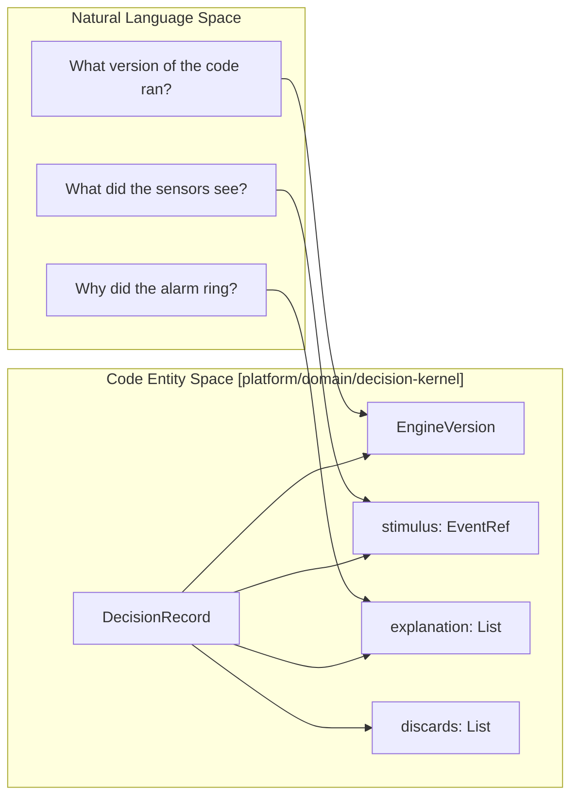
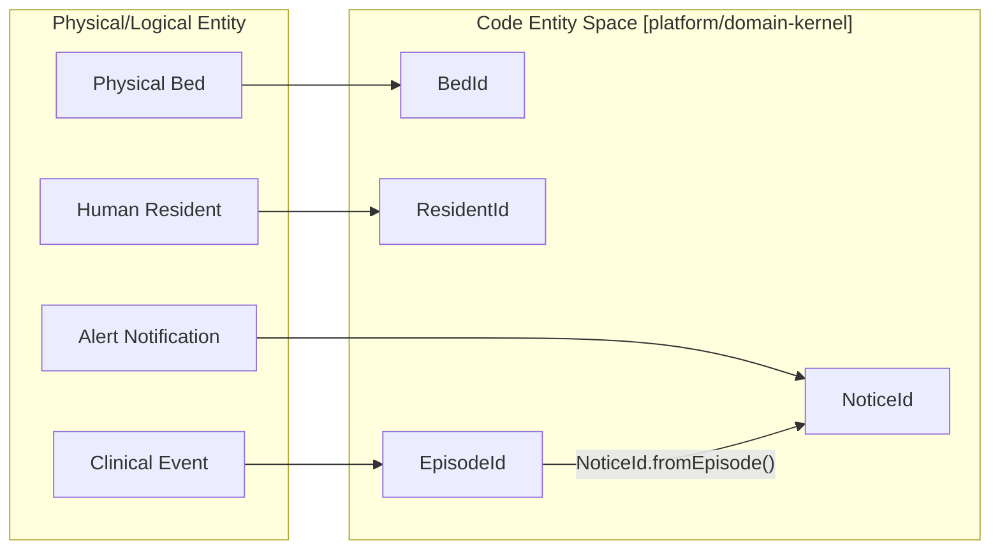

# Domain Kernel

Relevant source files

- 
- 
- 
- 
- 

The `platform/domain-kernel` module defines the foundational abstractions and primitive types for the entire mana-hive ecosystem. It establishes a strict contract for "pure domain" logic, ensuring that all decision-making processes are deterministic, machine-reproducible, and isolated from infrastructure concerns like I/O or system clocks [platform/domain-kernel/src/main/kotlin/com/manahive/kernel/Engine.kt1-10](https://github.com/kerrvisiona-sudo/hive2/blob/f8142c8f/platform/domain-kernel/src/main/kotlin/com/manahive/kernel/Engine.kt#L1-L10)

## Pure Functional Architecture

The system is built on the principle that engines are pure functions. By enforcing this at the kernel level, the platform guarantees that the same input will yield the exact same output, whether processed in real-time or replayed years later [platform/domain-kernel/src/main/kotlin/com/manahive/kernel/Engine.kt3-7](https://github.com/kerrvisiona-sudo/hive2/blob/f8142c8f/platform/domain-kernel/src/main/kotlin/com/manahive/kernel/Engine.kt#L3-L7)

### The Engine Interface

The `Engine` interface is the base contract for all domain services. It mandates that every engine carries an `EngineVersion`, which combines a semantic version with a build fingerprint to ensure the integrity of the logic during audits [platform/domain-kernel/src/main/kotlin/com/manahive/kernel/Engine.kt8-17](https://github.com/kerrvisiona-sudo/hive2/blob/f8142c8f/platform/domain-kernel/src/main/kotlin/com/manahive/kernel/Engine.kt#L8-L17)

### Explained and Decision Telemetry

In mana-hive, a decision without a "why" is considered non-existent. All engine outputs are wrapped in the `Explained<T>` container, which carries the result alongside a trace of the reasoning process [platform/domain-kernel/src/main/kotlin/com/manahive/kernel/Engine.kt23-27](https://github.com/kerrvisiona-sudo/hive2/blob/f8142c8f/platform/domain-kernel/src/main/kotlin/com/manahive/kernel/Engine.kt#L23-L27)

|Class|Purpose|
|---|---|
|`Explained<T>`|Wraps the result `T` with `ExplanationStep` and `Discard` lists [platform/domain-kernel/src/main/kotlin/com/manahive/kernel/Engine.kt23-27](https://github.com/kerrvisiona-sudo/hive2/blob/f8142c8f/platform/domain-kernel/src/main/kotlin/com/manahive/kernel/Engine.kt#L23-L27)|
|`ExplanationStep`|Records a specific rule, the observation made, and the resulting conclusion [platform/domain-kernel/src/main/kotlin/com/manahive/kernel/Engine.kt29-33](https://github.com/kerrvisiona-sudo/hive2/blob/f8142c8f/platform/domain-kernel/src/main/kotlin/com/manahive/kernel/Engine.kt#L29-L33)|
|`Discard`|Tracks items that were filtered out, citing a specific `DiscardCause` [platform/domain-kernel/src/main/kotlin/com/manahive/kernel/Engine.kt35-36](https://github.com/kerrvisiona-sudo/hive2/blob/f8142c8f/platform/domain-kernel/src/main/kotlin/com/manahive/kernel/Engine.kt#L35-L36)|
|`DiscardCause`|Enum covering reasons for rejection, such as `HYSTERESIS_NOT_MET`, `CONFIDENCE_TOO_LOW`, or `FATIGUE_BUDGET_EXCEEDED` [platform/domain-kernel/src/main/kotlin/com/manahive/kernel/Engine.kt37-46](https://github.com/kerrvisiona-sudo/hive2/blob/f8142c8f/platform/domain-kernel/src/main/kotlin/com/manahive/kernel/Engine.kt#L37-L46)|

### DecisionRecord

A `DecisionRecord` is the durable trace of an engine invocation. It is persisted by the Hub as judgment telemetry (distinct from business facts) to answer clinical or technical inquiries about why specific actions were or were not taken [platform/domain-kernel/src/main/kotlin/com/manahive/kernel/DecisionRecord.kt3-19](https://github.com/kerrvisiona-sudo/hive2/blob/f8142c8f/platform/domain-kernel/src/main/kotlin/com/manahive/kernel/DecisionRecord.kt#L3-L19)

**Diagram: Natural Language to Decision Telemetry** This diagram maps the conceptual "Reasoning" behind an alert to the specific code entities in the `DecisionRecord`.

_Sources: [platform/domain-kernel/src/main/kotlin/com/manahive/kernel/DecisionRecord.kt11-19](https://github.com/kerrvisiona-sudo/hive2/blob/f8142c8f/platform/domain-kernel/src/main/kotlin/com/manahive/kernel/DecisionRecord.kt#L11-L19) [platform/domain-kernel/src/main/kotlin/com/manahive/kernel/Engine.kt29-35](https://github.com/kerrvisiona-sudo/hive2/blob/f8142c8f/platform/domain-kernel/src/main/kotlin/com/manahive/kernel/Engine.kt#L29-L35)_

## The Decider Pattern

The `Decider` interface defines the uniform shape for all event-sourced aggregates in the system. It separates the logic of "what should happen" from "how the state changes" [platform/domain-kernel/src/main/kotlin/com/manahive/kernel/Decider.kt3-9](https://github.com/kerrvisiona-sudo/hive2/blob/f8142c8f/platform/domain-kernel/src/main/kotlin/com/manahive/kernel/Decider.kt#L3-L9)

- **`decide(command, state)`**: A pure function that either rejects a command or produces a list of events. It never mutates state or performs I/O [platform/domain-kernel/src/main/kotlin/com/manahive/kernel/Decider.kt13](https://github.com/kerrvisiona-sudo/hive2/blob/f8142c8f/platform/domain-kernel/src/main/kotlin/com/manahive/kernel/Decider.kt#L13-L13)
- **`evolve(state, event)`**: A pure function that applies an event to the current state to produce a new state. This function must be total over history [platform/domain-kernel/src/main/kotlin/com/manahive/kernel/Decider.kt16](https://github.com/kerrvisiona-sudo/hive2/blob/f8142c8f/platform/domain-kernel/src/main/kotlin/com/manahive/kernel/Decider.kt#L16-L16)

Decisions are returned as a `Decision` sealed interface, which can be either `Accepted` (containing events) or `Rejected` (containing a domain-specific `RejectionReason`) [platform/domain-kernel/src/main/kotlin/com/manahive/kernel/Decider.kt19-27](https://github.com/kerrvisiona-sudo/hive2/blob/f8142c8f/platform/domain-kernel/src/main/kotlin/com/manahive/kernel/Decider.kt#L19-L27)

_Sources: [platform/domain-kernel/src/main/kotlin/com/manahive/kernel/Decider.kt9-27](https://github.com/kerrvisiona-sudo/hive2/blob/f8142c8f/platform/domain-kernel/src/main/kotlin/com/manahive/kernel/Decider.kt#L9-L27)_

## Strongly-Typed Identities

To prevent domain logic errors (e.g., passing a `ResidentId` where a `BedId` is expected), the kernel utilizes Kotlin `value class` wrappers with `@JvmInline`. These provide compile-time safety with zero runtime overhead [platform/domain-kernel/src/main/kotlin/com/manahive/kernel/Ids.kt3-6](https://github.com/kerrvisiona-sudo/hive2/blob/f8142c8f/platform/domain-kernel/src/main/kotlin/com/manahive/kernel/Ids.kt#L3-L6)

### Core ID Types

|Type|Usage|
|---|---|
|`BedId`|Unique identifier for a physical bed location [platform/domain-kernel/src/main/kotlin/com/manahive/kernel/Ids.kt7-9](https://github.com/kerrvisiona-sudo/hive2/blob/f8142c8f/platform/domain-kernel/src/main/kotlin/com/manahive/kernel/Ids.kt#L7-L9)|
|`ResidentId`|Unique identifier for a resident [platform/domain-kernel/src/main/kotlin/com/manahive/kernel/Ids.kt10-12](https://github.com/kerrvisiona-sudo/hive2/blob/f8142c8f/platform/domain-kernel/src/main/kotlin/com/manahive/kernel/Ids.kt#L10-L12)|
|`EpisodeId`|Identifies a specific clinical episode (e.g., a fall incident) [platform/domain-kernel/src/main/kotlin/com/manahive/kernel/Ids.kt25-27](https://github.com/kerrvisiona-sudo/hive2/blob/f8142c8f/platform/domain-kernel/src/main/kotlin/com/manahive/kernel/Ids.kt#L25-L27)|
|`NoticeId`|Identifies a notification sent to staff; can be derived from an `EpisodeId` [platform/domain-kernel/src/main/kotlin/com/manahive/kernel/Ids.kt28-35](https://github.com/kerrvisiona-sudo/hive2/blob/f8142c8f/platform/domain-kernel/src/main/kotlin/com/manahive/kernel/Ids.kt#L28-L35)|
|`EventRef`|A pointer to an existing event, consisting of a `stream` name and a `seq` (sequence) number [platform/domain-kernel/src/main/kotlin/com/manahive/kernel/Ids.kt43](https://github.com/kerrvisiona-sudo/hive2/blob/f8142c8f/platform/domain-kernel/src/main/kotlin/com/manahive/kernel/Ids.kt#L43-L43)|
|`DagId` / `NodeId`|Identifiers for Scene DAG (Directed Acyclic Graph) structures [platform/domain-kernel/src/main/kotlin/com/manahive/kernel/Ids.kt46-53](https://github.com/kerrvisiona-sudo/hive2/blob/f8142c8f/platform/domain-kernel/src/main/kotlin/com/manahive/kernel/Ids.kt#L46-L53)|

**Diagram: Identity Mapping** Mapping physical and logical concepts to their code-level `value class` representations.

_Sources: [platform/domain-kernel/src/main/kotlin/com/manahive/kernel/Ids.kt7-35](https://github.com/kerrvisiona-sudo/hive2/blob/f8142c8f/platform/domain-kernel/src/main/kotlin/com/manahive/kernel/Ids.kt#L7-L35)_

## Implementation Details

The module is configured as a `manahive.pure-domain` project, which applies build-time constraints to ensure no infrastructure dependencies (like Spring or Database drivers) leak into the kernel [platform/domain-kernel/build.gradle.kts1](https://github.com/kerrvisiona-sudo/hive2/blob/f8142c8f/platform/domain-kernel/build.gradle.kts#L1-L1)

All ID types include `init` blocks to enforce that identifiers are never blank, providing immediate validation at the point of construction [platform/domain-kernel/src/main/kotlin/com/manahive/kernel/Ids.kt8-26](https://github.com/kerrvisiona-sudo/hive2/blob/f8142c8f/platform/domain-kernel/src/main/kotlin/com/manahive/kernel/Ids.kt#L8-L26)

_Sources: [platform/domain-kernel/build.gradle.kts1](https://github.com/kerrvisiona-sudo/hive2/blob/f8142c8f/platform/domain-kernel/build.gradle.kts#L1-L1) [platform/domain-kernel/src/main/kotlin/com/manahive/kernel/Ids.kt1-53](https://github.com/kerrvisiona-sudo/hive2/blob/f8142c8f/platform/domain-kernel/src/main/kotlin/com/manahive/kernel/Ids.kt#L1-L53)_

### On this page

- [Domain Kernel](https://deepwiki.com/kerrvisiona-sudo/hive2/2.1-domain-kernel#domain-kernel)
- [Pure Functional Architecture](https://deepwiki.com/kerrvisiona-sudo/hive2/2.1-domain-kernel#pure-functional-architecture)
- [The Engine Interface](https://deepwiki.com/kerrvisiona-sudo/hive2/2.1-domain-kernel#the-engine-interface)
- [Explained<T> and Decision Telemetry](https://deepwiki.com/kerrvisiona-sudo/hive2/2.1-domain-kernel#explainedt-and-decision-telemetry)
- [DecisionRecord](https://deepwiki.com/kerrvisiona-sudo/hive2/2.1-domain-kernel#decisionrecord)
- [The Decider Pattern](https://deepwiki.com/kerrvisiona-sudo/hive2/2.1-domain-kernel#the-decider-pattern)
- [Strongly-Typed Identities](https://deepwiki.com/kerrvisiona-sudo/hive2/2.1-domain-kernel#strongly-typed-identities)
- [Core ID Types](https://deepwiki.com/kerrvisiona-sudo/hive2/2.1-domain-kernel#core-id-types)
- [Implementation Details](https://deepwiki.com/kerrvisiona-sudo/hive2/2.1-domain-kernel#implementation-details)

