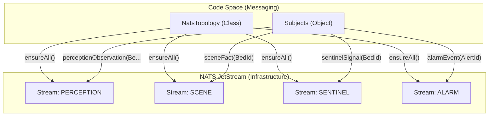
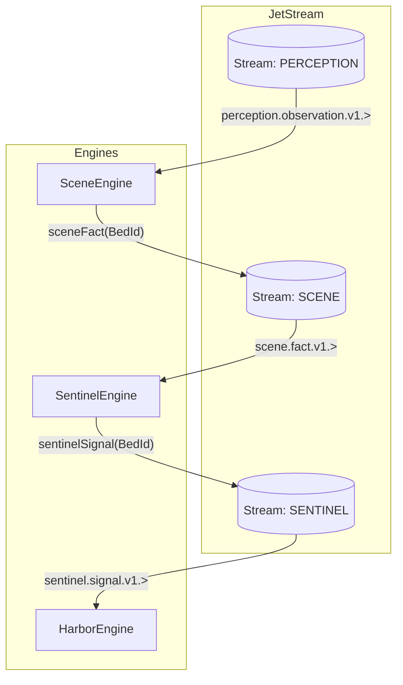

# Messaging Infrastructure (NATS JetStream)

Relevant source files

- 
- 
- 

The messaging infrastructure in `mana-hive` provides the asynchronous backbone for the entire event-driven architecture. It leverages **NATS JetStream** to provide a persistent, fault-tolerant transport layer for telemetry, facts, signals, and alarms.

The design treats the NATS bus as a high-performance buffer rather than a permanent archive. While JetStream provides persistence, the **Hub** remains the ultimate System of Record. This allows the messaging layer to focus on low-latency delivery and reliable streaming between engines.

### NATS Topology & Stream Management

The `NatsTopology` class is responsible for the idempotent declaration of the system's stream infrastructure. Every service within the platform calls `ensureAll()` or specific `ensure()` methods during its startup sequence.

#### Idempotency Strategy

The topology management follows a "first one wins, others verify" pattern. If a stream does not exist, it is created; if it already exists, its configuration is updated to match the current code definition. This ensures that the infrastructure evolves safely alongside the code without manual operator intervention.

#### Stream Configuration (Limits-Based Retention)

Streams are configured with a **Limits-based retention policy** [platform/messaging/src/main/kotlin/com/manahive/messaging/NatsTopology.kt32-33](https://github.com/kerrvisiona-sudo/hive2/blob/f8142c8f/platform/messaging/src/main/kotlin/com/manahive/messaging/NatsTopology.kt#L32-L33). This is a critical architectural decision:

- **Storage**: `StorageType.File` for persistence across restarts.
- **Max Age**: Defaulted to 7 days [platform/messaging/src/main/kotlin/com/manahive/messaging/NatsTopology.kt21-24](https://github.com/kerrvisiona-sudo/hive2/blob/f8142c8f/platform/messaging/src/main/kotlin/com/manahive/messaging/NatsTopology.kt#L21-L24).
- **Deduplication**: A 10-minute duplicate window is enforced to handle potential producer retries [platform/messaging/src/main/kotlin/com/manahive/messaging/NatsTopology.kt34](https://github.com/kerrvisiona-sudo/hive2/blob/f8142c8f/platform/messaging/src/main/kotlin/com/manahive/messaging/NatsTopology.kt#L34-L34).

**Sources:** [platform/messaging/src/main/kotlin/com/manahive/messaging/NatsTopology.kt10-39](https://github.com/kerrvisiona-sudo/hive2/blob/f8142c8f/platform/messaging/src/main/kotlin/com/manahive/messaging/NatsTopology.kt#L10-L39)

---

### Subject Taxonomy & Versioning

The `Subjects` object defines the address space for the entire platform. The taxonomy follows a strict hierarchical structure: `{domain}.{type}.{version}.{discriminator}`.

#### Versioning Policy

Breaking changes to event schemas do not update existing subjects. Instead, they result in a new subject (e.g., `v1` to `v2`). This allows old consumers to continue processing legacy events until they are retired, facilitating blue/green deployments and zero-downtime migrations [platform/messaging/src/main/kotlin/com/manahive/messaging/Subjects.kt8-10](https://github.com/kerrvisiona-sudo/hive2/blob/f8142c8f/platform/messaging/src/main/kotlin/com/manahive/messaging/Subjects.kt#L8-L10).

|Domain|Subject Template|Wildcard Pattern|Key Discriminator|
|---|---|---|---|
|**Perception**|`perception.observation.v1.{bed}`|`perception.observation.v1.>`|`BedId`|
|**Scene**|`scene.fact.v1.{bed}`|`scene.fact.v1.>`|`BedId`|
|**Sentinel**|`sentinel.signal.v1.{bed}`|`sentinel.signal.v1.>`|`BedId`|
|**Alarm**|`alarm.event.v1.{alert}`|`alarm.event.v1.>`|`AlertId`|
|**Policy**|`hub.policy.effective-rules.v1.{resident}`|N/A|`ResidentId`|

**Sources:** [platform/messaging/src/main/kotlin/com/manahive/messaging/Subjects.kt11-24](https://github.com/kerrvisiona-sudo/hive2/blob/f8142c8f/platform/messaging/src/main/kotlin/com/manahive/messaging/Subjects.kt#L11-L24)

---

### Data Flow & Code Entities

The following diagram bridges the logical messaging concepts to the specific code entities that implement them.

**Messaging Infrastructure Overview**

**Sources:** [platform/messaging/src/main/kotlin/com/manahive/messaging/NatsTopology.kt20-25](https://github.com/kerrvisiona-sudo/hive2/blob/f8142c8f/platform/messaging/src/main/kotlin/com/manahive/messaging/NatsTopology.kt#L20-L25), [platform/messaging/src/main/kotlin/com/manahive/messaging/Subjects.kt12-23](https://github.com/kerrvisiona-sudo/hive2/blob/f8142c8f/platform/messaging/src/main/kotlin/com/manahive/messaging/Subjects.kt#L12-L23)

---

### Stream Definitions

The platform maintains four primary JetStream streams. Each stream aggregates related subjects into a single persistence unit for durable consumption.

|Stream Name|Subjects Included|Purpose|
|---|---|---|
|`PERCEPTION`|`perception.observation.v1.>`|Raw sensor data and computer vision observations.|
|`SCENE`|`scene.fact.v1.>`|High-level facts about bed occupancy and resident state.|
|`SENTINEL`|`sentinel.signal.v1.>`|Incident detections, suppressions, and escalation signals.|
|`ALARM`|`alarm.event.v1.>`|Final alarm lifecycle events (Dispatch, Ack, Resolve).|

**Sources:** [platform/messaging/src/main/kotlin/com/manahive/messaging/NatsTopology.kt20-25](https://github.com/kerrvisiona-sudo/hive2/blob/f8142c8f/platform/messaging/src/main/kotlin/com/manahive/messaging/NatsTopology.kt#L20-L25)

---

### Consumption Pattern: Durable Consumers

While the `messaging` module defines the topology, the engines (Scene, Sentinel, etc.) interact with these streams using **Durable Consumers**.

1. **Subscription**: Engines subscribe to the wildcard subjects defined in `Subjects`.
2. **State Management**: By using durable names, NATS tracks the "last seen" sequence number for each engine.
3. **Recovery**: If an engine restarts, it resumes consumption from the last acknowledged message in the JetStream stream.
4. **Batching**: Engines typically pull batches of messages to optimize throughput while maintaining the strict ordering required for stateful processing (e.g., `SceneInterpreter`).

**Engine-to-Stream Interaction**

### On this page

- [Messaging Infrastructure (NATS JetStream)](https://deepwiki.com/kerrvisiona-sudo/hive2/2.3-messaging-infrastructure-\(nats-jetstream\)#messaging-infrastructure-nats-jetstream)
- [NATS Topology & Stream Management](https://deepwiki.com/kerrvisiona-sudo/hive2/2.3-messaging-infrastructure-\(nats-jetstream\)#nats-topology-stream-management)
- [Idempotency Strategy](https://deepwiki.com/kerrvisiona-sudo/hive2/2.3-messaging-infrastructure-\(nats-jetstream\)#idempotency-strategy)
- [Stream Configuration (Limits-Based Retention)](https://deepwiki.com/kerrvisiona-sudo/hive2/2.3-messaging-infrastructure-\(nats-jetstream\)#stream-configuration-limits-based-retention)
- [Subject Taxonomy & Versioning](https://deepwiki.com/kerrvisiona-sudo/hive2/2.3-messaging-infrastructure-\(nats-jetstream\)#subject-taxonomy-versioning)
- [Versioning Policy](https://deepwiki.com/kerrvisiona-sudo/hive2/2.3-messaging-infrastructure-\(nats-jetstream\)#versioning-policy)
- [Data Flow & Code Entities](https://deepwiki.com/kerrvisiona-sudo/hive2/2.3-messaging-infrastructure-\(nats-jetstream\)#data-flow-code-entities)
- [Stream Definitions](https://deepwiki.com/kerrvisiona-sudo/hive2/2.3-messaging-infrastructure-\(nats-jetstream\)#stream-definitions)
- [Consumption Pattern: Durable Consumers](https://deepwiki.com/kerrvisiona-sudo/hive2/2.3-messaging-infrastructure-\(nats-jetstream\)#consumption-pattern-durable-consumers)
