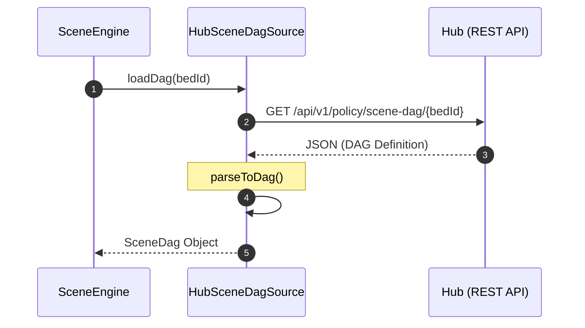

# Infrastructure & Configuration

Relevant source files

- 
- 

The `platform:infrastructure` module provides the foundational cross-cutting concerns for all engines and services within the hive2 platform. It primarily handles TOML-based configuration management, environment-specific overrides (LocalConfig), and specialized data sources for loading scene definitions from the Hub.

## TOML Configuration System

The platform utilizes a structured TOML-based configuration system designed for type safety and hierarchical overrides. This system abstracts the source of configuration (files, strings, environment) from the parsing logic.

### Core Configuration Classes

- **`TomlConfigParser`**: The primary entry point for transforming TOML data into domain-specific configuration objects. It leverages the `TomlConfigSource` to fetch raw data.
- **`TomlConfigSource`**: An interface defining the contract for retrieving TOML content.
- **`BaseTomlConfigSource`**: A base implementation that provides common logic for reading from various origins (e.g., file system, classpath).

### Configuration Data Flow

The following diagram illustrates how raw TOML files are processed into typed configuration objects used by the engines.

**Diagram: Configuration Resolution Pipeline**

**Sources:**

- `platform/infrastructure/src/main/kotlin/com/kerrvision/hive2/infrastructure/config/TomlConfigParser.kt`
- `platform/infrastructure/src/main/kotlin/com/kerrvision/hive2/infrastructure/config/TomlConfigSource.kt`
- `platform/infrastructure/src/main/kotlin/com/kerrvision/hive2/infrastructure/config/BaseTomlConfigSource.kt`

---

## LocalConfig Pattern

To support diverse development and deployment environments, the platform implements a `LocalConfig` pattern. This allows developers to provide environment-specific overrides (such as NATS URLs or local database credentials) without modifying the version-controlled default configurations.

The `LocalConfig` mechanism typically looks for a `local.properties` or `local.toml` file at the project root, which is ignored by Git. This pattern ensures that secrets and machine-specific paths remain outside the main codebase.

**Sources:**

- `platform/infrastructure/src/main/kotlin/com/kerrvision/hive2/infrastructure/config/LocalConfig.kt`

---

## HubSceneDagSource

The `HubSceneDagSource` is a specialized infrastructure component responsible for loading Scene Directed Acyclic Graph (DAG) definitions. These DAGs define the logic for how observations are interpreted into scene facts (e.g., "Person In Bed" or "Room Empty").

### Implementation Details

- **Role**: It acts as a bridge between the Hub (the System of Record) and the Scene Engine.
- **Data Retrieval**: It fetches DAG definitions from the Hub's policy context, ensuring that the Scene Engine is always running the latest validated interpretive logic.
- **Integration**: It implements the `SceneDagSource` port, allowing the `SceneInterpreter` to remain decoupled from the specific storage mechanism of the DAGs.

**Diagram: Scene DAG Loading Sequence**

**Sources:**

- `platform/infrastructure/src/main/kotlin/com/kerrvision/hive2/infrastructure/hub/HubSceneDagSource.kt`
- `platform/infrastructure/src/main/kotlin/com/kerrvision/hive2/infrastructure/hub/HubClient.kt`

---

## Infrastructure Module Dependencies

The `platform:infrastructure` module serves as the glue between the pure domain logic and the external world. It depends on `platform:domain-kernel` for basic types and `platform:contracts` for communication schemas.

|Dependency|Purpose|
|---|---|
|`platform:domain-kernel`|Provides `BedId`, `ResidentId`, and basic `Engine` interfaces [platform/domain-kernel/build.gradle.kts1](https://github.com/kerrvisiona-sudo/hive2/blob/f8142c8f/platform/domain-kernel/build.gradle.kts#L1-L1)|
|`platform:contracts`|Provides the `EventEnvelope` and shared event definitions [platform/contracts/build.gradle.kts1-5](https://github.com/kerrvisiona-sudo/hive2/blob/f8142c8f/platform/contracts/build.gradle.kts#L1-L5)|
|`Toml4j` (or similar)|Underlying library used by `TomlConfigParser` for low-level TOML parsing.|

**Sources:**

- `platform/infrastructure/build.gradle.kts`
- `platform/domain-kernel/build.gradle.kts`
- `platform/contracts/build.gradle.kts`

### On this page

- [Infrastructure & Configuration](https://deepwiki.com/kerrvisiona-sudo/hive2/2.4-infrastructure-and-configuration#infrastructure-configuration)
- [TOML Configuration System](https://deepwiki.com/kerrvisiona-sudo/hive2/2.4-infrastructure-and-configuration#toml-configuration-system)
- [Core Configuration Classes](https://deepwiki.com/kerrvisiona-sudo/hive2/2.4-infrastructure-and-configuration#core-configuration-classes)
- [Configuration Data Flow](https://deepwiki.com/kerrvisiona-sudo/hive2/2.4-infrastructure-and-configuration#configuration-data-flow)
- [LocalConfig Pattern](https://deepwiki.com/kerrvisiona-sudo/hive2/2.4-infrastructure-and-configuration#localconfig-pattern)
- [HubSceneDagSource](https://deepwiki.com/kerrvisiona-sudo/hive2/2.4-infrastructure-and-configuration#hubscenedagsource)
- [Implementation Details](https://deepwiki.com/kerrvisiona-sudo/hive2/2.4-infrastructure-and-configuration#implementation-details)
- [Infrastructure Module Dependencies](https://deepwiki.com/kerrvisiona-sudo/hive2/2.4-infrastructure-and-configuration#infrastructure-module-dependencies)

