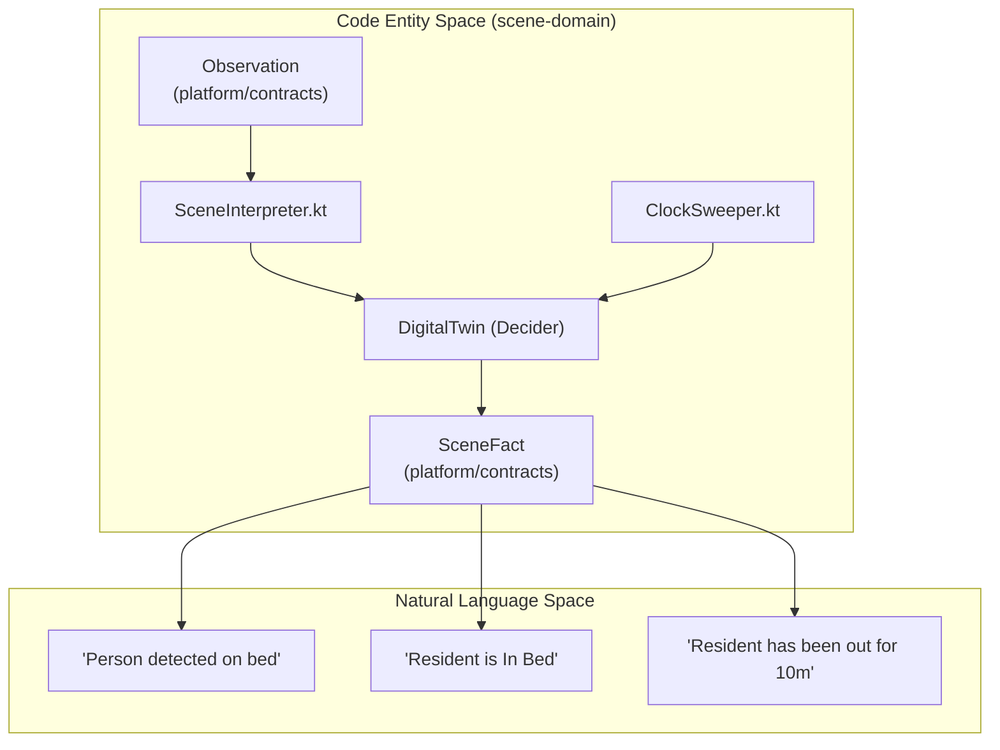
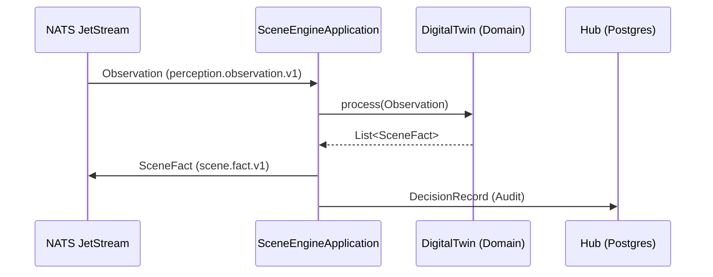

# Scene Engine

Relevant source files

- 
- 
- 
- 

The **Scene Engine** is the primary perception-to-state translator of the mana-hive platform. It transforms raw sensor observations (perception) into high-level, stable, and semantically meaningful facts about a resident's environment (scenes). It operates as an event-sourced system, maintaining an immutable model of every monitored bed via a "Digital Twin" abstraction.

The engine is designed to handle noisy sensor data through hysteresis, confidence thresholds, and temporal dwell detection, ensuring that downstream consumers (like the Sentinel Engine) receive reliable state transitions rather than raw signal fluctuations.

## Core Architecture

The Scene Engine follows the "Pure Domain + Thin Shell" pattern. The domain logic is entirely decoupled from infrastructure, allowing it to be executed in both the real-time Spring service and the offline batch processing tools.

### Natural Language to Code Mapping

|Concept|Code Entity|Role|
|---|---|---|
|**Digital Twin**|`DigitalTwin`|The event-sourced aggregate representing the state of one bed.|
|**Scene Logic**|`SceneInterpreter`|The pure function that applies calibration to observations.|
|**Temporal Logic**|`ClockSweeper`|Handles time-based transitions (e.g., "Out of Bed for 5 mins").|
|**State Machine**|`SceneDag` / `TransitionTable`|Defines valid movements between scene states.|
|**Configuration**|`SceneCalibration`|DSL-based settings for hysteresis and timeouts.|

### Data Flow Overview

**Sources:** [engines/scene-engine/scene-service/src/main/kotlin/com/manahive/scene/service/SceneEngineApplication.kt7-13](https://github.com/kerrvisiona-sudo/hive2/blob/f8142c8f/engines/scene-engine/scene-service/src/main/kotlin/com/manahive/scene/service/SceneEngineApplication.kt#L7-L13)

## Domain Logic: The Digital Twin

The `DigitalTwin` is the central aggregate in the `scene-domain`. It implements the `Decider` interface from the `domain-kernel`, making it a pure, event-sourced model of a single bed's state.

### SceneInterpreter

The `SceneInterpreter` is responsible for processing incoming `Observation` events. It does not immediately change the state; instead, it applies:

1. **Confidence Thresholds:** Filters out low-confidence sensor detections.
2. **Hysteresis:** Prevents "flickering" between states by requiring a sustained signal change.
3. **Occupant Binding:** Maps sensor IDs to specific `ResidentId` values based on the current `CensusSnapshot`.

### ClockSweeper and Dwell Detection

Because some state changes are triggered by the _absence_ of events (e.g., a resident remaining out of bed for a duration), the engine utilizes a `ClockSweeper`.

- The `SceneEngineApplication` triggers a periodic "sweep tick" (defaulting to every 5 seconds).
- The `ClockSweeper` evaluates the current state's `dwell` time against the `SceneCalibration`.
- If a timeout is reached, it emits a transition event to the `DigitalTwin`.

**Sources:** [engines/scene-engine/scene-service/src/main/resources/application.yml9-10](https://github.com/kerrvisiona-sudo/hive2/blob/f8142c8f/engines/scene-engine/scene-service/src/main/resources/application.yml#L9-L10) [engines/scene-engine/scene-service/src/main/kotlin/com/manahive/scene/service/SceneEngineApplication.kt11](https://github.com/kerrvisiona-sudo/hive2/blob/f8142c8f/engines/scene-engine/scene-service/src/main/kotlin/com/manahive/scene/service/SceneEngineApplication.kt#L11-L11)

## Scene Definition & Calibration

The engine's behavior is governed by a Directed Acyclic Graph (DAG) and a specific DSL for calibration.

### SceneDag and TransitionTable

The `SceneDag` defines the legal transitions between scenes (e.g., a resident cannot move from `Empty` to `InBed` without passing through an intermediate detection state). The `TransitionTable` acts as the validator for these movements, ensuring the integrity of the event stream.

### SceneCalibration DSL

Calibration allows fine-tuning of the engine per-facility or per-bed. Key parameters include:

- **Hysteresis:** Time/count buffers for state entry.
- **Dwell:** Minimum time to stay in a state before it is considered "confirmed."
- **Heartbeat Timeout:** The threshold after which a sensor is considered offline (default 90s).

**Sources:** [engines/scene-engine/scene-service/src/main/resources/application.yml12](https://github.com/kerrvisiona-sudo/hive2/blob/f8142c8f/engines/scene-engine/scene-service/src/main/resources/application.yml#L12-L12)

## Infrastructure & Service Shell

The `scene-service` module provides the Spring Boot wrapper (`SceneEngineApplication`) that connects the domain logic to the outside world via NATS JetStream.

### NATS Connectivity

The service maintains two primary subscriptions and one publisher:

1. **Inbound (Observations):** Subscribes to `perception.observation.v1.>`.
2. **Inbound (Census):** Subscribes to `hub.census.snapshot.v1` to maintain resident-to-bed mappings.
3. **Outbound (Facts):** Publishes `scene.fact.v1.<bed>` events whenever the `DigitalTwin` state changes.
4. **Telemetry:** Pushes `DecisionRecord` objects to the Hub for auditing and debugging.

**Sources:** [engines/scene-engine/scene-service/src/main/kotlin/com/manahive/scene/service/SceneEngineApplication.kt7-13](https://github.com/kerrvisiona-sudo/hive2/blob/f8142c8f/engines/scene-engine/scene-service/src/main/kotlin/com/manahive/scene/service/SceneEngineApplication.kt#L7-L13) [engines/scene-engine/scene-service/src/main/resources/application.yml6-8](https://github.com/kerrvisiona-sudo/hive2/blob/f8142c8f/engines/scene-engine/scene-service/src/main/resources/application.yml#L6-L8)

## Scene Batch CLI

The `scene-batch` tool is a command-line utility used for offline analysis and verification of scene logic. It supports three primary commands:

1. **Run:** Processes a stream of historical observations and outputs the resulting `SceneFact` sequence.
2. **Verify:** Compares the output of the current engine version against a "golden" expected output file to detect regressions.
3. **Diff:** Highlights specific differences in state transitions between two engine configurations or versions.

This tool is critical for "Clinical Review," allowing engineers to replay real-world incidents (like a fall) through updated logic to ensure the system reacts correctly.

## Module Structure

- `scene-domain`: Contains the pure logic, `DigitalTwin`, `SceneInterpreter`, and `SceneDag`. Depends on `platform:domain-kernel` and `platform:contracts`.
- `scene-service`: The Spring Boot application. Depends on `scene-domain` and `platform:messaging`.
- `scene-batch`: The CLI tool for offline replay and verification.

**Sources:** [engines/scene-engine/scene-domain/build.gradle.kts10-14](https://github.com/kerrvisiona-sudo/hive2/blob/f8142c8f/engines/scene-engine/scene-domain/build.gradle.kts#L10-L14) [engines/scene-engine/scene-service/build.gradle.kts3-6](https://github.com/kerrvisiona-sudo/hive2/blob/f8142c8f/engines/scene-engine/scene-service/build.gradle.kts#L3-L6)

### On this page

- [Scene Engine](https://deepwiki.com/kerrvisiona-sudo/hive2/3.1-scene-engine#scene-engine)
- [Core Architecture](https://deepwiki.com/kerrvisiona-sudo/hive2/3.1-scene-engine#core-architecture)
- [Natural Language to Code Mapping](https://deepwiki.com/kerrvisiona-sudo/hive2/3.1-scene-engine#natural-language-to-code-mapping)
- [Data Flow Overview](https://deepwiki.com/kerrvisiona-sudo/hive2/3.1-scene-engine#data-flow-overview)
- [Domain Logic: The Digital Twin](https://deepwiki.com/kerrvisiona-sudo/hive2/3.1-scene-engine#domain-logic-the-digital-twin)
- [SceneInterpreter](https://deepwiki.com/kerrvisiona-sudo/hive2/3.1-scene-engine#sceneinterpreter)
- [ClockSweeper and Dwell Detection](https://deepwiki.com/kerrvisiona-sudo/hive2/3.1-scene-engine#clocksweeper-and-dwell-detection)
- [Scene Definition & Calibration](https://deepwiki.com/kerrvisiona-sudo/hive2/3.1-scene-engine#scene-definition-calibration)
- [SceneDag and TransitionTable](https://deepwiki.com/kerrvisiona-sudo/hive2/3.1-scene-engine#scenedag-and-transitiontable)
- [SceneCalibration DSL](https://deepwiki.com/kerrvisiona-sudo/hive2/3.1-scene-engine#scenecalibration-dsl)
- [Infrastructure & Service Shell](https://deepwiki.com/kerrvisiona-sudo/hive2/3.1-scene-engine#infrastructure-service-shell)
- [NATS Connectivity](https://deepwiki.com/kerrvisiona-sudo/hive2/3.1-scene-engine#nats-connectivity)
- [Scene Batch CLI](https://deepwiki.com/kerrvisiona-sudo/hive2/3.1-scene-engine#scene-batch-cli)
- [Module Structure](https://deepwiki.com/kerrvisiona-sudo/hive2/3.1-scene-engine#module-structure)

