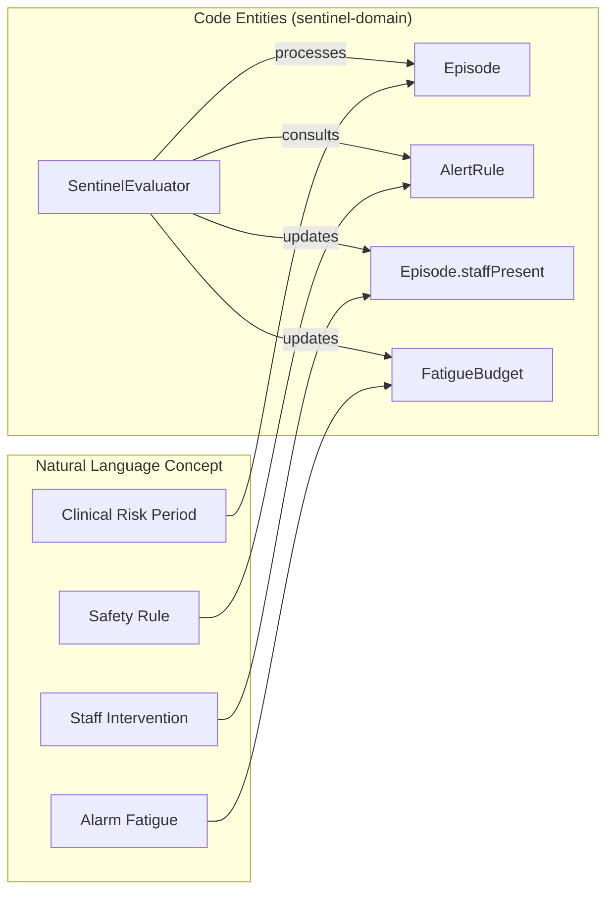
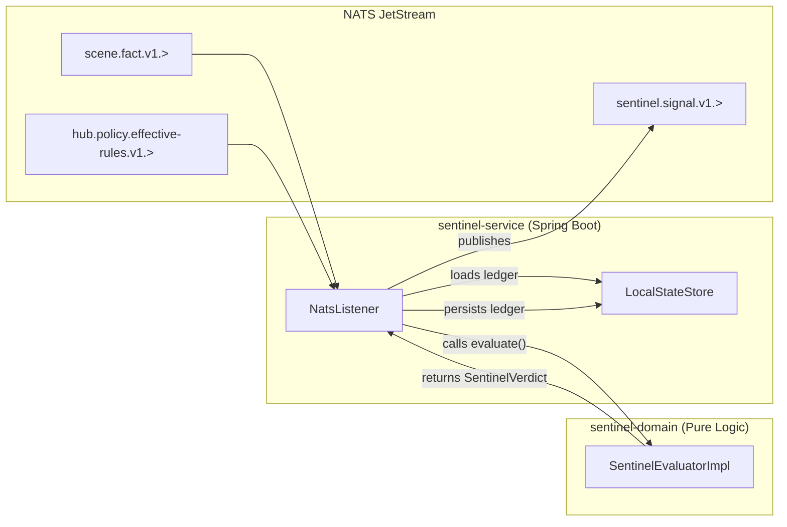

# Sentinel Engine

Relevant source files

- [](https://github.com/kerrvisiona-sudo/hive2/blob/f8142c8f/engines/sentinel/sentinel-domain/build.gradle.kts)
- [](https://github.com/kerrvisiona-sudo/hive2/blob/f8142c8f/engines/sentinel/sentinel-domain/src/main/kotlin/com/manahive/sentinel/EpisodeLedger.kt)
- [](https://github.com/kerrvisiona-sudo/hive2/blob/f8142c8f/engines/sentinel/sentinel-domain/src/main/kotlin/com/manahive/sentinel/SentinelEvaluator.kt)
- [](https://github.com/kerrvisiona-sudo/hive2/blob/f8142c8f/engines/sentinel/sentinel-service/build.gradle.kts)
- [](https://github.com/kerrvisiona-sudo/hive2/blob/f8142c8f/engines/sentinel/sentinel-service/src/main/kotlin/com/manahive/sentinel/service/SentinelApplication.kt)
- [](https://github.com/kerrvisiona-sudo/hive2/blob/f8142c8f/engines/sentinel/sentinel-service/src/main/resources/application.yml)

The Sentinel Engine is the clinical reasoning core of the mana-hive platform. It functions as a pure-logic judge that evaluates environmental observations (Scene Facts) against clinical safety policies to manage the lifecycle of resident risk episodes.

## Purpose and Scope

The Sentinel Engine is responsible for transforming physical state changes into clinical events. It operates on the following principles:

- **Pure Evaluation**: The core logic is a pure function: `(SceneFact, EpisodeLedger, Instant) -> Explained<SentinelVerdict>`. It has no side effects and does not directly access databases or NATS [engines/sentinel/sentinel-domain/src/main/kotlin/com/manahive/sentinel/SentinelEvaluator.kt9-19](https://github.com/kerrvisiona-sudo/hive2/blob/f8142c8f/engines/sentinel/sentinel-domain/src/main/kotlin/com/manahive/sentinel/SentinelEvaluator.kt#L9-L19)
- **Episode Lifecycle**: It manages the transition of a resident from a "Safe" state to an "At Risk" state, tracking the duration of risk, staff presence, and recovery conditions [engines/sentinel/sentinel-domain/src/main/kotlin/com/manahive/sentinel/EpisodeLedger.kt52-56](https://github.com/kerrvisiona-sudo/hive2/blob/f8142c8f/engines/sentinel/sentinel-domain/src/main/kotlin/com/manahive/sentinel/EpisodeLedger.kt#L52-L56)
- **Fatigue Management**: It tracks an "Alarm Fatigue Budget" to prevent excessive notifications within a single shift [engines/sentinel/sentinel-domain/src/main/kotlin/com/manahive/sentinel/EpisodeLedger.kt150-156](https://github.com/kerrvisiona-sudo/hive2/blob/f8142c8f/engines/sentinel/sentinel-domain/src/main/kotlin/com/manahive/sentinel/EpisodeLedger.kt#L150-L156)

**Sources:**

- [engines/sentinel/sentinel-domain/src/main/kotlin/com/manahive/sentinel/SentinelEvaluator.kt](https://github.com/kerrvisiona-sudo/hive2/blob/f8142c8f/engines/sentinel/sentinel-domain/src/main/kotlin/com/manahive/sentinel/SentinelEvaluator.kt)
- [engines/sentinel/sentinel-domain/src/main/kotlin/com/manahive/sentinel/EpisodeLedger.kt](https://github.com/kerrvisiona-sudo/hive2/blob/f8142c8f/engines/sentinel/sentinel-domain/src/main/kotlin/com/manahive/sentinel/EpisodeLedger.kt)

---

## Domain Model & State Tracking

The engine tracks state per resident using the `EpisodeLedger`. Unlike the Scene Engine which tracks beds, the Sentinel follows the resident, allowing risk episodes to persist even if a resident moves between beds during a night [engines/sentinel/sentinel-domain/src/main/kotlin/com/manahive/sentinel/EpisodeLedger.kt15-22](https://github.com/kerrvisiona-sudo/hive2/blob/f8142c8f/engines/sentinel/sentinel-domain/src/main/kotlin/com/manahive/sentinel/EpisodeLedger.kt#L15-L22)

### EpisodeLedger

The ledger acts as a container for all active episodes and the current fatigue budget for a specific resident.

|Component|Description|
|---|---|
|`residentId`|The unique identifier for the resident being monitored [engines/sentinel/sentinel-domain/src/main/kotlin/com/manahive/sentinel/EpisodeLedger.kt24](https://github.com/kerrvisiona-sudo/hive2/blob/f8142c8f/engines/sentinel/sentinel-domain/src/main/kotlin/com/manahive/sentinel/EpisodeLedger.kt#L24-L24)|
|`open`|A map of `BedId` to `Episode`. Supports multi-bed monitoring for a single resident [engines/sentinel/sentinel-domain/src/main/kotlin/com/manahive/sentinel/EpisodeLedger.kt27](https://github.com/kerrvisiona-sudo/hive2/blob/f8142c8f/engines/sentinel/sentinel-domain/src/main/kotlin/com/manahive/sentinel/EpisodeLedger.kt#L27-L27)|
|`fatigue`|A `FatigueBudget` tracking `interruptionsThisShift` vs `maxPerShift` [engines/sentinel/sentinel-domain/src/main/kotlin/com/manahive/sentinel/EpisodeLedger.kt151-156](https://github.com/kerrvisiona-sudo/hive2/blob/f8142c8f/engines/sentinel/sentinel-domain/src/main/kotlin/com/manahive/sentinel/EpisodeLedger.kt#L151-L156)|

### Episode Lifecycle

An `Episode` represents the arc between leaving a safe state and returning to it stably [engines/sentinel/sentinel-domain/src/main/kotlin/com/manahive/sentinel/EpisodeLedger.kt52-53](https://github.com/kerrvisiona-sudo/hive2/blob/f8142c8f/engines/sentinel/sentinel-domain/src/main/kotlin/com/manahive/sentinel/EpisodeLedger.kt#L52-L53)

1. **Open**: Triggered when a `SceneFact` matches an `AlertRule` and no episode is currently open for that bed [engines/sentinel/sentinel-domain/src/main/kotlin/com/manahive/sentinel/EpisodeLedger.kt85-103](https://github.com/kerrvisiona-sudo/hive2/blob/f8142c8f/engines/sentinel/sentinel-domain/src/main/kotlin/com/manahive/sentinel/EpisodeLedger.kt#L85-L103)
2. **Escalate**: If a new fact matches a rule with higher `Severity` than the current episode, the episode is updated [engines/sentinel/sentinel-domain/src/main/kotlin/com/manahive/sentinel/EpisodeLedger.kt129-133](https://github.com/kerrvisiona-sudo/hive2/blob/f8142c8f/engines/sentinel/sentinel-domain/src/main/kotlin/com/manahive/sentinel/EpisodeLedger.kt#L129-L133)
3. **Umbrella Events**: Subsequent facts that match rules but don't trigger escalation are stored as `EpisodeEvent` objects under the episode "umbrella" to preserve clinical context without spamming new alerts [engines/sentinel/sentinel-domain/src/main/kotlin/com/manahive/sentinel/EpisodeLedger.kt136-148](https://github.com/kerrvisiona-sudo/hive2/blob/f8142c8f/engines/sentinel/sentinel-domain/src/main/kotlin/com/manahive/sentinel/EpisodeLedger.kt#L136-L148)
4. **Close**: An episode closes based on its `ClosureCondition` [engines/sentinel/sentinel-domain/src/main/kotlin/com/manahive/sentinel/EpisodeLedger.kt107-110](https://github.com/kerrvisiona-sudo/hive2/blob/f8142c8f/engines/sentinel/sentinel-domain/src/main/kotlin/com/manahive/sentinel/EpisodeLedger.kt#L107-L110):
    - `SAFE_ONLY`: Closes as soon as the resident returns to a safe state.
    - `STAFF_AND_SAFE`: Requires both the resident to be safe AND staff presence to have been detected.

### Logic Flow: Natural Language to Code Entities

The following diagram maps clinical concepts to the specific classes and interfaces in the `sentinel-domain` module.

"Sentinel Logic Mapping"




**Sources:**

- [engines/sentinel/sentinel-domain/src/main/kotlin/com/manahive/sentinel/EpisodeLedger.kt](https://github.com/kerrvisiona-sudo/hive2/blob/f8142c8f/engines/sentinel/sentinel-domain/src/main/kotlin/com/manahive/sentinel/EpisodeLedger.kt)
- [engines/sentinel/sentinel-domain/src/main/kotlin/com/manahive/sentinel/SentinelEvaluator.kt](https://github.com/kerrvisiona-sudo/hive2/blob/f8142c8f/engines/sentinel/sentinel-domain/src/main/kotlin/com/manahive/sentinel/SentinelEvaluator.kt)

---

## The SentinelEvaluator

The `SentinelEvaluator` is the core interface defining the engine's processing logic. It is implemented as a pure function to ensure testability and deterministic behavior during batch replays.

### Evaluation Input/Output

The `evaluate` function takes the current fact, the existing ledger, and the current timestamp [engines/sentinel/sentinel-domain/src/main/kotlin/com/manahive/sentinel/SentinelEvaluator.kt44-49](https://github.com/kerrvisiona-sudo/hive2/blob/f8142c8f/engines/sentinel/sentinel-domain/src/main/kotlin/com/manahive/sentinel/SentinelEvaluator.kt#L44-L49)

```
public fun evaluate(
    fact: SceneFact,
    episodes: EpisodeLedger,
    now: Instant,
): Explained<SentinelVerdict>
```

The `SentinelVerdict` contains [engines/sentinel/sentinel-domain/src/main/kotlin/com/manahive/sentinel/SentinelEvaluator.kt64-69](https://github.com/kerrvisiona-sudo/hive2/blob/f8142c8f/engines/sentinel/sentinel-domain/src/main/kotlin/com/manahive/sentinel/SentinelEvaluator.kt#L64-L69):

1. **Signals**: A list of `SentinelSignal` objects (Incident, Occurrence, or Suppression).
2. **Next State**: An updated `EpisodeLedger` to be persisted by the service shell.

### SentinelSignal Types

The engine emits three primary signal types via NATS:

- **Incident**: A new episode has opened or escalated; requires immediate attention.
- **Occurrence**: An event happened within an existing episode umbrella (e.g., resident moved while already out of bed).
- **Suppression**: A rule matched, but the signal was suppressed due to the `FatigueBudget` being exceeded.

**Sources:**

- [engines/sentinel/sentinel-domain/src/main/kotlin/com/manahive/sentinel/SentinelEvaluator.kt](https://github.com/kerrvisiona-sudo/hive2/blob/f8142c8f/engines/sentinel/sentinel-domain/src/main/kotlin/com/manahive/sentinel/SentinelEvaluator.kt)
- [engines/sentinel/sentinel-service/src/main/kotlin/com/manahive/sentinel/service/SentinelApplication.kt10](https://github.com/kerrvisiona-sudo/hive2/blob/f8142c8f/engines/sentinel/sentinel-service/src/main/kotlin/com/manahive/sentinel/service/SentinelApplication.kt#L10-L10)

---

## System Integration & Data Flow

The `sentinel-service` acts as the Spring Boot shell, providing the infrastructure for the domain logic to operate within the NATS JetStream ecosystem.

### Data Flow Diagram

This diagram shows how data moves from the Scene Engine through the Sentinel Engine and out to the Harbor (Alerting) Engine.

"Sentinel Data Pipeline"



### Infrastructure Components

- **SentinelApplication**: The entry point that initializes the Spring context and wires the NATS durable consumer named `sentinel` [engines/sentinel/sentinel-service/src/main/kotlin/com/manahive/sentinel/service/SentinelApplication.kt8-15](https://github.com/kerrvisiona-sudo/hive2/blob/f8142c8f/engines/sentinel/sentinel-service/src/main/kotlin/com/manahive/sentinel/service/SentinelApplication.kt#L8-L15)
- **Fatigue Configuration**: The maximum allowed interruptions per shift is configured via `application.yml` (default: 12) [engines/sentinel/sentinel-service/src/main/resources/application.yml9-10](https://github.com/kerrvisiona-sudo/hive2/blob/f8142c8f/engines/sentinel/sentinel-service/src/main/resources/application.yml#L9-L10)
- **State Persistence**: The shell is responsible for persisting the `EpisodeLedger` between facts. On a cold start, the state can be rebuilt by replaying the scene fact stream [engines/sentinel/sentinel-service/src/main/kotlin/com/manahive/sentinel/service/SentinelApplication.kt11-12](https://github.com/kerrvisiona-sudo/hive2/blob/f8142c8f/engines/sentinel/sentinel-service/src/main/kotlin/com/manahive/sentinel/service/SentinelApplication.kt#L11-L12)

**Sources:**

- [engines/sentinel/sentinel-service/src/main/kotlin/com/manahive/sentinel/service/SentinelApplication.kt](https://github.com/kerrvisiona-sudo/hive2/blob/f8142c8f/engines/sentinel/sentinel-service/src/main/kotlin/com/manahive/sentinel/service/SentinelApplication.kt)
- [engines/sentinel/sentinel-service/src/main/resources/application.yml](https://github.com/kerrvisiona-sudo/hive2/blob/f8142c8f/engines/sentinel/sentinel-service/src/main/resources/application.yml)
- [engines/sentinel/sentinel-domain/build.gradle.kts](https://github.com/kerrvisiona-sudo/hive2/blob/f8142c8f/engines/sentinel/sentinel-domain/build.gradle.kts)

### On this page

- [Sentinel Engine](https://deepwiki.com/kerrvisiona-sudo/hive2/3.2-sentinel-engine#sentinel-engine)
- [Purpose and Scope](https://deepwiki.com/kerrvisiona-sudo/hive2/3.2-sentinel-engine#purpose-and-scope)
- [Domain Model & State Tracking](https://deepwiki.com/kerrvisiona-sudo/hive2/3.2-sentinel-engine#domain-model-state-tracking)
- [EpisodeLedger](https://deepwiki.com/kerrvisiona-sudo/hive2/3.2-sentinel-engine#episodeledger)
- [Episode Lifecycle](https://deepwiki.com/kerrvisiona-sudo/hive2/3.2-sentinel-engine#episode-lifecycle)
- [Logic Flow: Natural Language to Code Entities](https://deepwiki.com/kerrvisiona-sudo/hive2/3.2-sentinel-engine#logic-flow-natural-language-to-code-entities)
- [The SentinelEvaluator](https://deepwiki.com/kerrvisiona-sudo/hive2/3.2-sentinel-engine#the-sentinelevaluator)
- [Evaluation Input/Output](https://deepwiki.com/kerrvisiona-sudo/hive2/3.2-sentinel-engine#evaluation-inputoutput)
- [SentinelSignal Types](https://deepwiki.com/kerrvisiona-sudo/hive2/3.2-sentinel-engine#sentinelsignal-types)
- [System Integration & Data Flow](https://deepwiki.com/kerrvisiona-sudo/hive2/3.2-sentinel-engine#system-integration-data-flow)
- [Data Flow Diagram](https://deepwiki.com/kerrvisiona-sudo/hive2/3.2-sentinel-engine#data-flow-diagram)
- [Infrastructure Components](https://deepwiki.com/kerrvisiona-sudo/hive2/3.2-sentinel-engine#infrastructure-components)
