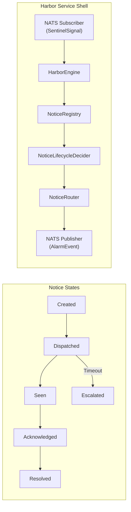

# Harbor Engine (Alert Delivery)

Relevant source files

- 
- 

The Harbor Engine is the final stage of the event processing pipeline, responsible for translating logical sentinel signals into actionable notifications for staff. It manages the delivery lifecycle of alerts across multiple communication channels (Push, Tablet, Ward Board, Console) and handles the state machine for escalation and resolution.

### Harbor Engine Overview

The Harbor Engine consumes `SentinelSignal` events and produces `NoticeCommand` instructions. It maintains a `NoticeRegistry` to track active alerts and uses a `NoticeLifecycle` decider to manage the state transitions of each individual notice.

**Sources:**

- `platform/domain-kernel/src/main/kotlin/com/manahive/kernel/Decider.kt:9-17` (Decider interface definition)

---

### Core Components

#### HarborEngine

The `HarborEngine` acts as the primary coordinator. It receives signals from the Sentinel Engine and determines if a new notice should be created or if an existing notice should be updated based on the `SentinelSignal` type (Incident, Occurrence, or Suppression).

#### HarborCalibration

This configuration defines how alerts are handled based on their severity and the specific facility context. It maps severities to specific delivery `Channel` sets and defines the `escalation timeouts` for each.

- **Channels:** Defined by the `Channel` enum, including `PUSH` (mobile devices), `TABLET` (room-side devices), `WARD_BOARD` (central displays), and `CONSOLE` (nursing stations).
- **Escalation:** If a notice is not acknowledged within the calibrated window, the engine triggers an escalation event.

#### NoticeRegistry

The `NoticeRegistry` is an in-memory or persisted store that tracks the current state of all active notices. It ensures that duplicate signals do not result in redundant alerts and provides the lookup mechanism for incoming interactions (e.g., a staff member tapping "Acknowledge" on a tablet).

**Sources:**

- `platform/domain-kernel/src/main/kotlin/com/manahive/kernel/Decider.kt:1-28`

---

### Notice Lifecycle (FSM)

The delivery process is managed by the `NoticeLifecycle` which implements the `Decider` interface. It follows a strict Finite State Machine (FSM) to ensure auditability and reliable delivery.

|State|Description|Trigger|
|---|---|---|
|**Created**|The notice has been instantiated in the registry.|`SentinelSignal` received.|
|**Dispatched**|The command has been sent to the `NoticeRouter`.|`NoticeCommand.Dispatch` issued.|
|**Seen**|A device has confirmed receipt/display of the alert.|Device feedback event.|
|**Acknowledged**|A staff member has explicitly interacted with the alert.|User action on `TABLET` or `PUSH`.|
|**Escalated**|The acknowledgment timeout expired.|`ClockSweeper` or timeout logic.|
|**Resolved**|The underlying condition is gone or manually cleared.|`SentinelSignal(Suppression)` or manual close.|

**Sources:**

- `platform/domain-kernel/src/main/kotlin/com/manahive/kernel/Decider.kt:9-17`

---

### NoticeRouter and Delivery

The `NoticeRouter` is responsible for the side-effect of delivery. It takes a `NoticeCommand` and routes it to the appropriate NATS subjects based on the `Channel` requirements.

1. **Push Routing:** Sends to the notification gateway for mobile devices.
2. **Tablet Routing:** Targets specific `BedId` or `RoomId` associated with the alert.
3. **Ward Board Routing:** Broadcasts to facility-wide monitoring screens.

### harbor-batch Tool

Similar to other engines, the Harbor Engine includes a `harbor-batch` CLI tool. This tool allows developers to:

- **Run:** Replay historical `SentinelSignals` to see resulting `NoticeCommands`.
- **Verify:** Compare the current engine output against a "golden" baseline to detect regressions in delivery logic.
- **Diff:** Visualize changes in escalation timing or channel routing based on calibration updates.

**Sources:**

- `engines/sentinel/sentinel-service/build.gradle.kts:1-7` (Reference to engine module structure)

### On this page

- [Harbor Engine (Alert Delivery)](https://deepwiki.com/kerrvisiona-sudo/hive2/3.3-harbor-engine-\(alert-delivery\)#harbor-engine-alert-delivery)
- [Harbor Engine Overview](https://deepwiki.com/kerrvisiona-sudo/hive2/3.3-harbor-engine-\(alert-delivery\)#harbor-engine-overview)
- [Core Components](https://deepwiki.com/kerrvisiona-sudo/hive2/3.3-harbor-engine-\(alert-delivery\)#core-components)
- [HarborEngine](https://deepwiki.com/kerrvisiona-sudo/hive2/3.3-harbor-engine-\(alert-delivery\)#harborengine)
- [HarborCalibration](https://deepwiki.com/kerrvisiona-sudo/hive2/3.3-harbor-engine-\(alert-delivery\)#harborcalibration)
- [NoticeRegistry](https://deepwiki.com/kerrvisiona-sudo/hive2/3.3-harbor-engine-\(alert-delivery\)#noticeregistry)
- [Notice Lifecycle (FSM)](https://deepwiki.com/kerrvisiona-sudo/hive2/3.3-harbor-engine-\(alert-delivery\)#notice-lifecycle-fsm)
- [NoticeRouter and Delivery](https://deepwiki.com/kerrvisiona-sudo/hive2/3.3-harbor-engine-\(alert-delivery\)#noticerouter-and-delivery)
- [harbor-batch Tool](https://deepwiki.com/kerrvisiona-sudo/hive2/3.3-harbor-engine-\(alert-delivery\)#harbor-batch-tool)

