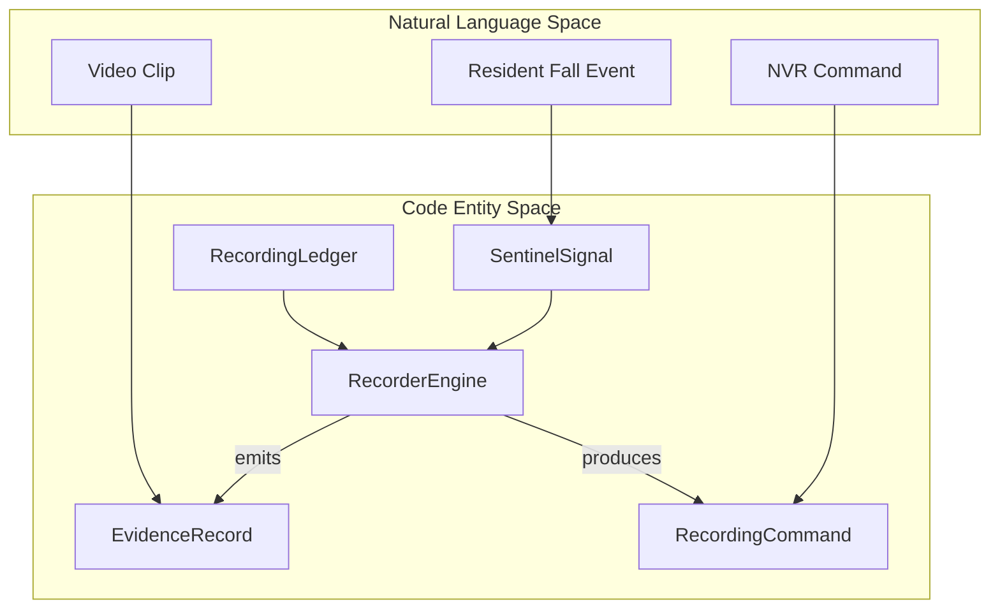
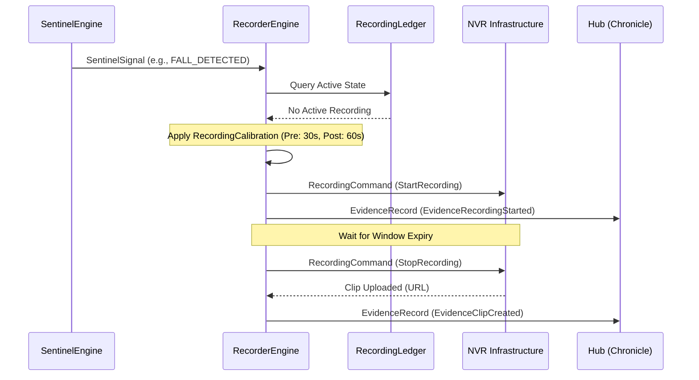

# 3.5 Recorder Engine (Evidence & NVR)

Relevant source files

- 
- 

The **Recorder Engine** is the system component responsible for translating high-level clinical events (Sentinel Signals) and scene changes into concrete recording commands for the Network Video Recorder (NVR) infrastructure. It operates as a pure domain engine that manages the lifecycle of "Evidence Clips"—short video segments captured around specific points of interest—and continuous recording states.

## Purpose and Scope

The Recorder Engine serves two primary functions:

1. **Evidence Capture**: Automatically triggering short video clips (e.g., 30 seconds before and 60 seconds after an event) when a `SentinelSignal` (like a Fall or Bed Exit) occurs.
2. **NVR Orchestration**: Managing the state of recording requests to ensure that multiple overlapping triggers for the same camera are handled efficiently without redundant command overhead.

The engine follows the standard platform pattern: a **pure domain** core for decision logic, a **Spring shell** for NATS integration, and a **batch tool** for offline replay and verification.

---

## Core Domain Logic

The engine is built around the `RecorderEngine` class, which implements the pure function contract defined in the platform kernel [platform/domain-kernel/src/main/kotlin/com/manahive/kernel/Engine.kt8-10](https://github.com/kerrvisiona-sudo/hive2/blob/f8142c8f/platform/domain-kernel/src/main/kotlin/com/manahive/kernel/Engine.kt#L8-L10).

### The Decision Function

The core logic follows this signature: `RecordingTrigger` + `RecordingLedger` → `Explained<RecordingVerdict>`

- **RecordingTrigger**: The stimulus, typically a `SentinelSignal` (Incident/Occurrence) or a `SceneFact` (e.g., Resident entered bed).
- **RecordingLedger**: The state container that tracks active recording windows and camera statuses.
- **RecordingVerdict**: The output containing the necessary `RecordingCommand` (Start/Stop) and `EvidenceRecord` metadata.

### Recording Calibration

The engine's behavior is governed by `RecordingCalibration`, which defines the rules for how different events trigger the NVR.

|Rule Component|Description|
|---|---|
|**Monitors**|Defines which `SentinelSignal` types or `SceneFact` types should trigger recording.|
|**Windows**|Specifies the `preTriggerDuration` and `postTriggerDuration` for evidence clips.|
|**Retention**|Policy for how long the resulting evidence should be kept (e.g., 30 days).|

---

## Data Flow & Entity Mapping

The following diagram maps the natural language concepts of "Video Recording" to the specific code entities within the `recorder-domain` and `contracts` modules.

### Concept to Code Mapping

**Sources:** [platform/domain-kernel/src/main/kotlin/com/manahive/kernel/Engine.kt23-27](https://github.com/kerrvisiona-sudo/hive2/blob/f8142c8f/platform/domain-kernel/src/main/kotlin/com/manahive/kernel/Engine.kt#L23-L27), [platform/domain-kernel/src/main/kotlin/com/manahive/kernel/Engine.kt8-10](https://github.com/kerrvisiona-sudo/hive2/blob/f8142c8f/platform/domain-kernel/src/main/kotlin/com/manahive/kernel/Engine.kt#L8-L10).

---

## Implementation Details

### RecordingCommand

When the `RecorderEngine` decides to act, it issues a `RecordingCommand`. These commands are consumed by the infrastructure layer to communicate with physical NVRs or Cloud Storage.

- **StartRecording**: Sent when a monitor condition is met. Includes the `StreamId` and the `EvidenceId` for correlation.
- **StopRecording**: Sent after the `postTriggerDuration` has elapsed relative to the last active trigger.

### EvidenceRecord

The engine emits telemetry via `EvidenceRecord` to the Hub. This allows the **Moviola** (the clinical review UI) to know exactly which video segments are available for a given incident.

- **EvidenceRecordingStarted**: Signals that a buffer is being captured.
- **EvidenceClipCreated**: Contains the URI or reference to the finalized video file.

### RecordingLedger (State Management)

The `RecordingLedger` is essential for idempotency and efficiency. It prevents the system from sending a "Start" command to an NVR that is already recording due to a previous, overlapping event. It tracks:

1. **Active Windows**: Time ranges currently being captured.
2. **Pending Stops**: Scheduled stop commands that may be canceled if a new trigger arrives.

---

## Engine Pipeline

The following sequence demonstrates how a clinical incident results in a recorded evidence clip.

**Sources:** [platform/domain-kernel/src/main/kotlin/com/manahive/kernel/Engine.kt29-33](https://github.com/kerrvisiona-sudo/hive2/blob/f8142c8f/platform/domain-kernel/src/main/kotlin/com/manahive/kernel/Engine.kt#L29-L33), [platform/domain-kernel/src/main/kotlin/com/manahive/kernel/Engine.kt35-36](https://github.com/kerrvisiona-sudo/hive2/blob/f8142c8f/platform/domain-kernel/src/main/kotlin/com/manahive/kernel/Engine.kt#L35-L36).

---

## Batch Tool: recorder-batch

Similar to other engines, the `recorder-batch` tool allows developers to run the recorder logic against historical data.

### Key Capabilities:

- **Run**: Processes a stream of `SentinelSignals` and `SceneFacts` from a JSONL file or NATS snapshot and outputs the resulting `RecordingCommands`.
- **Verify**: Compares the output of a new engine version against a "Golden Record" to ensure no regressions in recording logic.
- **Diff**: Highlights changes in recording windows or clip metadata between two versions of the engine.

This tool is critical for validating that changes to `RecordingCalibration` (e.g., increasing the pre-trigger buffer) don't result in excessive NVR load or storage exhaustion.

---

## Discard Logic

The Recorder Engine utilizes the `DiscardCause` enum from the domain kernel to explain why a recording was _not_ triggered.

Common discards in the recorder context include:

- **DUPLICATE**: A recording for this specific event window is already in progress [platform/domain-kernel/src/main/kotlin/com/manahive/kernel/Engine.kt41](https://github.com/kerrvisiona-sudo/hive2/blob/f8142c8f/platform/domain-kernel/src/main/kotlin/com/manahive/kernel/Engine.kt#L41-L41).
- **STAFF_PRESENT**: Calibration may specify that recordings should be suppressed if a staff member is already in the room [platform/domain-kernel/src/main/kotlin/com/manahive/kernel/Engine.kt43](https://github.com/kerrvisiona-sudo/hive2/blob/f8142c8f/platform/domain-kernel/src/main/kotlin/com/manahive/kernel/Engine.kt#L43-L43).

**Sources:**

- [platform/domain-kernel/src/main/kotlin/com/manahive/kernel/Engine.kt1-46](https://github.com/kerrvisiona-sudo/hive2/blob/f8142c8f/platform/domain-kernel/src/main/kotlin/com/manahive/kernel/Engine.kt#L1-L46)
- [engines/scene-engine/scene-domain/build.gradle.kts1-14](https://github.com/kerrvisiona-sudo/hive2/blob/f8142c8f/engines/scene-engine/scene-domain/build.gradle.kts#L1-L14)

### On this page

- [3.5 Recorder Engine (Evidence & NVR)](https://deepwiki.com/kerrvisiona-sudo/hive2/3.5-recorder-engine-\(evidence-and-nvr\)#35-recorder-engine-evidence-nvr)
- [Purpose and Scope](https://deepwiki.com/kerrvisiona-sudo/hive2/3.5-recorder-engine-\(evidence-and-nvr\)#purpose-and-scope)
- [Core Domain Logic](https://deepwiki.com/kerrvisiona-sudo/hive2/3.5-recorder-engine-\(evidence-and-nvr\)#core-domain-logic)
- [The Decision Function](https://deepwiki.com/kerrvisiona-sudo/hive2/3.5-recorder-engine-\(evidence-and-nvr\)#the-decision-function)
- [Recording Calibration](https://deepwiki.com/kerrvisiona-sudo/hive2/3.5-recorder-engine-\(evidence-and-nvr\)#recording-calibration)
- [Data Flow & Entity Mapping](https://deepwiki.com/kerrvisiona-sudo/hive2/3.5-recorder-engine-\(evidence-and-nvr\)#data-flow-entity-mapping)
- [Concept to Code Mapping](https://deepwiki.com/kerrvisiona-sudo/hive2/3.5-recorder-engine-\(evidence-and-nvr\)#concept-to-code-mapping)
- [Implementation Details](https://deepwiki.com/kerrvisiona-sudo/hive2/3.5-recorder-engine-\(evidence-and-nvr\)#implementation-details)
- [RecordingCommand](https://deepwiki.com/kerrvisiona-sudo/hive2/3.5-recorder-engine-\(evidence-and-nvr\)#recordingcommand)
- [EvidenceRecord](https://deepwiki.com/kerrvisiona-sudo/hive2/3.5-recorder-engine-\(evidence-and-nvr\)#evidencerecord)
- [RecordingLedger (State Management)](https://deepwiki.com/kerrvisiona-sudo/hive2/3.5-recorder-engine-\(evidence-and-nvr\)#recordingledger-state-management)
- [Engine Pipeline](https://deepwiki.com/kerrvisiona-sudo/hive2/3.5-recorder-engine-\(evidence-and-nvr\)#engine-pipeline)
- [Batch Tool: recorder-batch](https://deepwiki.com/kerrvisiona-sudo/hive2/3.5-recorder-engine-\(evidence-and-nvr\)#batch-tool-recorder-batch)
- [Key Capabilities:](https://deepwiki.com/kerrvisiona-sudo/hive2/3.5-recorder-engine-\(evidence-and-nvr\)#key-capabilities)
- [Discard Logic](https://deepwiki.com/kerrvisiona-sudo/hive2/3.5-recorder-engine-\(evidence-and-nvr\)#discard-logic)

