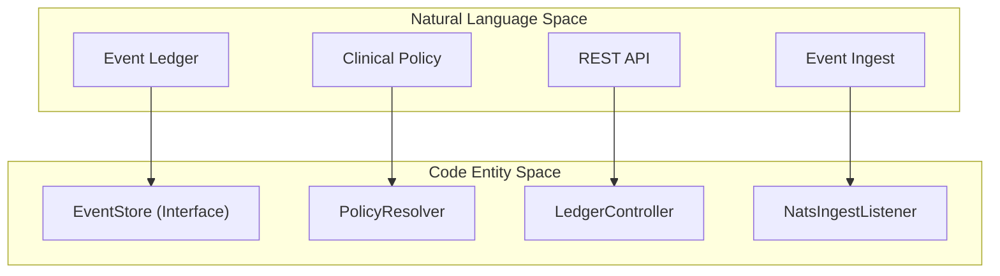
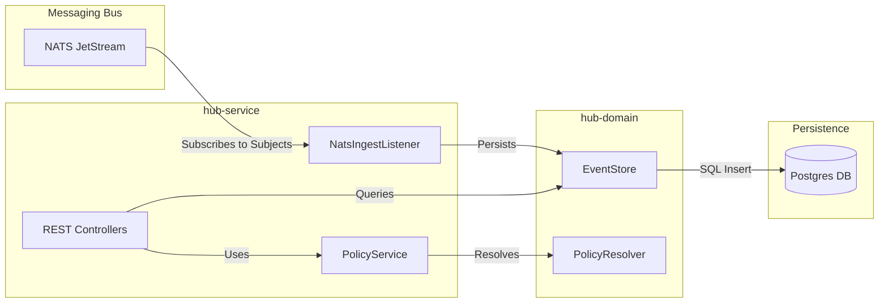

# Hub — System of Record

Relevant source files

- 
- 
- 

The **Hub** is the central authority and "System of Record" for the entire mana-hive platform. While the NATS JetStream bus provides transport and short-term buffering, the Hub is responsible for long-term persistence, forensic audit, and maintaining the ground truth of the system [hub/hub-service/src/main/kotlin/com/manahive/hub/HubApplication.kt7-10](https://github.com/kerrvisiona-sudo/hive2/blob/f8142c8f/hub/hub-service/src/main/kotlin/com/manahive/hub/HubApplication.kt#L7-L10)

It serves as the source of truth for clinical policies, the housing/census state, and a permanent ledger of every significant event emitted by the various processing engines. When an engine needs to rebuild its internal state (e.g., after a crash or a version upgrade), it re-seeds itself by querying the Hub's ledger.

## Bounded Contexts

The Hub is organized into four primary bounded contexts, implemented as logical modules within the Spring Boot application [hub/hub-service/src/main/kotlin/com/manahive/hub/HubApplication.kt12-17](https://github.com/kerrvisiona-sudo/hive2/blob/f8142c8f/hub/hub-service/src/main/kotlin/com/manahive/hub/HubApplication.kt#L12-L17):

|Context|Responsibility|
|---|---|
|**Housing & Census**|Manages the physical structure of the facility and the 1:1 invariant between beds and residents.|
|**Policy**|Manages clinical policies per resident (event-sourced) and resolves them via the `PolicyResolver`.|
|**Chronicle**|Records incidents, human verdicts (ground truth), and evidence links.|
|**Inquiry**|Provides cross-context read models and the "moviola" for forensic data joins.|

**Sources:**

- [hub/hub-service/src/main/kotlin/com/manahive/hub/HubApplication.kt12-17](https://github.com/kerrvisiona-sudo/hive2/blob/f8142c8f/hub/hub-service/src/main/kotlin/com/manahive/hub/HubApplication.kt#L12-L17)

## System Architecture

The Hub operates as a reactive consumer of the NATS bus, persisting data into a Postgres-backed ledger. It exposes this data and management capabilities via a REST API.

### Logical to Code Entity Mapping

The following diagram illustrates how high-level Hub concepts map to specific modules and implementation classes.

Hub System Components

**Sources:**

- [hub/hub-domain/build.gradle.kts1-6](https://github.com/kerrvisiona-sudo/hive2/blob/f8142c8f/hub/hub-domain/build.gradle.kts#L1-L6)
- [hub/hub-service/build.gradle.kts1-12](https://github.com/kerrvisiona-sudo/hive2/blob/f8142c8f/hub/hub-service/build.gradle.kts#L1-L12)

### Data Flow Overview

The Hub sits at the end of the event pipeline, listening to streams like `SCENE`, `SENTINEL`, and `ALARM`.

Hub Data Flow

**Sources:**

- [hub/hub-service/src/main/kotlin/com/manahive/hub/HubApplication.kt7-17](https://github.com/kerrvisiona-sudo/hive2/blob/f8142c8f/hub/hub-service/src/main/kotlin/com/manahive/hub/HubApplication.kt#L7-L17)
- [hub/hub-service/build.gradle.kts4-9](https://github.com/kerrvisiona-sudo/hive2/blob/f8142c8f/hub/hub-service/build.gradle.kts#L4-L9)

## Core Components

### Ledger & Event Store

The Hub maintains a Postgres-backed event ledger that provides a global order for all system events. This ledger supports optimistic concurrency tracking via consumer watermarks, ensuring that downstream processors can reliably track their progress during replays. For details, see [Hub Domain — Ledger & Policy](https://deepwiki.com/kerrvisiona-sudo/hive2/4.1-hub-domain-ledger-and-policy).

### Policy Management

The Hub is responsible for resolving clinical policies. This involves a layered resolution strategy that considers `WatchLevel`, `LevelTemplate`, `ManualAdjustment`, and `TimeWindow`. The `PolicyResolver` ensures that the correct rules are applied to a resident at any given time. For details, see [Hub Domain — Ledger & Policy](https://deepwiki.com/kerrvisiona-sudo/hive2/4.1-hub-domain-ledger-and-policy).

### REST API & Ingest

The `hub-service` provides the entry points for both data ingestion and external queries.

- **NatsIngestListener**: Subscribes to NATS streams and persists incoming `EventEnvelope` data.
- **Controllers**: Provide endpoints for managing policies, querying the ledger, and health monitoring (e.g., `LedgerController`, `PolicyController`). For details, see [Hub Service — REST API & NATS Ingest](https://deepwiki.com/kerrvisiona-sudo/hive2/4.2-hub-service-rest-api-and-nats-ingest).

### Database Schema

The underlying Postgres schema is designed for append-only performance and forensic integrity. It utilizes a central `events` table with `JSONB` payloads and specialized tables for `consumer_watermarks` and `decision_records`. For details, see [Hub Database Schema](https://deepwiki.com/kerrvisiona-sudo/hive2/4.3-hub-database-schema).

**Sources:**

- [hub/hub-service/src/main/kotlin/com/manahive/hub/HubApplication.kt7-10](https://github.com/kerrvisiona-sudo/hive2/blob/f8142c8f/hub/hub-service/src/main/kotlin/com/manahive/hub/HubApplication.kt#L7-L10)
- [hub/hub-service/build.gradle.kts1-15](https://github.com/kerrvisiona-sudo/hive2/blob/f8142c8f/hub/hub-service/build.gradle.kts#L1-L15)

### On this page

- [Hub — System of Record](https://deepwiki.com/kerrvisiona-sudo/hive2/4-hub-system-of-record#hub-system-of-record)
- [Bounded Contexts](https://deepwiki.com/kerrvisiona-sudo/hive2/4-hub-system-of-record#bounded-contexts)
- [System Architecture](https://deepwiki.com/kerrvisiona-sudo/hive2/4-hub-system-of-record#system-architecture)
- [Logical to Code Entity Mapping](https://deepwiki.com/kerrvisiona-sudo/hive2/4-hub-system-of-record#logical-to-code-entity-mapping)
- [Data Flow Overview](https://deepwiki.com/kerrvisiona-sudo/hive2/4-hub-system-of-record#data-flow-overview)
- [Core Components](https://deepwiki.com/kerrvisiona-sudo/hive2/4-hub-system-of-record#core-components)
- [Ledger & Event Store](https://deepwiki.com/kerrvisiona-sudo/hive2/4-hub-system-of-record#ledger-event-store)
- [Policy Management](https://deepwiki.com/kerrvisiona-sudo/hive2/4-hub-system-of-record#policy-management)
- [REST API & Ingest](https://deepwiki.com/kerrvisiona-sudo/hive2/4-hub-system-of-record#rest-api-ingest)
- [Database Schema](https://deepwiki.com/kerrvisiona-sudo/hive2/4-hub-system-of-record#database-schema)

