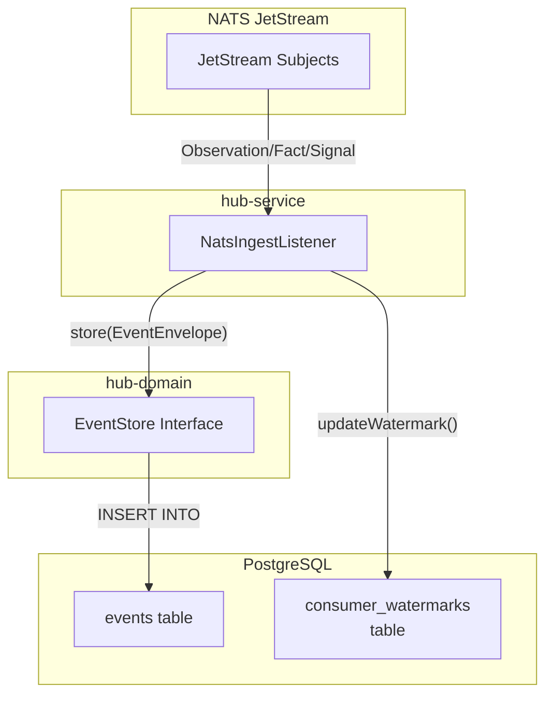
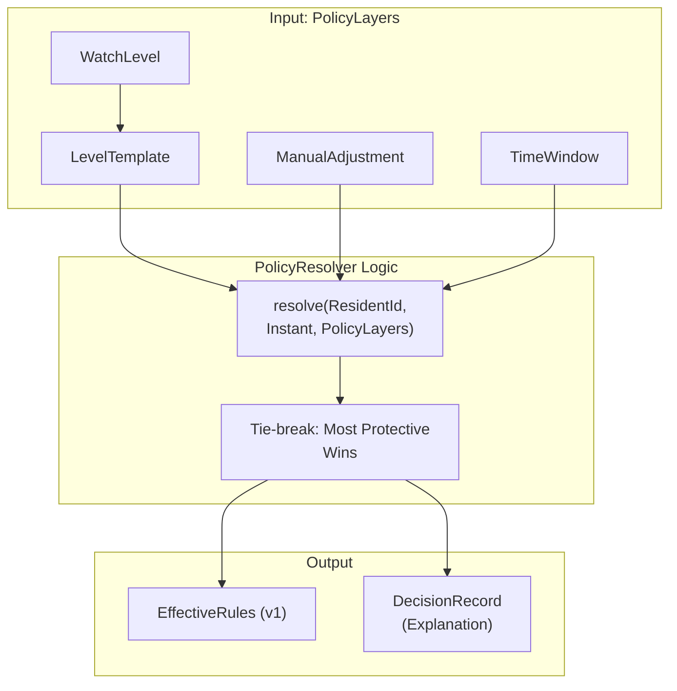

# Hub Domain — Ledger & Policy

Relevant source files

- 
- 

The `hub-domain` module serves as the core logic provider for the Hub, acting as the system of record for the entire Hive2 platform. It defines the abstractions for the append-only event ledger and the complex, layered resolution logic for resident care policies.

## 1. Ledger Abstraction

The Hub manages an immutable history of system activity. Unlike the transient streams in NATS JetStream, the Hub's ledger provides long-term persistence and structured access to historical events across different domain streams.

### Stream and Watermark Catalogs

The ledger is organized into streams (e.g., `SCENE`, `SENTINEL`, `ALARM`) and managed via two primary catalog interfaces:

- **`StreamCatalog`**: Responsible for retrieving events from the persistent store. It supports fetching events by global sequence, stream-specific sequence, or time ranges [hub/hub-domain/src/main/kotlin/com/manahive/hub/ledger/StreamCatalog.kt8-25](https://github.com/kerrvisiona-sudo/hive2/blob/f8142c8f/hub/hub-domain/src/main/kotlin/com/manahive/hub/ledger/StreamCatalog.kt#L8-L25)
- **`WatermarkCatalog`**: Manages "watermarks" or cursors for different consumers. This allows external services or internal background tasks to track their progress through the event log, ensuring at-least-once processing semantics [hub/hub-domain/src/main/kotlin/com/manahive/hub/ledger/WatermarkCatalog.kt7-20](https://github.com/kerrvisiona-sudo/hive2/blob/f8142c8f/hub/hub-domain/src/main/kotlin/com/manahive/hub/ledger/WatermarkCatalog.kt#L7-L20)

### Event Store

The `EventStore` interface defines the contract for persisting new events into the ledger. It ensures that every event is assigned a unique `global_seq` and a `stream_seq` while enforcing idempotency via an `event_id` [hub/hub-domain/src/main/kotlin/com/manahive/hub/ledger/EventStore.kt9-22](https://github.com/kerrvisiona-sudo/hive2/blob/f8142c8f/hub/hub-domain/src/main/kotlin/com/manahive/hub/ledger/EventStore.kt#L9-L22)

### Data Flow: Ledger Ingestion

The following diagram illustrates how events flow from the NATS bus into the Hub's persistent ledger.

**Diagram: Event Ingestion to Ledger**

**Sources:** [hub/hub-domain/src/main/kotlin/com/manahive/hub/ledger/EventStore.kt9-22](https://github.com/kerrvisiona-sudo/hive2/blob/f8142c8f/hub/hub-domain/src/main/kotlin/com/manahive/hub/ledger/EventStore.kt#L9-L22) [hub/hub-domain/src/main/kotlin/com/manahive/hub/ledger/WatermarkCatalog.kt7-20](https://github.com/kerrvisiona-sudo/hive2/blob/f8142c8f/hub/hub-domain/src/main/kotlin/com/manahive/hub/ledger/WatermarkCatalog.kt#L7-L20)

---

## 2. Policy Resolution Engine

The Hub is responsible for determining the `EffectiveRules` for a resident at any given moment. This is handled by the `PolicyResolver`, which follows a deterministic, layered precedence model.

### Watch Levels

The foundation of a resident's policy is their `WatchLevel`. This enum defines the intensity of monitoring required [hub/hub-domain/src/main/kotlin/com/manahive/hub/policy/WatchLevel.kt3-12](https://github.com/kerrvisiona-sudo/hive2/blob/f8142c8f/hub/hub-domain/src/main/kotlin/com/manahive/hub/policy/WatchLevel.kt#L3-L12):

- **`NONE`**: No active monitoring.
- **`LOW` / `MEDIUM` / `HIGH`**: Standard tiers of clinical observation.
- **`VITAL`**: The most intensive monitoring level.

### Layered Resolution Logic

The `PolicyResolver` implements the `Engine` interface [hub/hub-domain/src/main/kotlin/com/manahive/hub/policy/PolicyResolver.kt22-28](https://github.com/kerrvisiona-sudo/hive2/blob/f8142c8f/hub/hub-domain/src/main/kotlin/com/manahive/hub/policy/PolicyResolver.kt#L22-L28) It takes a `PolicyLayers` object and resolves it into a single `Explained<EffectiveRules>`.

The resolution follows these layers in order of precedence:

1. **`LevelTemplate`**: The default set of `AlertRule` objects associated with a `WatchLevel` [hub/hub-domain/src/main/kotlin/com/manahive/hub/policy/PolicyResolver.kt37-41](https://github.com/kerrvisiona-sudo/hive2/blob/f8142c8f/hub/hub-domain/src/main/kotlin/com/manahive/hub/policy/PolicyResolver.kt#L37-L41)
2. **`ManualAdjustment`**: Overrides made by staff members (e.g., a nurse manually enabling a specific fall alert for a high-risk night) [hub/hub-domain/src/main/kotlin/com/manahive/hub/policy/PolicyResolver.kt43-48](https://github.com/kerrvisiona-sudo/hive2/blob/f8142c8f/hub/hub-domain/src/main/kotlin/com/manahive/hub/policy/PolicyResolver.kt#L43-L48)
3. **`TimeWindow`**: Time-based rules (e.g., tightening "Bed Exit" rules between 22:00 and 07:00) [hub/hub-domain/src/main/kotlin/com/manahive/hub/policy/PolicyResolver.kt51-56](https://github.com/kerrvisiona-sudo/hive2/blob/f8142c8f/hub/hub-domain/src/main/kotlin/com/manahive/hub/policy/PolicyResolver.kt#L51-L56)

**Tie-break Rule:** If multiple layers provide conflicting configurations for the same rule, the **most protective** configuration wins to ensure resident safety.

**Diagram: Policy Resolution Layers**

**Sources:** [hub/hub-domain/src/main/kotlin/com/manahive/hub/policy/PolicyResolver.kt12-35](https://github.com/kerrvisiona-sudo/hive2/blob/f8142c8f/hub/hub-domain/src/main/kotlin/com/manahive/hub/policy/PolicyResolver.kt#L12-L35) [hub/hub-domain/src/main/kotlin/com/manahive/hub/policy/WatchLevel.kt3-12](https://github.com/kerrvisiona-sudo/hive2/blob/f8142c8f/hub/hub-domain/src/main/kotlin/com/manahive/hub/policy/WatchLevel.kt#L3-L12)

---

## 3. Policy Catalogs and Storage

The domain provides in-memory abstractions for managing policy metadata, which are typically backed by the Hub's event-sourced clinical history.

### InMemory Catalogs

These classes serve as caches or simplified stores for policy components:

- **`InMemoryPolicyCatalog`**: Stores the definitions of `LevelTemplate` and available `WatchLevel` configurations.
- **`InMemoryRawPolicyStore`**: A low-level store for the raw JSON representations of policies before they are resolved.
- **`InMemorySemanticBucketStore`**: Manages "Semantic Buckets"—logical groupings of sensors or areas used to define where rules apply (e.g., "Bed Area", "Bathroom").

### Implementation Details

|Class|Responsibility|Key Function|
|---|---|---|
|`PolicyResolver`|Pure logic for folding layers into `EffectiveRules`.|`resolve(...)` [hub/hub-domain/src/main/kotlin/com/manahive/hub/policy/PolicyResolver.kt23](https://github.com/kerrvisiona-sudo/hive2/blob/f8142c8f/hub/hub-domain/src/main/kotlin/com/manahive/hub/policy/PolicyResolver.kt#L23-L23)|
|`PolicyLayers`|Data container for the four resolution layers.|`val level: WatchLevel` [hub/hub-domain/src/main/kotlin/com/manahive/hub/policy/PolicyResolver.kt30-35](https://github.com/kerrvisiona-sudo/hive2/blob/f8142c8f/hub/hub-domain/src/main/kotlin/com/manahive/hub/policy/PolicyResolver.kt#L30-L35)|
|`LevelTemplate`|Maps a `WatchLevel` to a default list of `AlertRule`.|`val rules: List<AlertRule>` [hub/hub-domain/src/main/kotlin/com/manahive/hub/policy/PolicyResolver.kt37-41](https://github.com/kerrvisiona-sudo/hive2/blob/f8142c8f/hub/hub-domain/src/main/kotlin/com/manahive/hub/policy/PolicyResolver.kt#L37-L41)|

**Sources:** [hub/hub-domain/src/main/kotlin/com/manahive/hub/policy/PolicyResolver.kt1-56](https://github.com/kerrvisiona-sudo/hive2/blob/f8142c8f/hub/hub-domain/src/main/kotlin/com/manahive/hub/policy/PolicyResolver.kt#L1-L56) [hub/hub-domain/build.gradle.kts1-6](https://github.com/kerrvisiona-sudo/hive2/blob/f8142c8f/hub/hub-domain/build.gradle.kts#L1-L6)

### On this page

- [Hub Domain — Ledger & Policy](https://deepwiki.com/kerrvisiona-sudo/hive2/4.1-hub-domain-ledger-and-policy#hub-domain-ledger-policy)
- [1. Ledger Abstraction](https://deepwiki.com/kerrvisiona-sudo/hive2/4.1-hub-domain-ledger-and-policy#1-ledger-abstraction)
- [Stream and Watermark Catalogs](https://deepwiki.com/kerrvisiona-sudo/hive2/4.1-hub-domain-ledger-and-policy#stream-and-watermark-catalogs)
- [Event Store](https://deepwiki.com/kerrvisiona-sudo/hive2/4.1-hub-domain-ledger-and-policy#event-store)
- [Data Flow: Ledger Ingestion](https://deepwiki.com/kerrvisiona-sudo/hive2/4.1-hub-domain-ledger-and-policy#data-flow-ledger-ingestion)
- [2. Policy Resolution Engine](https://deepwiki.com/kerrvisiona-sudo/hive2/4.1-hub-domain-ledger-and-policy#2-policy-resolution-engine)
- [Watch Levels](https://deepwiki.com/kerrvisiona-sudo/hive2/4.1-hub-domain-ledger-and-policy#watch-levels)
- [Layered Resolution Logic](https://deepwiki.com/kerrvisiona-sudo/hive2/4.1-hub-domain-ledger-and-policy#layered-resolution-logic)
- [3. Policy Catalogs and Storage](https://deepwiki.com/kerrvisiona-sudo/hive2/4.1-hub-domain-ledger-and-policy#3-policy-catalogs-and-storage)
- [InMemory Catalogs](https://deepwiki.com/kerrvisiona-sudo/hive2/4.1-hub-domain-ledger-and-policy#inmemory-catalogs)
- [Implementation Details](https://deepwiki.com/kerrvisiona-sudo/hive2/4.1-hub-domain-ledger-and-policy#implementation-details)

