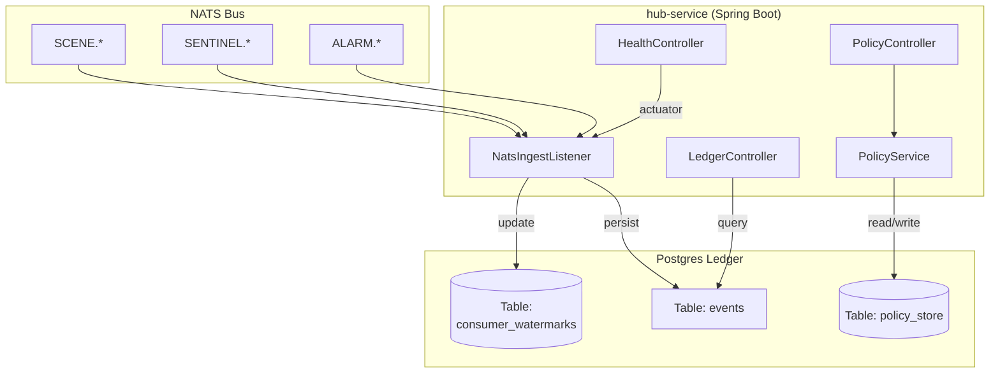

# Hub Service — REST API & NATS Ingest

Relevant source files

- 
- 
- 

The `hub-service` is the **System of Record** for the mana-hive platform. While NATS JetStream provides the transport and short-term buffering for the event-driven architecture, the Hub is responsible for the long-term persistence, forensic auditing, and clinical policy management [hub/hub-service/src/main/kotlin/com/manahive/hub/HubApplication.kt6-10](https://github.com/kerrvisiona-sudo/hive2/blob/f8142c8f/hub/hub-service/src/main/kotlin/com/manahive/hub/HubApplication.kt#L6-L10) It ingests every event published by every engine into a centralized Postgres ledger, providing the "golden replay" source required for engine state rebuilding and clinical inquiry [hub/hub-service/src/main/kotlin/com/manahive/hub/HubApplication.kt7-11](https://github.com/kerrvisiona-sudo/hive2/blob/f8142c8f/hub/hub-service/src/main/kotlin/com/manahive/hub/HubApplication.kt#L7-L11)

## System Architecture & Data Flow

The `hub-service` operates as a Spring Boot application that bridges the asynchronous NATS messaging layer with a synchronous REST API and a relational Postgres backend.

### Component Interaction Diagram

This diagram illustrates how the `hub-service` internal components interact with the NATS bus and the Postgres database.

Sources: [hub/hub-service/src/main/kotlin/com/manahive/hub/HubApplication.kt12-17](https://github.com/kerrvisiona-sudo/hive2/blob/f8142c8f/hub/hub-service/src/main/kotlin/com/manahive/hub/HubApplication.kt#L12-L17) [hub/hub-service/src/main/resources/application.yml1-26](https://github.com/kerrvisiona-sudo/hive2/blob/f8142c8f/hub/hub-service/src/main/resources/application.yml#L1-L26)

## NATS Ingest & Persistence

The `NatsIngestListener` (conceptually described in the Hub's role) acts as a durable consumer for the `SCENE`, `SENTINEL`, and `ALARM` streams. Its primary responsibility is to guarantee that every `EventEnvelope` crossing the bus is recorded in the Postgres `events` table.

### Data Flow: Ingest to Ledger

1. **Subscription**: The service subscribes to subjects defined in `platform/messaging`.
2. **Idempotency**: Upon receiving a message, the service checks the `event_id` against the `events` table to prevent duplicate processing.
3. **Persistence**: The payload is stored as `JSONB`, preserving the `EventEnvelope` metadata (type, version, source, and timestamps).
4. **Watermarking**: The `consumer_watermarks` table is updated to track the Hub's progress relative to the NATS stream sequences.

Sources: [hub/hub-service/src/main/kotlin/com/manahive/hub/HubApplication.kt6-11](https://github.com/kerrvisiona-sudo/hive2/blob/f8142c8f/hub/hub-service/src/main/kotlin/com/manahive/hub/HubApplication.kt#L6-L11) [hub/hub-service/build.gradle.kts3-12](https://github.com/kerrvisiona-sudo/hive2/blob/f8142c8f/hub/hub-service/build.gradle.kts#L3-L12)

## REST API Controllers

The Hub exposes several REST endpoints to allow engines and administrative tools to interact with the System of Record.

|Controller|Purpose|Key Responsibilities|
|---|---|---|
|`LedgerController`|Event Retrieval|Provides access to the historical event stream for "Golden Replay" and debugging.|
|`PolicyController`|Active Policy|Manages `ResidentPolicy` and `AlarmProfile` assignments.|
|`PolicyCatalogController`|Templates|Manages the `PolicyCatalog` (predefined templates for WatchLevels).|
|`RawPolicyController`|Storage|Low-level access to raw policy definitions before resolution.|
|`SemanticBucketController`|Classification|Manages `SemanticBucket` mappings used by the `PolicyResolver`.|
|`HealthController`|Monitoring|Integrates with Spring Boot Actuator to report service and NATS connectivity status.|

Sources: [hub/hub-service/src/main/kotlin/com/manahive/hub/HubApplication.kt12-17](https://github.com/kerrvisiona-sudo/hive2/blob/f8142c8f/hub/hub-service/src/main/kotlin/com/manahive/hub/HubApplication.kt#L12-L17) [hub/hub-service/build.gradle.kts7-8](https://github.com/kerrvisiona-sudo/hive2/blob/f8142c8f/hub/hub-service/build.gradle.kts#L7-L8)

## Policy Management Service

The `PolicyService` acts as the orchestrator for clinical configuration. It coordinates between the `PolicyResolver` (defined in `hub-domain`) and the underlying persistence layer.

### Policy Resolution Logic

When a request for a resident's policy is made, the service follows a layered resolution strategy:

1. **WatchLevel**: Identifies the base level (e.g., `STANDARD`, `ENHANCED`).
2. **LevelTemplate**: Loads the default `EffectiveRules` for that level from the `PolicyCatalog`.
3. **ManualAdjustment**: Overlays any resident-specific overrides.
4. **TimeWindow**: Applies temporal rules (e.g., different sensitivity at night).

Sources: [hub/hub-service/src/main/kotlin/com/manahive/hub/HubApplication.kt14-15](https://github.com/kerrvisiona-sudo/hive2/blob/f8142c8f/hub/hub-service/src/main/kotlin/com/manahive/hub/HubApplication.kt#L14-L15) [hub/hub-service/build.gradle.kts4](https://github.com/kerrvisiona-sudo/hive2/blob/f8142c8f/hub/hub-service/build.gradle.kts#L4-L4)

## Hub Batch CLI

The `hub-batch` tool is a command-line interface used for administrative tasks and offline data manipulation.

### Key Components

- **HubBatchApp**: The entry point for the CLI tool.
- **HubFileHelper**: A utility class responsible for importing/exporting event data between the Postgres ledger and local files (typically JSONL format).

This tool is critical for **Scenario Simulation**, allowing developers to export a sequence of events from a production environment and replay them in a local `scene-engine` or `sentinel` instance for debugging.

Sources: [hub/hub-service/src/main/kotlin/com/manahive/hub/HubApplication.kt8-11](https://github.com/kerrvisiona-sudo/hive2/blob/f8142c8f/hub/hub-service/src/main/kotlin/com/manahive/hub/HubApplication.kt#L8-L11)

## Configuration & Deployment

The service is configured via `application.yml` and environment variables.

### Key Configuration Parameters

- **Server Port**: Defaults to `8080` [hub/hub-service/src/main/resources/application.yml8](https://github.com/kerrvisiona-sudo/hive2/blob/f8142c8f/hub/hub-service/src/main/resources/application.yml#L8-L8)
- **NATS URL**: Configured via `nats.url`, defaulting to `nats://localhost:4222` [hub/hub-service/src/main/resources/application.yml25](https://github.com/kerrvisiona-sudo/hive2/blob/f8142c8f/hub/hub-service/src/main/resources/application.yml#L25-L25)
- **Database**: Uses `spring-boot-starter-jdbc` with a PostgreSQL driver [hub/hub-service/build.gradle.kts9-12](https://github.com/kerrvisiona-sudo/hive2/blob/f8142c8f/hub/hub-service/build.gradle.kts#L9-L12)
- **Actuator**: Health, Info, and Metrics endpoints are exposed for monitoring [hub/hub-service/src/main/resources/application.yml10-17](https://github.com/kerrvisiona-sudo/hive2/blob/f8142c8f/hub/hub-service/src/main/resources/application.yml#L10-L17)

Sources: [hub/hub-service/src/main/resources/application.yml1-26](https://github.com/kerrvisiona-sudo/hive2/blob/f8142c8f/hub/hub-service/src/main/resources/application.yml#L1-L26) [hub/hub-service/build.gradle.kts7-12](https://github.com/kerrvisiona-sudo/hive2/blob/f8142c8f/hub/hub-service/build.gradle.kts#L7-L12)

### On this page

- [Hub Service — REST API & NATS Ingest](https://deepwiki.com/kerrvisiona-sudo/hive2/4.2-hub-service-rest-api-and-nats-ingest#hub-service-rest-api-nats-ingest)
- [System Architecture & Data Flow](https://deepwiki.com/kerrvisiona-sudo/hive2/4.2-hub-service-rest-api-and-nats-ingest#system-architecture-data-flow)
- [Component Interaction Diagram](https://deepwiki.com/kerrvisiona-sudo/hive2/4.2-hub-service-rest-api-and-nats-ingest#component-interaction-diagram)
- [NATS Ingest & Persistence](https://deepwiki.com/kerrvisiona-sudo/hive2/4.2-hub-service-rest-api-and-nats-ingest#nats-ingest-persistence)
- [Data Flow: Ingest to Ledger](https://deepwiki.com/kerrvisiona-sudo/hive2/4.2-hub-service-rest-api-and-nats-ingest#data-flow-ingest-to-ledger)
- [REST API Controllers](https://deepwiki.com/kerrvisiona-sudo/hive2/4.2-hub-service-rest-api-and-nats-ingest#rest-api-controllers)
- [Policy Management Service](https://deepwiki.com/kerrvisiona-sudo/hive2/4.2-hub-service-rest-api-and-nats-ingest#policy-management-service)
- [Policy Resolution Logic](https://deepwiki.com/kerrvisiona-sudo/hive2/4.2-hub-service-rest-api-and-nats-ingest#policy-resolution-logic)
- [Hub Batch CLI](https://deepwiki.com/kerrvisiona-sudo/hive2/4.2-hub-service-rest-api-and-nats-ingest#hub-batch-cli)
- [Key Components](https://deepwiki.com/kerrvisiona-sudo/hive2/4.2-hub-service-rest-api-and-nats-ingest#key-components)
- [Configuration & Deployment](https://deepwiki.com/kerrvisiona-sudo/hive2/4.2-hub-service-rest-api-and-nats-ingest#configuration-deployment)
- [Key Configuration Parameters](https://deepwiki.com/kerrvisiona-sudo/hive2/4.2-hub-service-rest-api-and-nats-ingest#key-configuration-parameters)
