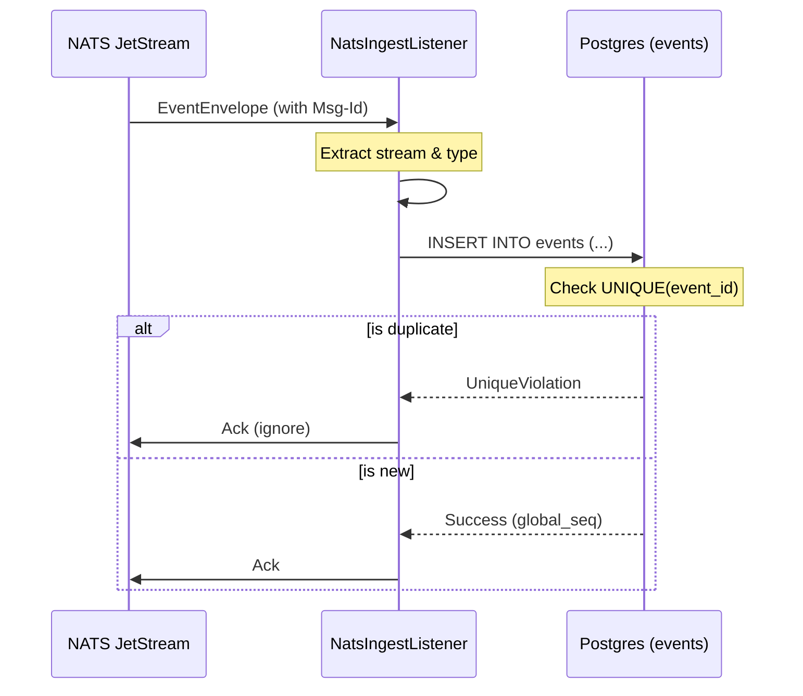
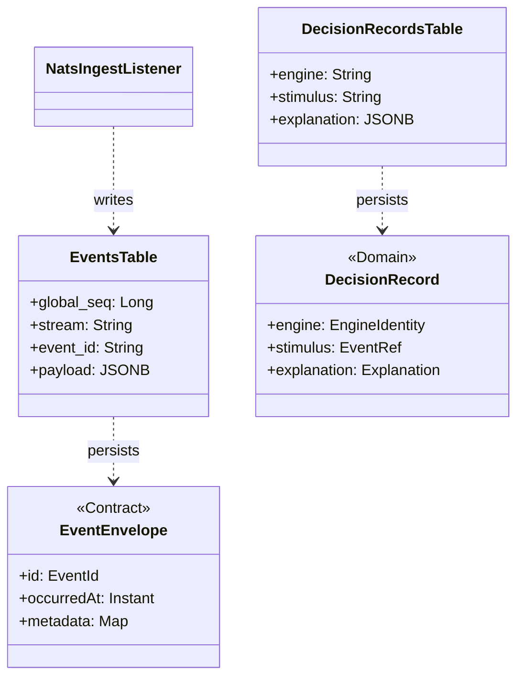

# Hub Database Schema

Relevant source files

- 
- 

The Hub serves as the **System of Record** for the mana-hive platform. Its database schema is designed for high-integrity event sourcing, auditability, and telemetry storage. The implementation uses a Postgres-backed append-only ledger that ensures end-to-end idempotency and tracks the progress of downstream consumers.

## Core Schema Architecture

The database is structured into three primary tables: `events` (the immutable ledger), `consumer_watermarks` (cursor management), and `decision_records` (engine telemetry).

### 1. The Events Ledger (`events`)

The `events` table is the heart of the Hub. It stores every domain event produced across the system, including observations, scene facts, and alarms. It uses a dual-sequencing strategy to maintain global order while allowing for stream-specific optimistic concurrency.

|Column|Type|Description|
|---|---|---|
|`global_seq`|`BIGINT`|Primary Key. Auto-incrementing global order of arrival.|
|`stream`|`TEXT`|The logical stream identifier (e.g., `scene.12A.2026-08-20`).|
|`stream_seq`|`BIGINT`|The sequence number within that specific stream.|
|`event_id`|`TEXT`|The idempotency key, typically mapped from the `Nats-Msg-Id`.|
|`type`|`TEXT`|The event contract type (e.g., `scene.transition-detected`).|
|`version`|`INT`|Schema version of the event payload.|
|`source`|`TEXT`|The producing component (e.g., `scene-engine`, `ia-cell/12A`).|
|`payload`|`JSONB`|The actual event data.|
|`occurred_at`|`TIMESTAMPTZ`|When the event was generated by the source.|
|`recorded_at`|`TIMESTAMPTZ`|When the Hub persisted the event (default `now()`).|

**Constraints and Indices:**

- **Idempotency:** A `UNIQUE` constraint on `event_id` ensures that NATS bus redeliveries or retries do not result in duplicate entries [hub/hub-service/src/main/resources/db/schema.sql15](https://github.com/kerrvisiona-sudo/hive2/blob/f8142c8f/hub/hub-service/src/main/resources/db/schema.sql#L15-L15)
- **Concurrency:** A `UNIQUE` constraint on `(stream, stream_seq)` prevents race conditions within a single aggregate's timeline [hub/hub-service/src/main/resources/db/schema.sql14](https://github.com/kerrvisiona-sudo/hive2/blob/f8142c8f/hub/hub-service/src/main/resources/db/schema.sql#L14-L14)
- **Performance:** Indices are maintained on `(stream, stream_seq)` for rapid stream reconstruction and `(type, occurred_at)` for temporal queries [hub/hub-service/src/main/resources/db/schema.sql17-18](https://github.com/kerrvisiona-sudo/hive2/blob/f8142c8f/hub/hub-service/src/main/resources/db/schema.sql#L17-L18)

**Sources:** [hub/hub-service/src/main/resources/db/schema.sql3-18](https://github.com/kerrvisiona-sudo/hive2/blob/f8142c8f/hub/hub-service/src/main/resources/db/schema.sql#L3-L18)

### 2. Consumer Tracking (`consumer_watermarks`)

To support asynchronous processing and "catch-up" subscriptions, the Hub tracks the progress of various consumers (such as the Moviola replay service or external integrations).

|Column|Type|Description|
|---|---|---|
|`consumer`|`TEXT`|Primary Key. The unique name of the consumer.|
|`global_seq`|`BIGINT`|The last `global_seq` successfully processed by this consumer.|
|`advanced_at`|`TIMESTAMPTZ`|Timestamp of the last watermark update.|

This table allows the Hub to manage state for non-NATS consumers and provides a mechanism for monitoring system lag.

**Sources:** [hub/hub-service/src/main/resources/db/schema.sql20-24](https://github.com/kerrvisiona-sudo/hive2/blob/f8142c8f/hub/hub-service/src/main/resources/db/schema.sql#L20-L24)

### 3. Judgment Telemetry (`decision_records`)

Unlike the `events` table, which contains the "what," the `decision_records` table contains the "why." It stores the internal reasoning of pure-function engines (like `sentinel-evaluator`).

|Column|Type|Description|
|---|---|---|
|`engine`|`TEXT`|Engine name and version (e.g., `sentinel-evaluator@1.4.0+ab12cd`).|
|`stimulus`|`TEXT`|Reference to the event that triggered the decision (`stream` + `seq`).|
|`inputs`|`JSONB`|Fingerprints of inputs: twin state, rules, calibration, etc.|
|`output`|`JSONB`|The resulting event or command emitted.|
|`explanation`|`JSONB`|The `Explained<T>` trace: logical steps and `DiscardCause` reasons.|
|`took_ms`|`INT`|Processing latency in milliseconds.|

**Sources:** [hub/hub-service/src/main/resources/db/schema.sql27-37](https://github.com/kerrvisiona-sudo/hive2/blob/f8142c8f/hub/hub-service/src/main/resources/db/schema.sql#L27-L37)

## Data Flow: NATS to Postgres

The `NatsIngestListener` in the `hub-service` acts as the bridge between the transient NATS JetStream and the permanent Postgres ledger.

### Ingestion Logic

**Sources:** [hub/hub-service/src/main/resources/db/schema.sql3-16](https://github.com/kerrvisiona-sudo/hive2/blob/f8142c8f/hub/hub-service/src/main/resources/db/schema.sql#L3-L16) [hub/hub-service/src/main/resources/application.yml24-26](https://github.com/kerrvisiona-sudo/hive2/blob/f8142c8f/hub/hub-service/src/main/resources/application.yml#L24-L26)

## Entity Mapping

The following diagram maps the database schema entities to the corresponding domain objects and service components defined in the codebase.

### Code to Schema Mapping

**Sources:** [hub/hub-service/src/main/resources/db/schema.sql3-37](https://github.com/kerrvisiona-sudo/hive2/blob/f8142c8f/hub/hub-service/src/main/resources/db/schema.sql#L3-L37) [hub/hub-service/src/main/resources/application.yml1-3](https://github.com/kerrvisiona-sudo/hive2/blob/f8142c8f/hub/hub-service/src/main/resources/application.yml#L1-L3)

## Key Implementation Details

1. **Append-Only Design:** The `events` table is strictly append-only. Updates are never performed on existing events. State changes are represented by new events with incremented `stream_seq` values.
2. **JSONB for Flexibility:** The `payload`, `inputs`, and `explanation` columns use the `JSONB` type. This allows the Hub to store evolving event schemas from different engines without requiring frequent DDL changes, while still supporting indexed queries on JSON fields.
3. **Engine Telemetry:** The `decision_records` table is intentionally decoupled from the domain ledger. While events represent the official history of the facility, decision records are used for debugging, clinical review, and "what-if" analysis in the `moviola` context.
4. **Optimistic Concurrency:** The `UNIQUE (stream, stream_seq)` constraint is the primary defense against split-brain scenarios where two instances of an engine might attempt to write to the same stream simultaneously.

**Sources:** [hub/hub-service/src/main/resources/db/schema.sql1-37](https://github.com/kerrvisiona-sudo/hive2/blob/f8142c8f/hub/hub-service/src/main/resources/db/schema.sql#L1-L37)

### On this page

- [Hub Database Schema](https://deepwiki.com/kerrvisiona-sudo/hive2/4.3-hub-database-schema#hub-database-schema)
- [Core Schema Architecture](https://deepwiki.com/kerrvisiona-sudo/hive2/4.3-hub-database-schema#core-schema-architecture)
- [1. The Events Ledger (`events`)](https://deepwiki.com/kerrvisiona-sudo/hive2/4.3-hub-database-schema#1-the-events-ledger-events)
- [2. Consumer Tracking (`consumer_watermarks`)](https://deepwiki.com/kerrvisiona-sudo/hive2/4.3-hub-database-schema#2-consumer-tracking-consumer_watermarks)
- [3. Judgment Telemetry (`decision_records`)](https://deepwiki.com/kerrvisiona-sudo/hive2/4.3-hub-database-schema#3-judgment-telemetry-decision_records)
- [Data Flow: NATS to Postgres](https://deepwiki.com/kerrvisiona-sudo/hive2/4.3-hub-database-schema#data-flow-nats-to-postgres)
- [Ingestion Logic](https://deepwiki.com/kerrvisiona-sudo/hive2/4.3-hub-database-schema#ingestion-logic)
- [Entity Mapping](https://deepwiki.com/kerrvisiona-sudo/hive2/4.3-hub-database-schema#entity-mapping)
- [Code to Schema Mapping](https://deepwiki.com/kerrvisiona-sudo/hive2/4.3-hub-database-schema#code-to-schema-mapping)
- [Key Implementation Details](https://deepwiki.com/kerrvisiona-sudo/hive2/4.3-hub-database-schema#key-implementation-details)

