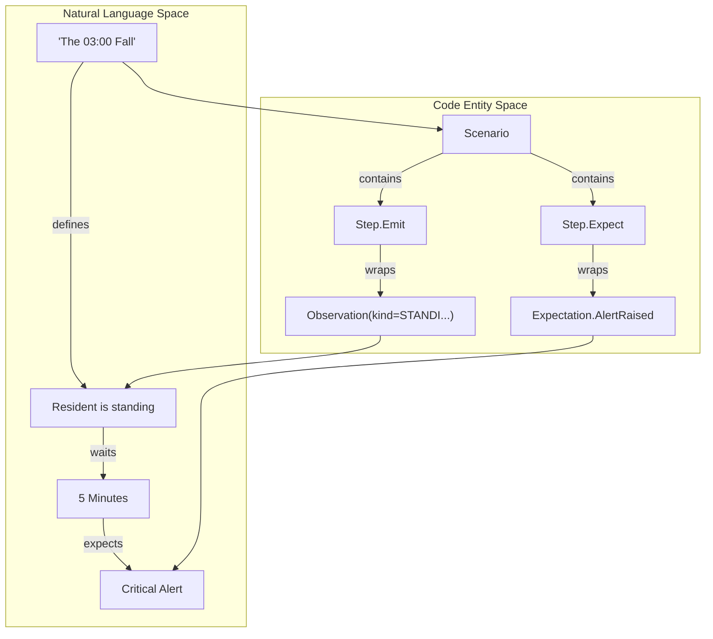
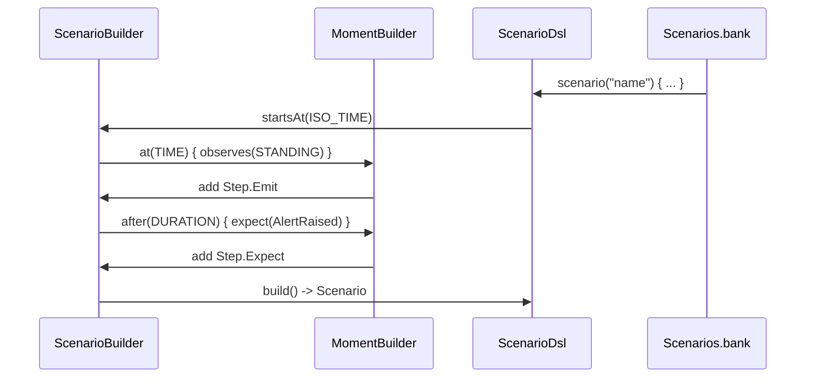

# Batch Tools & Simulator

Relevant source files

- 
- 
- 
- 

The Hive2 platform provides a suite of offline tooling designed for deterministic replay, clinical validation, and regression testing. These tools allow developers and clinical staff to execute the system's logic against historical data or synthetic scenarios without requiring a live NATS cluster or a running production environment.

The tooling is divided into two primary components:

1. **Batch CLI Tools**: Per-engine command-line interfaces used to process large volumes of historical events for "golden replay" testing and debugging.
2. **Scenario Simulator**: A DSL-driven environment for defining synthetic resident behavior and asserting expected system responses (e.g., alerts raised or suppressed).

## Batch CLI Tools

Each engine in the system (Scene, Sentinel, Harbor, Politica, Recorder, and Hub) includes a corresponding batch module (e.g., `scene-batch`, `sentinel-batch`). These tools share a common pattern for offline event processing, enabling "Golden Replay" workflows where logic changes can be verified against known historical inputs and outputs.

The batch tools typically support a triad of operations:

- **Run**: Processes an input stream of events and writes the resulting engine decisions to a file.
- **Verify**: Compares current engine output against a previously saved "golden" reference file.
- **Diff**: Highlights discrepancies between two execution runs, useful for identifying side effects of logic updates.

These tools leverage a shared infrastructure for state management and event cursors, ensuring that offline processing mirrors the behavior of the live Spring-shell services.

For details on configuration, the `BatchProcessor`, and output writers, see **[Batch CLI Tools](https://deepwiki.com/kerrvisiona-sudo/hive2/5.1-batch-cli-tools)**.

### Entity Mapping: Batch Infrastructure

|Code Entity|Role|
|---|---|
|`BatchConfig`|YAML-driven configuration for input/output paths and engine parameters.|
|`BatchProcessor`|Orchestrates the reading of events and the invocation of the pure-domain `Engine`.|
|`EventOffset`|Tracks the replay cursor to ensure ordered processing.|
|`FactsOutWriter` / `SignalJsonlWriter`|Standardized writers for persisting engine results to disk.|

**Sources:**

- [scene-engine/scene-batch/src/main/kotlin/com/manahive/scene/batch/SceneBatchApp.kt1-50](https://github.com/kerrvisiona-sudo/hive2/blob/f8142c8f/scene-engine/scene-batch/src/main/kotlin/com/manahive/scene/batch/SceneBatchApp.kt#L1-L50) (Conceptual reference for engine-specific batch entry points)

---

## Scenario Simulator

The **Scenario Simulator** is a specialized module (`simulator`) that bridges the gap between clinical requirements and technical implementation. It uses a Kotlin-based **Scenario DSL** to define resident activities and sensor observations over a virtual timeline.

Scenarios serve a triple purpose:

1. **Acceptance Tests**: Executed in CI to verify that the system meets specific clinical criteria.
2. **Golden Replay Inputs**: Synthetic scenarios can be exported to feed the Batch CLI tools.
3. **Clinical Review**: The DSL is readable enough for clinical staff to "see" and approve a rule's behavior before it is deployed.

### Scenario DSL Concepts

The simulator uses a `ScenarioBuilder` to construct a sequence of `Step` entities, which include emitting observations or setting expectations for the system's response.

For details on the DSL syntax and the `Scenarios` bank, see **[Scenario Simulator](https://deepwiki.com/kerrvisiona-sudo/hive2/5.2-scenario-simulator)**.

### Simulator Logic Flow

The simulator processes a `Scenario` by advancing a virtual clock and comparing engine outputs against defined `Expectation` types.

**Sources:**

- [simulator/src/main/kotlin/com/manahive/simulator/ScenarioDsl.kt11-45](https://github.com/kerrvisiona-sudo/hive2/blob/f8142c8f/simulator/src/main/kotlin/com/manahive/simulator/ScenarioDsl.kt#L11-L45) (Scenario, Step, and Expectation definitions)
- [simulator/src/main/kotlin/com/manahive/simulator/ScenarioDsl.kt48-97](https://github.com/kerrvisiona-sudo/hive2/blob/f8142c8f/simulator/src/main/kotlin/com/manahive/simulator/ScenarioDsl.kt#L48-L97) (ScenarioBuilder and MomentBuilder implementation)
- [simulator/src/main/kotlin/com/manahive/simulator/Scenarios.kt10-53](https://github.com/kerrvisiona-sudo/hive2/blob/f8142c8f/simulator/src/main/kotlin/com/manahive/simulator/Scenarios.kt#L10-L53) (Definition of canonical scenarios like `fallAtThree`)
- [simulator/src/main/kotlin/com/manahive/simulator/Main.kt8-13](https://github.com/kerrvisiona-sudo/hive2/blob/f8142c8f/simulator/src/main/kotlin/com/manahive/simulator/Main.kt#L8-L13) (Entry point for reviewing the scenario bank)

---

## Related Pages

- **[Batch CLI Tools](https://deepwiki.com/kerrvisiona-sudo/hive2/5.1-batch-cli-tools)**: Deep dive into the `BatchProcessor`, `BatchDsl`, and replay mechanics.
- **[Scenario Simulator](https://deepwiki.com/kerrvisiona-sudo/hive2/5.2-scenario-simulator)**: Technical details on the `ScenarioDsl`, virtual clocks, and the `Expectation` sealed hierarchy.

### On this page

- [Batch Tools & Simulator](https://deepwiki.com/kerrvisiona-sudo/hive2/5-batch-tools-and-simulator#batch-tools-simulator)
- [Batch CLI Tools](https://deepwiki.com/kerrvisiona-sudo/hive2/5-batch-tools-and-simulator#batch-cli-tools)
- [Entity Mapping: Batch Infrastructure](https://deepwiki.com/kerrvisiona-sudo/hive2/5-batch-tools-and-simulator#entity-mapping-batch-infrastructure)
- [Scenario Simulator](https://deepwiki.com/kerrvisiona-sudo/hive2/5-batch-tools-and-simulator#scenario-simulator)
- [Scenario DSL Concepts](https://deepwiki.com/kerrvisiona-sudo/hive2/5-batch-tools-and-simulator#scenario-dsl-concepts)
- [Simulator Logic Flow](https://deepwiki.com/kerrvisiona-sudo/hive2/5-batch-tools-and-simulator#simulator-logic-flow)
- [Related Pages](https://deepwiki.com/kerrvisiona-sudo/hive2/5-batch-tools-and-simulator#related-pages)
