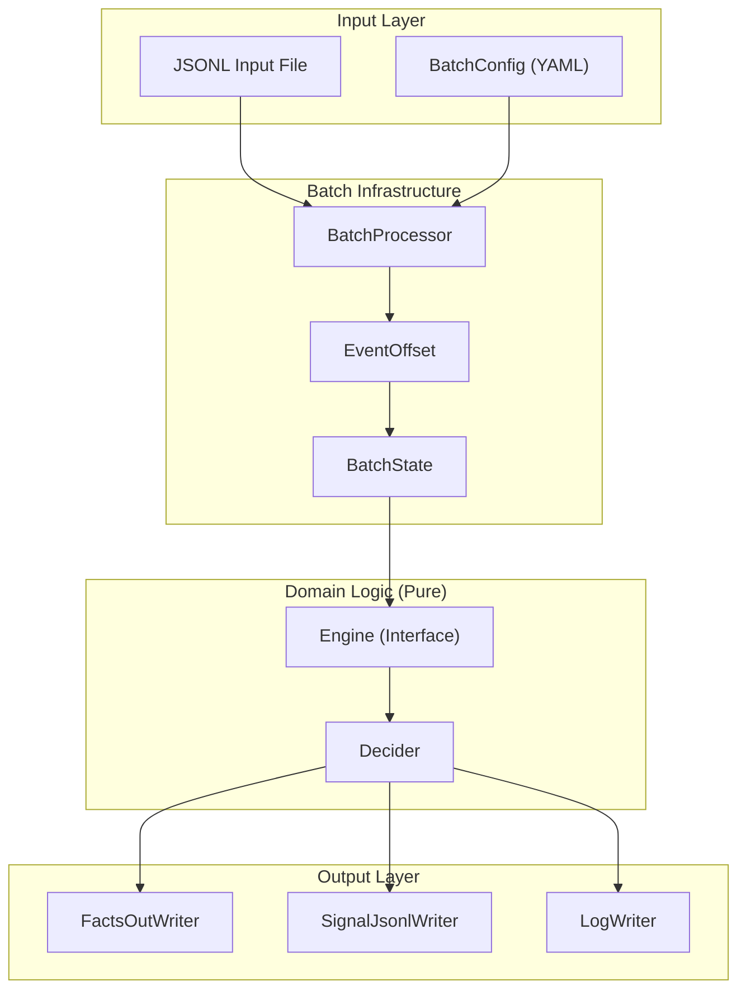
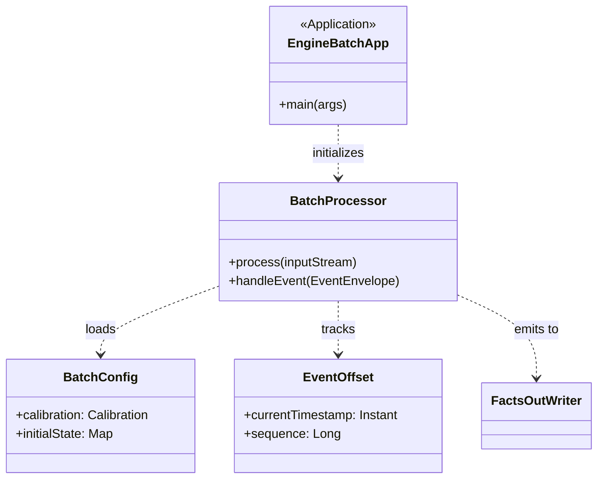

# Batch CLI Tools

Relevant source files

- 
- 
- 

Batch CLI tools provide an offline, deterministic execution environment for the platform's engines. By abstracting the transport layer (NATS JetStream) into a file-based or memory-based stream, these tools enable "golden-replay" testing, where historical or simulated events are processed to verify engine logic without requiring a live cluster.

Every engine in the system (Scene, Sentinel, Harbor, Politica, Recorder) implements a batch CLI following a unified pattern, allowing developers to run, verify, and diff engine outputs across code changes.

### The Command Triad

The batch tools are structured around three primary operations that facilitate a test-driven development (TDD) workflow for complex event processing:

1. **`run`**: Processes an input event stream (JSONL) and produces an output stream of engine decisions.
2. **`verify`**: Compares the output of a `run` against a "golden" reference file, reporting any regressions.
3. **`diff`**: Provides a detailed structural comparison between two output sets to assist in debugging logic changes.

### Core Architecture & Data Flow

The batch processing logic is encapsulated in a `BatchProcessor` that orchestrates the movement of events from a source through the engine's pure domain logic and into specialized writers.

#### Logic Flow Diagram: Batch Execution

This diagram shows how the `BatchProcessor` bridges the gap between static files and the pure `Engine` interface.

**Sources:** `platform/domain-kernel` (Engine/Decider interfaces), `engines/scene-engine/scene-batch`, `engines/sentinel/sentinel-batch`.

### Configuration and DSL

Batch execution is driven by a YAML-based configuration known as `BatchDsl`. This configuration defines the environment parameters, such as calibration settings, initial state, and time offsets, which would normally be provided by the Hub or NATS in a production environment.

- **`BatchConfig`**: The runtime object parsed from the DSL.
- **`BatchState`**: A container that holds the accumulated state of all aggregates (e.g., `DigitalTwin` for Scene Engine or `EpisodeLedger` for Sentinel) during the batch run.
- **`EventOffset`**: A replay cursor that ensures events are processed in strict temporal order, even when merging multiple input files.

### Output Writers

To support different verification needs, the batch tools utilize multiple output strategies:

|Writer|Purpose|Output Format|
|---|---|---|
|**`FactsOutWriter`**|Records state changes and intermediate facts.|Human-readable text / Table|
|**`SignalJsonlWriter`**|Records the final output events (Signals/Facts).|Line-delimited JSON|
|**`LogWriter`**|Captures `DecisionRecord` and `Explained<T>` metadata.|Structured Log|

### Code Entity Mapping

The following diagram maps the conceptual batch components to their specific implementations within the engine modules.

**Sources:** `engines/scene-engine/scene-domain/build.gradle.kts:6-8`(), `engines/sentinel/sentinel-domain/build.gradle.kts:3-7`().

### Enabling Golden-Replay Testing

The batch tools are the primary mechanism for "Golden-Replay" testing. This allows the engineering team to:

1. **Capture Production Bugs**: Download a sequence of events from the Hub's `events` table (via `hub-batch`).
2. **Reproduce Locally**: Run the captured events through the local engine using the `run` command.
3. **Fix and Verify**: Modify the `pure-domain` logic and use the `verify` command to ensure the bug is resolved without introducing regressions in other scenarios.

Because the engines depend on `manahive.pure-domain` [engines/scene-engine/scene-domain/build.gradle.kts2](https://github.com/kerrvisiona-sudo/hive2/blob/f8142c8f/engines/scene-engine/scene-domain/build.gradle.kts#L2-L2) they are side-effect free, making the batch tool's output 100% deterministic based on the input JSONL and `BatchConfig`.

**Sources:** `engines/scene-engine/scene-domain/build.gradle.kts:10-14`(), `engines/sentinel/sentinel-domain/build.gradle.kts:3-7`(), `simulator/build.gradle.kts:6-9`().

Dismiss

Refresh this wiki

This wiki was recently refreshed. Please wait 8 days to refresh again.

### On this page

- [Batch CLI Tools](https://deepwiki.com/kerrvisiona-sudo/hive2/5.1-batch-cli-tools#batch-cli-tools)
- [The Command Triad](https://deepwiki.com/kerrvisiona-sudo/hive2/5.1-batch-cli-tools#the-command-triad)
- [Core Architecture & Data Flow](https://deepwiki.com/kerrvisiona-sudo/hive2/5.1-batch-cli-tools#core-architecture-data-flow)
- [Logic Flow Diagram: Batch Execution](https://deepwiki.com/kerrvisiona-sudo/hive2/5.1-batch-cli-tools#logic-flow-diagram-batch-execution)
- [Configuration and DSL](https://deepwiki.com/kerrvisiona-sudo/hive2/5.1-batch-cli-tools#configuration-and-dsl)
- [Output Writers](https://deepwiki.com/kerrvisiona-sudo/hive2/5.1-batch-cli-tools#output-writers)
- [Code Entity Mapping](https://deepwiki.com/kerrvisiona-sudo/hive2/5.1-batch-cli-tools#code-entity-mapping)
- [Enabling Golden-Replay Testing](https://deepwiki.com/kerrvisiona-sudo/hive2/5.1-batch-cli-tools#enabling-golden-replay-testing)

Ask Devin about kerrvisiona-sudo/hive2

Fast

Batch CLI Tools | kerrvisiona-sudo/hive2 | DeepWiki

Syntax error in textmermaid version 11.7.0

Syntax error in textmermaid version 11.7.0

Syntax error in textmermaid version 11.7.0

Syntax error in textmermaid version 11.7.0

Syntax error in textmermaid version 11.7.0

Add to ContextPress Q