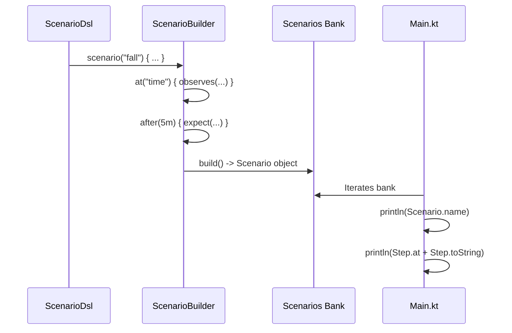

# Scenario Simulator

Relevant source files

- 
- 
- 
- 

The Scenario Simulator is a specialized module designed to define and execute clinical narratives as executable code. It serves a triple purpose within the Hive2 platform: acting as **acceptance tests** in CI environments, providing inputs for **golden-replay** verification in batch tools, and serving as a **clinical review tool** for staff to visualize and validate system rules before deployment [simulator/src/main/kotlin/com/manahive/simulator/ScenarioDsl.kt11-16](https://github.com/kerrvisiona-sudo/hive2/blob/f8142c8f/simulator/src/main/kotlin/com/manahive/simulator/ScenarioDsl.kt#L11-L16)

## Scenario DSL

The simulator utilizes a Type-Safe Kotlin DSL (Domain Specific Language) marked with the `@ScenarioDsl` annotation to prevent scope leaking [simulator/src/main/kotlin/com/manahive/simulator/ScenarioDsl.kt17-18](https://github.com/kerrvisiona-sudo/hive2/blob/f8142c8f/simulator/src/main/kotlin/com/manahive/simulator/ScenarioDsl.kt#L17-L18)

### Core DSL Components

|Component|Role|Code Entity|
|---|---|---|
|**Scenario**|The root container for a clinical narrative, including a start time and a sequence of steps.|`Scenario` [simulator/src/main/kotlin/com/manahive/simulator/ScenarioDsl.kt23-27](https://github.com/kerrvisiona-sudo/hive2/blob/f8142c8f/simulator/src/main/kotlin/com/manahive/simulator/ScenarioDsl.kt#L23-L27)|
|**Builder**|Orchestrates the creation of steps, managing a virtual `cursor` for time progression.|`ScenarioBuilder` [simulator/src/main/kotlin/com/manahive/simulator/ScenarioDsl.kt48-72](https://github.com/kerrvisiona-sudo/hive2/blob/f8142c8f/simulator/src/main/kotlin/com/manahive/simulator/ScenarioDsl.kt#L48-L72)|
|**Moment**|A scope representing a specific point in time where observations or expectations occur.|`MomentBuilder` [simulator/src/main/kotlin/com/manahive/simulator/ScenarioDsl.kt74-96](https://github.com/kerrvisiona-sudo/hive2/blob/f8142c8f/simulator/src/main/kotlin/com/manahive/simulator/ScenarioDsl.kt#L74-L96)|

### DSL to Code Mapping

The following diagram illustrates how DSL keywords translate into internal data structures.

**DSL Translation to Internal Types**

**Sources:** [simulator/src/main/kotlin/com/manahive/simulator/ScenarioDsl.kt20-97](https://github.com/kerrvisiona-sudo/hive2/blob/f8142c8f/simulator/src/main/kotlin/com/manahive/simulator/ScenarioDsl.kt#L20-L97)

## Step and Expectation Types

Scenarios are composed of a list of `Step` objects, which are sorted by their `at` timestamp upon building [simulator/src/main/kotlin/com/manahive/simulator/ScenarioDsl.kt71](https://github.com/kerrvisiona-sudo/hive2/blob/f8142c8f/simulator/src/main/kotlin/com/manahive/simulator/ScenarioDsl.kt#L71-L71)

### Step Types

Steps represent stimulus or lifecycle changes:

- **`Emit`**: Injects a `Observation` (e.g., `STANDING`, `IN_BED`) into the system [simulator/src/main/kotlin/com/manahive/simulator/ScenarioDsl.kt32](https://github.com/kerrvisiona-sudo/hive2/blob/f8142c8f/simulator/src/main/kotlin/com/manahive/simulator/ScenarioDsl.kt#L32-L32)
- **`SensorGoesSilent`**: Simulates a loss of signal for a specific `BedId` [simulator/src/main/kotlin/com/manahive/simulator/ScenarioDsl.kt33](https://github.com/kerrvisiona-sudo/hive2/blob/f8142c8f/simulator/src/main/kotlin/com/manahive/simulator/ScenarioDsl.kt#L33-L33)
- **`Expect`**: Defines a required outcome for validation [simulator/src/main/kotlin/com/manahive/simulator/ScenarioDsl.kt36](https://github.com/kerrvisiona-sudo/hive2/blob/f8142c8f/simulator/src/main/kotlin/com/manahive/simulator/ScenarioDsl.kt#L36-L36)

### Expectation Types

Expectations use clinician-friendly language to define acceptance criteria:

- **`AlertRaised`**: Asserts a specific rule triggered at a specific severity [simulator/src/main/kotlin/com/manahive/simulator/ScenarioDsl.kt40](https://github.com/kerrvisiona-sudo/hive2/blob/f8142c8f/simulator/src/main/kotlin/com/manahive/simulator/ScenarioDsl.kt#L40-L40)
- **`AlertEscalated`**: Asserts that an alert moved to a higher escalation step [simulator/src/main/kotlin/com/manahive/simulator/ScenarioDsl.kt41](https://github.com/kerrvisiona-sudo/hive2/blob/f8142c8f/simulator/src/main/kotlin/com/manahive/simulator/ScenarioDsl.kt#L41-L41)
- **`AlertResolvedByPresence`**: Asserts that staff arrival (e.g., `STAFF_IN_ROOM`) resolved the incident within a time limit [simulator/src/main/kotlin/com/manahive/simulator/ScenarioDsl.kt42](https://github.com/kerrvisiona-sudo/hive2/blob/f8142c8f/simulator/src/main/kotlin/com/manahive/simulator/ScenarioDsl.kt#L42-L42)
- **`NoAlert`**: Asserts that the stimulus was correctly absorbed (e.g., by hysteresis) without triggering [simulator/src/main/kotlin/com/manahive/simulator/ScenarioDsl.kt43](https://github.com/kerrvisiona-sudo/hive2/blob/f8142c8f/simulator/src/main/kotlin/com/manahive/simulator/ScenarioDsl.kt#L43-L43)
- **`SuppressedWithCause`**: Asserts that an alert was correctly blocked by a suppression rule (e.g., `STAFF_PRESENT`) [simulator/src/main/kotlin/com/manahive/simulator/ScenarioDsl.kt44](https://github.com/kerrvisiona-sudo/hive2/blob/f8142c8f/simulator/src/main/kotlin/com/manahive/simulator/ScenarioDsl.kt#L44-L44)

**Sources:** [simulator/src/main/kotlin/com/manahive/simulator/ScenarioDsl.kt29-45](https://github.com/kerrvisiona-sudo/hive2/blob/f8142c8f/simulator/src/main/kotlin/com/manahive/simulator/ScenarioDsl.kt#L29-L45)

## Scenario Bank

The `Scenarios` object acts as a repository for canonical night-watch scenarios used for system verification and demonstrations [simulator/src/main/kotlin/com/manahive/simulator/Scenarios.kt10-53](https://github.com/kerrvisiona-sudo/hive2/blob/f8142c8f/simulator/src/main/kotlin/com/manahive/simulator/Scenarios.kt#L10-L53)

### Examples

1. **The 03:00 Fall**: A resident stands up, the sensor goes silent, and a `CRITICAL` alert is expected after 5 minutes of dwell time. The alert is resolved when staff enters the room [simulator/src/main/kotlin/com/manahive/simulator/Scenarios.kt13-30](https://github.com/kerrvisiona-sudo/hive2/blob/f8142c8f/simulator/src/main/kotlin/com/manahive/simulator/Scenarios.kt#L13-L30)
2. **Quiet Night**: Demonstrates hysteresis where low-confidence observations (e.g., `BED_EDGE` at 0.55) followed by high-confidence `IN_BED` results in `NoAlert` [simulator/src/main/kotlin/com/manahive/simulator/Scenarios.kt33-40](https://github.com/kerrvisiona-sudo/hive2/blob/f8142c8f/simulator/src/main/kotlin/com/manahive/simulator/Scenarios.kt#L33-L40)
3. **Staff Present**: Demonstrates suppression where a risk transition (`STANDING`) occurs while staff is already in the room, resulting in `SuppressedWithCause("STAFF_PRESENT")` [simulator/src/main/kotlin/com/manahive/simulator/Scenarios.kt43-50](https://github.com/kerrvisiona-sudo/hive2/blob/f8142c8f/simulator/src/main/kotlin/com/manahive/simulator/Scenarios.kt#L43-L50)

**Sources:** [simulator/src/main/kotlin/com/manahive/simulator/Scenarios.kt10-53](https://github.com/kerrvisiona-sudo/hive2/blob/f8142c8f/simulator/src/main/kotlin/com/manahive/simulator/Scenarios.kt#L10-L53)

## Execution Flow

The simulator's main entry point currently serves to print the `Scenarios.bank` for clinical review. Future iterations (Sprint 1 Story S7) will implement the runner using a virtual clock and in-memory transport [simulator/src/main/kotlin/com/manahive/simulator/Main.kt3-13](https://github.com/kerrvisiona-sudo/hive2/blob/f8142c8f/simulator/src/main/kotlin/com/manahive/simulator/Main.kt#L3-L13)

**Data Flow: DSL to Output**

**Sources:** [simulator/src/main/kotlin/com/manahive/simulator/Main.kt8-13](https://github.com/kerrvisiona-sudo/hive2/blob/f8142c8f/simulator/src/main/kotlin/com/manahive/simulator/Main.kt#L8-L13) [simulator/src/main/kotlin/com/manahive/simulator/ScenarioDsl.kt20-21](https://github.com/kerrvisiona-sudo/hive2/blob/f8142c8f/simulator/src/main/kotlin/com/manahive/simulator/ScenarioDsl.kt#L20-L21)

### On this page

- [Scenario Simulator](https://deepwiki.com/kerrvisiona-sudo/hive2/5.2-scenario-simulator#scenario-simulator)
- [Scenario DSL](https://deepwiki.com/kerrvisiona-sudo/hive2/5.2-scenario-simulator#scenario-dsl)
- [Core DSL Components](https://deepwiki.com/kerrvisiona-sudo/hive2/5.2-scenario-simulator#core-dsl-components)
- [DSL to Code Mapping](https://deepwiki.com/kerrvisiona-sudo/hive2/5.2-scenario-simulator#dsl-to-code-mapping)
- [Step and Expectation Types](https://deepwiki.com/kerrvisiona-sudo/hive2/5.2-scenario-simulator#step-and-expectation-types)
- [Step Types](https://deepwiki.com/kerrvisiona-sudo/hive2/5.2-scenario-simulator#step-types)
- [Expectation Types](https://deepwiki.com/kerrvisiona-sudo/hive2/5.2-scenario-simulator#expectation-types)
- [Scenario Bank](https://deepwiki.com/kerrvisiona-sudo/hive2/5.2-scenario-simulator#scenario-bank)
- [Examples](https://deepwiki.com/kerrvisiona-sudo/hive2/5.2-scenario-simulator#examples)
- [Execution Flow](https://deepwiki.com/kerrvisiona-sudo/hive2/5.2-scenario-simulator#execution-flow)
