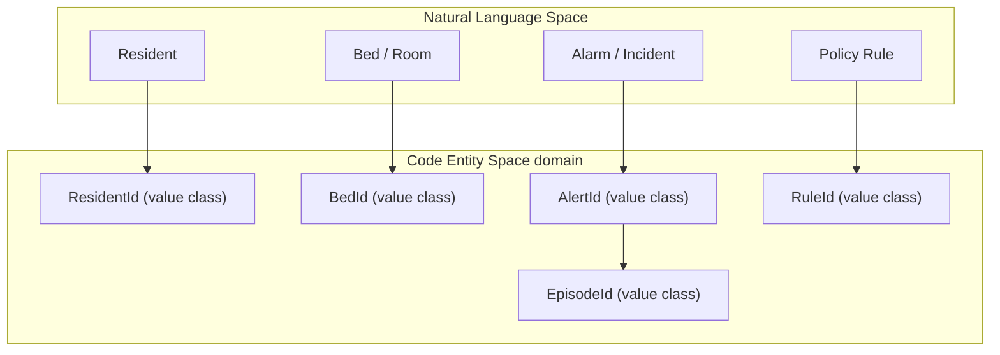
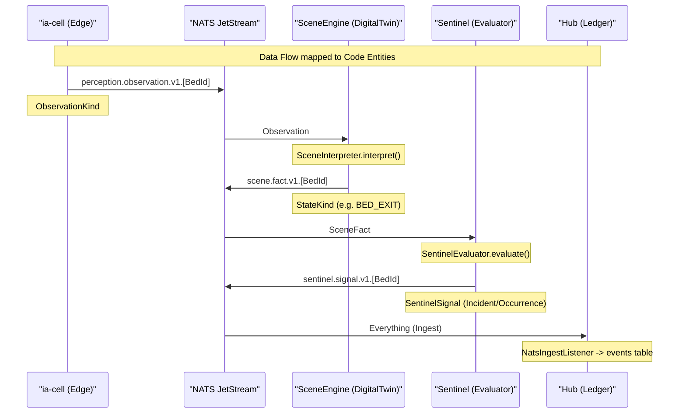

# Glossary

Relevant source files

- 
- 
- 
- 
- 
- 
- 
- 
- 
- 
- 

This glossary defines the foundational concepts, technical terms, and domain-specific jargon used throughout the **mana-hive** codebase. It serves as a primary reference for onboarding engineers to understand how natural language care concepts map to specific code entities.

## Core Domain Concepts

|Term|Definition|Code Pointer|
|---|---|---|
|**Digital Twin**|An immutable, event-sourced model representing the state of a single bed/room.|[engines/scene-engine/scene-domain/src/main/kotlin/com/manahive/scene/DigitalTwin.kt1-10](https://github.com/kerrvisiona-sudo/hive2/blob/f8142c8f/engines/scene-engine/scene-domain/src/main/kotlin/com/manahive/scene/DigitalTwin.kt#L1-L10)|
|**Episode**|The lifecycle arc starting when a resident leaves a safe state and ending when they return to safety (potentially requiring staff presence).|[engines/sentinel/sentinel-domain/src/main/kotlin/com/manahive/sentinel/EpisodeLedger.kt58-79](https://github.com/kerrvisiona-sudo/hive2/blob/f8142c8f/engines/sentinel/sentinel-domain/src/main/kotlin/com/manahive/sentinel/EpisodeLedger.kt#L58-L79)|
|**Scene Fact**|A high-level state conclusion (e.g., "Resident Out of Bed") derived from raw sensor observations.|[platform/contracts/src/main/kotlin/com/manahive/contracts/scene/SceneFact.kt1-10](https://github.com/kerrvisiona-sudo/hive2/blob/f8142c8f/platform/contracts/src/main/kotlin/com/manahive/contracts/scene/SceneFact.kt#L1-L10)|
|**System of Record (SoR)**|The Hub's Postgres ledger, which acts as the ultimate source of truth for audit and engine re-seeding.|[README.md45-49](https://github.com/kerrvisiona-sudo/hive2/blob/f8142c8f/README.md?plain=1#L45-L49)|
|**Fatigue Budget**|A mechanism to limit the number of non-critical interruptions sent to staff during a shift to prevent alarm fatigue.|[engines/sentinel/sentinel-domain/src/main/kotlin/com/manahive/sentinel/EpisodeLedger.kt150-156](https://github.com/kerrvisiona-sudo/hive2/blob/f8142c8f/engines/sentinel/sentinel-domain/src/main/kotlin/com/manahive/sentinel/EpisodeLedger.kt#L150-L156)|

**Sources:** [README.md45-49](https://github.com/kerrvisiona-sudo/hive2/blob/f8142c8f/README.md?plain=1#L45-L49) [engines/sentinel/sentinel-domain/src/main/kotlin/com/manahive/sentinel/EpisodeLedger.kt58-156](https://github.com/kerrvisiona-sudo/hive2/blob/f8142c8f/engines/sentinel/sentinel-domain/src/main/kotlin/com/manahive/sentinel/EpisodeLedger.kt#L58-L156)

---

## Technical Architecture Terms

### The Decider Pattern

The codebase follows a functional event-sourcing pattern defined by the `Decider` interface. It separates the logic of "what should happen" from "how the state changes."

- **Decide**: A pure function `(Command, State) -> Decision`. It produces events or rejects the command.
- **Evolve**: A pure function `(State, Event) -> State`. It computes the next state based on an event.

**Sources:** [platform/domain-kernel/src/main/kotlin/com/manahive/kernel/Decider.kt9-17](https://github.com/kerrvisiona-sudo/hive2/blob/f8142c8f/platform/domain-kernel/src/main/kotlin/com/manahive/kernel/Decider.kt#L9-L17)

### Pure Engines

An `Engine` in mana-hive is a pure domain service. By architectural constraint, engines cannot perform I/O, access the system clock (`Instant.now()`), or have side effects. This ensures that any decision made in the past can be perfectly reproduced in a "Golden Replay."

**Sources:** [platform/domain-kernel/src/main/kotlin/com/manahive/kernel/Engine.kt8-10](https://github.com/kerrvisiona-sudo/hive2/blob/f8142c8f/platform/domain-kernel/src/main/kotlin/com/manahive/kernel/Engine.kt#L8-L10) [README.md45-49](https://github.com/kerrvisiona-sudo/hive2/blob/f8142c8f/README.md?plain=1#L45-L49)

### Explained Decisions

Every decision made by an engine is wrapped in an `Explained<T>` container. This includes the result, the steps taken to reach it, and any items that were discarded (and why).

**Sources:** [platform/domain-kernel/src/main/kotlin/com/manahive/kernel/Engine.kt23-27](https://github.com/kerrvisiona-sudo/hive2/blob/f8142c8f/platform/domain-kernel/src/main/kotlin/com/manahive/kernel/Engine.kt#L23-L27)

---

## Domain to Code Mapping

### Entity Identification

The system uses strongly-typed value classes for all identifiers to prevent "primitive obsession" and accidental ID swapping (e.g., passing a `BedId` where a `ResidentId` is required).

**Sources:** [platform/domain-kernel/src/main/kotlin/com/manahive/kernel/Ids.kt7-35](https://github.com/kerrvisiona-sudo/hive2/blob/f8142c8f/platform/domain-kernel/src/main/kotlin/com/manahive/kernel/Ids.kt#L7-L35)

### The Event Pipeline

The following diagram maps the logical flow of data to the specific NATS subjects and engine interfaces that process them.

**Sources:** [README.md13-33](https://github.com/kerrvisiona-sudo/hive2/blob/f8142c8f/README.md?plain=1#L13-L33) [platform/messaging/src/main/kotlin/com/manahive/messaging/Subjects.kt11-24](https://github.com/kerrvisiona-sudo/hive2/blob/f8142c8f/platform/messaging/src/main/kotlin/com/manahive/messaging/Subjects.kt#L11-L24) [engines/sentinel/sentinel-domain/src/main/kotlin/com/manahive/sentinel/SentinelEvaluator.kt44-49](https://github.com/kerrvisiona-sudo/hive2/blob/f8142c8f/engines/sentinel/sentinel-domain/src/main/kotlin/com/manahive/sentinel/SentinelEvaluator.kt#L44-L49)

---

## Database & Telemetry Terms

### The Ledger (`events` table)

The primary append-only table in the Hub. It stores every event across all streams with global ordering.

- `global_seq`: The absolute ordering of all events in the system.
- `stream_seq`: The sequence number within a specific stream (e.g., all events for Bed 101), used for optimistic concurrency.
- `event_id`: The NATS message ID, used for end-to-end idempotency.

**Sources:** [hub/hub-service/src/main/resources/db/schema.sql3-16](https://github.com/kerrvisiona-sudo/hive2/blob/f8142c8f/hub/hub-service/src/main/resources/db/schema.sql#L3-L16)

### Decision Records

Telemetry data stored in the `decision_records` table. Unlike the ledger, this is not "business truth" but "judgment telemetry." It records exactly why an engine made a specific choice, citing the engine version and input fingerprints.

**Sources:** [hub/hub-service/src/main/resources/db/schema.sql27-36](https://github.com/kerrvisiona-sudo/hive2/blob/f8142c8f/hub/hub-service/src/main/resources/db/schema.sql#L27-L36) [platform/domain-kernel/src/main/kotlin/com/manahive/kernel/DecisionRecord.kt11-19](https://github.com/kerrvisiona-sudo/hive2/blob/f8142c8f/platform/domain-kernel/src/main/kotlin/com/manahive/kernel/DecisionRecord.kt#L11-L19)

---

## Discard Causes

When an engine processes a stimulus but decides not to act, it must provide a `DiscardCause`.

|Cause|Meaning|
|---|---|
|`CONFIDENCE_TOO_LOW`|The AI sensor's confidence is below the configured threshold.|
|`HYSTERESIS_NOT_MET`|The state change hasn't persisted long enough to be considered stable.|
|`NO_OCCUPANT`|The bed is currently marked as unoccupied in the census.|
|`EPISODE_ALREADY_ALERTED`|A signal for this specific rule has already been sent during the current episode.|
|`FATIGUE_BUDGET_EXCEEDED`|The signal was valid but suppressed because the staff interruption limit was reached.|

**Sources:** [platform/domain-kernel/src/main/kotlin/com/manahive/kernel/Engine.kt37-46](https://github.com/kerrvisiona-sudo/hive2/blob/f8142c8f/platform/domain-kernel/src/main/kotlin/com/manahive/kernel/Engine.kt#L37-L46)

---

## Simulator & DSL Jargon

### Scenario DSL

A internal language used to define "Night Scenarios." A scenario consists of `Steps` (Emits, Silences) and `Expectations`.

- **Moment**: A specific point in time within a scenario.
- **Expectation**: The assertion of what should happen (e.g., `AlertRaised`, `NoAlert`, `SuppressedWithCause`).
- **Golden Replay**: The process of running a recorded scenario through the pure engines to verify that logic changes haven't broken existing clinical requirements.

**Sources:** [simulator/src/main/kotlin/com/manahive/simulator/ScenarioDsl.kt23-46](https://github.com/kerrvisiona-sudo/hive2/blob/f8142c8f/simulator/src/main/kotlin/com/manahive/simulator/ScenarioDsl.kt#L23-L46)

### On this page

- [Glossary](https://deepwiki.com/kerrvisiona-sudo/hive2/6-glossary#glossary)
- [Core Domain Concepts](https://deepwiki.com/kerrvisiona-sudo/hive2/6-glossary#core-domain-concepts)
- [Technical Architecture Terms](https://deepwiki.com/kerrvisiona-sudo/hive2/6-glossary#technical-architecture-terms)
- [The Decider Pattern](https://deepwiki.com/kerrvisiona-sudo/hive2/6-glossary#the-decider-pattern)
- [Pure Engines](https://deepwiki.com/kerrvisiona-sudo/hive2/6-glossary#pure-engines)
- [Explained Decisions](https://deepwiki.com/kerrvisiona-sudo/hive2/6-glossary#explained-decisions)
- [Domain to Code Mapping](https://deepwiki.com/kerrvisiona-sudo/hive2/6-glossary#domain-to-code-mapping)
- [Entity Identification](https://deepwiki.com/kerrvisiona-sudo/hive2/6-glossary#entity-identification)
- [The Event Pipeline](https://deepwiki.com/kerrvisiona-sudo/hive2/6-glossary#the-event-pipeline)
- [Database & Telemetry Terms](https://deepwiki.com/kerrvisiona-sudo/hive2/6-glossary#database-telemetry-terms)
- [The Ledger (`events` table)](https://deepwiki.com/kerrvisiona-sudo/hive2/6-glossary#the-ledger-events-table)
- [Decision Records](https://deepwiki.com/kerrvisiona-sudo/hive2/6-glossary#decision-records)
- [Discard Causes](https://deepwiki.com/kerrvisiona-sudo/hive2/6-glossary#discard-causes)
- [Simulator & DSL Jargon](https://deepwiki.com/kerrvisiona-sudo/hive2/6-glossary#simulator-dsl-jargon)
- [Scenario DSL](https://deepwiki.com/kerrvisiona-sudo/hive2/6-glossary#scenario-dsl)
