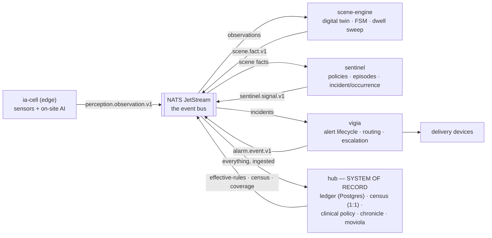

# mana-hive

Night-watch platform for care residences: **the right person reaches the right
room in time, with the fewest false alarms possible — and afterwards we can
prove why every decision was made.**

Not a monolith: a set of components around a bus, with the hub as **System of
Record**. Design docs (Spanish) live in `files/`; all code and identifiers are
English.

## The components



**The flow, in domain words:** the *ia-cell* perceives; the *scene-engine*
digests perception into what the digital twin can state (transitions, dwells,
staff presence, its own sensor's silence); the *sentinel* judges those scene
facts against each resident's effective rules and distills them into
incidents, occurrences, or suppressions-with-record; the *vigia* takes
incidents and owns the conversation with humans (routing, delivery,
escalation, closing the loop by physical presence). The *hub* remembers
everything, owns the administrative truth (census, policy, verdicts) and
answers "why did the alarm (not) ring at 03:12?".

**Truth model:** the bus transports and buffers (limits-based retention); the
hub ledger is the single system of record — audit, golden replay, and the
re-seed source when an engine rebuilds state. Engines cite fingerprints
(rules, twin, engine version) in every decision, so any decision is
machine-reproducible.

## Workspace layout

| Module | Role | Content |
| --- | --- | --- |
| `platform/domain-kernel` | pure | `Decider`, `Engine`, `Explained`, `DecisionRecord`, typed ids |
| `platform/contracts` | pure | the published language: `Observation`, `SceneFact`, `SentinelSignal`, `AlarmEvent`, `EffectiveRules`, `CensusSnapshot` + JSON schemas |
| `platform/messaging` | lib | NATS subject taxonomy, stream topology (idempotent declare) |
| `hub/hub-domain` | pure | `PolicyResolver` (layered resolution, provenance, fingerprint) |
| `hub/hub-service` | Spring Boot | ledger (SoR), bus ingest, census, policy, chronicle, moviola |
| `engines/scene-engine/scene-domain` | pure | `DigitalTwin`, `TransitionTable`, `SceneInterpreter`, `ClockSweeper` |
| `engines/scene-engine/scene-service` | Spring Boot | bus in/out wiring + sweep tick |
| `engines/sentinel/sentinel-domain` | pure | `SentinelEvaluator`, `EpisodeLedger`, `FatigueBudget` |
| `engines/sentinel/sentinel-service` | Spring Boot | bus wiring + episode persistence |
| `engines/vigia/vigia-domain` | pure | `AlertLifecycle` (Decider), `RoutingPlanner`, `DeliveryPlan` |
| `engines/vigia/vigia-service` | Spring Boot | lifecycle process, delivery adapters |
| `simulator` | app | night-scenario DSL + scenario bank (the customer tests) |

Three module roles enforced by convention plugins (`build-logic/`):
`manahive.pure-domain` (zero external deps **by construction** + purity guard),
`manahive.kotlin-common`, `manahive.spring-service`.

## Build

```bash
./gradlew check          # compiles everything, runs purity guards + tests
./gradlew :simulator:run # prints the scenario bank
```

## Sprint 1 (release "The watched night")

Goal: *the 03:00 fall runs end to end — observation → transition → dwell
exceeded → incident → alert → escalation without ack → resolved by staff
presence — with virtual clock, and killing any engine mid-dwell loses
nothing.* Stories and acceptance criteria: `files/09-bigpicture-y-sprint-1.md`
(amended by `files/11-*.md`).
