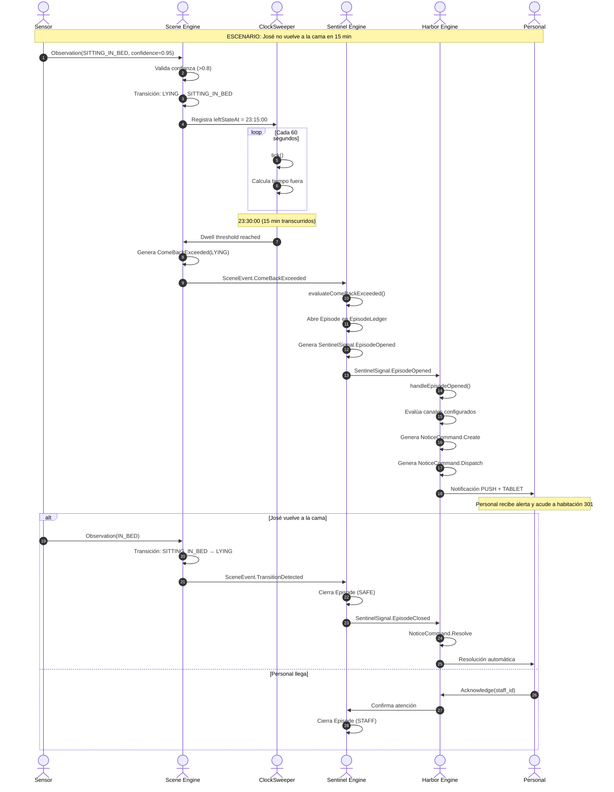
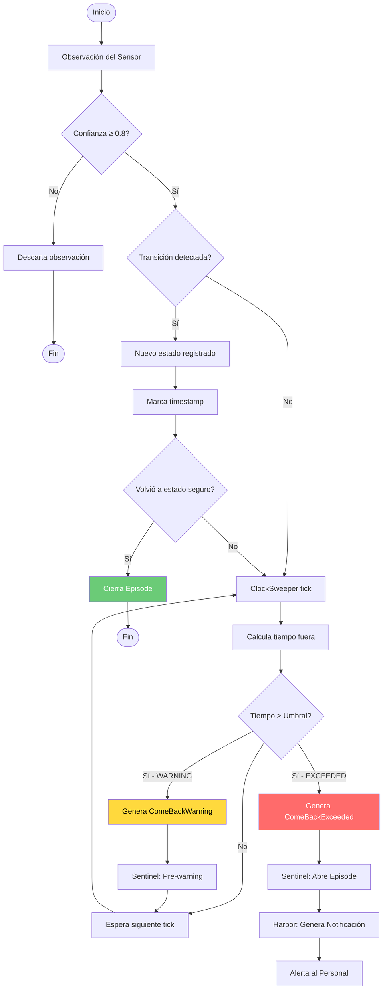

```mermaid

sequenceDiagram
    autonumber
    
    actor Sensor as Sensor
    actor SE as Scene Engine
    actor CS as ClockSweeper
    actor SEn as Sentinel Engine
    actor HE as Harbor Engine
    actor Personal as Personal

    Note over Sensor,Personal: ESCENARIO: José no vuelve a la cama en 15 min

    Sensor->>SE: Observation(SITTING_IN_BED, confidence=0.95)
    SE->>SE: Valida confianza (>0.8)
    SE->>SE: Transición: LYING → SITTING_IN_BED
    SE->>CS: Registra leftStateAt = 23:15:00
    
    loop Cada 60 segundos
        CS->>CS: tick()
        CS->>CS: Calcula tiempo fuera
    end
    
    Note over CS: 23:30:00 (15 min transcurridos)
    CS->>SE: Dwell threshold reached
    SE->>SE: Genera ComeBackExceeded(LYING)
    SE->>SEn: SceneEvent.ComeBackExceeded
    
    SEn->>SEn: evaluateComeBackExceeded()
    SEn->>SEn: Abre Episode en EpisodeLedger
    SEn->>SEn: Genera SentinelSignal.EpisodeOpened
    SEn->>HE: SentinelSignal.EpisodeOpened
    
    HE->>HE: handleEpisodeOpened()
    HE->>HE: Evalúa canales configurados
    HE->>HE: Genera NoticeCommand.Create
    HE->>HE: Genera NoticeCommand.Dispatch
    HE->>Personal: Notificación PUSH + TABLET
    
    Note over Personal: Personal recibe alerta y acude a habitación 301
    
    alt José vuelve a la cama
        Sensor->>SE: Observation(IN_BED)
        SE->>SE: Transición: SITTING_IN_BED → LYING
        SE->>SEn: SceneEvent.TransitionDetected
        SEn->>SEn: Cierra Episode (SAFE)
        SEn->>HE: SentinelSignal.EpisodeClosed
        HE->>HE: NoticeCommand.Resolve
        HE->>Personal: Resolución automática
    else Personal llega
        Personal->>HE: Acknowledge(staff_id)
        HE->>SEn: Confirma atención
        SEn->>SEn: Cierra Episode (STAFF)
    end
    
```

```mermaid

flowchart TD
    START([Inicio]) --> OBS[Observación del Sensor]
    OBS --> VALID{Confianza ≥ 0.8?}
    
    VALID -->|No| DISCARD[Descarta observación]
    DISCARD --> END1([Fin])
    
    VALID -->|Sí| TRANS{Transición detectada?}
    
    TRANS -->|No| SWEEP[ClockSweeper tick]
    SWEEP --> CALC[Calcula tiempo fuera]
    CALC --> THRESH{Tiempo > Umbral?}
    
    THRESH -->|No| WAIT[Espera siguiente tick]
    WAIT --> SWEEP
    
    THRESH -->|Sí - WARNING| WARN[Genera ComeBackWarning]
    WARN --> SENTINEL1[Sentinel: Pre-warning]
    SENTINEL1 --> WAIT
    
    THRESH -->|Sí - EXCEEDED| EXCEED[Genera ComeBackExceeded]
    EXCEED --> SENTINEL2[Sentinel: Abre Episode]
    SENTINEL2 --> HARBOR[Harbor: Genera Notificación]
    HARBOR --> PERSONAL[Alerta al Personal]
    
    TRANS -->|Sí| NEWSTATE[Nuevo estado registrado]
    NEWSTATE --> MARK[Marca timestamp]
    MARK --> RESOLVE{Volvió a estado seguro?}
    
    RESOLVE -->|Sí| CLOSE[Cierra Episode]
    CLOSE --> END2([Fin])
    
    RESOLVE -->|No| SWEEP

    style EXCEED fill:#ff6b6b,color:white
    style WARN fill:#ffd93d,color:black
    style CLOSE fill:#6bcb77,color:white
```