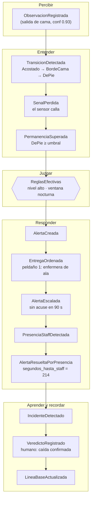
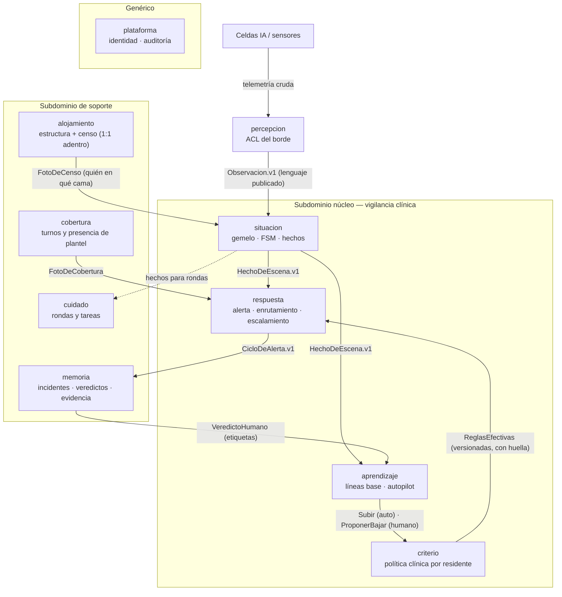

# 02 · Dominio estratégico

Volver al problema antes que a la solución. Este documento re-deriva el lenguaje, los hechos del dominio, los puntos calientes y — recién entonces — las fronteras.

---

## 1. El problema, dicho sin software

Una residencia de cuidados durante la noche. Personas mayores cuyas transiciones más ordinarias — levantarse, ir al baño, volver — concentran el riesgo de su día. Un plantel reducido que no puede estar en todas partes y que, si recibe demasiadas alarmas falsas, dejará de escucharlas. Sensores que ven movimiento pero no intención, y que a veces callan justo cuando más importa. El propósito del sistema cabe en una frase:

> **Que la persona correcta llegue a la habitación correcta a tiempo, con la menor cantidad de falsas alarmas posible, y que después se pueda demostrar por qué cada decisión se tomó.**

De esa frase se desprenden las cinco capacidades que el dominio exige: **percibir** el mundo físico, **entender la situación** (incluido el silencio), **juzgar** qué merece atención según cada persona, **responder** llevando a alguien hasta la habitación, y **aprender** de lo ocurrido — todo bajo una sexta capacidad transversal: **rendir cuentas**.

## 2. Lenguaje ubicuo (glosario normativo)

Las palabras siguientes tienen un solo significado dentro de su contexto; los sinónimos quedan prohibidos en código, eventos y UI.

| Término              | Significado                                                                                                | Contexto dueño         |
| -------------------- | ---------------------------------------------------------------------------------------------------------- | ---------------------- |
| **Observación**      | Lo que el borde afirma haber visto, ya traducido del hardware al dominio (con confianza y origen)          | percepcion             |
| **Gemelo**           | El modelo vivo de una cama: quién la ocupa, en qué estado está, desde cuándo                               | situacion              |
| **Hecho de escena**  | Algo que el gemelo constata: una transición, una permanencia superada, presencia de staff, señal perdida   | situacion              |
| **Episodio**         | El arco entre que un residente abandona un estado seguro y vuelve a él de forma estable                    | respuesta              |
| **Criterio**         | La política clínica vigente para un residente: nivel, plantilla, ajustes, ventanas horarias                | criterio               |
| **Reglas efectivas** | El resultado de resolver las capas del criterio en un instante, con procedencia por regla                  | criterio               |
| **Alerta**           | La afirmación de que una situación merece atención humana ahora; tiene ciclo de vida propio                | respuesta              |
| **Plan de entrega**  | Peldaños ordenados de a quién avisar, por qué canal y con qué vencimiento                                  | respuesta              |
| **Cierre del lazo**  | El momento en que la presencia física de staff en la habitación resuelve la alerta; se mide, no se declara | respuesta              |
| **Línea base**       | El comportamiento habitual de un residente, aprendido de sus propios hechos                                | aprendizaje            |
| **Propuesta**        | Sugerencia del autopilot de bajar vigilancia; jamás se aplica sola                                         | aprendizaje → criterio |
| **Incidente**        | Un suceso clínicamente relevante detectado, sujeto a revisión humana                                       | memoria                |
| **Veredicto**        | El juicio humano sobre un incidente (caída / no-caída / incierto); es la verdad de terreno                 | memoria                |
| **Censo**            | Quién ocupa qué cama, con la invariante 1:1                                                                | alojamiento            |

## 3. Event storming — la línea de la noche

El panorama grande del dominio, contado como secuencia de hechos (naranja), decisiones automáticas (violeta) y momentos humanos (amarillo). La línea narra el escenario canónico: la caída de las 03:00.

Dos lecturas del diagrama que el v2 no hacía: el **silencio del sensor es un hecho** (`SenalPerdida`), no la ausencia de hechos — el sistema que patrulla el silencio del residente debe también modelar el silencio de su propio ojo; y el lazo termina en `memoria`, cuyo veredicto humano alimenta a `aprendizaje` — el sistema fabrica su propia verdad de terreno.

## 4. Puntos calientes descubiertos (y su resolución)

El event storming existe para encontrar los lugares donde el modelo duele. Estos son los de esta sesión, con la decisión tomada en cada uno.

| Punto caliente | Tensión | Resolución de diseño |
| --- | --- | --- |
| **Silencio del sensor** | ¿Ausencia de observaciones = residente quieto o sensor muerto? Son riesgos opuestos | `situacion` mantiene latido por monitor; sin latido en umbral → hecho `SenalPerdida` y el gemelo pasa a `Desconocido` con marca de causa. Las reglas tratan `Desconocido por señal` distinto de `Desconocido por escena` |
| **Presencia de staff como supresor** | Si la enfermera está en la habitación, las transiciones del residente son cuidado, no riesgo | `PresenciaStaff` abre una ventana de supresión en `respuesta` (no en `situacion`: los hechos se siguen registrando; lo que se suprime es la alarma, con constancia del descarte) |
| **Fin de episodio** | ¿Cuándo se rearma una alarma ya disparada? Sin definición, o suena una vez por noche o suena cada minuto | Álgebra de episodios en `respuesta` (doc 04): el episodio cierra con retorno a grupo seguro sostenido N min o con presencia de staff; una alerta por (episodio, regla) |
| **Reasignación con alerta abierta** | Mover de cama a un residente con una alerta activa deja la alerta apuntando al pasado | Regla de proceso: el comando de reasignación en `alojamiento` exige la aserción "sin alertas abiertas" (consulta a `respuesta`); si las hay, se bloquea salvo resolución explícita. La alerta pertenece a la situación de la cama y queda atribuida al residente vinculado en su creación |
| **Fatiga de alarmas** | Cada regla nueva suma pitidos; el plantel se insensibiliza y el sistema se vuelve peligroso por exceso de celo | La fatiga es un presupuesto de diseño en `respuesta`: las severidades bajas se agregan en resúmenes de ronda; solo lo crítico interrumpe. El presupuesto es política, vive en `criterio` |
| **Doble verdad de ocupación** | La invariante 1:1 cruzaba dos contextos y vivía en la capa de aplicación | Fusión en `alojamiento` (objeción 1): la invariante vuelve a ser de agregado |

## 5. El mapa de contextos, derivado

Diez contextos nombrados por capacidad. El núcleo es la cadena percibir→entender→juzgar→responder más el diferenciador de aprender; el soporte administra el mundo sobre el que el núcleo decide; lo genérico se compra hecho.

Relaciones en términos del canon: `percepcion` es un **anticorruption layer** puro — nada del vocabulario del hardware cruza hacia `situacion`. `Observacion.v1`, `HechoDeEscena.v1` y `CicloDeAlerta.v1` son **lenguaje publicado**, con esquema versionado y tests de contrato en ambos lados. `situacion` es **conformista** del censo de `alojamiento` (lo consume como foto, no lo interpreta). La pareja `aprendizaje`↔`criterio` es la relación más delicada del mapa: cliente-proveedor con la asimetría como cláusula del contrato — subir viaja como comando auto-aplicable, bajar solo existe como propuesta que `criterio` mantiene en bandeja humana.

## 6. Mapeo viejo → nuevo

| v2 (heredado) | v3 (derivado) | Nota |
| --- | --- | --- |
| ctx-residencia + ctx-poblacion | **alojamiento** | La fusión lleva la ocupación 1:1 adentro de una frontera |
| observacion (subsistema) | **percepcion** (contexto ACL) | Se promueve a contexto: traducir el borde es una capacidad, no plomería |
| gemelo/ + parte de motores | **situacion** | El gemelo es el modelo del contexto, no un módulo suelto |
| ctx-politica | **criterio** (pasa a event-sourced) | Cada cambio de criterio sobre una persona es historia clínica |
| ctx-vigilancia + enrutamiento implícito | **respuesta** | El enrutamiento se vuelve motor explícito |
| autopilot dentro de motores | **aprendizaje** | Con líneas base como concepto propio |
| ctx-historia + ctx-evidencia | **memoria** | Un solo lenguaje: incidente, veredicto, evidencia |
| ctx-cobertura · ctx-cuidado | cobertura · cuidado | Sobreviven con ajustes menores |
| ctx-identidad + ctx-auditoria | **plataforma** | Genérico honesto |
| aplicacion (orquestador) | — eliminado | Sustituido por process managers nombrados + `consultas` (doc 03) |

La regla estructural sobrevive endurecida: ningún contexto del núcleo depende de otro en compilación; se hablan por lenguaje publicado (eventos del ledger) y por fotos de solo lectura (censo, cobertura). Spring Modulith verifica el grafo; Konsist verifica la pureza de los motores dentro de `situacion`, `criterio`, `respuesta` y `aprendizaje`.
