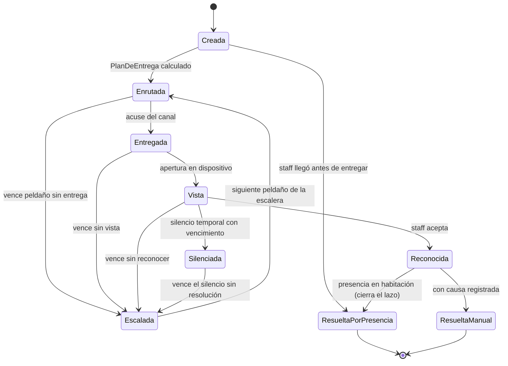
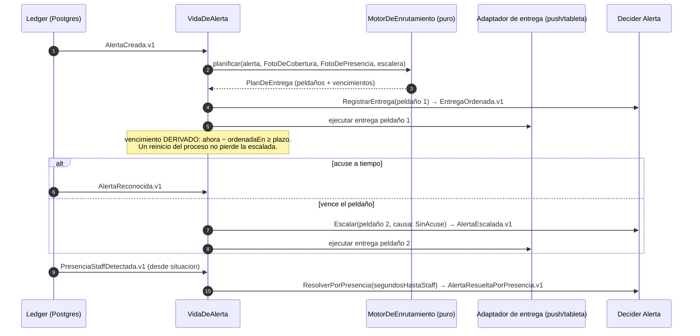

# 03 · Modelo táctico

Agregados, comandos, eventos y procesos — con el criterio de event sourcing explícito y los coordinadores con nombre propio. Aquí se responden dos preguntas de la sala: *¿por qué event sourcing?* y *¿por qué no un orquestador?*

---

## 1. La forma uniforme del núcleo: el patrón Decider

Todo agregado event-sourced y todo motor comparten una misma forma pura: decidir (comando → eventos) y evolucionar (estado + evento → estado). Esta uniformidad no es estética: hace que replay, sombra y simulación (doc 06) funcionen igual para todo el núcleo, y que cada pieza se pruebe con la misma mecánica `dado eventos → cuando comando → entonces eventos`.

```kotlin
// núcleo puro — sin framework, sin IO, reloj siempre por parámetro
interface Decider<C, S, E> {
    val inicial: S
    /** Rechaza o produce hechos. Nunca muta, nunca mira el mundo. */
    fun decidir(comando: C, estado: S): Decision<E>
    /** Aplicación pura del hecho. Total: todo evento histórico debe poder aplicarse. */
    fun evolucionar(estado: S, evento: E): S
}

sealed interface Decision<out E> {
    data class Aceptado<E>(val eventos: List<E>) : Decision<E>
    data class Rechazado(val motivo: MotivoDeRechazo) : Decision<Nothing>
}
```

La cáscara imperativa de cada contexto hace siempre lo mismo: cargar el flujo (snapshot + eventos desde la marca), plegar con `evolucionar`, invocar `decidir`, y — en una sola transacción — anexar los eventos al ledger con control optimista (`seq_flujo` esperada), escribir su auditoría y avanzar proyecciones propias. Esa cáscara se escribe una vez en `plataforma-eventos` y se reutiliza.

## 2. ¿Por qué event sourcing? La regla de las tres preguntas

Un agregado se event-sourcea si responde **sí** a al menos una:

1. **¿Su historia es su identidad?** El proceso *es* una secuencia de hechos (una alerta es su ciclo de vida; un criterio clínico es la sucesión de juicios sobre una persona).
2. **¿"Qué era verdad en t" es una pregunta clínica o legal?** Reconstruir el estado en el instante del incidente debe ser una consulta, no una arqueología.
3. **¿Sus eventos son lenguaje publicado?** Otros contextos viven de consumirlos en orden.

Si responde **no** a las tres, es estado mutable con mutación atómica (cambio + auditoría en una TX) y retiro lógico. Aplicada la regla:

| Agregado | Contexto | P1 | P2 | P3 | Veredicto |
| --- | --- | :-: | :-: | :-: | --- |
| Observaciones | percepcion | sí | sí | sí | **Append-only** (evidencia externa; ni siquiera es agregado: es hecho) |
| GemeloCama | situacion | sí | sí | sí | **ES** — flujo `situacion.cama.{id}` |
| PoliticaDeResidente | criterio | sí | sí | sí | **ES** — flujo `criterio.residente.{id}` *(cambio respecto a v2)* |
| Alerta | respuesta | sí | sí | sí | **ES** — flujo `respuesta.alerta.{id}` |
| PropuestaAutopilot | aprendizaje | sí | sí | no | **ES** — flujo `aprendizaje.propuesta.{id}` |
| LineaBase | aprendizaje | no | no | no | Proyección versionada (recalculable desde hechos) |
| Incidente + Veredictos | memoria | sí | sí | no | **ES** (veredictos append-only; el vigente es el último) |
| Censo (Residente, Cama, Asignación) | alojamiento | no | no | emite integración | Mutable + auditoría atómica + **eventos de integración** (`ResidenteAdmitido`, `CamaReasignada`, `EgresoRegistrado`) |
| Turnos, Rondas, Tareas, Usuarios | cobertura/cuidado/plataforma | no | no | no | Mutable + auditoría atómica |

El caso que cambió de bando merece la línea que lo justifica: bajar el nivel de vigilancia del señor García el 12 de marzo, quién lo propuso, quién lo confirmó y con qué evidencia **es historia clínica**; un `UPDATE nivel = 'medio'` la destruye.

## 3. Catálogo de flujos y eventos (lenguaje publicado)

| Flujo | Eventos (tipo versionado) |
| --- | --- |
| `situacion.cama.{id}` | `OcupanteVinculado.v1`, `TransicionDetectada.v1`, `PermanenciaSuperada.v1`, `PreAvisoDePermanencia.v1`, `PresenciaStaffDetectada.v1`, `SenalPerdida.v1`, `SenalRecuperada.v1`, `OcupanteDesvinculado.v1` |
| `criterio.residente.{id}` | `NivelAsignado.v1`, `AjusteAplicado.v1`, `VentanaTemporalDefinida.v1`, `PropuestaAceptada.v1`, `PropuestaRechazada.v1` |
| `respuesta.alerta.{id}` | `AlertaCreada.v1`, `EntregaOrdenada.v1`, `EntregaRegistrada.v1`, `AlertaVista.v1`, `AlertaReconocida.v1`, `AlertaEscalada.v1`, `AlertaSilenciada.v1`, `AlertaResueltaPorPresencia.v1`, `AlertaResueltaManual.v1` |
| `aprendizaje.propuesta.{id}` | `PropuestaEmitida.v1`, `PropuestaDecidida.v1` (siempre por humano) |
| `memoria.incidente.{id}` | `IncidenteDetectado.v1`, `RevisionAbierta.v1`, `VeredictoRegistrado.v1` |
| integración de `alojamiento` | `ResidenteAdmitido.v1`, `CamaReasignada.v1`, `EgresoRegistrado.v1` |

Reglas de versionado heredadas y ratificadas: el tipo lleva versión; los eventos emitidos son API para siempre; cambio incompatible = tipo nuevo + upcaster puro; esquemas en `contratos/eventos/*.schema.json` con fixtures de todas las versiones históricas.

## 4. El agregado Alerta, completo

El ciclo de vida más rico del sistema, como máquina de estados y como Decider.



```kotlin
// contexto respuesta — núcleo puro
sealed interface ComandoAlerta {
    data class Crear(val clave: ClaveAlerta, val severidad: Severidad, val hechoOrigen: RefEvento) : ComandoAlerta
    data class RegistrarEntrega(val peldano: Int, val canal: Canal) : ComandoAlerta
    data class RegistrarVista(val por: ActorId) : ComandoAlerta
    data class Reconocer(val por: ActorId) : ComandoAlerta
    data class Escalar(val aPeldano: Int, val causa: CausaEscalada) : ComandoAlerta
    data class Silenciar(val hasta: Instant, val por: ActorId, val motivo: String) : ComandoAlerta
    data class ResolverPorPresencia(val presencia: RefEvento, val segundosHastaStaff: Long) : ComandoAlerta
    data class ResolverManual(val por: ActorId, val causa: CausaResolucion) : ComandoAlerta
}

data class EstadoAlerta(
    val fase: Fase = Fase.Inexistente,
    val clave: ClaveAlerta? = null,
    val peldanoActual: Int = 0,
    val silenciadaHasta: Instant? = null,
) { enum class Fase { Inexistente, Creada, Enrutada, Entregada, Vista, Reconocida, Silenciada, Resuelta } }

object AlertaDecider : Decider<ComandoAlerta, EstadoAlerta, EventoAlerta> {
    override val inicial = EstadoAlerta()
    override fun decidir(comando: ComandoAlerta, estado: EstadoAlerta): Decision<EventoAlerta> = when (comando) {
        is ComandoAlerta.Crear ->
            if (estado.fase != EstadoAlerta.Fase.Inexistente) Decision.Rechazado(MotivoDeRechazo.YaExiste)
            else Decision.Aceptado(listOf(EventoAlerta.Creada(comando.clave, comando.severidad, comando.hechoOrigen)))
        is ComandoAlerta.ResolverPorPresencia ->
            if (estado.fase == EstadoAlerta.Fase.Resuelta) Decision.Rechazado(MotivoDeRechazo.YaResuelta)
            else Decision.Aceptado(listOf(EventoAlerta.ResueltaPorPresencia(comando.presencia, comando.segundosHastaStaff)))
        // … cada rama cubre su invariante; el `when` exhaustivo obliga a decidir todas
        else -> TODO("resto de transiciones según la máquina de estados")
    }
    override fun evolucionar(estado: EstadoAlerta, evento: EventoAlerta): EstadoAlerta = TODO()
}
```

Dos invariantes del agregado que en v2 flotaban sin dueño: **una alerta por (cama, regla, episodio)** — la clave de dedupe es identidad del agregado, no un índice suelto; y **resuelta es absorbente** — ningún comando revive una alerta resuelta; si el mundo insiste, es un episodio nuevo.

## 5. ¿Por qué no un orquestador? Comandos, procesos y consultas

El orquestador del v2 mezclaba tres responsabilidades de naturaleza distinta. Se separan:

**Comandos** viven en el servicio de aplicación del contexto dueño de la invariante — delgado, al lado de su Decider. La reasignación de cama, con su 1:1, es un caso de uso de `alojamiento`, no de una capa superior: abre la TX, cierra la asignación vieja, abre la nueva, escribe auditoría y evento de integración, y aplica la regla de proceso del punto caliente (bloquear si hay alertas abiertas, verificado contra la proyección de `respuesta`).

**Procesos largos** son process managers con nombre: máquinas de estado que escuchan eventos del ledger, mantienen su pequeño estado durable y emiten comandos. No contienen lógica de decisión (esa es de los motores); contienen *coordinación en el tiempo*.

| Process manager | Escucha | Comanda | Su estado |
| --- | --- | --- | --- |
| **VidaDeAlerta** | `AlertaCreada`, acuses de entrega, `PresenciaStaffDetectada`, ticks | `RegistrarEntrega`, `Escalar`, `ResolverPorPresencia` | peldaño vigente, vencimientos derivados |
| **CicloDeIncidente** | `AlertaResuelta*`, detecciones del borde | abrir incidente, abrir revisión | incidentes pendientes de veredicto |
| **CicloDePropuesta** | `PropuestaEmitida`, decisiones humanas | `AjusteAplicado` en criterio (solo tras `PropuestaAceptada`) | propuestas en bandeja |
| **EjecucionDeRonda** | inicio de ronda, hechos de escena durante la ronda | congelar foto, registrar visitas | la ronda en curso |

**Consultas** — las pantallas que cruzan contextos — se mudan al módulo `consultas`: compone **proyecciones** de varios contextos en read models de UI. Leer no es orquestar: `consultas` no emite comandos, no abre procesos, no conoce Deciders.

## 6. VidaDeAlerta en acción



El principio de los dos tiempos gobierna también aquí: los vencimientos de escalada son estado derivado sobre `EntregaOrdenada.ocurrido_en`, evaluados por el mismo barrido del reloj — no hay cronómetros que un reinicio pueda perder, ni en el gemelo ni en los procesos.
