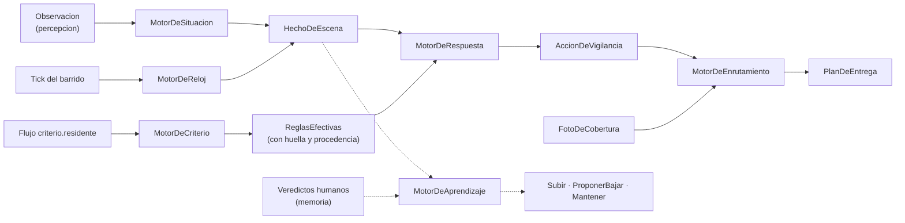

# 04 · Los motores, en serio

Seis motores puros. Cada uno con su carta de responsabilidad: qué domina, qué le está prohibido, qué complejidad debe resolver — y el artefacto que convierte la pureza en rendición de cuentas: el registro de decisión. Regla común a todos: sin Spring, sin JDBC, sin red, sin `Instant.now()`; el reloj entra por parámetro; misma entrada → misma salida, hoy y en el replay de 2030.

---

## 1. La tubería de decisión



Cada caja es una función pura; cada flecha, un tipo del lenguaje publicado. La cáscara (workers y process managers) solo cablea.

## 2. Infraestructura común de los motores

```kotlin
// núcleo puro compartido
data class VersionMotor(val nombre: String, val semver: String, val huellaBuild: String)

interface Motor { val version: VersionMotor }

/** Toda salida de motor viaja con su explicación. La decisión sin el porqué no existe. */
data class Explicado<T>(val valor: T, val explicacion: List<PasoDeExplicacion>)
data class PasoDeExplicacion(val regla: String, val observado: String, val conclusion: String)
```

## 3. MotorDeSituacion — el intérprete del mundo

**Propósito.** Convertir observaciones ruidosas en hechos de escena creíbles sobre el gemelo de una cama.

**Responsable de:** legalidad de transiciones (la FSM como tabla total); **histéresis** — una transición se acepta solo si la observación nueva persiste el mínimo configurado (un `BordeCama` de 800 ms es un acomodo, no una salida); **umbrales de confianza por estado** (entrar a `EnBanio` exige más confianza que permanecer en `Acostado`); vínculo de ocupante (aplicar `CamaReasignada` del censo); **salud de la señal** — sin latido del monitor en el umbral, emitir `SenalPerdida` y llevar el gemelo a `Desconocido(causa = SinSenal)`, distinto de `Desconocido(causa = Escena)`; detección de `PresenciaStaff` como hecho (nunca como supresión: suprimir es de respuesta); y **descartes explicados** — toda observación rechazada (ilegal, baja confianza, histéresis) deja constancia de por qué.

**Explícitamente no responsable de:** decidir si algo amerita alarma (respuesta), conocer reglas clínicas (criterio), medir permanencias (reloj), ordenar eventos (la cáscara entrega en orden de `seq`).

**Invariantes:** `estadoDesde` solo avanza cuando el estado cambia; jamás retrocede; una observación duplicada (misma fuente) es un no-op idéntico.

```kotlin
interface MotorDeSituacion : Motor {
    fun evaluar(
        gemelo: GemeloCama,
        observacion: Observacion,
        ahora: Instant,
        calibracion: CalibracionSituacion,   // histéresis, confianzas mínimas, umbral de latido
    ): Explicado<VeredictoDeSituacion>
}
data class VeredictoDeSituacion(
    val gemelo: GemeloCama,
    val hechos: List<HechoDeEscena>,
    val descartes: List<Descarte>,           // lo que NO pasó también se explica
)
data class Descarte(val observacion: RefEvento, val causa: CausaDescarte)
enum class CausaDescarte { TransicionIlegal, ConfianzaInsuficiente, HisteresisNoSuperada, Duplicada, SinOcupante }
```

## 4. MotorDeReloj — el patrullero del silencio

**Propósito.** Producir los hechos que solo el paso del tiempo revela.

**Responsable de:** permanencias como estado **derivado** (`ahora − estadoDesde ≥ umbral`, jamás cronómetros); **pre-avisos** al 80% del umbral (el sistema avisa "va camino a vencer" antes de gritar "venció", habilitando intervención temprana sin alarma); **gracia post-transición** (no evaluar permanencia en los primeros segundos de un estado nuevo); **rearme post-presencia** (tras `PresenciaStaff`, el conteo de permanencia reinicia: la visita reseteó la situación); vigilancia del latido de cada monitor (insumo de `SenalPerdida`); y vencimientos de los process managers (escaladas de alerta), evaluados por el mismo barrido — un solo reloj para todo el sistema.

**Explícitamente no responsable de:** agendarse a sí mismo (la cáscara dispara el tick), conocer severidades, tocar el gemelo.

**Invariantes:** idempotencia del barrido — dos ticks consecutivos sin cambios de estado no duplican hechos (el hecho `PermanenciaSuperada` se emite una vez por (cama, estado, episodio de permanencia)); un reinicio nunca acorta ni alarga un dwell.

```kotlin
interface MotorDeReloj : Motor {
    fun barrer(
        gemelos: Collection<GemeloCama>,
        vencimientosDeProceso: Collection<VencimientoPendiente>,  // escaladas de VidaDeAlerta
        ahora: Instant,
        umbrales: CatalogoDwell,             // por estado, ya resueltos por criterio
        yaEmitidos: MarcasDePermanencia,     // para idempotencia del barrido
    ): Explicado<ResultadoDeBarrido>
}
data class ResultadoDeBarrido(
    val hechos: List<HechoDeEscena>,         // PreAviso · PermanenciaSuperada · SenalPerdida
    val vencimientos: List<VencimientoDisparado>,
)
```

## 5. MotorDeCriterio — el jurista de cabecera

**Propósito.** Resolver, para un residente y un instante, qué reglas rigen — y poder decir de dónde salió cada una.

**Responsable de:** la resolución en capas (nivel de vigilancia → plantilla del nivel → ajustes manuales → ventanas temporales como el modo nocturno) con **precedencia total y determinista**; la regla de empate — *en conflicto, gana la capa más protectora*; la **procedencia por regla** (cada regla efectiva sabe qué capa la puso, quién y cuándo); la **huella** del conjunto (hash estable de las reglas efectivas: toda decisión posterior referencia esa huella y el replay puede reconstruir exactamente qué criterio regía); y la vigencia temporal (las ventanas se resuelven con el instante inyectado, no con el reloj del sistema).

**Explícitamente no responsable de:** evaluar hechos contra reglas (respuesta), aceptar propuestas (humanos, vía CicloDePropuesta), persistir nada.

```kotlin
interface MotorDeCriterio : Motor {
    fun resolver(residente: ResidenteId, en: Instant, capas: CapasDeCriterio): Explicado<ReglasEfectivas>
}
data class ReglasEfectivas(
    val residente: ResidenteId,
    val vigenciaEn: Instant,
    val reglas: List<ReglaEfectiva>,
    val huella: String,                      // hash estable: la identidad del criterio en ese instante
)
data class ReglaEfectiva(val id: ReglaId, val clase: ClaseRegla, val parametros: Parametros, val procedencia: Procedencia)
sealed interface Procedencia {
    data class DeNivel(val nivel: NivelVigilancia) : Procedencia
    data class DePlantilla(val plantilla: PlantillaId) : Procedencia
    data class DeAjusteManual(val ajuste: AjusteId, val actor: ActorId, val cuando: Instant) : Procedencia
    data class DeVentanaTemporal(val ventana: VentanaId) : Procedencia
}
```

## 6. MotorDeRespuesta — el que decide molestar

**Propósito.** Convertir hechos + reglas en la decisión más cara del sistema: interrumpir a un humano.

**Responsable de:** el **álgebra de episodios** — un episodio abre cuando el residente abandona el grupo seguro, cierra con retorno estable sostenido N minutos o con presencia de staff; una alerta por (cama, regla, episodio), y episodio cerrado = alarma rearmada; la **supresión por presencia** con constancia (el hecho ocurrió, la alarma se suprimió, el descarte queda registrado con causa `StaffPresente`); el **silencio temporal** con vencimiento (silenciar sin vencimiento está prohibido por tipo); y el **presupuesto de fatiga** — las severidades informativas no interrumpen: se acumulan para el resumen de ronda; solo advertencia y crítico generan entrega inmediata, y si el presupuesto por turno se excede, el motor agrega en digest y lo dice en su explicación. La fatiga deja de ser una queja del plantel y pasa a ser un parámetro del criterio.

**Explícitamente no responsable de:** decidir destinatarios (enrutamiento), entregar nada, conocer el hardware.

**Invariantes:** nunca dos alertas abiertas con la misma clave; toda supresión y toda agregación quedan explicadas; `Desconocido(SinSenal)` sostenido escala como problema técnico, no como riesgo del residente — el motor distingue las dos alarmas.

```kotlin
interface MotorDeRespuesta : Motor {
    fun evaluar(
        hecho: HechoDeEscena,
        reglas: ReglasEfectivas,
        episodios: EstadoDeEpisodios,        // episodios abiertos + presupuesto de fatiga consumido
        ahora: Instant,
    ): Explicado<ResultadoDeRespuesta>
}
data class ResultadoDeRespuesta(
    val acciones: List<AccionDeVigilancia>,
    val episodios: EstadoDeEpisodios,        // estado siguiente, inmutable
)
sealed interface AccionDeVigilancia {
    data class CrearAlerta(val clave: ClaveAlerta, val severidad: Severidad, val reglaHuella: String) : AccionDeVigilancia
    data class AgregarADigest(val clave: ClaveAlerta, val motivo: MotivoAgregacion) : AccionDeVigilancia
    data class SuprimirConConstancia(val clave: ClaveAlerta, val causa: CausaSupresion) : AccionDeVigilancia
    data object Nada : AccionDeVigilancia
}
data class Episodio(val camaId: CamaId, val abiertoEn: Instant, val origen: EstadoPersona, val alertasEmitidas: Set<ClaveAlerta>)
```

## 7. MotorDeEnrutamiento — el despachador (el motor que faltaba)

**Propósito.** Que la alerta correcta llegue a la persona correcta por el canal correcto, con plan de escalada calculado por adelantado.

**Responsable de:** **idoneidad** (turno activo, ala cubierta, rol habilitado para la severidad); **equidad de carga** (no concentrar todas las entregas en la misma enfermera si hay alternativas idóneas — la foto de cobertura trae carga reciente); canal por severidad (crítico interrumpe por todos los canales; advertencia respeta el canal preferido); la **escalera completa** como dato — peldaños, destinatarios y vencimientos se calculan de una vez, de modo que `VidaDeAlerta` solo ejecuta y el plan entero queda inspeccionable antes de la primera entrega; y el **peldaño terminal** — toda escalera termina en un destino que no puede fallar en silencio (responsable de guardia + tablero de sala), porque una alerta sin destinatario idóneo es a su vez una alarma.

**Explícitamente no responsable de:** ejecutar entregas, medir acuses, conocer la FSM.

```kotlin
interface MotorDeEnrutamiento : Motor {
    fun planificar(
        alerta: AlertaParaEnrutar,
        cobertura: FotoDeCobertura,          // quién está, dónde, con qué carga reciente
        presencia: FotoDePresencia,          // quién está físicamente en qué habitación
        escalera: PoliticaDeEscalada,        // del criterio del residente
    ): Explicado<PlanDeEntrega>
}
data class PlanDeEntrega(val peldanos: List<Peldano>) { init { require(peldanos.isNotEmpty()) } }
data class Peldano(val destinatarios: List<DestinatarioId>, val canal: Canal, val vencimiento: Duration, val motivoDeEleccion: String)
```

## 8. MotorDeAprendizaje — el autopilot con líneas base

**Propósito.** Aprender el comportamiento habitual de cada residente y proponer — nunca imponer — cambios de criterio.

**Responsable de:** **líneas base por señal** (permanencia en baño, salidas nocturnas, duración de sueño) como estadísticos robustos por ventana (percentiles/EWMA), recalculables desde los hechos; **puntaje de desviación** contra la propia línea base del residente, no contra promedios de la población; la **asimetría en el tipo** — `Subir` es auto-aplicable con evidencia, bajar solo existe como `ProponerBajar`; **histéresis de propuesta** (no repetir una propuesta rechazada dentro de la ventana de enfriamiento; no proponer con líneas base inmaduras — mínimo de días de datos); y **evidencia adjunta obligatoria** — toda decisión viaja con las señales, ventanas y comparaciones que la sostienen, porque la propuesta que el clínico no puede auditar es una propuesta que no debe existir.

**Explícitamente no responsable de:** aplicar cambios a criterio (CicloDePropuesta tras decisión humana), diagnosticar (una desviación urinaria es una señal para revisión clínica, no un diagnóstico).

```kotlin
interface MotorDeAprendizaje : Motor {
    fun decidir(
        residente: ResidenteId,
        lineasBase: LineasBase,
        ventana: VentanaDeSenales,
        vigente: NivelVigilancia,
        ahora: Instant,
    ): Explicado<DecisionAutopilot>
}
sealed interface DecisionAutopilot {
    data class Subir(val a: NivelVigilancia, val evidencia: Evidencia) : DecisionAutopilot
    data class ProponerBajar(val a: NivelVigilancia, val evidencia: Evidencia) : DecisionAutopilot
    data object Mantener : DecisionAutopilot
}
```

## 9. El registro de decisión — pureza que rinde cuentas

Cada invocación de motor deja una constancia durable. Es la respuesta operativa a "¿por qué (no) sonó la alarma a las 03:12?" y la materia prima del replay, la sombra y las métricas del documento 06.

```kotlin
data class RegistroDeDecision(
    val motor: VersionMotor,                 // qué código decidió (semver + huella de build)
    val estimulo: RefEvento,                 // el seq del ledger que causó la invocación
    val insumos: Map<String, String>,        // huellas: gemelo, reglas (huella de criterio), cobertura, calibración
    val salida: SalidaSerializada,
    val explicacion: List<PasoDeExplicacion>,
    val descartes: List<Descarte>,           // lo que no pasó, con causa
    val duracion: Duration,
)
```

Se persiste append-only en `registros_decision` (fuera del ledger de dominio: es telemetría de juicio, no hechos del negocio), indexado por `estimulo` y por cama/residente. La tripleta *(insumos, huella de reglas, versión de motor)* hace cada decisión **reproducible**: mismo estímulo + misma huella + mismo motor = misma salida, verificable por máquina. A escala de residencia el volumen es modesto; la retención sigue la política forense de auditoría.

## 10. Contrato de pureza (verificado, no prometido)

Konsist en CI sobre los módulos de motores: prohibidos `org.springframework`, `java.sql`, `io.nats`, `java.net`, `org.jooq` y cualquier fábrica de tiempo (`Instant.now`, `System.currentTimeMillis`) — el reloj solo entra por parámetro. Cada motor publica `version` y el build la sella con la huella del commit. La misma verificación corre sobre los Deciders del documento 03: el núcleo entero comparte el contrato.
