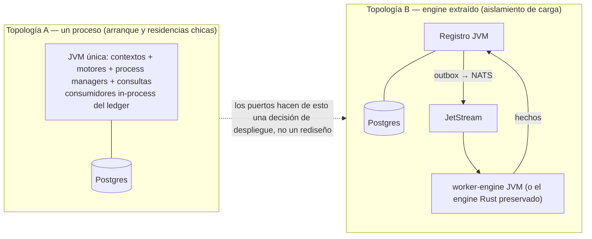

# 05 · Plataforma de ejecución: ledger-first

Aquí se responde la objeción 3: *¿por qué no NATS JetStream como bus de eventos?* Respuesta corta: porque el sistema ya posee un log transaccional — el event store — y un sistema con dos logs tiene una verdad y un rumor. El ledger es la columna vertebral; el bus es una herramienta de frontera.

---

## 1. El principio: un solo log, un solo orden

Todo hecho del dominio se anexa al ledger de Postgres en la misma transacción que lo produce (junto a su auditoría y sus proyecciones propias). Los consumidores internos — process managers, proyecciones, el propio engine cuando corre in-process — **leen el ledger** desde su marca de agua, en orden de `seq_global`. No hay entrega intermedia que pueda reordenar, duplicar con otra semántica ni retener con otra política. El principio P4 (determinismo por secuencia) queda custodiado por el único componente que puede garantizarlo: la base que asigna la secuencia.

```mermaid
sequenceDiagram
    autonumber
    participant D as Decider / caso de uso
    participant PG as Postgres (ledger + estado + marcas)
    participant NO as NOTIFY (pista)
    participant C as Consumidor (listener Modulith)

    D->>PG: TX: eventos (seq_flujo esperada) + auditoría + proyección propia
    PG-->>NO: NOTIFY canal_ledger
    NO-->>C: despertar (optimización, no garantía)
    C->>PG: SELECT eventos WHERE seq_global > marca ORDER BY seq_global LIMIT n
    C->>C: procesar con efecto idempotente
    C->>PG: TX: efecto + marca = último seq procesado
    Note over C,PG: sin NOTIFY el sondeo de respaldo (cada pocos segundos)<br/>garantiza avance. La notificación es pista; el ledger es la verdad.
```

Propiedades que este diseño compra de una sola vez: **entrega al-menos-una-vez** (la marca solo avanza con el efecto confirmado), **orden total** (el del ledger), **replay trivial** (rebobinar es poner la marca atrás), **rehidratación y vivo por el mismo camino** (el gemelo lee el mismo ledger al arrancar y al operar — en v2 eran dos caminos), y **una sola historia de recuperación** para todo el sistema.

## 2. NATS JetStream, degradado a la frontera (no eliminado)

| Lugar | ¿NATS? | Por qué |
| --- | --- | --- |
| Borde → hub (celdas IA publican telemetría) | **Sí** | El borde necesita buffer con reintento cuando el hub no está; JetStream es exactamente eso. La ingesta del hub consume, deduplica por `source_event_id` y anexa al ledger — la frontera termina ahí |
| Hub → dispositivos de entrega (push, tabletas) | **Sí, como transporte** | Entrega es plomería de frontera; el ciclo de vida (ordenada/entregada/vista) vive en el ledger |
| Entre contextos dentro del monolito | **No** | Listeners in-process + lectores del ledger. Cero infraestructura para hablar consigo mismo |
| Hub → worker extraído a proceso propio (futuro) | **Cuando ocurra** | Si el engine se extrae (topología B), NATS reaparece como puente — alimentado por el publicador de outbox desde el ledger, que sigue siendo la verdad |

Cuándo reconsiderar: si aparecen múltiples instalaciones consumiendo un plano común, o consumidores externos de los eventos, el fan-out del ledger por sondeo deja de alcanzar y el puente NATS (o CDC con replicación lógica) se promueve. La decisión queda registrada con su disparador; no se instala por si acaso.

## 3. Esquema de plataforma (delta sobre v2)

El DDL del v2 sobrevive casi entero; cambian tres cosas. `bandeja_salida` deja de ser el corazón y pasa a existir **solo para las fronteras** (publicaciones hacia NATS/borde), alimentada desde el ledger. `marcas_consumidor` se vuelve la pieza central del cableado interno. Y se agrega `registros_decision` (doc 04):

```sql
CREATE TABLE registros_decision (
    id            BIGINT GENERATED ALWAYS AS IDENTITY PRIMARY KEY,
    motor         TEXT        NOT NULL,      -- 'MotorDeRespuesta@1.4.0+ab12cd'
    estimulo_seq  BIGINT      NOT NULL,      -- ref al ledger
    insumos       JSONB       NOT NULL,      -- huellas de gemelo, reglas, cobertura, calibración
    salida        JSONB       NOT NULL,
    explicacion   JSONB       NOT NULL,      -- pasos + descartes
    duracion_ms   INT         NOT NULL,
    registrado_en TIMESTAMPTZ NOT NULL DEFAULT now()
);
CREATE INDEX ix_decision_estimulo ON registros_decision (estimulo_seq);
```

Las claves de idempotencia siguen nombradas y son ley: `source_event_id` en ingesta; `(flujo, seq_flujo)` en el append (control optimista); `(cama, regla, episodio)` en alertas; `(residente, día, tipo)` en resúmenes; `id_mensaje` = `Nats-Msg-Id` en la frontera.

## 4. Topologías de despliegue: el mismo diseño, tres tamaños



La topología A es la recomendada para empezar: los motores puros corren en el mismo proceso, los consumidores son listeners con marca, y no hay red interna que pueda fallar. La B existe para dos disparadores concretos: aislar la carga del barrido cuando las camas se cuenten en cientos, o **preservar el engine Rust existente** vía strangler — los contratos `Observacion.v1`/`HechoDeEscena.v1` ya son la frontera, y da igual qué lenguaje hay a cada lado.

## 5. Simulacros de fallo (la tabla que se ensaya, no se declama)

Cada fila es un test de escena automatizado en CI y un ejercicio operativo trimestral.

| Simulacro | Comportamiento exigido |
| --- | --- |
| Proceso muere a mitad de un dwell de 30 min | Rehidratación (snapshot + ledger desde marca) + primer tick recalculan `ahora − estadoDesde`; la Permanencia dispara a tiempo. Cero minutos perdidos |
| Reintento del borde con el mismo `source_event_id` | `duplicate: true`, sin nuevo evento, sin reproyección |
| Dos reasignaciones concurrentes de la misma cama | Una gana; la otra recibe conflicto optimista; jamás dos asignaciones activas (índices 1:1 del contexto alojamiento) |
| Escalada pendiente y reinicio del hub | El vencimiento es derivado de `EntregaOrdenada.ocurrido_en`; el barrido post-arranque escala si corresponde |
| NOTIFY perdido (siempre se pierde alguno) | El sondeo de respaldo avanza la marca; latencia degrada segundos, corrección nunca |
| Consumidor procesa y muere antes de avanzar marca | Reprocesa el lote; los efectos son idempotentes por clave nombrada; resultado idéntico |
| Sensor mudo 10 min | `SenalPerdida` emitida; gemelo en `Desconocido(SinSenal)`; alarma técnica, no clínica |
| Postgres caído | El hub no acepta escrituras (falla ruidosa, jamás silenciosa); el borde bufferea en JetStream; al volver, la ingesta drena en orden |

## 6. Presupuestos de latencia (funciones de aptitud en CI)

Del hecho al plan: `Observacion` anexada → `HechoDeEscena` en el ledger ≤ 2 s (p99); hecho → `AlertaCreada` ≤ 1 s; alerta crítica → primera entrega ordenada ≤ 2 s. El tick del barrido corre cada 5 s con presupuesto de 500 ms para el censo completo de una residencia. Son números de arranque conservadores — a esta escala el cuello es siempre la frontera física, no el ledger — y viven como tests de rendimiento que fallan el build si se degradan, no como aspiraciones de documento.
