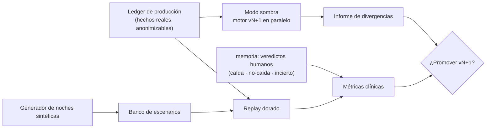

# 06 · Evaluación, inspección e implementación

La objeción 6 pedía tratar la evaluación como capacidad del producto, no como control de calidad del código. Este documento la diseña: cómo se inspecciona una decisión, cómo se compara una versión nueva de un motor contra la vigente, cómo se mide calidad clínica con verdad de terreno, y en qué orden se construye todo.

---

## 1. El ciclo de evaluación

Las cuatro piezas comparten una misma posibilidad técnica: como todo el núcleo son Deciders y motores puros con reloj inyectado (docs 03–04), **ejecutar el pasado, un futuro hipotético o dos versiones a la vez es la misma operación**: alimentar funciones con eventos.

## 2. Inspección: responder "¿por qué no sonó a las 03:12?"

La consulta forense es un join, no una investigación: dado un instante y una cama, se recuperan del ledger los hechos del intervalo y de `registros_decision` las invocaciones de motor con su explicación **incluidos los descartes** — la observación rechazada por histéresis, la alarma suprimida por presencia de staff, la severidad agregada al digest por presupuesto de fatiga. La respuesta a la familia, al auditor o al propio equipo tiene esta forma: *"a las 03:12:41 la transición se registró (seq 184.220); la regla `permanencia-DePie-5min` del criterio `a91f…` (capa: ventana nocturna, definida por Dra. R. el 2/8) aún no vencía; venció a las 03:17:41 y la alerta AL-2231 se creó, entregó y resolvió por presencia a los 214 segundos"*. Cada afirmación de esa frase es una fila con huella. La UI de inspección — la "moviola" — es una pantalla del módulo `consultas` que reproduce ese join por cama y rango horario.

## 3. Replay dorado

Un corpus versionado de ledgers (reales anonimizados + sintéticos) se reproduce contra el núcleo con reloj simulado; la secuencia de decisiones se reduce a un hash y se compara con el esperado. Es el test que compra el determinismo (P4) y el contrato de compatibilidad: un refactor que cambie una sola decisión histórica se descubre en CI, no en una residencia. Regla de mantenimiento: cuando un cambio de comportamiento es **intencional**, el PR debe actualizar el hash esperado *y* adjuntar el informe de divergencias — el cambio de juicio clínico se revisa como tal, nunca como efecto colateral.

## 4. Modo sombra

Para promover `MotorDeRespuesta@2.0` sin apostar una noche real: la versión candidata corre en paralelo dentro del mismo proceso, recibe los mismos estímulos, y sus decisiones se escriben **solo** en `registros_decision` marcadas como sombra — jamás producen alertas. Un job diario emite el informe: divergencias por tipo (alertas que la sombra habría creado y la vigente no, y viceversa), cruzadas con los veredictos humanos posteriores cuando existen. La promoción es una decisión informada por semanas de sombra, con criterio explícito (p. ej. "la candidata no pierde ninguna alerta que un veredicto humano confirmó, y reduce un 20% las que se marcaron falsas").

## 5. Simulador de noches

Un generador de escenarios produce secuencias de `Observacion` con reloj virtual — la herramienta de diseño de reglas y de regresión de motores. Banco inicial de escenarios, cada uno con su resultado exigido:

| Escenario | Lo que debe pasar |
| --- | --- |
| La caída de las 03:00 (salida + silencio) | Permanencia dispara al vencer el umbral; escalada si no hay acuse; `segundos_hasta_staff` medido |
| Noche tranquila (giros en cama, micro-movimientos) | Cero alertas; histéresis y dedupe absorben todo; digest vacío |
| Deambulación (habitación ⇄ pasillo repetido) | Un episodio, una alerta; sin metralleta de re-alarmas |
| Baño largo con visita de staff a mitad | Rearme post-presencia; el conteo reinicia; sin alerta espuria |
| Sensor mudo 10 min con residente quieto | `SenalPerdida` → alarma técnica; ninguna alarma clínica falsa |
| Enfermera presente durante transición de riesgo | Hecho registrado, alarma suprimida con constancia `StaffPresente` |
| Ráfaga de severidades bajas (12 en una hora) | Presupuesto de fatiga: agregación en digest, explicada |
| Reasignación de cama a medianoche | El gemelo re-vincula ocupante; criterio del nuevo residente rige desde el vínculo |

El simulador vive en `analitica/simulador` y es también la herramienta con la que el equipo clínico *ve* una regla antes de activarla: "así se habría comportado esta configuración en las últimas 30 noches de esta ala".

## 6. Banco de conformidad de puertos

Cada puerto (ledger, marcas, entrega, foto de cobertura, calibración) publica su kit de conformidad: una suite abstracta que todo adaptador debe pasar — el adaptador Postgres, el de memoria para tests, el futuro adaptador NATS de la topología B. Es la garantía de que "cambiar la implementación sin tocar el núcleo" es un hecho verificado y no una promesa de arquitectura: el kit codifica la semántica (orden, idempotencia, visibilidad tras confirmación) y cualquier adaptador nuevo hereda las mismas obligaciones.

## 7. Métricas clínicas: memoria como verdad de terreno

Los veredictos humanos (`VeredictoRegistrado`: caída / no-caída / incierto) etiquetan retrospectivamente las decisiones del sistema, y de ese cruce salen las métricas que importan — no las de infraestructura, las de propósito:

| Métrica | Definición | Fuente |
| --- | --- | --- |
| Precisión de alerta | alertas confirmadas por veredicto / alertas emitidas | respuesta × memoria |
| Recobrado | incidentes confirmados que tuvieron alerta previa / incidentes confirmados | memoria × respuesta |
| Tiempo hasta staff | p50 y p90 de `segundos_hasta_staff` por severidad y turno | respuesta |
| Fatiga | interrupciones por persona de plantel por turno; % agregado a digest | respuesta × cobertura |
| Silencio técnico | minutos-cama en `Desconocido(SinSenal)` por noche | situacion |
| Rendimiento del aprendizaje | % de `ProponerBajar` aceptadas; subas automáticas seguidas de incidente confirmado (deseado: alto) | aprendizaje × memoria |

Todas se computan en el plano analítico (Parquet + DuckDB, ratificado de v2) y las operativas se exhiben en `consultas`. La regla de frontera se mantiene: si una métrica debe volverse comportamiento, entra por `criterio` como regla, con su evento y su auditoría — la analítica nunca actúa.

## 8. Plan de implementación por rebanadas

Se abandona el plan por capas del v2 (contextos primero, lazo al final) por un plan por **rebanadas verticales**: cada una atraviesa del estímulo a la constancia y deja el sistema demostrable. La primera es el esqueleto andante.

| Rebanada | Contenido | Demostración de cierre |
| --- | --- | --- |
| **R0 — Esqueleto andante** (la más importante) | Una cama, un residente fijo, una regla de permanencia; ledger + marcas + Decider Alerta + MotorDeSituacion mínimo + MotorDeReloj + entrega a consola; reloj simulado | La caída de las 03:00 corre de punta a punta en un test de escena; matar el proceso a mitad del dwell no pierde la alarma; el replay dorado del escenario da hash estable |
| **R1 — Criterio real** | `criterio` event-sourced, capas con procedencia, huella referenciada por las decisiones | La moviola explica una alerta citando capa y autor de cada regla |
| **R2 — Respuesta seria** | Episodios, supresión por presencia, fatiga, silencio temporal; `MotorDeEnrutamiento` + `VidaDeAlerta` con escalada derivada | Escenarios de deambulación, staff presente y ráfaga pasan el banco |
| **R3 — Censo y frontera** | `alojamiento` (1:1 adentro, reasignación con aserción), `percepcion` con ingesta idempotente, borde vía JetStream | Simulacros de duplicado, concurrencia y sensor mudo en verde |
| **R4 — Memoria y lazo de verdad** | Incidentes, veredictos, `CicloDeIncidente`; primeras métricas de precisión/recobrado | Un mes simulado produce el tablero de métricas clínicas |
| **R5 — Aprendizaje** | Líneas base, autopilot asimétrico, `CicloDePropuesta`, bandeja humana | Sombra del autopilot sobre el corpus; ninguna baja sin humano, verificado por tipo y por test |
| **R6 — Operación y consultas** | `cobertura`, `cuidado` (rondas con foto congelada), módulo `consultas` completo, moviola | Ronda nocturna completa con digest de fatiga |
| **R7 — Evaluación como producto** | Modo sombra generalizado, simulador para clínicos, banco de conformidad completo, compactación a Parquet | Promoción de un motor vN+1 siguiendo el proceso de sombra, de punta a punta |

Definition of done transversal de cada rebanada: sus escenarios en el banco, sus simulacros de fallo, sus registros de decisión inspeccionables en la moviola, Konsist y Modulith en verde, y el replay dorado del corpus acumulado sin divergencias no intencionales.

---

*Con esto, la sala considera respondidas las seis objeciones: contextos derivados del problema, procesos con nombre en lugar de orquestador, un solo ledger en lugar de dos logs, event sourcing con criterio, motores con cartas de responsabilidad y decisiones que se explican solas — y un camino de construcción que empieza demostrando el lazo completo en la rebanada cero.*
