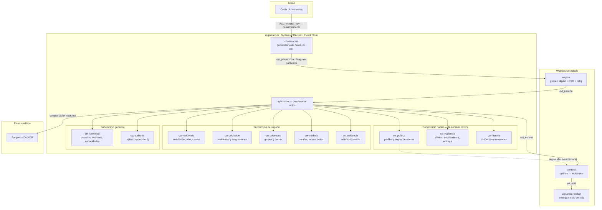
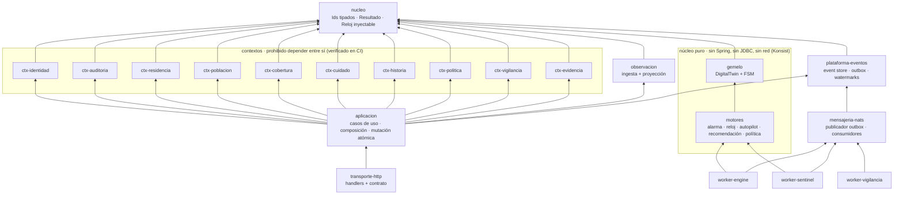
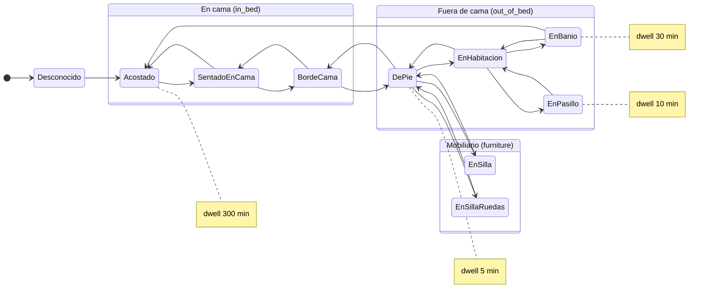
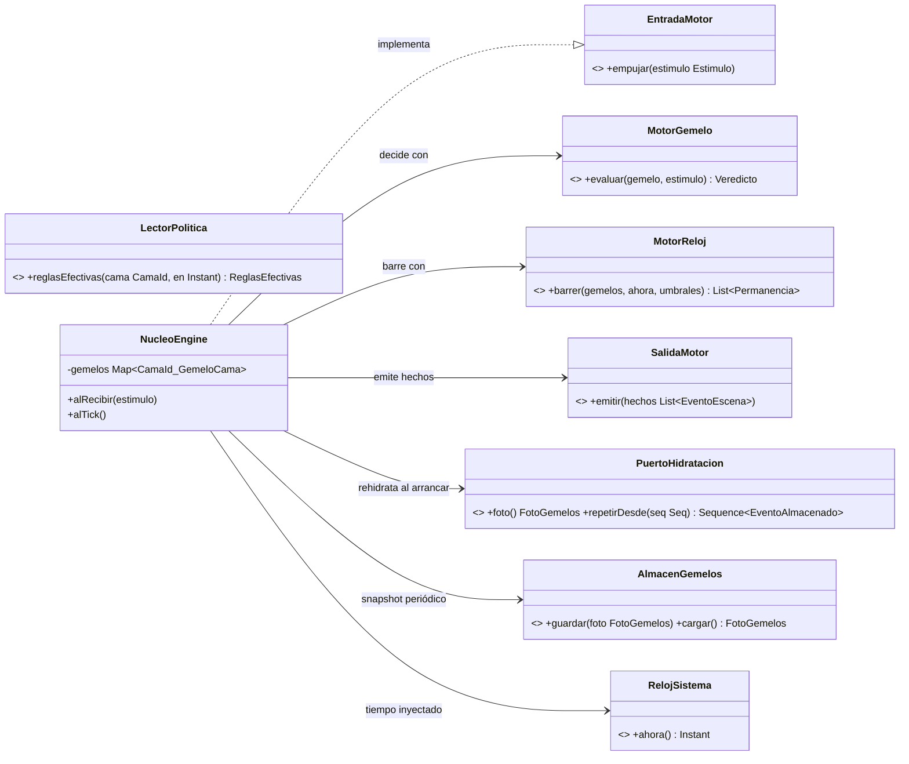

# Registro v2 — Diseño de arquitectura evolutiva

**Sistema:** Registro clínico de monitoreo (Virtual Rounds / familia Mana)
**Estado:** Borrador para revisión de diseño · Agosto 2026
**Alcance:** Bounded contexts, event sourcing selectivo, interfaces (puertos), paquetes de motores, modelo de datos, elección de stack, persistencia, analítica y hoja de ruta.

---

## 0. Veredicto ejecutivo

Este documento propone la versión evolutiva del Registro con las siguientes decisiones, argumentadas en detalle más abajo:

| Decisión | Elección | Alternativas descartadas |
| --- | --- | --- |
| Estilo arquitectónico | **Monolito modular + 3 workers sin estado** | Microservicios (fragilidad de red en dominio clínico) |
| Lenguaje y framework | **Kotlin + Spring Boot 4 + Spring Modulith 2** para el Registro; núcleo de motores en **Kotlin puro sin framework** | Go (sin tipos suma → FSM no exhaustiva); Rust queda como opción válida para appliance de borde |
| Persistencia SoR | **PostgreSQL** (único System of Record + Event Store + Outbox) | MongoDB (invariantes transaccionales 1:1 y auditoría atómica no encajan); SQLite queda para edge/tests |
| Event sourcing | **Selectivo**: percepción, escena, entrega y auditoría son append-only; agregados administrativos siguen mutables con auditoría atómica | Event sourcing global (complejidad sin retorno) |
| Mensajería | **NATS JetStream** (se conserva): `evt_percepcion`, `evt_escena`, `evt_notif`, `evt_politica` | Kafka (sobredimensionado para una residencia) |
| Grafos | **Modelo sí, base de grafos no**: CTEs recursivas en Postgres; Apache AGE solo si emerge una necesidad real | Neo4j (no hay consultas de grafo profundas en OLTP) |
| Analítica | **Parquet + DuckDB** embebido, compactación desde el event store | ClickHouse (camino de escala futuro, no punto de partida) |

La regla que ordena todo el diseño se mantiene de la versión anterior y se eleva a principio:

> **Interfaces donde el cambio cruza fronteras; funciones puras donde la corrección debe ser demostrable; una sola memoria que no miente; proyecciones para todo lo demás.**

---

## 1. Principios de diseño (no negociables)

Estos ocho principios gobiernan cada decisión posterior. Cualquier PR que los viole se rechaza en revisión, y donde sea posible se rechaza antes: en compilación o en CI.

**P1 — Núcleo funcional, cáscara imperativa.** Los motores de decisión (`motores/*`) y el gemelo digital (`gemelo/*`) son módulos Kotlin puros: sin Spring, sin JDBC, sin red, sin reloj implícito. Reciben datos, devuelven decisiones. La pureza no es disciplina, es construcción: el módulo Gradle no declara esas dependencias y Konsist rompe el build si aparecen.

**P2 — Un solo System of Record.** Postgres detrás del Registro es la única verdad persistente. Los workers (engine, sentinel, vigilancia) no tienen base de datos propia: son proyecciones y decisión, reconstruibles desde el Hub.

**P3 — Event sourcing selectivo.** Es append-only lo que por naturaleza es evidencia, decisión o entrega: eventos de sensor, eventos de escena, ciclo de vida de alertas, auditoría, revisiones de incidente. Los agregados administrativos (residentes, camas, turnos, perfiles) siguen siendo mutables, pero **ninguna mutación ocurre sin su fila de auditoría en la misma transacción** (patrón de mutación atómica).

**P4 — Determinismo por secuencia, nunca por reloj.** El orden de aplicación de eventos es la secuencia monotónica del event store (`seq_global`), jamás `occurred_at`. Un evento fuera de orden se encola, no se aplica. Esta es la lección F8 heredada y no se renegocia.

**P5 — Dos tiempos.** Tiempo de evento (reactivo: llega una percepción) y tiempo de reloj (proactivo: el barrido evalúa permanencias). Los timers de permanencia son **estado derivado** (`ahora − estado_desde ≥ umbral`), nunca cronómetros persistidos que un reinicio pueda perder.

**P6 — Seguridad asimétrica.** Subir vigilancia es automático con evidencia; bajarla es siempre una propuesta que requiere confirmación humana. La asimetría vive en el sistema de tipos (ver §4.5): bajar no es una acción representable, solo una propuesta.

**P7 — La ausencia de información no es información.** `durmiendo` desconocido es `null`, nunca `false`. Kotlin con nulabilidad explícita (y JSpecify en las fronteras Java) hace este principio verificable por el compilador.

**P8 — Contratos primero.** El contrato HTTP (OpenAPI) y los esquemas de eventos (JSON Schema versionado) se mantienen a mano, independientes del código, con DTOs escritos a mano y testeados contra el contrato. Los eventos ya emitidos son API para siempre: se versionan, jamás se reinterpretan.

---

## 2. Mapa de contextos (context map)

Once bounded contexts más un subsistema de datos (observación), clasificados por destilación de subdominio. La regla estructural: **ningún `ctx-*` depende de otro `ctx-*`**; toda composición vive en la capa de aplicación, y los IDs entre contextos son referencias opacas sin foreign keys.



Lectura del mapa en términos de Evans y Vernon: el **núcleo** es la decisión clínica (política, vigilancia, historia) más los motores que la ejecutan; ahí se invierte la energía de modelado. Residencia, población, cobertura, cuidado y evidencia son **soporte**: modelos correctos pero sin sofisticación innecesaria. Identidad y auditoría son **genéricos**: se resuelven con lo mejor del ecosistema (Spring Security, tabla append-only) sin inventar nada. El borde entra por un **anticorruption layer** explícito: la resolución `monitor_key → cama → residente` traduce el lenguaje del hardware al lenguaje del dominio, y ningún concepto de sensor cruza esa frontera sin traducirse. Los eventos `evt_percepcion` y `evt_escena` son **lenguaje publicado**: esquemas versionados que ambos lados testean por contrato.

---

## 3. Arquitectura de módulos y paquetes

Monolito modular en Gradle multi-módulo. Spring Modulith 2 verifica las fronteras entre módulos de aplicación (`ApplicationModules.verify()` en CI) y Konsist verifica la pureza de los motores. El grafo de dependencias es un DAG estricto: los contextos no se miran entre sí ni miran hacia arriba.



Estructura de repositorio propuesta (Gradle Kotlin DSL):

```text
registro/
├── settings.gradle.kts
├── nucleo/                      # value classes Id<K>, Resultado, RelojSistema
├── contextos/
│   ├── ctx-identidad/           # domain/ + store/ + api/ (puerto del contexto)
│   ├── ctx-auditoria/
│   ├── ctx-residencia/
│   ├── ctx-poblacion/
│   ├── ctx-cobertura/
│   ├── ctx-cuidado/
│   ├── ctx-historia/
│   ├── ctx-politica/
│   ├── ctx-vigilancia/
│   └── ctx-evidencia/
├── observacion/                 # ingesta idempotente + proyección estado_actual_camas
├── gemelo/                      # PURO: DigitalTwin, FSM, tipos de escena
├── motores/                     # PURO: alarma, reloj, autopilot, recomendación, política
├── plataforma-eventos/          # event store, outbox, watermarks, upcasters
├── aplicacion/                  # casos de uso, composición cross-context, mutación atómica
├── transporte-http/             # Spring MVC, seguridad, OpenAPI hecho a mano
├── mensajeria-nats/             # jnats: publicador de outbox + consumidores durables
├── workers/
│   ├── worker-engine/           # cáscara imperativa del gemelo + scan loop
│   ├── worker-sentinel/         # cáscara imperativa del motor de política/alarma
│   └── worker-vigilancia/       # entrega push/UI, ciclo de vida de alerta
├── analitica/                   # compactador a Parquet + consultas DuckDB
└── contratos/
    ├── openapi.yaml             # contrato HTTP mantenido a mano
    └── eventos/                 # JSON Schema por tipo y versión: escena.transicion.v1.json …
```

Cada `ctx-*` conserva la estructura interna de tres capas: `domain/` (invariantes, sin IO), `store/` (SQL del contexto, dueño exclusivo de sus tablas), `api/` (el puerto que `aplicacion` consume). Las pantallas que combinan contextos son **read models de la aplicación**, nunca un contexto nuevo.

---

## 4. El núcleo puro: gemelo digital, FSM y motores

### 4.1 La máquina de estados de la persona

Once variantes agrupadas por riesgo. La FSM elimina imposibilidades físicas: una transición ilegal se descarta como ruido de sensor, no se aplica. Cada estado lleva su umbral de permanencia (dwell) por catálogo, ajustable por perfil.



```kotlin
// módulo gemelo — PURO
sealed interface EstadoPersona {
    // En cama
    data object Acostado : EstadoPersona
    data object SentadoEnCama : EstadoPersona
    data object BordeCama : EstadoPersona
    // Fuera de cama
    data object DePie : EstadoPersona
    data object EnBanio : EstadoPersona
    data object EnHabitacion : EstadoPersona
    data object EnPasillo : EstadoPersona
    // Mobiliario
    data object EnSilla : EstadoPersona
    data object EnSillaRuedas : EstadoPersona
    // Otros
    data object Ausente : EstadoPersona
    data object Desconocido : EstadoPersona

    val grupo: GrupoEstado
        get() = when (this) {
            Acostado, SentadoEnCama, BordeCama -> GrupoEstado.EnCama
            DePie, EnBanio, EnHabitacion, EnPasillo, Ausente -> GrupoEstado.FueraDeCama
            EnSilla, EnSillaRuedas -> GrupoEstado.Mobiliario
            Desconocido -> GrupoEstado.Desconocido
        }
}

enum class GrupoEstado { EnCama, FueraDeCama, Mobiliario, Desconocido }

/** Tabla de transiciones legales. `when` exhaustivo: agregar un estado
 *  sin decidir sus transiciones NO compila. Esa es la garantía que Go no da. */
fun EstadoPersona.transicionesValidas(): Set<EstadoPersona>
```

Regla de deduplicación heredada: una percepción que repite el estado vigente **no** genera transición ni reinicia `estado_desde`; el reloj de permanencia solo se mueve cuando el estado cambia.

### 4.2 El gemelo digital como memory image

El gemelo es una proyección viva en memoria (patrón Memory Image de Fowler): mantiene estado, `estado_desde` y alertas abiertas por cama, aplica eventos en orden de secuencia y **nunca es System of Record**. Tras un reinicio se rehidrata con snapshot + replay desde el último watermark. Los timers no existen como filas: se derivan.

```kotlin
// módulo gemelo — PURO
@JvmInline value class CamaId(val valor: String)
@JvmInline value class ResidenteId(val valor: String)
@JvmInline value class Seq(val valor: Long)

data class GemeloCama(
    val camaId: CamaId,
    val residenteId: ResidenteId?,          // cama sin ocupante es un estado legal
    val estado: EstadoPersona,
    val estadoDesde: Instant,
    val ultimaSeqAplicada: Seq,
    val alertasAbiertas: Set<ClaveAlerta>,  // dedupe (cama, regla, episodio)
) {
    /** Función pura de transición: (gemelo, percepción) -> (gemelo', hechos). */
    fun aplicar(p: EventoPercepcion, seq: Seq): Pair<GemeloCama, List<EventoEscena>>
}

data class FotoGemelos(              // snapshot durable
    val tomadaEn: Instant,
    val hastaSeq: Seq,
    val camas: Map<CamaId, GemeloCama>,
)
```

### 4.3 Estímulos, hechos y decisiones (el lenguaje de los motores)

Tres jerarquías selladas ordenan todo el flujo: lo que entra (`Estimulo`), lo que el gemelo constata (`EventoEscena`) y lo que la política decide (`AccionVigilancia`). Serialización con estabilidad de esquema: cada tipo mapea a `escena.<tipo>.v<n>` en el event store.

```kotlin
// módulo gemelo — PURO
sealed interface Estimulo {
    data class Percepcion(val evento: EventoPercepcion, val seq: Seq) : Estimulo
    data class Tick(val ahora: Instant) : Estimulo          // pulso del barrido
}

data class EventoPercepcion(
    val fuenteId: String,            // source_event_id → clave de idempotencia
    val monitorKey: String,
    val estadoObservado: EstadoPersona?,
    val durmiendo: Boolean?,         // P7: ausencia ≠ false, nulabilidad deliberada
    val ocurridoEn: Instant,
)

sealed interface EventoEscena {
    val camaId: CamaId
    val ocurridoEn: Instant

    data class Transicion(
        override val camaId: CamaId,
        val desde: EstadoPersona,
        val hacia: EstadoPersona,
        override val ocurridoEn: Instant,
    ) : EventoEscena

    /** Disparada por el reloj: el silencio como síntoma. */
    data class Permanencia(
        override val camaId: CamaId,
        val estado: EstadoPersona,
        val minutosTranscurridos: Long,
        override val ocurridoEn: Instant,
    ) : EventoEscena

    data class PresenciaStaff(
        override val camaId: CamaId,
        val segundosHastaLlegada: Long?,   // cierre del lazo medido por IA, no por botón
        override val ocurridoEn: Instant,
    ) : EventoEscena
}
```

### 4.4 Los cinco motores como funciones puras

```kotlin
// módulo motores — PURO. Sin Spring, sin JDBC, sin red, sin Instant.now().
// El reloj SIEMPRE entra por parámetro: mismo insumo → misma decisión, siempre.

/** 1 · Motor de gemelo/alarma (corre en worker-engine). */
fun interface MotorGemelo {
    fun evaluar(gemelo: GemeloCama, estimulo: Estimulo): Veredicto
}
data class Veredicto(
    val gemelo: GemeloCama,               // estado siguiente, inmutable
    val hechos: List<EventoEscena>,       // lo que pasó; el Hub decide qué materializar
)

/** 2 · Motor de reloj: el barrido. Permanencia = ahora − estadoDesde ≥ umbral.
 *  No hay cronómetros: un reinicio no pierde tiempo porque el tiempo no se cuenta, se calcula. */
fun interface MotorReloj {
    fun barrer(
        gemelos: Collection<GemeloCama>,
        ahora: Instant,
        umbrales: CatalogoDwell,
    ): List<EventoEscena.Permanencia>
}

/** 3 · Motor de política efectiva: capas nivel → plantilla → ajuste manual. */
fun interface MotorPolitica {
    fun resolver(cama: CamaId, en: Instant, capas: CapasPolitica): ReglasEfectivas
}

/** 4 · Motor de alarma (corre en worker-sentinel): hechos + reglas → acciones. */
fun interface MotorAlarma {
    fun evaluar(
        hecho: EventoEscena,
        reglas: ReglasEfectivas,
        abiertas: Set<ClaveAlerta>,       // dedupe estricto por (cama, regla, episodio)
    ): List<AccionVigilancia>
}
sealed interface AccionVigilancia {
    data class CrearAlerta(val clave: ClaveAlerta, val severidad: Severidad, val motivo: Motivo) : AccionVigilancia
    data class Escalar(val alertaId: AlertaId, val a: NivelEscalamiento) : AccionVigilancia
    data object Nada : AccionVigilancia
}

/** 5 · Motor de autopilot: la asimetría vive en el TIPO.
 *  Subir es una acción auto-aplicable; bajar solo existe como propuesta. */
fun interface MotorAutopilot {
    fun decidir(historial: VentanaSenales, vigente: PerfilVigente, ahora: Instant): DecisionAutopilot
}
sealed interface DecisionAutopilot {
    data class Subir(val a: NivelVigilancia, val evidencia: Evidencia) : DecisionAutopilot
    data class ProponerBajar(val a: NivelVigilancia, val evidencia: Evidencia) : DecisionAutopilot
    data object Mantener : DecisionAutopilot
}
```

El punto de diseño clave del autopilot: no existe un `Bajar` aplicable. El compilador hace irrepresentable la violación de la regla de seguridad asimétrica — "hacer los estados ilegales irrepresentables" aplicado a política clínica. La ausencia de incidentes bajo alta vigilancia no es evidencia de bajo riesgo (es la vigilancia funcionando), y por eso bajar exige el juicio holístico de un humano.

### 4.5 Puertos: la cáscara imperativa

Los puertos nombran conversaciones, no tecnologías (Cockburn). Las implementaciones arrancan in-process contra Postgres/NATS y pueden migrar a red sin tocar el núcleo.



```kotlin
// módulo workers/worker-engine — cáscara imperativa (aquí SÍ hay IO)
interface EntradaMotor { fun empujar(e: Estimulo) }
interface SalidaMotor { fun emitir(hechos: List<EventoEscena>) }

interface PuertoHidratacion {
    fun foto(): FotoGemelos?
    fun repetirDesde(seqExclusiva: Seq): Sequence<EventoAlmacenado>
}
interface AlmacenGemelos {
    fun guardar(foto: FotoGemelos)
    fun cargar(): FotoGemelos?
}
interface LectorPolitica {
    fun reglasEfectivas(cama: CamaId, en: Instant): ReglasEfectivas
}
/** El reloj es un puerto: en producción, el sistema; en tests, controlado. */
interface RelojSistema { fun ahora(): Instant }
```

El ciclo del worker-engine es un super loop estilo PLC: en cada iteración drena estímulos de `evt_percepcion` en orden de `seq`, aplica `MotorGemelo.evaluar`, corre `MotorReloj.barrer` con el reloj inyectado, emite los hechos por `SalidaMotor` (que los publica a `evt_escena` vía outbox) y cada N segundos persiste `FotoGemelos`. Si el proceso muere a mitad de un dwell, la rehidratación (snapshot + replay + tick inmediato) reconstruye exactamente el mismo cálculo: `ahora − estado_desde` no olvida.
