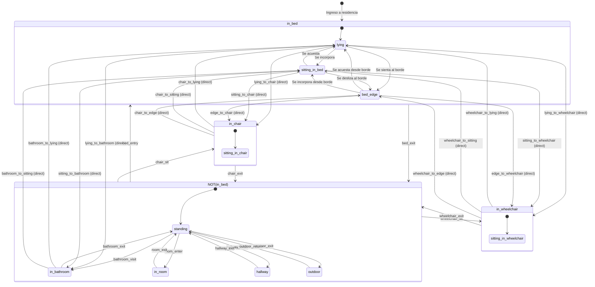

# Catálogo de Alarmas — Arquitectura FSM Jerárquica

Contenido del documento
 1. Visión General — Principios de la arquitectura FSM jerárquica
 2. Diagrama de Estados — Statechart en Mermaid con sub-máquinas
 3. Estados y Sub-estados — Árbol jerárquico + tabla completa
 4. Transiciones — 28 transiciones organizadas por grupo
 5. Dwells — 11 dwells con sus estados y timers
 6. Fall Prevention — 4 reglas de riesgo
 7. Environment — 4 accesorios
 8. Sleep — 3 estados de sueño
 9. Resolución de Complementos — Lógica NOT para out_of_bed y on_floor
10. Matriz de Presets — Niveles bajo/medio/alto
11. Templates — 5 plantillas
12. Ejemplo Jose — JSON de configuración personalizada

**Actualizado.** Resumen de cambios:

### `config/alarm-catalog-proposal.toml` (782 líneas)

Agregadas **16 transiciones directas**:

| Tipo | Transiciones |
|------|--------------|
| Bed → Chair | `lying_to_chair`, `sitting_to_chair`, `edge_to_chair` |
| Bed → Wheelchair | `lying_to_wheelchair`, `sitting_to_wheelchair`, `edge_to_wheelchair` |
| Chair → Bed | `chair_to_lying`, `chair_to_sitting`, `chair_to_edge` |
| Wheelchair → Bed | `wheelchair_to_lying`, `wheelchair_to_sitting`, `wheelchair_to_edge` |
| Bed → Bathroom | `lying_to_bathroom`, `sitting_to_bathroom` |
| Bathroom → Bed | `bathroom_to_lying`, `bathroom_to_sitting` |

### `docs/funcional/catalogo-alarmas-arquitectura.md` (464 líneas)

- Tabla de transiciones directas actualizada
- Diagrama Mermaid con flechas directas bed↔chair/wheelchair y bed↔bathroom
- Sección de resumen con conteo de reglas (44 transiciones totales)

### Total de transiciones

```
Internas in_bed:           6
in_bed ↔ out_of_bed:       6
Internas out_of_bed:      10
Directas bed↔chair:       12
Directas bed↔bathroom:     4
standing↔chair:            4
─────────────────────────────
Total:                    42
```


## Visión General

El sistema de alarmas se basa en una **máquina de estados jerárquica** (HSM) donde:

- **Estados** = dónde está el residente (ubicación/postura)
- **Transiciones** = movimientos entre estados
- **Dwells** = permanencia en un estado
- **Complementos** = lógica NOT sobre conjuntos de estados

### Principios

1. **Jerarquía**: Los estados pueden tener sub-estados (OR de conjuntos)
2. **Complemento**: `out_of_bed = NOT(in_bed)` permite reglas como "fuera de la cama"
3. **Dimensiones**: Cada regla tiene 4 dimensiones (state, transition, dwell, action)
4. **Resolución**: Los complementos se resuelven en tiempo de configuración

---

## Diagrama de Estados (Statechart)



---

## Estados y Sub-estados

### Árbol de Estados

```
in_bed (estado raíz)
├── lying (sub-estado implícito)
├── sitting_in_bed (sub-estado explícito)
└── bed_edge (sub-estado explícito)

out_of_bed = NOT(in_bed) (complemento)
├── standing (sub-estado)
├── in_bathroom (sub-estado)
├── in_room (sub-estado, excluyendo cama)
├── hallway (sub-estado)
└── outdoor (sub-estado)

in_chair (estado independiente)
in_wheelchair (estado independiente)
```

### Tabla de Estados

| Estado | Tipo | Padre | Descripción |
|--------|------|-------|-------------|
| `in_bed` | state | - | Residente en la cama |
| `in_bed.lying` | sub_state | in_bed | Posición acostado |
| `in_bed.sitting_in_bed` | sub_state | in_bed | Posición incorporado |
| `in_bed.bed_edge` | sub_state | in_bed | Posición al borde |
| `out_of_bed` | complement | - | NOT(in_bed) |
| `out_of_bed.standing` | sub_state | out_of_bed | De pie |
| `out_of_bed.in_bathroom` | sub_state | out_of_bed | En baño |
| `out_of_bed.in_room` | sub_state | out_of_bed | En habitación (no en cama) |
| `out_of_bed.hallway` | sub_state | out_of_bed | En pasillo |
| `out_of_bed.outdoor` | sub_state | out_of_bed | En exterior |
| `in_chair` | state | - | En silla |
| `in_wheelchair` | state | - | En silla de ruedas |

---

## Transiciones

### Transiciones dentro de in_bed

| ID | Desde | Hacia | Descripción | Timer |
|----|-------|-------|-------------|-------|
| `lying_to_sitting` | lying | sitting_in_bed | Se incorpora en la cama | 0-15 min |
| `sitting_to_lying` | sitting_in_bed | lying | Se acuesta desde incorporado | 0-10 min |
| `lying_to_edge` | lying | bed_edge | Se sienta al borde | 0-10 min |
| `edge_to_lying` | bed_edge | lying | Se acuesta desde el borde | 0-10 min |
| `sitting_to_edge` | sitting_in_bed | bed_edge | Se desliza al borde | 0-10 min |
| `edge_to_sitting` | bed_edge | sitting_in_bed | Se incorpora desde el borde | 0-10 min |

### Transiciones in_bed ↔ out_of_bed

| ID | Desde | Hacia | Descripción | Timer |
|----|-------|-------|-------------|-------|
| `lying_to_standing` | lying | standing | Se levanta desde acostado | 0-10 min |
| `sitting_to_standing` | sitting_in_bed | standing | Se levanta desde incorporado | 0-10 min |
| `edge_to_standing` | bed_edge | standing | Se levanta desde el borde | 0-10 min |
| `standing_to_lying` | standing | lying | Se acosta desde de pie | 0-10 min |
| `standing_to_sitting` | standing | sitting_in_bed | Se sienta en cama desde de pie | 0-10 min |
| `standing_to_edge` | standing | bed_edge | Se sienta en borde desde de pie | 0-10 min |

### Transiciones dentro de out_of_bed

| ID | Desde | Hacia | Descripción | Timer |
|----|-------|-------|-------------|-------|
| `standing_to_chair` | standing | in_chair | Se sienta en silla | 0-10 min |
| `chair_to_standing` | in_chair | standing | Se levanta de la silla | 0-10 min |
| `standing_to_wheelchair` | standing | in_wheelchair | Se sienta en silla de ruedas | 0-10 min |
| `wheelchair_to_standing` | in_wheelchair | standing | Se levanta de silla de ruedas | 0-10 min |
| `standing_to_bathroom` | standing | in_bathroom | Entra al baño | 0-10 min |
| `bathroom_to_standing` | in_bathroom | standing | Sale del baño | 0-10 min |
| `standing_to_hallway` | standing | hallway | Entra al pasillo | 0-5 min |
| `hallway_to_standing` | hallway | standing | Sale del pasillo | 0-5 min |
| `standing_to_outdoor` | standing | outdoor | Sale al exterior | 0-5 min |
| `outdoor_to_standing` | outdoor | standing | Regresa del exterior | 0-5 min |

### Transiciones directas: Bed ↔ Chair/Wheelchair

Transferencias directas sin pasar por standing (asistencia, sliding board, etc.)

| ID | Desde | Hacia | Descripción | Timer |
|----|-------|-------|-------------|-------|
| `lying_to_chair` | lying | in_chair | Transferencia directa de cama a silla (acostado) | 0-10 min |
| `sitting_to_chair` | sitting_in_bed | in_chair | Transferencia directa de cama a silla (incorporado) | 0-10 min |
| `edge_to_chair` | bed_edge | in_chair | Transferencia directa de borde a silla | 0-10 min |
| `lying_to_wheelchair` | lying | in_wheelchair | Transferencia directa de cama a silla de ruedas (acostado) | 0-10 min |
| `sitting_to_wheelchair` | sitting_in_bed | in_wheelchair | Transferencia directa de cama a silla de ruedas (incorporado) | 0-10 min |
| `edge_to_wheelchair` | bed_edge | in_wheelchair | Transferencia directa de borde a silla de ruedas | 0-10 min |
| `chair_to_lying` | in_chair | lying | Transferencia directa de silla a cama (acostado) | 0-10 min |
| `chair_to_sitting` | in_chair | sitting_in_bed | Transferencia directa de silla a cama (incorporado) | 0-10 min |
| `chair_to_edge` | in_chair | bed_edge | Transferencia directa de silla a borde de cama | 0-10 min |
| `wheelchair_to_lying` | in_wheelchair | lying | Transferencia directa de silla de ruedas a cama (acostado) | 0-10 min |
| `wheelchair_to_sitting` | in_wheelchair | sitting_in_bed | Transferencia directa de silla de ruedas a cama (incorporado) | 0-10 min |
| `wheelchair_to_edge` | in_wheelchair | bed_edge | Transferencia directa de silla de ruedas a borde de cama | 0-10 min |

### Transiciones directas: Bed ↔ Bathroom

Algunos residentes pueden ir directamente del baño a la cama

| ID | Desde | Hacia | Descripción | Timer |
|----|-------|-------|-------------|-------|
| `bathroom_to_lying` | in_bathroom | lying | Transferencia directa de baño a cama (acostado) | 0-10 min |
| `bathroom_to_sitting` | in_bathroom | sitting_in_bed | Transferencia directa de baño a cama (incorporado) | 0-10 min |
| `lying_to_bathroom` | lying | in_bathroom | Transferencia directa de cama a baño (acostado) | 0-10 min |
| `sitting_to_bathroom` | sitting_in_bed | in_bathroom | Transferencia directa de cama a baño (incorporado) | 0-10 min |

---

## Dwells (Permanencia en Estado)

| ID | Estado | Descripción | Timer |
|----|--------|-------------|-------|
| `in_bed_dwell` | in_bed | Mucho tiempo en la cama | 0-480 min |
| `out_of_bed_dwell` | out_of_bed | Mucho tiempo fuera de la cama | 0-120 min |
| `sitting_dwell` | sitting_in_bed | Mucho tiempo incorporado | 0-60 min |
| `bed_edge_dwell` | bed_edge | Mucho tiempo al borde | 0-30 min |
| `standing_dwell` | standing | Mucho tiempo de pie | 0-60 min |
| `bathroom_dwell` | in_bathroom | Mucho tiempo en el baño | 0-60 min |
| `room_absence_dwell` | out_of_bed | Mucho tiempo fuera de habitación | 0-180 min |
| `outdoor_dwell` | outdoor | Mucho tiempo en el exterior | 0-180 min |
| `in_chair_dwell` | in_chair | Mucho tiempo en la silla | 0-240 min |
| `in_wheelchair_dwell` | in_wheelchair | Mucho tiempo en silla de ruedas | 0-240 min |
| `sleep_dwell` | in_bed | Mucho tiempo dormido | 0-480 min |

---

## Fall Prevention (Prevención de Caídas)

| ID | Tipo | Descripción | Bloqueada |
|----|------|-------------|-----------|
| `fall` | event | Caída detectada | sí |
| `on_floor` | consequence | Residente en el piso | no |
| `standing_unassisted` | posture | De pie sin asistencia | no |
| `walking_without_aid` | action | Camina sin su apoyo | no |

### Lógica de `on_floor`

```
on_floor = NOT(in_bed) AND NOT(in_chair) AND NOT(in_wheelchair) AND NOT(standing)
         = residente en posición que no es ninguna conocida
```

---

## Environment (Accesorios)

| ID | Descripción | Condiciones watch |
|----|-------------|-------------------|
| `bed_rail` | Baranda de la cama | up, pad |
| `wheelchair_aid` | Silla de ruedas del residente | present, reach |
| `chair_aid` | Silla de la habitación | present, reach |
| `walker_aid` | Andador del residente | present, reach |

---

## Sleep (Sueño)

| ID | Estado | Descripción |
|----|--------|-------------|
| `sleep_in_bed` | in_bed | Se duerme en la cama |
| `sleep_sitting_in_bed` | sitting_in_bed | Se duerme incorporado |
| `sleep_in_chair` | in_chair | Se duerme en la silla |

---

## Resolución de Complementos

### Ejemplo: `out_of_bed_dwell`

Cuando el usuario configura `out_of_bed_dwell`, el sistema resuelve:

```
out_of_bed = NOT(in_bed)
           = NOT({lying, sitting_in_bed, bed_edge})
           = {standing, in_bathroom, in_room, hallway, outdoor}
```

### Ejemplo: `on_floor`

```
on_floor = NOT(in_bed) AND NOT(in_chair) AND NOT(in_wheelchair) AND NOT(standing)
         = {in_bathroom, in_room, hallway, outdoor} ∩ NOT(standing)
         = residente en posición desconocida
```

---

## Matriz de Presets

### Nivel Bajo

| Regla | Día | Noche |
|-------|-----|-------|
| fall | alarm | alarm |
| on_floor | alarm | alarm |
| lying_to_standing | off | notify |
| sitting_to_standing | off | notify |
| edge_to_standing | off | notify |
| out_of_bed_dwell | off | notify (60 min) |
| standing_to_bathroom | off | notify |
| bathroom_dwell | off | notify (30 min) |
| standing_to_lying | off | notify |

### Nivel Medio

| Regla | Día | Noche |
|-------|-----|-------|
| fall | alarm | alarm |
| on_floor | alarm | alarm |
| lying_to_standing | notify | alarm |
| sitting_to_standing | notify | alarm |
| edge_to_standing | notify | alarm |
| out_of_bed_dwell | notify | alarm (30 min) |
| standing_unassisted | off | notify |
| standing_to_bathroom | notify | notify |
| bathroom_dwell | notify | alarm (15 min) |
| standing_to_lying | off | notify |
| sitting_dwell | off | notify (30 min) |

### Nivel Alto

| Regla | Día | Noche |
|-------|-----|-------|
| fall | alarm | alarm |
| on_floor | alarm | alarm |
| lying_to_standing | alarm | alarm |
| sitting_to_standing | alarm | alarm |
| edge_to_standing | alarm | alarm |
| out_of_bed_dwell | alarm | alarm (15 min) |
| standing_unassisted | notify | alarm |
| walking_without_aid | alarm | alarm |
| standing_to_bathroom | notify | alarm |
| bathroom_dwell | alarm | alarm (10 min) |
| standing_to_lying | notify | alarm |
| sitting_dwell | notify | alarm (15 min) |
| bed_edge_dwell | notify | alarm (5 min) |

---

## Templates (Plantillas)

### balanced
- Solo el preset del nivel, sin ajustes de perfil

### night_wandering
- Refuerza salidas de habitación y exterior durante la noche
- Reglas: standing_to_hallway (notify/alarm), outdoor (alarm), room_absence_dwell (20 min)

### wheelchair_transfers
- Prioriza el momento de la transferencia y el apoyo al alcance
- Reglas: wheelchair_to_standing (alarm, delay=0, sensitivity=high), wheelchair_aid (alarm, delay=2)

### bathroom_assist
- Acompaña el circuito del baño con tiempos más cortos
- Reglas: standing_to_bathroom (notify), bathroom_dwell (10 min)

### post_fall
- Vigilancia reforzada de transiciones después de un evento
- Reglas: edge_to_standing (delay=0), sitting_to_standing (delay=1), standing_unassisted (delay=1)

---

## Configuración de Jose Perez (Ejemplo)

```json
{
  "risk_level": "medium",
  "mobility_aid": "none",
  "autopilot": false,
  "mode": "custom",
  "template_id": "balanced",
  "overrides": {
    "lying_to_standing": {
      "day": "notify",
      "night": "alarm",
      "delay_minutes": 1,
      "sensitivity": "standard"
    },
    "sitting_to_standing": {
      "day": "notify",
      "night": "alarm",
      "delay_minutes": 1,
      "sensitivity": "standard"
    },
    "sitting_dwell": {
      "day": "notify",
      "night": "alarm",
      "dwell_minutes": 10,
      "sensitivity": "standard"
    },
    "standing_unassisted": {
      "day": "notify",
      "night": "alarm",
      "delay_minutes": 5,
      "sensitivity": "standard"
    },
    "standing_to_bathroom": {
      "day": "notify",
      "night": "notify",
      "delay_minutes": 0,
      "sensitivity": "standard"
    },
    "bathroom_dwell": {
      "day": "alarm",
      "night": "alarm",
      "dwell_minutes": 10,
      "sensitivity": "standard"
    },
    "standing_to_lying": {
      "day": "notify",
      "night": "notify",
      "delay_minutes": 0,
      "sensitivity": "standard"
    }
  }
}
```

---

## Resumen de la Arquitectura

### Conteo de Reglas

| Categoría | Cantidad |
|-----------|----------|
| Estados | 12 (3 raíz + 9 sub-estados) |
| Transiciones | 44 (6 internas in_bed + 6 in_bed↔out_of_bed + 10 internas out_of_bed + 12 directas bed↔chair/wheelchair + 4 directas bed↔bathroom + 6 standing↔chair/wheelchair) |
| Dwells | 11 |
| Fall Prevention | 4 |
| Environment | 4 |
| Sleep | 3 |
| **Total** | **78** |

### Jerarquía de Estados

```
in_bed = {lying, sitting_in_bed, bed_edge}
out_of_bed = NOT(in_bed) = {standing, in_bathroom, in_room, hallway, outdoor}
in_chair = {sitting_in_chair}
in_wheelchair = {sitting_in_wheelchair}
```

### Tipos de Transiciones

1. **Internas en in_bed**: 6 transiciones (lying↔sitting, lying↔edge, sitting↔edge)
2. **in_bed ↔ out_of_bed**: 6 transiciones (3 levantarse + 3 acostarse)
3. **Internas en out_of_bed**: 10 transiciones (standing↔chair, standing↔wheelchair, standing↔bathroom, standing↔hallway, standing↔outdoor)
4. **Directas bed ↔ chair/wheelchair**: 12 transiciones (6 bed→chair/wheelchair + 6 chair/wheelchair→bed)
5. **Directas bed ↔ bathroom**: 4 transiciones (2 bed→bathroom + 2 bathroom→bed)
6. **standing ↔ chair/wheelchair**: 4 transiciones (2 standing→chair/wheelchair + 2 chair/wheelchair→standing)

### Principsio de Disolución

Los complementos se resuelven en tiempo de configuración:
- `out_of_bed = NOT(in_bed)` → se expande a todos los sub-estados de out_of_bed
- `on_floor = NOT(in_bed) AND NOT(in_chair) AND NOT(in_wheelchair) AND NOT(standing)` → se interseca con los estados restantes
