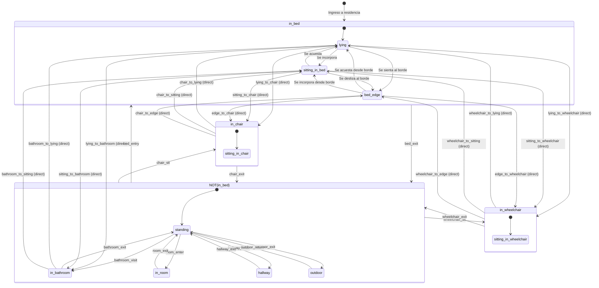

# Casos de uso: `ctx-auditoria`

## Frontera funcional

`ctx-auditoria` conserva los hechos de cambio del Registro. No decide si una
mutacion es valida y no posee las entidades que fueron modificadas.

Su valor de negocio es la trazabilidad: despues de una operacion relevante se
puede responder que paso, quien lo hizo, sobre que registro y cuando.

## Reglas del contexto

- Una entrada es append-only.
- `action`, `entity_type` y `entity_id` son obligatorios y no vacios.
- El reloj del servidor asigna `created_at`.
- Metadata debe ser JSON valido y no superar el limite del dominio.
- No hay foreign key hacia `users`; la historia sobrevive al retiro de un actor.
- Una mutacion auditable y su entrada confirman o revierten juntas.

## AUD-01 - Registrar mutacion relevante

**Objetivo:** dejar evidencia durable de una mutacion de negocio.

**Actor primario:** el caso de uso de `mana-app` que acaba de cambiar un
contexto.

**Disparador:** una mutacion valida esta lista para confirmarse.

**Precondiciones:** existe una transaccion abierta; la mutacion ya paso la
autorizacion y las invariantes de su contexto.

**Flujo principal:**

1. El application service construye una `AuditRecord` con actor, accion, tipo,
   ID y metadata.
2. Auditoria valida los campos y serializa la metadata.
3. Genera un ID de auditoria y un timestamp de servidor.
4. Inserta una fila append-only en `audit_log` usando la misma conexion.
5. Devuelve la entrada al application service.
6. La transaccion confirma negocio y auditoria juntas.

**Alternos y excepciones:**

- accion, entidad o metadata invalidas: la mutacion no puede confirmarse;
- metadata demasiado grande: error de validacion y rollback;
- error de SQLite: rollback de la mutacion y de la auditoria.

**Postcondiciones:** existe una evidencia consultable o no existe la mutacion.
No hay un estado valido donde solo una de las dos quede confirmada.

**Realizacion:** `AuditStore::record_in_transaction`, invocado por
`mana-app::create_user`, `update_user` y los comandos de residencia.

## AUD-02 - Consultar trazabilidad

**Objetivo:** investigar cambios del Registro sin modificar la historia.

**Actor primario:** auditor o actor con `audit.read`.

**Disparador:** `GET /api/v1/audit-log`.

**Precondiciones:** bearer valido y capability `audit.read`.

**Flujo principal:**

1. Se autentica el actor.
2. Se valida y acota `limit`.
3. Se aplican filtros opcionales por tipo, ID y accion.
4. Se ordenan las entradas de la mas reciente a la mas antigua.
5. La aplicacion resuelve `actor_name` como enriquecimiento de lectura.
6. Se devuelve `{ audit }`.

**Alternos y excepciones:**

- actor sin capability: `FORBIDDEN`;
- filtros invalidos o limite fuera de rango: se usa el limite por defecto o se
  acota al maximo definido por el dominio;
- actor retirado: la entrada permanece; el nombre puede no resolverse.

**Postcondiciones:** `audit_log` queda exactamente igual que antes de la
consulta.

**Realizacion:** `mana-app::list_audit` -> `AuditStore::list` ->
`GET /api/v1/audit-log`.

## Mutaciones que hoy dejan evidencia

- `user.created` y `user.updated`;
- `facility.created` y `facility.updated`;
- `wing.created` y `wing.updated`;
- `room.created` y `room.updated`;
- `bed.created` y `bed.updated`.

## Lo que no es auditoria

- No es autenticacion.
- No es autorizacion.
- No es historial de estados clinicos.
- No es un bus de eventos.
- No reemplaza una tabla de negocio consultable.
# Casos de uso: `ctx-cobertura`

## Frontera funcional

`ctx-cobertura` es propietario de la grilla laboral, grupos de staff, membresias
temporales y cobertura de alas. Nunca importa `ctx-identidad`, `ctx-residencia`
ni `ctx-poblacion`; los IDs de usuario, facility y ala son opacos y la
validacion de existencia vive en `mana-app`.

## Reglas del contexto

- Un turno laboral no es el eje `day`/`night` de la politica de alarmas.
- Los keys de turno son unicos por facility, no un enum global.
- Dos turnos no pueden empezar en el mismo minuto local.
- Un ala tiene a lo sumo una cobertura por turno en un instante.
- Un grupo pertenece a la misma facility que el ala que cubre.
- Una membresia es temporal; un usuario puede pertenecer a multiples grupos.
- Reemplazar la grilla cierra coberturas que usaban turnos removidos.
- Las queries historicas usan `valid_from <= at < valid_to`.

## COB-01 - Reemplazar grilla de turnos

**Objetivo:** Definir los turnos laborales de una facility.

**Actor primario:** Staff con capability `master.structure.write`.

**Disparador:** HTTP PUT `/api/v1/facilities/{facilityId}/shifts`.

**Precondiciones:** Sesion autenticada; facility existe.

**Flujo principal:**

1. El staff envia `{ shifts: [{ key, label, start_minute }] }`.
2. El sistema reemplaza la grilla: retira los turnos existentes, crea los nuevos.
3. Si un turno removido tenia coberturas abiertas, las cierra.
4. Devuelve `200 OK` con `{ facility_id, shifts, coverages_cleared }`.

**Alternos y excepciones:**

- `shifts` vacio -> 422 VALIDATION_ERROR
- key duplicado -> 409 CONFLICT
- start_minute duplicado -> 409 CONFLICT
- start_minute fuera de rango (0..1439) -> 422

**Postcondiciones:** La grilla refleja los turnos nuevos; coberturas de turnos
removidos quedan cerradas con `valid_to`.

**Realizacion:** `mana-app::AppState::replace_shift_grid` -> `CoverageStore::replace_grid`

## COB-02 - Crear grupo de staff

**Objetivo:** Crear un grupo nombrado asociado a una facility.

**Disparador:** HTTP POST `/api/v1/staff-groups`.

**Flujo principal:**

1. El staff envia `{ facility_id, name }`.
2. El sistema crea el grupo.
3. Devuelve `201 CREATED` con el `StaffGroup`.

**Alternos y excepciones:**

- `name` vacio -> 422
- Nombre duplicado en la misma facility (grupo activo) -> 409

## COB-03 - Agregar miembros a un grupo

**Objetivo:** Asignar usuarios a un grupo de staff.

**Disparador:** HTTP PUT `/api/v1/staff-groups/{groupId}/members`.

**Flujo principal:**

1. El staff envia `{ members: [{ user_id, valid_from? }] }`.
2. El sistema cierra las membresias activas existentes y crea las nuevas.
3. Devuelve `200 OK` con las membresias actuales.

**Alternos y excepciones:**

- Grupo no encontrado -> 404
- `valid_from` ausente -> usa `now`

**Postcondiciones:** El grupo tiene exactamente los miembros enviados como
activos; las membresias anteriores quedan cerradas (historial preservado).

## COB-04 - Asignar cobertura a un ala

**Objetivo:** Asignar un grupo a un turno de un ala.

**Disparador:** HTTP PUT `/api/v1/wings/{wingId}/coverage`.

**Flujo principal:**

1. El staff envia `{ staff_group_id, shift_key }`.
2. El sistema cierra cualquier cobertura abierta para ese turno en ese ala.
3. Crea la nueva cobertura.
4. Devuelve `200 OK` con la `WingCoverage`.

**Alternos y excepciones:**

- `shift_key` no existe en la grilla de la facility -> 422
- El grupo pertenece a otra facility -> 422

**Postcondiciones:** El ala tiene una cobertura abierta para ese turno.

## COB-05 - Reemplazar grilla remueve coberturas

**Objetivo:** Verificar que reemplazar la grilla cierra coberturas afectadas.

**Disparador:** COB-01 con turnos removidos.

**Postcondiciones:** `coverages_cleared` indica cuantas coberturas quedaron
cerradas. Las coberturas de turnos que permanecen no se alteran.
# Casos de uso: `ctx-cuidado`

## Frontera funcional

`ctx-cuidado` es propietario de las rondas operativas, tareas de ronda y notas
de cuidado. Nunca importa `ctx-residencia`, `ctx-poblacion` ni
`ctx-observacion`; los IDs de ala, residente y cama son opacos y la validacion
de existencia vive en `mana-app`.

## Reglas del contexto

- Hay como maximo una ronda `in_progress` por ala.
- No se puede crear una ronda sin al menos un residente asignado.
- Una ronda no puede completarse mientras haya una tarea pendiente.
- Una ronda completada no puede recibir tareas nuevas ni reabrirse.
- Completar una tarea graba actor y timestamp.
- Volver una tarea a pending limpia actor y timestamp.
- Una nota requiere cuerpo no vacio, autor y residente.
- La duracion de una nota es nullable; ausente no significa cero.

## CUI-01 - Crear ronda

**Objetivo:** Iniciar una ronda de visita a un ala.

**Actor primario:** Staff con capability `rounds.manage`.

**Disparador:** HTTP POST `/api/v1/rounds`.

**Precondiciones:** Sesion autenticada; ala existe; hay residentes asignados a
camas del ala.

**Flujo principal:**

1. El staff envia `{ wing_id }`.
2. El sistema snapshot de asignaciones actuales como tareas pendientes.
3. Crea la ronda con `status = in_progress`.
4. Devuelve `201 CREATED` con el `Round`.

**Alternos y excepciones:**

- Ya existe una ronda `in_progress` para este ala -> 409 CONFLICT
- No hay residentes asignados a camas del ala -> 422 VALIDATION_ERROR

**Postcondiciones:** La ronda existe con tareas pendientes para cada residente
asignado a una cama del ala.

**Realizacion:** `mana-app::AppState::create_round` -> `CareStore::create_round`

## CUI-02 - Completar ronda con tareas pendientes

**Objetivo:** Verificar que no se puede completar una ronda con tareas
pendientes.

**Disparador:** HTTP PATCH `/api/v1/rounds/{roundId}` con `{ status: "completed" }`.

**Resultado esperado:** 409 CONFLICT con mensaje "No se puede completar una
ronda con tareas pendientes".

## CUI-03 - Completar tareas y ronda

**Objetivo:** Completar todas las tareas de una ronda y luego la ronda.

**Disparador:** HTTP PATCH `/api/v1/round-tasks/{taskId}` y luego PATCH
`/api/v1/rounds/{roundId}`.

**Flujo principal:**

1. El staff completa cada tarea con `{ status: "completed", note? }`.
2. El sistema graba actor y timestamp en cada tarea.
3. Cuando no quedan tareas pendientes, el staff completa la ronda.
4. El sistema cambia el status a `completed` y graba `completed_at/by`.

**Alternos y excepciones:**

- Tarea en ronda completada -> 409
- Ronda con tareas pendientes -> 409

## CUI-04 - Rechazar edicion de ronda completada

**Objetivo:** Verificar que una ronda completada no puede recibir cambios.

**Disparador:** PATCH sobre una ronda ya completada.

**Resultado esperado:** 409 CONFLICT.

## CUI-05 - Crear nota de cuidado

**Objetivo:** Registrar una nota de continuidad para un residente.

**Disparador:** HTTP POST `/api/v1/residents/{residentId}/notes`.

**Flujo principal:**

1. El staff envia `{ body, kind?, duration_min? }`.
2. El sistema crea la nota con el autor de la sesion.
3. Devuelve `201 CREATED` con la `CareNote`.

**Alternos y excepciones:**

- `body` vacio -> 422 VALIDATION_ERROR
- `kind` ausente -> default "general"
- `duration_min` ausente -> null (no es cero)

**Postcondiciones:** La nota existe como append-only.

## CUI-06 - Listar notas de un residente

**Objetivo:** Consultar el historial de notas de cuidado de un residente.

**Disparador:** HTTP GET `/api/v1/residents/{residentId}/notes?limit={n}`.

**Postcondiciones:** Devuelve las notas ordenadas por fecha descendente.
# Casos de uso: `ctx-historia`

## Frontera funcional

`ctx-historia` es propietario de las detecciones de incidentes clinicos y las
revisiones humanas sobre ellas. Nunca importa otros `ctx-*`; los IDs de
residente, cama y usuario son opacos y la validacion de existencia vive en
`mana-app`.

## Reglas del contexto

- Un `source_record_id` duplicado devuelve la deteccion existente (idempotencia).
- La ingesta crea una deteccion, pero no inserta una revision.
- La ingesta no puede cerrar un incidente ni fijar un veredicto.
- Una revision siempre tiene actor y timestamp del servidor.
- Las revisiones nunca se pisan; el estado actual es la ultima revision valida.
- `safe_to_ground` no es un veredicto de caida aunque el residente haya tocado
  el floor.
- El vocabulario de deteccion y el de revision son distintos de los IDs de
  reglas de alerta.
- La secuencia y las metricas de respuesta derivadas vienen de read models de
  Observacion y Cuidado, no se copian en la deteccion.

## HIS-01 - Ingestar deteccion de incidente

**Objetivo:** Registrar evidencia clinica inmutable de forma idempotente.

**Actor primario:** Fuente interna (IA, sensor, operador) con `x-clinical-secret`.

**Disparador:** HTTP POST `/internal/v1/clinical/incidents`.

**Precondiciones:** Secret clinico valido.

**Flujo principal:**

1. El cliente envia `source_record_id`, `resident_id`, `kind`, `severity`,
   `occurred_at`, `injury_status`, `source`, `model_version`.
2. El contexto busca si ya existe una deteccion con ese `source_record_id`.
3. Si no existe, crea la deteccion y devuelve 201 con `duplicate: false`.
4. Si ya existe, devuelve 200 con `duplicate: true` y la deteccion existente.

**Postcondiciones:** La deteccion es inmutable; no se puede modificar.

**Excepciones:**

- Secret invalido: 403.
- Campos requeridos faltantes: 422.

## HIS-02 - Listar incidentes de un residente

**Objetivo:** Consultar todos los incidentes detectados de un residente.

**Actor primario:** Staff autenticado con capability `incidents.read`.

**Disparador:** HTTP GET `/api/v1/residents/{residentId}/incidents`.

**Precondiciones:** Sesion autenticada.

**Flujo principal:**

1. El contexto lista detecciones del residente ordenadas por `occurred_at`
   descendente.
2. Para cada deteccion, compone el read model con las revisiones y el estado
   actual.
3. Devuelve la lista de incidentes compuestos.

## HIS-03 - Revisar un incidente

**Objetivo:** Registrar una decision humana sobre un incidente detectado.

**Actor primario:** Staff autenticado con capability `incidents.manage`.

**Disparador:** HTTP POST `/api/v1/incidents/{incidentId}/reviews`.

**Precondiciones:** Sesion autenticada; incidente existe.

**Flujo principal:**

1. El cliente envia `status` (open, under_review, closed), opcionalmente
   `detection_verdict`, `review_note` y `resolved_at`.
2. El contexto crea una nueva revision append-only con actor y timestamp.
3. Devuelve el incidente compuesto con todas las revisiones.

**Postcondiciones:** La revision queda registrada; el historial es inmutable.

**Excepciones:**

- Status invalido: 422.
- Veredicto invalido: 422.
- Incidente no existe: 404.

## HIS-04 - Obtener secuencia de un incidente

**Objetivo:** Consultar el historial completo de revisiones de un incidente.

**Actor primario:** Staff autenticado con capability `incidents.read`.

**Disparador:** HTTP GET `/api/v1/incidents/{incidentId}/sequence`.

**Precondiciones:** Sesion autenticada; incidente existe.

**Flujo principal:**

1. El contexto busca la deteccion por ID.
2. Lista todas las revisiones ordenadas por fecha.
3. Devuelve el incidente compuesto con su historial.

## HIS-05 - Ingestar multiples incidentes

**Objetivo:** Verificar que multiples incidentes se registran correctamente y
se pueden listar.

**Actor primario:** Fuente interna + staff autenticado.

**Disparador:** Secuencia de POST y GET.

**Flujo principal:**

1. Ingestar primer incidente (sr-001) con kind=fall.
2. Ingestar segundo incidente (sr-002) con kind=bed_exit.
3. Listar incidentes del residente: debe retornar 2.
4. Cada incidente tiene su propio historial de revisiones independiente.
# Casos de uso: `ctx-identidad`

## Frontera funcional

`ctx-identidad` decide quien puede iniciar una sesion en el Registro y que actor
autenticado se entrega a la aplicacion. Posee usuarios, credenciales y sesiones.

No decide si una persona puede modificar una room, una cama o una alerta. Esas
decisiones usan capabilities en `mana-app`.

## Reglas del contexto

- El username es unico despues de trim y lowercase.
- Un usuario retirado no puede autenticarse.
- Un token vencido no autentica.
- Solo se persiste el hash del bearer, nunca el token claro.
- El password se persiste como hash Argon2id.
- `role` es perfil de acceso; `job_title` es informacion descriptiva.
- Las capabilities se derivan del role y de las capabilities activas del
  proceso; el cliente no las envia.
- Retirar un usuario no borra su historia de auditoria.

## IAM-01 - Iniciar sesion

**Objetivo:** obtener una sesion bearer para operar el Registro.

**Actor primario:** usuario no autenticado.

**Disparador:** el actor envia username y password.

**Precondiciones:** el servicio esta iniciado y el contexto tiene migraciones
aplicadas.

**Flujo principal:**

1. El sistema normaliza el username.
2. Busca el usuario por username normalizado.
3. Comprueba que el usuario esta activo.
4. Verifica el password contra el hash Argon2id.
5. Genera un token bearer y calcula su hash SHA-256.
6. Persiste la sesion con expiracion y devuelve el token claro una sola vez.
7. Deriva el usuario publico y sus capabilities efectivas.

**Alternos y excepciones:**

- username inexistente, password incorrecto o usuario retirado: mismo resultado
  funcional `INVALID_CREDENTIALS`; no se crea sesion.
- body incompleto: `VALIDATION_ERROR`.
- demasiados intentos invalidos del mismo cliente: `RATE_LIMITED`. El contador es
  responsabilidad del adapter HTTP, no del dominio de identidad.

**Postcondiciones:** existe como maximo una nueva fila de sesion para el intento
exitoso; el cliente posee un bearer que puede presentar a los siguientes casos.

**Realizacion:** `mana-app::login` -> `IdentityStore::login` ->
`POST /api/v1/auth/login`.

## IAM-02 - Resolver actor autenticado

**Objetivo:** convertir un bearer en un actor activo con capabilities para un
caso protegido.

**Actor primario:** un caso de uso protegido en `mana-app`.

**Disparador:** llega un bearer en `Authorization`.

**Precondiciones:** el token no esta vacio.

**Flujo principal:**

1. Se hashea el token recibido.
2. Se busca la sesion por su hash.
3. Se verifica que la expiracion sea futura.
4. Se carga el usuario y se verifica que siga activo.
5. Se actualiza `last_seen_at` como maximo una vez por minuto.
6. Se devuelve `AuthenticatedActor` con ID, role, features y capabilities.

**Alternos y excepciones:** cualquier ausencia, vencimiento o retiro produce
`UNAUTHENTICATED`. No se revela si fallo el token o el usuario.

**Postcondiciones:** ningun estado de negocio cambia; el caso llamador puede
aplicar su capability.

**Realizacion:**
`authenticated_actor_in_transaction`/`IdentityStore::authenticate_in_transaction`.
Tambien se expone mediante `GET /api/v1/auth/me`.

## IAM-03 - Cerrar sesion

**Objetivo:** impedir que un bearer deje de ser utilizable antes de su expiracion.

**Actor primario:** actor autenticado.

**Disparador:** el actor solicita logout.

**Precondiciones:** el bearer resuelve un actor activo.

**Flujo principal:**

1. Se resuelve el actor con IAM-02.
2. Se elimina la sesion por hash de token.
3. Se responde sin contenido.

**Alternos:** repetir el borrado de la misma sesion no produce una mutacion de
negocio adicional; el borde HTTP conserva la operacion como `204` mientras el
token sea autenticable al comenzar.

**Postcondiciones:** el token ya no resuelve una sesion valida.

**Realizacion:** `mana-app::logout` -> `IdentityStore::logout` ->
`POST /api/v1/auth/logout`.

## IAM-04 - Crear cuenta de acceso

**Objetivo:** habilitar a una nueva persona para entrar al Registro.

**Actor primario:** operador con `master.structure.write`.

**Disparador:** el operador envia username, nombre, role, password y job title
opcional.

**Precondiciones:** actor autenticado y capability de escritura.

**Flujo principal:**

1. Se resuelve el actor y se verifica la capability.
2. Se valida role, password y valores de texto.
3. Se normaliza el username.
4. Se genera un `UserId`.
5. Se guarda el usuario con password hasheado y estado activo.
6. Se registra `user.created` en la misma transaccion.
7. Se devuelve la vista administrativa sin password ni token.

**Alternos y excepciones:**

- username ya usado: `CONFLICT` y no se registra auditoria.
- password menor a seis caracteres, role invalido o texto invalido:
  `VALIDATION_ERROR`.
- falta de capability: `FORBIDDEN`.
- fallo de auditoria: rollback de usuario y auditoria.

**Postcondiciones:** el nuevo usuario puede iniciar sesion y el hecho de alta es
consultable.

**Realizacion:** `mana-app::create_user` ->
`IdentityStore::create_user_in_transaction` + `AuditStore::record_in_transaction`
-> `POST /api/v1/users`.

## IAM-05 - Mantener cuenta de acceso

**Objetivo:** corregir datos de una cuenta, cambiar su acceso o retirarla sin
borrar la historia.

**Actor primario:** operador con `master.structure.write`.

**Disparador:** `PATCH /api/v1/users/{userId}`.

**Precondiciones:** actor autorizado, usuario destino existente y al menos un
campo de cambio.

**Flujo principal:**

1. Se resuelve el actor y se verifica la capability.
2. Se carga el usuario destino.
3. Se validan solo los campos presentes.
4. Se actualizan nombre, role, job title, password o estado.
5. `active = false` escribe `retired_at` y `retired_by`.
6. `active = true` limpia el retiro y reactiva el usuario.
7. Se registra `user.updated` con los campos modificados.

**Alternos y excepciones:**

- usuario inexistente: `NOT_FOUND`.
- PATCH vacio: `VALIDATION_ERROR`.
- password o role invalido: `VALIDATION_ERROR`.
- fallo de auditoria: rollback completo.

**Postcondiciones:** el usuario refleja el cambio; si quedo retirado, no puede
crear nuevas sesiones; la auditoria conserva quien y que cambio.

**Realizacion:** `mana-app::update_user` ->
`IdentityStore::update_user_in_transaction` + auditoria.

## IAM-06 - Consultar cuentas

**Objetivo:** permitir que un operador conozca las cuentas administrables.

**Actor primario:** operador con `master.structure.read`.

**Disparador:** `GET /api/v1/users`.

**Flujo principal:**

1. Se resuelve el actor y se verifica la capability.
2. Por defecto se consultan usuarios activos.
3. Con `include_inactive=1` se agregan usuarios retirados.
4. Se ordena por nombre visible y username.

**Postcondiciones:** no cambia usuarios, sesiones ni auditoria.

**Realizacion:** `mana-app::list_users` -> `IdentityStore::list_users`.

## Lo que todavia no es un caso activo

- scopes por facility o wing;
- delegacion temporal de capabilities;
- recuperacion de password;
- limpieza operativa de sesiones vencidas como job separado.
# Casos de uso: `ctx-poblacion`

## Frontera funcional

`ctx-poblacion` es propietario del padron de residentes, su ciclo de vida de
admision/egreso, las asignaciones residente-cama y los atributos con
provenance. Nunca importa `ctx-residencia` ni `ctx-observacion`; las
coordenadas de cama son opacas (`BedRef`) y la validacion de existencia vive en
`mana-app`.

## Reglas del contexto

- Un residente tiene exactamente un estado: `active` o `discharged`.
- El egreso es una accion de negocio separada de la liberacion de camas.
- Una cama puede tener a lo sumo una asignacion abierta a la vez.
- Un residente puede tener a lo sumo una asignacion abierta a la vez.
- Asignar una nueva cama cierra la asignacion abierta anterior (mudanza).
- Liberar una cama sin asignacion abierta es un `409 CONFLICT` deliberado.
- La fecha de egreso no puede preceder a la fecha de ingreso.
- Un residente egresado no puede recibir nuevas asignaciones.
- Los atributos requieren `source` y `recorded_at` (provenance obligatorio).
- Las fechas de calendario son `NaiveDate` (YYYY-MM-DD); los timestamps son
  `Instante` (RFC3339 millis).

## POP-01 - Alta de residente

**Objetivo:** Registrar un nuevo residente en el padron.

**Actor primario:** Staff con capability `master.structure.write`.

**Disparador:** HTTP POST `/api/v1/residents`.

**Precondiciones:** Sesion autenticada.

**Flujo principal:**

1. El staff envia `{ full_name, external_id?, birth_date?, admission_date? }`.
2. El sistema crea el residente con `status = active`.
3. Devuelve `201 CREATED` con el `ResidentRecord`.

**Alternos y excepciones:**

- `full_name` vacio o ausente -> 422 VALIDATION_ERROR
- `birth_date` o `admission_date` con formato invalido -> 422
- Token invalido -> 401
- Capability insuficiente -> 403

**Postcondiciones:** El residente existe en el padron con `status = active`.

**Realizacion:** `mana-app::AppState::create_resident` -> `PopulationStore::create_resident_in_transaction` -> `POST /api/v1/residents`

## POP-02 - Actualizar residente

**Objetivo:** Modificar datos de un residente existente.

**Actor primario:** Staff con capability `master.structure.write`.

**Disparador:** HTTP PATCH `/api/v1/residents/{residentId}`.

**Precondiciones:** El residente existe.

**Flujo principal:**

1. El staff envia los campos a actualizar (parciales).
2. El sistema valida y aplica los cambios.
3. Devuelve `200 OK` con el `ResidentRecord` actualizado.

**Alternos y excepciones:**

- Residente inexistente -> 404
- Ningun campo proporcionado -> 422 EMPTY_UPDATE
- Campos vacios o con formato invalido -> 422

**Postcondiciones:** Los campos indicados del residente estan actualizados.

**Realizacion:** `mana-app::AppState::update_resident` -> `PopulationStore::update_resident_in_transaction` -> `PATCH /api/v1/residents/{residentId}`

## POP-03 - Listar residentes

**Objetivo:** Consultar el padron con filtro opcional por nombre.

**Actor primario:** Staff con capability `master.structure.read`.

**Disparador:** HTTP GET `/api/v1/residents?q=...`.

**Precondiciones:** Sesion autenticada.

**Flujo principal:**

1. El staff consulta el padron (con o sin filtro `q`).
2. El sistema compone el read model: residentes + asignaciones abiertas +
   camas de Residencia (para mostrar habitacion y ala).
3. Devuelve `200 OK` con `{ residents: [...] }`.

**Alternos y excepciones:**

- Sin residentes -> lista vacia (no es error)
- Token invalido -> 401

**Postcondiciones:** No modifica estado.

**Realizacion:** `mana-app::AppState::list_residents` -> `PopulationStore::list_residents` + `list_open_assignments` + `ResidenceStore::list_beds_all` -> `GET /api/v1/residents`

## POP-04 - Detalle de residente

**Objetivo:** Obtener el registro completo de un residente.

**Actor primario:** Staff con capability `master.structure.read`.

**Disparador:** HTTP GET `/api/v1/residents/{residentId}`.

**Precondiciones:** El residente existe.

**Flujo principal:**

1. El staff consulta un residente por ID.
2. Devuelve `200 OK` con el `ResidentRecord` (sin read model de habitacion).

**Alternos y excepciones:**

- Residente inexistente -> 404

**Postcondiciones:** No modifica estado.

**Realizacion:** `mana-app::AppState::resident_detail` -> `PopulationStore::get_resident` -> `GET /api/v1/residents/{residentId}`

## POP-05 - Asignar cama

**Objetivo:** Vincular un residente a una cama, cerrando asignaciones previas
de ambos lados.

**Actor primario:** Staff con capability `master.structure.write`.

**Disparador:** HTTP POST `/api/v1/residents/{residentId}/assignments`.

**Precondiciones:** El residente existe y esta activo; la cama existe y esta
activa.

**Flujo principal:**

1. El staff envia `{ bed_id }`.
2. El sistema valida que el residente esta activo (Poblacion).
3. El sistema valida que la cama existe y esta activa (Residencia,
   `ensure_bed_active_in_transaction`).
4. En una sola transaccion:
   - Cierra la asignacion abierta del residente (si tiene).
   - Cierra la asignacion abierta de la cama (si tiene).
   - Crea la nueva asignacion.
5. Registra entradas de auditoria para las asignaciones cerradas y la nueva.
6. Devuelve `201 CREATED` con el `BedAssignmentRecord`.

**Alternos y excepciones:**

- Residente inexistente -> 404
- Residente egresado -> 409 (la asignacion se rechaza porque no esta activo;
  en realidad la validacion es en `assign_in_transaction` que verifica
  `ensure_resident_active`)
- Cama inexistente o inactiva -> 404
- Solapamiento de intervalos -> 422

**Postcondiciones:** El residente tiene una asignacion abierta a la cama
indicada; las asignaciones previas de ambos lados estan cerradas.

**Realizacion:** `mana-app::AppState::assign_bed` -> `PopulationStore::assign_in_transaction` + `ResidenceStore::ensure_bed_active_in_transaction` -> `POST /api/v1/residents/{residentId}/assignments`

## POP-06 - Listar asignaciones

**Objetivo:** Consultar el historial de asignaciones de un residente.

**Actor primario:** Staff con capability `master.structure.read`.

**Disparador:** HTTP GET `/api/v1/residents/{residentId}/assignments`.

**Precondiciones:** El residente existe.

**Flujo principal:**

1. El staff consulta las asignaciones de un residente.
2. Devuelve `200 OK` con `{ assignments: [...] }` ordenado por `starts_at` asc.

**Alternos y excepciones:**

- Residente inexistente -> 404
- Sin asignaciones -> lista vacia

**Postcondiciones:** No modifica estado.

**Realizacion:** `mana-app::AppState::list_assignments` -> `PopulationStore::list_assignments` -> `GET /api/v1/residents/{residentId}/assignments`

## POP-07 - Liberar cama

**Objetivo:** Cerrar la asignacion abierta de una cama.

**Actor primario:** Staff con capability `master.structure.write`.

**Disparador:** HTTP DELETE `/api/v1/beds/{bedId}/assignment`.

**Precondiciones:** La cama existe.

**Flujo principal:**

1. El staff indica la cama a liberar.
2. El sistema cierra la asignacion abierta de esa cama.
3. Registra entrada de auditoria.
4. Devuelve `200 OK` con el `BedAssignmentRecord` cerrado.

**Alternos y excepciones:**

- Cama sin asignacion abierta (ya libre) -> 409 CONFLICT (deliberado)
- Cama inexistente -> 404

**Postcondiciones:** La cama no tiene asignacion abierta.

**Realizacion:** `mana-app::AppState::release_bed` -> `PopulationStore::release_in_transaction` -> `DELETE /api/v1/beds/{bedId}/assignment`

## POP-08 - Egresar residente

**Objetivo:** Dar de alta al residente cerrando su asignacion abierta.

**Actor primario:** Staff con capability `master.structure.write`.

**Disparador:** HTTP POST `/api/v1/residents/{residentId}/discharge`.

**Precondiciones:** El residente existe y esta activo.

**Flujo principal:**

1. El staff envia `{ discharged_at? }` (si se omite, usa la fecha actual).
2. En una sola transaccion:
   - Cambia el estado del residente a `discharged`.
   - Cierra la asignacion abierta del residente (si tiene).
3. Registra entradas de auditoria para el egreso y la asignacion cerrada.
4. Devuelve `200 OK` con el `ResidentRecord`.

**Alternos y excepciones:**

- Residente inexistente -> 404
- Residente ya egresado -> 409
- Fecha de egreso anterior a la de ingreso -> 422

**Postcondiciones:** El residente tiene `status = discharged`,
`discharged_at` y `discharged_by` set; su asignacion abierta (si tenia) esta
cerrada.

**Realizacion:** `mana-app::AppState::discharge_resident` -> `PopulationStore::discharge_in_transaction` -> `POST /api/v1/residents/{residentId}/discharge`

## Fuera del corte actual

- Rutas HTTP para atributos (solo dominio y tests en F3).
- Proyecciones de Observacion (hook documentado, audit entry como registro).
- Busqueda full-text avanzada (solo filtro `q` por nombre).
- Paginacion de resultados.
# Casos de uso: `ctx-politica`

## Frontera funcional

`ctx-politica` es propietario de la politica de alarmas del residente, las
versiones temporales de perfiles, plantillas, overrides y catalogo de reglas.
El catalogo es dato de politica, no codigo Rust. Nunca importa otros `ctx-*`;
los IDs de residente son opacos y la validacion de existencia vive en
`mana-app`.

## Reglas del contexto

- Un perfil esta ligado a `ResidentId`, nunca a `BedId`.
- Como maximo una version es valida para un residente en un instante.
- Un dia sin observacion no es un dia con observacion cero.
- Una regla `fall` bloqueada no puede desactivarse por preset, plantilla u override.
- Un override debe referir a una regla de catalogo y un parametro declarado.
- Parametros enum, multivalor y numericos se validan contra el catalogo.
- `day` y `night` son momentos fisiologicos del residente, no turnos laborales.
- Aplicar un perfil nuevo conserva la version anterior y su version efectiva de
  catalog version.
- Una recomendacion puede aplicarse como una version nueva, pero nunca se guarda
  como si fuera observacion cruda.

## POL-01 - Obtener catalogo de alarmas

**Objetivo:** Consultar el catalogo de reglas, grupos, presets y plantillas
disponibles.

**Actor primario:** Cualquier cliente (sin autenticacion).

**Disparador:** HTTP GET `/api/v1/alarm-presets/catalog`.

**Flujo principal:**

1. El contexto lee el catalogo TOML cargado al arrancar.
2. Devuelve la version, grupos, reglas, presets y plantillas.

**Postcondiciones:** El catalogo es read-only y no se modifica.

## POL-02 - Buscar presets

**Objetivo:** Buscar reglas y presets por texto libre.

**Actor primario:** Staff autenticado.

**Disparador:** HTTP GET `/api/v1/alarm-presets?q={query}`.

**Precondiciones:** Sesion autenticada.

**Flujo principal:**

1. El cliente envia una query de busqueda.
2. El contexto filtra reglas por ID, descripcion o grupo.
3. Devuelve el catalogo filtrado.

## POL-03 - Obtener perfil actual

**Objetivo:** Consultar la version vigente de la politica de alarmas de un
residente.

**Actor primario:** Staff autenticado.

**Disparador:** HTTP GET `/api/v1/alarm-presets/:residentId`.

**Precondiciones:** Sesion autenticada.

**Flujo principal:**

1. El contexto busca la version con `valid_to IS NULL`.
2. Si existe, devuelve el perfil; si no, devuelve `null`.

## POL-04 - Actualizar perfil

**Objetivo:** Crear una nueva version de la politica de alarmas de un residente.

**Actor primario:** Staff autenticado.

**Disparador:** HTTP PATCH `/api/v1/alarm-presets/:residentId`.

**Precondiciones:** Sesion autenticada.

**Flujo principal:**

1. El cliente envia los campos a actualizar (mobility_aid, autopilot, mode,
   template_id, overrides_json, catalog_version).
2. El contexto cierra la version actual (si existe) seteando `valid_to`.
3. Crea una nueva version con `valid_to = NULL`.
4. Devuelve la nueva version.

**Postcondiciones:** La version anterior queda preservada con su `valid_to`.

## POL-05 - Historial de perfiles

**Objetivo:** Consultar todas las versiones de la politica de alarmas de un
residente.

**Actor primario:** Staff autenticado.

**Disparador:** HTTP GET `/api/v1/alarm-presets/:residentId/history`.

**Precondiciones:** Sesion autenticada.

**Flujo principal:**

1. El contexto lista todas las versiones ordenadas por `valid_from`.
2. Devuelve la lista completa con sus vigencias.

## POL-06 - Aplicar recomendacion individual

**Objetivo:** Aplicar una recomendacion de plantilla o overrides a un residente
especifico.

**Actor primario:** Staff autenticado.

**Disparador:** HTTP POST `/api/v1/alarm-presets/:residentId/apply-recommendation`.

**Precondiciones:** Sesion autenticada.

**Flujo principal:**

1. El cliente envia template_id, overrides_json y catalog_version opcionales.
2. El contexto cierra la version actual y crea una nueva con los parametros
   proporcionados.
3. Devuelve la nueva version.

## POL-07 - Aplicar recomendaciones bulk

**Objetivo:** Aplicar recomendaciones a multiples residentes en una sola
operacion.

**Actor primario:** Staff autenticado.

**Disparador:** HTTP POST `/api/v1/alarm-presets/apply-recommendations`.

**Precondiciones:** Sesion autenticada.

**Flujo principal:**

1. El cliente envia una lista de recomendaciones.
2. El contexto procesa cada una como POL-06.
3. Devuelve la lista de perfiles actualizados.

## POL-08 - Autopilot

**Objetivo:** Renovar perfiles de residentes que tienen autopilot activado.

**Actor primario:** Staff autenticado.

**Disparador:** HTTP POST `/api/v1/alarm-presets/autopilot`.

**Precondiciones:** Sesion autenticada.

**Flujo principal:**

1. El contexto busca residentes activos con `autopilot = true`.
2. `mana-app` hidrata las senales y calcula la recomendacion del dia.
3. `mana-motores::decidir` aplica solo una subida con evidencia suficiente y
   fuera del cooldown.
4. Una bajada queda como propuesta y una ventana sin evidencia se salta; ninguna
   de las dos crea una version automaticamente.
5. Devuelve la lista de perfiles aplicados.
# Casos de uso: `ctx-residencia`

## Frontera funcional

`ctx-residencia` define el lugar fisico donde ocurre la operacion:

```text
Facility -> Wing -> Room -> Bed
```

Es dueno de nombres, jerarquia, dispositivos vinculados, estado de retiro
tecnico, planograma de alas y regiones de privacidad de habitaciones. No decide
quien ocupa una cama, quien trabaja en un ala ni que alarma corresponde a una
persona.

## Reglas del contexto

- No se crea un hijo bajo un padre inexistente o retirado.
- Una room number es unica dentro de una wing activa.
- Un `StreamKey` pertenece como maximo a una room activa.
- Un `MonitorKey` pertenece como maximo a una bed activa.
- `StreamKey` y `MonitorKey` son conceptos distintos aunque lleguen como texto.
- Campos de texto se recortan y tienen limites de longitud.
- `sort_order` de una wing no puede ser negativo.
- Retirar un padre lo excluye de lecturas activas y oculta sus hijos.
- El retiro explicito de estructura aun no esta expuesto como comando.
- El planograma de un ala tiene una version activa: guardar desactiva la
  anterior e inserta la nueva.
- Una habitacion no puede repetirse en el planograma activo de su ala.
- Las coordenadas del planograma son finitas y su `sort_order` no negativo.
- Las regiones de privacidad estan normalizadas dentro de `0..1`, son a lo
  sumo 8 y su guardado tambien reemplaza la version activa.

## RES-01 - Definir una residencia

**Objetivo:** registrar o corregir una residencia operable.

**Actor primario:** operador con `master.structure.write`.

**Disparador:** alta o cambio de una facility.

**Precondiciones:** actor autenticado y autorizado; para modificar, facility
existente.

**Flujo principal:**

1. Se valida nombre y zona horaria.
2. En alta se genera `FacilityId` y se crea como activa.
3. En cambio se carga la facility y se aplican solo los campos enviados.
4. Se persiste la facility.
5. Se registra `facility.created` o `facility.updated`.

**Alternos y excepciones:**

- nombre o timezone vacio o demasiado largo: `VALIDATION_ERROR`;
- facility inexistente al actualizar: `NOT_FOUND`;
- fallo de auditoria: rollback de la facility.

**Postcondiciones:** la facility puede ser padre de wings; una lectura activa la
puede devolver.

**Realizacion:** `mana-app::create_facility` / `update_facility` sobre
`ResidenceStore`; handlers `facilities.create.post` y `facilities.update.patch`
sirviendo desde Rust; SDK `create_facility` / `update_facility`.

## RES-02 - Organizar una wing

**Objetivo:** dividir una residencia en unidades operativas ordenables.

**Actor primario:** operador con `master.structure.write`.

**Disparador:** alta o cambio de una wing.

**Precondiciones:** la facility padre existe y esta activa.

**Flujo principal:**

1. Se valida nombre, piso y `sort_order`.
2. En alta se genera `WingId` y se vincula a la facility.
3. En cambio se carga la wing y se aplican los campos presentes.
4. Se persiste el resultado.
5. Se registra `wing.created` o `wing.updated`.

**Alternos y excepciones:**

- facility inexistente o retirada: `NOT_FOUND`;
- texto invalido o sort negativo: `VALIDATION_ERROR`;
- fallo de auditoria: rollback.

**Postcondiciones:** la wing aparece en las lecturas activas de su facility y
puede recibir rooms.

**Realizacion:** `mana-app::create_wing` / `update_wing`; handlers
`facilities.wings.create.post` y `wings.update.patch` sirviendo desde Rust; SDK
`create_wing` / `update_wing`.

## RES-03 - Definir una habitacion y su camara

**Objetivo:** registrar el espacio donde posteriormente pueden existir camas y,
opcionalmente, vincular su stream de camara.

**Actor primario:** operador con `master.structure.write`.

**Disparador:** alta o cambio de una room.

**Precondiciones:** la wing padre existe y esta activa.

**Flujo principal:**

1. Se valida numero, tipo y `stream_key` opcional.
2. En alta se genera `RoomId`; si no llega tipo, aplicacion usa `single`.
3. Se comprueba que el numero no este usado en la wing activa.
4. Se comprueba que el stream no este vinculado a otra room activa.
5. Se persiste la room.
6. Se registra `room.created` o `room.updated`.

**Alternos y excepciones:**

- wing inexistente o retirada: `NOT_FOUND`;
- numero o stream duplicado: `CONFLICT`;
- enviar `stream_key: null` elimina la vinculacion de camara de forma explicita;
- room type, numero o stream invalidos: `VALIDATION_ERROR`;
- fallo de auditoria: rollback.

**Postcondiciones:** la room es identificable dentro de su wing y su stream no
puede quedar asignado a dos rooms activas.

**Realizacion:** `mana-app::create_room` / `update_room`; handlers
`wings.rooms.create.post` y `rooms.update.patch` sirviendo desde Rust; SDK
`create_room` / `update_room`.

## RES-04 - Definir una cama y su monitor

**Objetivo:** registrar una cama fisica y, opcionalmente, asociar el detector que
la observa.

**Actor primario:** operador con `master.structure.write`.

**Disparador:** alta o cambio de una bed.

**Precondiciones:** la room padre existe y esta activa.

**Flujo principal:**

1. Se valida label y `monitor_key` opcional.
2. En alta se genera `BedId` y se vincula a la room.
3. Se comprueba que el monitor no este usado por otra bed activa.
4. Se persiste la bed.
5. Se registra `bed.created` o `bed.updated`.

**Alternos y excepciones:**

- room inexistente o retirada: `NOT_FOUND`;
- monitor duplicado: `CONFLICT`;
- enviar `monitor_key: null` elimina la vinculacion de forma explicita;
- label o monitor invalido: `VALIDATION_ERROR`;
- fallo de auditoria: rollback.

**Postcondiciones:** la bed queda disponible para futuros casos de poblacion,
pero no se asigna ningun residente.

**Realizacion:** `mana-app::create_bed` / `update_bed`; handlers
`rooms.beds.create.post` y `beds.update.patch` sirviendo desde Rust; SDK
`create_bed` / `update_bed`.

## RES-05 - Consultar estructura activa

**Objetivo:** permitir que un operador conozca la estructura utilizable sin
mostrar ramas que dependen de un padre retirado.

**Actor primario:** operador con `master.structure.read`.

**Disparadores:** listar facilities, consultar detalle, listar wings, rooms o
beds.

**Flujo principal:**

1. Se autentica y autoriza al actor.
2. Se consulta el owner correspondiente.
3. Las listas filtran recursos retirados.
4. Las listas de hijos verifican que el padre este activo.
5. El detalle de una facility compone sus wings activas.

**Alternos y excepciones:**

- padre inexistente o retirado: `NOT_FOUND` o lista no disponible;
- actor sin lectura: `FORBIDDEN`.

**Postcondiciones:** no cambia estructura ni auditoria. La lectura nunca devuelve
un hijo activo bajo un padre retirado.

**Realizacion:** `list_facilities`, `facility_detail`, `list_wings`,
`list_rooms` y `list_beds` en `mana-app` y `ResidenceStore`; SDK
`list_facilities`, `facility`, `list_rooms` y `list_beds`.

## RES-06 - Planograma de un ala

**Objetivo:** definir la disposicion espacial de las habitaciones sobre el plano
de un ala, que alimenta la vista de vigilancia.

**Actor primario:** operador con `master.structure.write`.

**Disparador:** consultar o guardar la grilla de un ala.

**Precondiciones:** el ala existe y esta activa; las habitaciones del planograma
pertenecen al ala.

**Flujo principal (guardar):**

1. Se valida cada placement: coordenadas finitas y `sort_order` no negativo.
2. Se comprueba que no haya habitaciones duplicadas en el envio.
3. Se comprueba que cada habitacion pertenezca al ala y este activa.
4. Se desactiva la version activa anterior y se inserta la nueva.
5. Se registra `planogram.updated` con la cantidad de placements.

**Flujo principal (consultar):**

1. Se autoriza `master.structure.read`.
2. Se devuelven los placements de la version activa con numero, tipo y stream de
   cada habitacion.

**Alternos y excepciones:**

- ala inexistente o retirada: `NOT_FOUND`;
- habitacion duplicada en el envio: `CONFLICT`
  (`Habitacion duplicada en el planograma`);
- habitacion inexistente, retirada o de otro ala: `NOT_FOUND`
  (`Habitacion no encontrada`);
- coordenadas no finitas o sort negativo: `VALIDATION_ERROR`;
- fallo de auditoria: rollback.

**Postcondiciones:** el ala tiene exactamente una version activa de planograma
con los placements enviados.

**Realizacion:** `mana-app::planogram` / `save_planogram`; handlers
`wings.planogram.get` y `wings.planogram.put` sirviendo desde Rust
(`GET/PUT /api/v1/wings/:wingId/planogram`); SDK `planogram` / `save_planogram`.

## RES-07 - Regiones de privacidad de una habitacion

**Objetivo:** definir los rectangulos que enmascaran el video de una habitacion.

**Actor primario:** operador con `master.structure.write`.

**Disparador:** consultar o guardar las regiones de una room.

**Precondiciones:** la habitacion existe y esta activa.

**Flujo principal (guardar):**

1. Se valida cada region: valores finitos y normalizados dentro de `0..1`
   (`x + w <= 1` y `y + h <= 1`, con `w > 0` y `h > 0`).
2. Se limita a `MAX_PRIVACY_REGIONS` (8) regiones.
3. Se desactiva la version activa anterior y se inserta la nueva.
4. Se registra `room.privacy_regions.updated` con la cantidad de regiones.

**Flujo principal (consultar):**

1. Se autoriza `master.structure.read`.
2. Se devuelven las regiones de la version activa.

**Alternos y excepciones:**

- habitacion inexistente o retirada: `NOT_FOUND`;
- region fuera de `0..1`, no finita o con tamano invalido: `VALIDATION_ERROR`;
- mas de 8 regiones: `VALIDATION_ERROR`;
- fallo de auditoria: rollback.

**Postcondiciones:** la habitacion tiene una version activa de regiones (puede
ser vacia, lo que equivale a sin enmascaramiento).

**Realizacion:** `mana-app::privacy_regions` / `save_privacy_regions`; handlers
`rooms.privacy-regions.get` y `rooms.privacy-regions.put` sirviendo desde Rust
(`GET/PUT /api/v1/rooms/:roomId/privacy-regions`); SDK `privacy_regions` /
`save_privacy_regions`.

## RES-08 - Consultar vista global de alas y camas

**Objetivo:** alimentar la vista de la residencia entera: alas con su cantidad
de camas activas y camas con su ubicacion completa (habitacion, ala, piso y
stream) para decidir donde ubicar a alguien.

**Actor primario:** operador con `master.structure.read`.

**Disparadores:** `GET /api/v1/wings` (lista global) y `GET /api/v1/beds`
(overview de camas).

**Flujo principal:**

1. Se autoriza `master.structure.read`.
2. `list_wings` devuelve las alas activas de facilities activas con
   `bed_count` (camas activas no retiradas).
3. `list_beds` devuelve las camas activas con numero, tipo y stream de la
   habitacion y ala, piso y wing de la cama.
4. No se escribe estructura ni auditoria.

**Alternos y excepciones:**

- sin alas o sin camas: listas vacias;
- actor sin lectura: `FORBIDDEN`.

**Postcondiciones:** lecturas sin ramas retiradas; `bed_count` y ubicacion
quedan disponibles para el tablero.

**Realizacion:** `mana-app::list_wings` (usa `list_wings_overview`) y
`list_residence_beds`; handlers `wings.list.get` y `beds.list.get` sirviendo
desde Rust; SDK `list_wings` (con `bed_count`) y `list_residence_beds`.

## Fuera del corte actual

- Retiro explicito de facility, wing, room o bed desde un command.
- Read model de ocupacion (`resident_id` / `resident_name` en camas) y
  asignacion de residentes: dependen de `ctx-poblacion`.
- Turnos, grupos de staff, cobertura por ala y `hasRoundPlan`: pertenecen a
  `ctx-cobertura` y siguen en Node.
# Casos de uso: ctx-vigilancia

## VIG-01 Crear alerta

**Precondiciones**: El usuario esta autenticado. La cama existe.

**Flujo**:

1. El usuario envia POST /api/v1/alerts con bed_id, evidence_kind, rule_id, level, title, occurred_at.
2. El sistema valida evidence_kind (sensor_event, dwell_window, manual).
3. El sistema valida level (low, medium, high, critical).
4. El sistema crea la alerta en estado open.
5. El sistema registra la primera transicion (null -> open).
6. El sistema devuelve la alerta con escalation y delivery_summary.

**Postcondiciones**: La alerta existe en estado open con una transicion inicial.

## VIG-02 Transicionar alerta a acknowledged

**Precondiciones**: La alerta existe en estado open.

**Flujo**:

1. El usuario envia PATCH /api/v1/alerts/{id} con to_status = "acknowledged".
2. El sistema valida que la transicion open -> acknowledged es legal.
3. El sistema valida que hay un actor_id.
4. El sistema actualiza el estado de la alerta.
5. El sistema registra la transicion (open -> acknowledged).
6. El sistema devuelve la alerta actualizada.

**Postcondiciones**: La alerta esta en estado acknowledged con actor y timestamp.

## VIG-03 Transicionar alerta a attending

**Precondiciones**: La alerta existe en estado acknowledged.

**Flujo**:

1. El usuario envia PATCH /api/v1/alerts/{id} con to_status = "attending".
2. El sistema valida que la transicion acknowledged -> attending es legal.
3. El sistema actualiza el estado.
4. El sistema registra la transicion.

**Postcondiciones**: La alerta esta en estado attending.

## VIG-04 Transicionar alerta a resolved

**Precondiciones**: La alerta existe en estado attending.

**Flujo**:

1. El usuario envia PATCH /api/v1/alerts/{id} con to_status = "resolved".
2. El sistema valida que la transicion attending -> resolved es legal.
3. El sistema actualiza el estado.
4. El sistema registra la transicion.

**Postcondiciones**: La alerta esta en estado resolved.

## VIG-05 Crear entrega de notificacion

**Precondiciones**: La alerta existe.

**Flujo**:

1. El usuario envia POST /api/v1/alerts/{id}/deliveries con recipient_kind, recipient_id, channel.
2. El sistema crea la entrega (append-only).
3. El sistema devuelve la entrega.

**Postcondiciones**: La entrega existe asociada a la alerta.

## VIG-06 Agregar evento a entrega

**Precondiciones**: La entrega existe.

**Flujo**:

1. El usuario envia POST /api/v1/deliveries/{id}/events con kind (sent, acknowledged, failed).
2. El sistema crea el evento (append-only).
3. El sistema devuelve la entrega con sus eventos.

**Postcondiciones**: El evento existe en la entrega. Un retry crea una nueva entrega, no muta la anterior.

## VIG-07 Listar entregas de una alerta

**Precondiciones**: La alerta existe.

**Flujo**:

1. El usuario envia GET /api/v1/alerts/{id}/deliveries.
2. El sistema devuelve las entregas con sus eventos, sent_at, acked_at, failed_reason.

**Postcondiciones**: No modifica estado.

## VIG-08 Auditar acceso a alerta (view)

**Precondiciones**: La alerta existe. El usuario esta autenticado.

**Flujo**:

1. El usuario envia POST /api/v1/alerts/{id}/view.
2. El sistema registra el acceso (en auditoria).
3. El sistema devuelve la alerta.

**Postcondiciones**: El acceso queda registrado en auditoria. No se expone media.
# Casos de uso: Observacion

## Frontera funcional

Observacion **no es un `ctx-*`**: es un subsistema de ciclo de vida de datos.
Vive en `mana-observation` y posee `sensor_events`, `current_bed_states` y los
tres resumenes diarios. No decide que significa una alarma ni administra
residentes; su retencion, volumen y transporte pueden cambiar sin tocar el
modelo del Registro, y su destino es Parquet.

La regla que lo protege se verifica en CI: **ningun `ctx-*` puede declarar
`mana-observation`**. Sin eso el subsistema seria la puerta trasera por la que
dos contextos vuelven a tocarse a traves de la proyeccion.

Los IDs de cama, habitacion y residente son opacos. Resolverlos cruza contextos
y por eso vive en `mana-app`.

## Reglas del subsistema

- `source_event_id` hace idempotente la ingesta: un reintento devuelve `200` con
  `duplicate: true` y **no vuelve a proyectar**.
- Un evento es inmutable despues de aceptarse. No hay camino de `UPDATE`.
- `received_at` lo pone el hub; `occurred_at` viene de la fuente.
- **Unknown no es false ni cero.** `sleeping` ausente es `null`, nunca `false`.
- **Una `monitor_key` sin vincular no descarta el evento.** Se guarda con
  `resolved: false` y queda contable en `unresolved_events`.
- `state_since` solo se mueve cuando el estado **cambia**; un evento que repite
  el estado no reinicia el reloj de una permanencia.
- La frescura se **deriva** de `updated_at`; no existe columna `freshness`.
- **No existe `alert_level` en la proyeccion.** Es un veredicto de politica y el
  detector solo informa observaciones.
- La proyeccion es reemplazable: cambiar el ocupante de una cama la descarta en
  la misma transaccion que la asignacion.
- Un residente tiene un resumen por dia y por tipo. Reingerir el mismo dia
  reemplaza y devuelve `replaced: true`.

## OBS-01 - Ingerir un evento del detector

**Objetivo:** Conservar evidencia y actualizar el estado proyectado de la cama.

**Actor primario:** El bridge, con `x-clinical-secret`.

**Disparador:** HTTP POST `/internal/v1/events`.

**Precondiciones:** ninguna. El evento no exige que la cama exista.

**Flujo:**

1. Se valida el envelope y que `payload_json` sea JSON.
2. Dentro de una transaccion, se resuelve `monitor_key` -> cama (Residencia) y
   cama -> residente (Poblacion).
3. Si `source_event_id` ya existe, se devuelve el evento guardado con
   `duplicate: true` y termina.
4. Se inserta el evento con `received_at` del hub.
5. Si resolvio, se actualiza `current_bed_states`, moviendo `state_since` solo
   si el estado cambio.

**Postcondiciones:** el evento existe y es inmutable; la proyeccion refleja el
ultimo evento resuelto de esa cama.

**Alternativos:**

- **`monitor_key` sin vincular:** `201` con `resolved: false`. El evento queda
  guardado y sumado a `unresolved_events`. **El bridge no debe reintentar.**
- **Reintento:** `200` con `duplicate: true`, sin reproyectar.
- **`payload_json` invalido:** `422`, sin tocar la base.

## OBS-02 - Consultar el estado actual de un residente

**Objetivo:** Responder que esta pasando ahora con una persona.

**Capability:** `residents.live.read`.

**Disparador:** HTTP GET `/api/v1/residents/{residentId}/current-state`.

**Flujo:** se busca la asignacion abierta del residente y, si tiene cama, su
proyeccion. La frescura se calcula en la lectura.

**Postcondiciones:** ninguna; es una consulta.

**Alternativos:** residente sin cama asignada devuelve `state: null`, que es
distinto de una cama que nunca informo.

## OBS-03 - Board del ala

**Objetivo:** La vista operativa de la que cuelga el producto.

**Capability:** `monitoring.board.read`.

**Disparador:** HTTP GET `/api/v1/wings/{wingId}/board`.

**Flujo:** compone Residencia (habitaciones y camas), Poblacion (quien ocupa
cada cama) y Observacion (estado y frescura). Los estados de todas las camas se
piden en **una** consulta, no una por cama.

**Postcondiciones:** ninguna.

**Notas:** el board expone dos cosas que hoy son fallas silenciosas: una cama
sin `monitor_key` (no genera un solo aviso) y `unresolved_events` (una camara
informando sobre una cama que el sistema no sabe atribuir).

## OBS-04 - Eventos recientes de un residente

**Capability:** `residents.live.read`.

**Disparador:** HTTP GET `/api/v1/residents/{residentId}/events`.

**Flujo:** ultimos 100 eventos de la cama que ocupa, por `occurred_at`
descendente. Sin cama asignada, lista vacia.

## OBS-05 - Ingerir un resumen diario

**Objetivo:** Incorporar lo que la fuente analitica calculo sobre un dia.

**Actor primario:** La fuente de percepcion, con `x-clinical-secret`.

**Disparador:** HTTP POST `/internal/v1/clinical/{sleep,mobility,bathroom}-summaries`.

**Flujo:** se validan los invariantes de rango, se busca el resumen del
`(residente, dia)` y se reemplaza si existe, conservando `created_at`.

**Postcondiciones:** hay exactamente un resumen por residente, dia y tipo.

**Alternativos — todos `422`:**

- `wake_count < bed_exit_count`: salir de la cama implica haberse despertado.
- `night_visit_count > visit_count` o `assisted_count > visit_count`.
- `longest_visit_minutes > total_minutes`.
- `walking_minutes > out_of_bed_minutes`: caminar es parte de estar fuera de la
  cama, no un sumando aparte.
- Minutos que suman mas de 1440.
- `confidence` fuera de `[0, 1]`.

## OBS-06 - Leer resumenes de un residente

**Capabilities:** `sleep.read`, `mobility.read`, `bathroom.read`. La linea de
tiempo pide las tres.

**Disparador:** HTTP GET `/api/v1/residents/{residentId}/{sleep,mobility,bathroom,timeline}`.

**Flujo:** ultimos `limit` dias (por defecto 30, recortado a `[1, 365]`).

**Notas:** los derivados —minutos en cama, eficiencia de sueno, promedio por
visita— **los calcula la API**. El cliente no recalcula metricas clinicas desde
filas parciales. La eficiencia es `null` sin tiempo en cama: dividir por cero no
es cero.

## OBS-07 - Autorizar mirada al stream de una habitacion

**Objetivo:** Decir quien puede mirar y dejar la traza.

**Capability:** `monitoring.live.read`.

**Disparador:** HTTP POST `/api/v1/rooms/{roomId}/peek`.

**Flujo:** se valida la habitacion, se cuentan sus regiones de privacidad y se
escribe `room.peeked` en auditoria dentro de la misma transaccion.

**Postcondiciones:** existe una entrada de auditoria con actor y momento.

**Notas:** **no devuelve video.** El stream va directo de las IA cells a los
paneles; el hub autoriza y audita.

## OBS-08 - Resumen de residencia

**Capability:** `analytics.read`.

**Disparador:** HTTP GET `/api/v1/reports/summary`.

**Flujo:** cuenta residentes, camas, camas ocupadas, camas observadas y eventos
sin resolver.

**Notas:** la diferencia entre camas y camas observadas es la medida directa de
cuanta de la residencia esta efectivamente vigilada.
# Casos de uso por bounded context

Esta es la carpeta funcional del Registro. Un caso de uso describe una
capacidad de negocio y no una tabla, un endpoint ni una funcion Rust.

Cada documento responde:

- que objetivo tiene el actor;
- que estado debe existir antes;
- que reglas decide el dominio;
- que ocurre en el flujo normal y en los alternos;
- que queda garantizado despues;
- que parte lo realiza `mana-app` y que parte solo lo transporta.

## Casos activos

- [`ctx-identidad.md`](ctx-identidad.md): autenticacion, sesiones y cuentas de
  acceso.
- [`ctx-auditoria.md`](ctx-auditoria.md): registro y consulta de hechos
  auditables.
- [`ctx-residencia.md`](ctx-residencia.md): definicion de la estructura fisica.
- [`ctx-poblacion.md`](ctx-poblacion.md): residentes, atributos, asignaciones y
  egreso.
- [`ctx-cobertura.md`](ctx-cobertura.md): grilla laboral, grupos y coberturas.
- [`ctx-cuidado.md`](ctx-cuidado.md): rondas, tareas y notas de continuidad.
- [`ctx-historia.md`](ctx-historia.md): detecciones de incidentes y revisiones.
- [`ctx-politica.md`](ctx-politica.md): catalogo, perfiles y recomendaciones.
- [`ctx-vigilancia.md`](ctx-vigilancia.md): alertas, entregas y escalamiento.
- [`observacion.md`](observacion.md): evidencia del detector, estado actual y
  resumenes diarios. **No es un `ctx-*`**, es un subsistema de ciclo de vida de
  datos.

Con Observacion cerrada, el Registro completo se sirve desde Rust: la unica
entrada `node` que queda en `rutas.toml` es el comodin `OPTIONS *`.

## Regla de ownership

El caso de uso vive en el contexto que posee la decision de negocio. Si necesita
coordinar dos contextos, la coordinacion vive en `mana-app`, pero ningun contexto
importa al otro.

```text
caso de uso
  -> mana-app: actor, autorizacion, transaccion y cruces
  -> bounded context: reglas e invariantes propias
  -> store: persistencia del owner
  -> auditoria: hecho de mutacion, cuando corresponde
```

Los adaptadores tecnicos estan documentados en
[`../modulos/README.md`](../modulos/README.md). No tienen casos de uso de
negocio propios.
# Catálogo de Alarmas — Arquitectura FSM Jerárquica

Contenido del documento
 1. Visión General — Principios de la arquitectura FSM jerárquica
 2. Diagrama de Estados — Statechart en Mermaid con sub-máquinas
 3. Estados y Sub-estados — Árbol jerárquico + tabla completa
 4. Transiciones — 28 transiciones organizadas por grupo
 5. Dwells — 11 dwells con sus estados y timers
 6. Fall Prevention — 4 reglas de riesgo
 7. Environment — 4 accesorios
 8. Sleep — 3 estados de sueño
 9. Resolución de Complementos — Lógica NOT para out_of_bed y on_floor
10. Matriz de Presets — Niveles bajo/medio/alto
11. Templates — 5 plantillas
12. Ejemplo Jose — JSON de configuración personalizada

**Actualizado.** Resumen de cambios:

### `config/alarm-catalog-proposal.toml` (782 líneas)

Agregadas **16 transiciones directas**:

| Tipo | Transiciones |
|------|--------------|
| Bed → Chair | `lying_to_chair`, `sitting_to_chair`, `edge_to_chair` |
| Bed → Wheelchair | `lying_to_wheelchair`, `sitting_to_wheelchair`, `edge_to_wheelchair` |
| Chair → Bed | `chair_to_lying`, `chair_to_sitting`, `chair_to_edge` |
| Wheelchair → Bed | `wheelchair_to_lying`, `wheelchair_to_sitting`, `wheelchair_to_edge` |
| Bed → Bathroom | `lying_to_bathroom`, `sitting_to_bathroom` |
| Bathroom → Bed | `bathroom_to_lying`, `bathroom_to_sitting` |

### `docs/funcional/catalogo-alarmas-arquitectura.md` (464 líneas)

- Tabla de transiciones directas actualizada
- Diagrama Mermaid con flechas directas bed↔chair/wheelchair y bed↔bathroom
- Sección de resumen con conteo de reglas (44 transiciones totales)

### Total de transiciones

```
Internas in_bed:           6
in_bed ↔ out_of_bed:       6
Internas out_of_bed:      10
Directas bed↔chair:       12
Directas bed↔bathroom:     4
standing↔chair:            4
─────────────────────────────
Total:                    42
```


## Visión General

El sistema de alarmas se basa en una **máquina de estados jerárquica** (HSM) donde:

- **Estados** = dónde está el residente (ubicación/postura)
- **Transiciones** = movimientos entre estados
- **Dwells** = permanencia en un estado
- **Complementos** = lógica NOT sobre conjuntos de estados

### Principios

1. **Jerarquía**: Los estados pueden tener sub-estados (OR de conjuntos)
2. **Complemento**: `out_of_bed = NOT(in_bed)` permite reglas como "fuera de la cama"
3. **Dimensiones**: Cada regla tiene 4 dimensiones (state, transition, dwell, action)
4. **Resolución**: Los complementos se resuelven en tiempo de configuración

---

## Diagrama de Estados (Statechart)



---

## Estados y Sub-estados

### Árbol de Estados

```
in_bed (estado raíz)
├── lying (sub-estado implícito)
├── sitting_in_bed (sub-estado explícito)
└── bed_edge (sub-estado explícito)

out_of_bed = NOT(in_bed) (complemento)
├── standing (sub-estado)
├── in_bathroom (sub-estado)
├── in_room (sub-estado, excluyendo cama)
├── hallway (sub-estado)
└── outdoor (sub-estado)

in_chair (estado independiente)
in_wheelchair (estado independiente)
```

### Tabla de Estados

| Estado | Tipo | Padre | Descripción |
|--------|------|-------|-------------|
| `in_bed` | state | - | Residente en la cama |
| `in_bed.lying` | sub_state | in_bed | Posición acostado |
| `in_bed.sitting_in_bed` | sub_state | in_bed | Posición incorporado |
| `in_bed.bed_edge` | sub_state | in_bed | Posición al borde |
| `out_of_bed` | complement | - | NOT(in_bed) |
| `out_of_bed.standing` | sub_state | out_of_bed | De pie |
| `out_of_bed.in_bathroom` | sub_state | out_of_bed | En baño |
| `out_of_bed.in_room` | sub_state | out_of_bed | En habitación (no en cama) |
| `out_of_bed.hallway` | sub_state | out_of_bed | En pasillo |
| `out_of_bed.outdoor` | sub_state | out_of_bed | En exterior |
| `in_chair` | state | - | En silla |
| `in_wheelchair` | state | - | En silla de ruedas |

---

## Transiciones

### Transiciones dentro de in_bed

| ID | Desde | Hacia | Descripción | Timer |
|----|-------|-------|-------------|-------|
| `lying_to_sitting` | lying | sitting_in_bed | Se incorpora en la cama | 0-15 min |
| `sitting_to_lying` | sitting_in_bed | lying | Se acuesta desde incorporado | 0-10 min |
| `lying_to_edge` | lying | bed_edge | Se sienta al borde | 0-10 min |
| `edge_to_lying` | bed_edge | lying | Se acuesta desde el borde | 0-10 min |
| `sitting_to_edge` | sitting_in_bed | bed_edge | Se desliza al borde | 0-10 min |
| `edge_to_sitting` | bed_edge | sitting_in_bed | Se incorpora desde el borde | 0-10 min |

### Transiciones in_bed ↔ out_of_bed

| ID | Desde | Hacia | Descripción | Timer |
|----|-------|-------|-------------|-------|
| `lying_to_standing` | lying | standing | Se levanta desde acostado | 0-10 min |
| `sitting_to_standing` | sitting_in_bed | standing | Se levanta desde incorporado | 0-10 min |
| `edge_to_standing` | bed_edge | standing | Se levanta desde el borde | 0-10 min |
| `standing_to_lying` | standing | lying | Se acosta desde de pie | 0-10 min |
| `standing_to_sitting` | standing | sitting_in_bed | Se sienta en cama desde de pie | 0-10 min |
| `standing_to_edge` | standing | bed_edge | Se sienta en borde desde de pie | 0-10 min |

### Transiciones dentro de out_of_bed

| ID | Desde | Hacia | Descripción | Timer |
|----|-------|-------|-------------|-------|
| `standing_to_chair` | standing | in_chair | Se sienta en silla | 0-10 min |
| `chair_to_standing` | in_chair | standing | Se levanta de la silla | 0-10 min |
| `standing_to_wheelchair` | standing | in_wheelchair | Se sienta en silla de ruedas | 0-10 min |
| `wheelchair_to_standing` | in_wheelchair | standing | Se levanta de silla de ruedas | 0-10 min |
| `standing_to_bathroom` | standing | in_bathroom | Entra al baño | 0-10 min |
| `bathroom_to_standing` | in_bathroom | standing | Sale del baño | 0-10 min |
| `standing_to_hallway` | standing | hallway | Entra al pasillo | 0-5 min |
| `hallway_to_standing` | hallway | standing | Sale del pasillo | 0-5 min |
| `standing_to_outdoor` | standing | outdoor | Sale al exterior | 0-5 min |
| `outdoor_to_standing` | outdoor | standing | Regresa del exterior | 0-5 min |

### Transiciones directas: Bed ↔ Chair/Wheelchair

Transferencias directas sin pasar por standing (asistencia, sliding board, etc.)

| ID | Desde | Hacia | Descripción | Timer |
|----|-------|-------|-------------|-------|
| `lying_to_chair` | lying | in_chair | Transferencia directa de cama a silla (acostado) | 0-10 min |
| `sitting_to_chair` | sitting_in_bed | in_chair | Transferencia directa de cama a silla (incorporado) | 0-10 min |
| `edge_to_chair` | bed_edge | in_chair | Transferencia directa de borde a silla | 0-10 min |
| `lying_to_wheelchair` | lying | in_wheelchair | Transferencia directa de cama a silla de ruedas (acostado) | 0-10 min |
| `sitting_to_wheelchair` | sitting_in_bed | in_wheelchair | Transferencia directa de cama a silla de ruedas (incorporado) | 0-10 min |
| `edge_to_wheelchair` | bed_edge | in_wheelchair | Transferencia directa de borde a silla de ruedas | 0-10 min |
| `chair_to_lying` | in_chair | lying | Transferencia directa de silla a cama (acostado) | 0-10 min |
| `chair_to_sitting` | in_chair | sitting_in_bed | Transferencia directa de silla a cama (incorporado) | 0-10 min |
| `chair_to_edge` | in_chair | bed_edge | Transferencia directa de silla a borde de cama | 0-10 min |
| `wheelchair_to_lying` | in_wheelchair | lying | Transferencia directa de silla de ruedas a cama (acostado) | 0-10 min |
| `wheelchair_to_sitting` | in_wheelchair | sitting_in_bed | Transferencia directa de silla de ruedas a cama (incorporado) | 0-10 min |
| `wheelchair_to_edge` | in_wheelchair | bed_edge | Transferencia directa de silla de ruedas a borde de cama | 0-10 min |

### Transiciones directas: Bed ↔ Bathroom

Algunos residentes pueden ir directamente del baño a la cama

| ID | Desde | Hacia | Descripción | Timer |
|----|-------|-------|-------------|-------|
| `bathroom_to_lying` | in_bathroom | lying | Transferencia directa de baño a cama (acostado) | 0-10 min |
| `bathroom_to_sitting` | in_bathroom | sitting_in_bed | Transferencia directa de baño a cama (incorporado) | 0-10 min |
| `lying_to_bathroom` | lying | in_bathroom | Transferencia directa de cama a baño (acostado) | 0-10 min |
| `sitting_to_bathroom` | sitting_in_bed | in_bathroom | Transferencia directa de cama a baño (incorporado) | 0-10 min |

---

## Dwells (Permanencia en Estado)

| ID | Estado | Descripción | Timer |
|----|--------|-------------|-------|
| `in_bed_dwell` | in_bed | Mucho tiempo en la cama | 0-480 min |
| `out_of_bed_dwell` | out_of_bed | Mucho tiempo fuera de la cama | 0-120 min |
| `sitting_dwell` | sitting_in_bed | Mucho tiempo incorporado | 0-60 min |
| `bed_edge_dwell` | bed_edge | Mucho tiempo al borde | 0-30 min |
| `standing_dwell` | standing | Mucho tiempo de pie | 0-60 min |
| `bathroom_dwell` | in_bathroom | Mucho tiempo en el baño | 0-60 min |
| `room_absence_dwell` | out_of_bed | Mucho tiempo fuera de habitación | 0-180 min |
| `outdoor_dwell` | outdoor | Mucho tiempo en el exterior | 0-180 min |
| `in_chair_dwell` | in_chair | Mucho tiempo en la silla | 0-240 min |
| `in_wheelchair_dwell` | in_wheelchair | Mucho tiempo en silla de ruedas | 0-240 min |
| `sleep_dwell` | in_bed | Mucho tiempo dormido | 0-480 min |

---

## Fall Prevention (Prevención de Caídas)

| ID | Tipo | Descripción | Bloqueada |
|----|------|-------------|-----------|
| `fall` | event | Caída detectada | sí |
| `on_floor` | consequence | Residente en el piso | no |
| `standing_unassisted` | posture | De pie sin asistencia | no |
| `walking_without_aid` | action | Camina sin su apoyo | no |

### Lógica de `on_floor`

```
on_floor = NOT(in_bed) AND NOT(in_chair) AND NOT(in_wheelchair) AND NOT(standing)
         = residente en posición que no es ninguna conocida
```

---

## Environment (Accesorios)

| ID | Descripción | Condiciones watch |
|----|-------------|-------------------|
| `bed_rail` | Baranda de la cama | up, pad |
| `wheelchair_aid` | Silla de ruedas del residente | present, reach |
| `chair_aid` | Silla de la habitación | present, reach |
| `walker_aid` | Andador del residente | present, reach |

---

## Sleep (Sueño)

| ID | Estado | Descripción |
|----|--------|-------------|
| `sleep_in_bed` | in_bed | Se duerme en la cama |
| `sleep_sitting_in_bed` | sitting_in_bed | Se duerme incorporado |
| `sleep_in_chair` | in_chair | Se duerme en la silla |

---

## Resolución de Complementos

### Ejemplo: `out_of_bed_dwell`

Cuando el usuario configura `out_of_bed_dwell`, el sistema resuelve:

```
out_of_bed = NOT(in_bed)
           = NOT({lying, sitting_in_bed, bed_edge})
           = {standing, in_bathroom, in_room, hallway, outdoor}
```

### Ejemplo: `on_floor`

```
on_floor = NOT(in_bed) AND NOT(in_chair) AND NOT(in_wheelchair) AND NOT(standing)
         = {in_bathroom, in_room, hallway, outdoor} ∩ NOT(standing)
         = residente en posición desconocida
```

---

## Matriz de Presets

### Nivel Bajo

| Regla | Día | Noche |
|-------|-----|-------|
| fall | alarm | alarm |
| on_floor | alarm | alarm |
| lying_to_standing | off | notify |
| sitting_to_standing | off | notify |
| edge_to_standing | off | notify |
| out_of_bed_dwell | off | notify (60 min) |
| standing_to_bathroom | off | notify |
| bathroom_dwell | off | notify (30 min) |
| standing_to_lying | off | notify |

### Nivel Medio

| Regla | Día | Noche |
|-------|-----|-------|
| fall | alarm | alarm |
| on_floor | alarm | alarm |
| lying_to_standing | notify | alarm |
| sitting_to_standing | notify | alarm |
| edge_to_standing | notify | alarm |
| out_of_bed_dwell | notify | alarm (30 min) |
| standing_unassisted | off | notify |
| standing_to_bathroom | notify | notify |
| bathroom_dwell | notify | alarm (15 min) |
| standing_to_lying | off | notify |
| sitting_dwell | off | notify (30 min) |

### Nivel Alto

| Regla | Día | Noche |
|-------|-----|-------|
| fall | alarm | alarm |
| on_floor | alarm | alarm |
| lying_to_standing | alarm | alarm |
| sitting_to_standing | alarm | alarm |
| edge_to_standing | alarm | alarm |
| out_of_bed_dwell | alarm | alarm (15 min) |
| standing_unassisted | notify | alarm |
| walking_without_aid | alarm | alarm |
| standing_to_bathroom | notify | alarm |
| bathroom_dwell | alarm | alarm (10 min) |
| standing_to_lying | notify | alarm |
| sitting_dwell | notify | alarm (15 min) |
| bed_edge_dwell | notify | alarm (5 min) |

---

## Templates (Plantillas)

### balanced
- Solo el preset del nivel, sin ajustes de perfil

### night_wandering
- Refuerza salidas de habitación y exterior durante la noche
- Reglas: standing_to_hallway (notify/alarm), outdoor (alarm), room_absence_dwell (20 min)

### wheelchair_transfers
- Prioriza el momento de la transferencia y el apoyo al alcance
- Reglas: wheelchair_to_standing (alarm, delay=0, sensitivity=high), wheelchair_aid (alarm, delay=2)

### bathroom_assist
- Acompaña el circuito del baño con tiempos más cortos
- Reglas: standing_to_bathroom (notify), bathroom_dwell (10 min)

### post_fall
- Vigilancia reforzada de transiciones después de un evento
- Reglas: edge_to_standing (delay=0), sitting_to_standing (delay=1), standing_unassisted (delay=1)

---

## Configuración de Jose Perez (Ejemplo)

```json
{
  "risk_level": "medium",
  "mobility_aid": "none",
  "autopilot": false,
  "mode": "custom",
  "template_id": "balanced",
  "overrides": {
    "lying_to_standing": {
      "day": "notify",
      "night": "alarm",
      "delay_minutes": 1,
      "sensitivity": "standard"
    },
    "sitting_to_standing": {
      "day": "notify",
      "night": "alarm",
      "delay_minutes": 1,
      "sensitivity": "standard"
    },
    "sitting_dwell": {
      "day": "notify",
      "night": "alarm",
      "dwell_minutes": 10,
      "sensitivity": "standard"
    },
    "standing_unassisted": {
      "day": "notify",
      "night": "alarm",
      "delay_minutes": 5,
      "sensitivity": "standard"
    },
    "standing_to_bathroom": {
      "day": "notify",
      "night": "notify",
      "delay_minutes": 0,
      "sensitivity": "standard"
    },
    "bathroom_dwell": {
      "day": "alarm",
      "night": "alarm",
      "dwell_minutes": 10,
      "sensitivity": "standard"
    },
    "standing_to_lying": {
      "day": "notify",
      "night": "notify",
      "delay_minutes": 0,
      "sensitivity": "standard"
    }
  }
}
```

---

## Resumen de la Arquitectura

### Conteo de Reglas

| Categoría | Cantidad |
|-----------|----------|
| Estados | 12 (3 raíz + 9 sub-estados) |
| Transiciones | 44 (6 internas in_bed + 6 in_bed↔out_of_bed + 10 internas out_of_bed + 12 directas bed↔chair/wheelchair + 4 directas bed↔bathroom + 6 standing↔chair/wheelchair) |
| Dwells | 11 |
| Fall Prevention | 4 |
| Environment | 4 |
| Sleep | 3 |
| **Total** | **78** |

### Jerarquía de Estados

```
in_bed = {lying, sitting_in_bed, bed_edge}
out_of_bed = NOT(in_bed) = {standing, in_bathroom, in_room, hallway, outdoor}
in_chair = {sitting_in_chair}
in_wheelchair = {sitting_in_wheelchair}
```

### Tipos de Transiciones

1. **Internas en in_bed**: 6 transiciones (lying↔sitting, lying↔edge, sitting↔edge)
2. **in_bed ↔ out_of_bed**: 6 transiciones (3 levantarse + 3 acostarse)
3. **Internas en out_of_bed**: 10 transiciones (standing↔chair, standing↔wheelchair, standing↔bathroom, standing↔hallway, standing↔outdoor)
4. **Directas bed ↔ chair/wheelchair**: 12 transiciones (6 bed→chair/wheelchair + 6 chair/wheelchair→bed)
5. **Directas bed ↔ bathroom**: 4 transiciones (2 bed→bathroom + 2 bathroom→bed)
6. **standing ↔ chair/wheelchair**: 4 transiciones (2 standing→chair/wheelchair + 2 chair/wheelchair→standing)

### Principsio de Disolución

Los complementos se resuelven en tiempo de configuración:
- `out_of_bed = NOT(in_bed)` → se expande a todos los sub-estados de out_of_bed
- `on_floor = NOT(in_bed) AND NOT(in_chair) AND NOT(in_wheelchair) AND NOT(standing)` → se interseca con los estados restantes
# Funcion: `ctx-auditoria`

## Proposito

Conservar una explicacion inmutable de las mutaciones relevantes: que cambio,
quien lo hizo, sobre que entidad y en que instante.

Auditoria no decide si una operacion esta permitida ni posee las tablas de
negocio que originan los cambios.

## Funciones implementadas

- Registrar una entrada append-only.
- Validar accion, tipo, entidad y metadata.
- Limitar el tamano de metadata.
- Consultar por entidad, accion y limite.
- Enriquecer la lectura con el nombre actual del actor.
- Revertir la entrada automaticamente si la transaccion de negocio hace
  rollback.

## Entrada funcional

```text
actor_id opcional
action estable
entity_type
entity_id
metadata JSON
```

El timestamp lo asigna el servidor. No se acepta que el cliente decida el
instante de la auditoria.

## Acciones actuales

| Accion             | Origen               |
| ------------------ | -------------------- |
| `user.created`     | alta de usuario      |
| `user.updated`     | cambio de usuario    |
| `facility.created` | alta de residencia   |
| `facility.updated` | cambio de residencia |
| `wing.created`     | alta de ala          |
| `wing.updated`     | cambio de ala        |
| `room.created`     | alta de habitacion   |
| `room.updated`     | cambio de habitacion |
| `bed.created`      | alta de cama         |
| `bed.updated`      | cambio de cama       |

## Consulta

`GET /api/v1/audit-log` requiere `audit.read`.

Filtros actuales:

- `limit`, siempre acotado por servidor;
- `entity_type`;
- `entity_id`;
- `action`.

La respuesta conserva el actor como ID opaco y agrega `actor_name` como dato de
lectura. Si el usuario fue retirado, la auditoria sigue existiendo.

## Garantia transaccional

```text
BEGIN
  validar actor
  mutar contexto
  insertar audit_log
COMMIT
```

No debe existir una mutacion confirmada sin su entrada de auditoria cuando el
caso de uso la declara auditable.

## Endpoint

`GET /api/v1/audit-log` ya es publico desde Rust. La escritura no es un endpoint
independiente: ocurre desde `mana-app` como parte de los casos de uso.

## No es responsabilidad de auditoria

- Autenticar tokens.
- Autorizar operaciones.
- Reemplazar tablas de negocio.
- Servir analytics o un bus de eventos generico.

## Verificacion

Se prueban append-only, filtros, metadata invalida, limite de metadata y
rollback conjunto con la mutacion.
# Funcion: `ctx-identidad`

## Proposito

Controlar quien puede entrar al hub y que capabilities recibe el actor
autenticado. Es un contexto generico: conoce usuarios, credenciales y sesiones,
pero no conoce permisos de negocio especificos de cada dominio.

## Actores

| Actor                       | Puede hacer                                               |
| --------------------------- | --------------------------------------------------------- |
| Visitante                   | Intentar login                                            |
| Usuario autenticado         | Consultar sesion y cerrar sesion                          |
| Administrador de estructura | Listar, crear y actualizar usuarios                       |
| Aplicacion                  | Resolver bearer y capabilities para autorizar operaciones |

## Funciones implementadas

- Normalizar username a lowercase y validar textos.
- Crear sesiones bearer con expiracion.
- Guardar solamente el hash SHA-256 del token.
- Rechazar usuarios retirados y sesiones vencidas.
- Resolver capabilities desde role y configuracion activa.
- Aplicar rate limit local a credenciales invalidas.
- Crear y actualizar usuarios con retiro logico.

## Datos funcionales

| Concepto         | Regla                                                          |
| ---------------- | -------------------------------------------------------------- |
| Username         | Unico despues de normalizar                                    |
| Password         | Nunca sale en una respuesta; se guarda como Argon2id           |
| Token            | El claro solo aparece en login; SQLite guarda su hash          |
| Role             | `supervisor` o `staff`                                         |
| Usuario retirado | No inicia sesion y no resuelve bearer                          |
| Capabilities     | Derivadas del role e intersectadas con la configuracion activa |

## Flujo de autenticacion

```text
HTTP bearer
  -> mana-app
  -> hash del token
  -> auth_sessions
  -> usuario activo
  -> actor + capabilities
```

El `last_seen_at` se actualiza como maximo una vez por minuto para evitar una
escritura en cada request autenticada.

## Endpoints activos en Rust

- `POST /api/v1/auth/login`
- `GET /api/v1/auth/me`
- `POST /api/v1/auth/logout`
- `GET /api/v1/users`
- `POST /api/v1/users`
- `PATCH /api/v1/users/{userId}`

Todos estan marcados como `sirve = "rust"` en `rutas.toml`.

## Auditoria asociada

Las operaciones `create_user` y `update_user` se confirman junto con:

- `user.created`;
- `user.updated`.

Si falla la auditoria, falla la mutacion completa.

## Errores que entiende el cliente

- `VALIDATION_ERROR`: body incompleto o valor invalido.
- `INVALID_CREDENTIALS`: username o password no validos.
- `UNAUTHENTICATED`: falta bearer valido.
- `FORBIDDEN`: actor autenticado sin capability requerida.
- `CONFLICT`: username ya utilizado.
- `RATE_LIMITED`: demasiados intentos fallidos.

## No es responsabilidad de identidad

- Decidir si un actor puede modificar una room concreta.
- Resolver ocupacion de camas.
- Poseer la auditoria.
- Mantener flags de UI como una segunda fuente de verdad.

## Verificacion

La cobertura funcional esta en los tests de `mana-app`, `mana-http` y
`ctx-identidad`, incluyendo login, capabilities, usuarios, logout, expiracion,
rate limit y formas wire.
# Funcion: `ctx-residencia`

## Proposito

Representar la estructura fisica en la que opera el sistema:

```text
Facility
  -> Wing
      -> Room
          -> Bed
```

Tambien reserva el ownership futuro de planograma, privacidad, streams de
camara y vinculaciones de monitores.

## Funciones implementadas en F2.1

- Crear y leer facilities.
- Consultar el detalle de una facility con sus wings activas.
- Crear, listar y actualizar wings.
- Crear, listar y actualizar rooms.
- Crear, listar y actualizar beds.
- Asignar un `stream_key` opcional a una room.
- Asignar un `monitor_key` opcional a una bed.
- Ocultar hijos de padres retirados en lecturas activas.
- Mantener cada mutacion con auditoria.

## Reglas de negocio

| Regla                        | Comportamiento                                               |
| ---------------------------- | ------------------------------------------------------------ |
| Nombre, piso, numero y label | No pueden quedar vacios                                      |
| Facility                     | Requiere nombre y timezone; HTTP usa `UTC` por default       |
| Wing                         | `sort_order` no puede ser negativo                           |
| Room                         | `type` default de aplicacion: `single`                       |
| Numero de room               | Unico dentro de una wing activa                              |
| `StreamKey`                  | Unico entre rooms activas                                    |
| `MonitorKey`                 | Unico entre beds activas                                     |
| Padres                       | No se puede crear un hijo de un padre inexistente o retirado |
| Tipos de dispositivo         | `StreamKey` y `MonitorKey` son newtypes distintos            |

## Casos de lectura

- Listar facilities activas.
- Obtener una facility activa y sus wings activas.
- Listar wings activas.
- Listar rooms de una wing activa.
- Listar beds de una room activa.

Todas las lecturas exigen `master.structure.read`.

## Casos de escritura

- Crear o actualizar facility.
- Crear o actualizar wing.
- Crear o actualizar room.
- Crear o actualizar bed.

Todas las escrituras exigen `master.structure.write` y producen auditoria con
la accion y entidad correspondiente.

## Contrato de rutas preparado

Los handlers Rust estan registrados para:

- `facilities.list.get`;
- `facilities.detail.get`;
- `facilities.create.post`;
- `facilities.update.patch`;
- `wings.list.get`;
- `facilities.wings.create.post`;
- `wings.update.patch`;
- `wings.rooms.get`;
- `wings.rooms.create.post`;
- `rooms.update.patch`;
- `rooms.beds.get`;
- `rooms.beds.create.post`;
- `beds.update.patch`.

La tabla publica todavia marca estas rutas como Node. Por eso este documento
describe una capacidad Rust aislada, no una migracion publica terminada.

## Estado de retiro

El modelo y las consultas conocen `retired_at` y `retired_by`, y las pruebas
verifican que un padre retirado no expone sus hijos. El comando de retiro
explicito aun no esta expuesto en `mana-app` ni en HTTP.

## Fuera de F2.1

- Planograma.
- Regiones de privacidad.
- Ocupacion de camas.
- Estado actual de sensores.
- Board y Companion.
- Mirror de datos desde la SQLite de Node.

## Verificacion

El test HTTP Rust crea facility, wing, room y bed, luego lee la jerarquia y la
auditoria. Los tests de store cubren unicidad, padres invalidos y ocultamiento de
hijos de padres retirados.
# Modelo de dominio: `ctx-auditoria`

## Pregunta del contexto

Que cambio, quien lo hizo, sobre que registro y en que instante?

## Objeto de dominio

### `AuditEntry` - hecho inmutable

Una entrada no representa el estado actual de una entidad. Representa el hecho
de que una mutacion fue confirmada.

```text
AuditEntry
  actor_id?     -> referencia opaca a Actor
  action        -> verbo estable: user.created, room.updated, ...
  entity_type   -> tipo funcional
  entity_id     -> identidad opaca del owner
  metadata      -> contexto forense JSON
  created_at    -> reloj del servidor
```

`AuditRecord` es el comando de escritura. `AuditFilter` es el objeto de consulta.
Ninguno es una entidad de negocio de otro contexto.

## Relaciones de dominio

```text
Actor 0..1 ---- 0..* AuditEntry
Entidad de negocio 1 ---- 0..* AuditEntry
```

Las relaciones son referencias opacas (`actor_id`, `entity_type`, `entity_id`).
Auditoria no hace foreign keys hacia usuarios ni hacia facilities, porque debe
seguir existiendo aunque el owner cambie o sea retirado.

## Invariantes

- append-only: no update ni delete desde la aplicacion;
- accion, tipo e ID no vacios;
- metadata JSON objeto valido;
- metadata menor o igual a 16 KiB;
- timestamp asignado por servidor;
- una mutacion auditable y su entrada tienen el mismo commit.

## Mapeo a casos de uso

| Caso                          | Objetos usados              | Regla principal                       | Servicio de aplicacion  |
| ----------------------------- | --------------------------- | ------------------------------------- | ----------------------- |
| AUD-01 Registrar mutacion     | `AuditRecord`, `AuditEntry` | no confirmar negocio sin auditoria    | `record_in_transaction` |
| AUD-02 Consultar trazabilidad | `AuditFilter`, `AuditEntry` | leer sin modificar; limite maximo 500 | `list_audit`            |

AUD-01 es invocado por los casos de uso de identidad y residencia. No es una
dependencia Cargo de esos contextos: `mana-app` coordina el puerto.

Detalle funcional: [`../casos-uso/ctx-auditoria.md`](../casos-uso/ctx-auditoria.md).

## Mapeo a modelo de datos

| Objeto           | Tabla       | Columnas principales                                                                  | Restricciones e indices                               | Migracion    |
| ---------------- | ----------- | ------------------------------------------------------------------------------------- | ----------------------------------------------------- | ------------ |
| `AuditEntry`     | `audit_log` | `id`, `actor_id`, `action`, `entity_type`, `entity_id`, `metadata_json`, `created_at` | checks de labels; indices por entidad, actor y accion | `0002_audit` |
| `AuditRecord`    | ninguna     | se valida antes de insert                                                             | comando transitorio                                   | ninguna      |
| `AuditFilter`    | ninguna     | se traduce a query                                                                    | default 100, maximo 500                               | ninguna      |
| `AuditEntryView` | ninguna     | agrega `actor_name`                                                                   | read model de `mana-app`                              | ninguna      |

`metadata_json` es persistencia de contexto forense, no un sustituto de tablas
para usuarios, habitaciones o residentes.

## Realizacion

- Dominio: `crates/ctx-auditoria/src/domain.rs`.
- Persistencia: `crates/ctx-auditoria/src/store.rs`.
- Aplicacion: `crates/mana-app/src/auditoria.rs`.
- Transporte: `crates/mana-http/src/audit.rs`.
- Migracion: `crates/ctx-auditoria/migrations/0002_audit/`.
# Modelo de dominio: `ctx-cobertura`

## Pregunta del contexto

Quien trabaja en el hogar y que grupo cubria una unidad funcional en un
instante determinado?

## Objetos de dominio

```text
StaffGroup (agregado raiz)
  id: StaffGroupId
  facility_id: String (opaco, sin FK)
  name: String
  retired_at: Option<Instante>
  retired_by: Option<Id<Actor>>
  created_at: Instante
  updated_at: Instante

StaffGroupMembership (agregado temporal)
  id: MembershipId
  staff_group_id: StaffGroupId
  user_id: String (opaco, sin FK)
  valid_from: Instante
  valid_to: Option<Instante>
  created_at: Instante

FacilityShift (agregado)
  id: ShiftId
  facility_id: String
  key: String (unico por facility)
  label: String
  start_minute: i32 (0..1439, hora local)
  sort_order: i32
  retired_at: Option<Instante>
  retired_by: Option<Id<Actor>>
  created_at: Instante
  updated_at: Instante

WingCoverage (agregado temporal)
  id: CoverageId
  wing_id: String (opaco, sin FK)
  staff_group_id: Option<String> (opaco, sin FK)
  shift_key: String
  valid_from: Instante
  valid_to: Option<Instante>
  created_at: Instante
  created_by: Option<Id<Actor>>
```

### Value objects

| Tipo | Significado |
|---|---|
| `StaffGroupId` | Identificador opaco de grupo. |
| `MembershipId` | Identificador opaco de membresia. |
| `ShiftId` | Identificador opaco de turno. |
| `CoverageId` | Identificador opaco de cobertura. |

## Invariantes

| # | Invariante | Capa |
|---|---|---|
| 1 | Facility tiene shifts antes de cobertura | mana-app: `ensure_shift_exists` |
| 2 | Shift key unica por facility | Indice unico `(facility_id, key) WHERE retired_at IS NULL` |
| 3 | Dos shifts no empiezan en el mismo minuto | Indice unico `(facility_id, start_minute) WHERE retired_at IS NULL` |
| 4 | Shift keys validadas contra grilla local | Repo: lookup por facility_id |
| 5 | Maximo 1 cobertura por ala+turno en instante | Indice parcial + `assign_coverage_in_transaction` |
| 6 | Staff group pertenece a misma facility que ala | `ensure_group_facility` en mana-app |
| 7 | Miembro es usuario activo al inicio | Validacion en mana-app (port) |
| 8 | Reemplazo de grilla cierra coberturas afectadas | `replace_grid_in_transaction` |
| 9 | Queries historicas usan `valid_from <= at < valid_to` | Repositorio: filtros temporales |
| 10 | Cobertura no cambia semantica de alarmas | Documentacion |

## Tablas

### `staff_groups`

- `id` TEXT PK
- `facility_id` TEXT NOT NULL
- `name` TEXT NOT NULL
- `retired_at/retried_by` TEXT NULL (soft delete)
- Indice unico parcial `(facility_id, name) WHERE retired_at IS NULL`

### `staff_group_members`

- `id` TEXT PK
- `staff_group_id` TEXT NOT NULL FK
- `user_id` TEXT NOT NULL
- `valid_from` TEXT NOT NULL
- `valid_to` TEXT NULL
- Indice unico parcial `(user_id, staff_group_id) WHERE valid_to IS NULL`

### `facility_shifts`

- `id` TEXT PK
- `facility_id` TEXT NOT NULL
- `key` TEXT NOT NULL
- `label` TEXT NOT NULL
- `start_minute` INTEGER NOT NULL (0..1439)
- `sort_order` INTEGER NOT NULL
- `retired_at/retired_by` TEXT NULL
- Indices unicos parciales: key y start_minute por facility

### `unit_shift_coverages`

- `id` TEXT PK
- `wing_id` TEXT NOT NULL
- `staff_group_id` TEXT NULL
- `shift_key` TEXT NOT NULL
- `valid_from/valid_to` TEXT
- `created_at/created_by` TEXT
- Indice unico parcial `(wing_id, shift_key) WHERE valid_to IS NULL`
# Modelo de dominio: `ctx-cuidado`

## Pregunta del contexto

Que tareas de cuidado se planificaron, que rondas se completaron y que notas de
continuidad dejo el equipo?

## Objetos de dominio

```text
Round (agregado raiz)
  id: RoundId
  wing_id: String (opaco, sin FK)
  status: RoundStatus (in_progress | completed | cancelled)
  scheduled_for: Option<String>
  started_at: Instante
  completed_at: Option<Instante>
  started_by: Id<Actor>
  completed_by: Option<Id<Actor>>
  created_at: Instante
  updated_at: Instante

RoundTask (agregado hijo)
  id: TaskId
  round_id: RoundId
  resident_id: String (opaco, snapshot)
  bed_id: String (opaco, snapshot)
  status: TaskStatus (pending | completed)
  note: Option<String>
  completed_at: Option<Instante>
  completed_by: Option<Id<Actor>>
  created_at: Instante
  updated_at: Instante

CareNote (agregado)
  id: NoteId
  resident_id: String (opaco, sin FK)
  author_id: Id<Actor>
  kind: String (default "general")
  body: String
  duration_min: Option<i32>
  created_at: Instante
  updated_at: Instante
```

### Value objects

| Tipo | Significado |
|---|---|
| `RoundId` | Identificador opaco de ronda. |
| `TaskId` | Identificador opaco de tarea. |
| `NoteId` | Identificador opaco de nota. |
| `RoundStatus` | Enum `in_progress \| completed \| cancelled`. |
| `TaskStatus` | Enum `pending \| completed`. |

## Invariantes

| # | Invariante | Capa |
|---|---|---|
| 1 | Maximo 1 ronda in_progress por ala | Indice parcial `WHERE status = 'in_progress'` + repo |
| 2 | No crear ronda sin residentes asignados | `create_round_in_transaction`: check lista vacia |
| 3 | No completar ronda con tareas pendientes | `complete_round_in_transaction`: count pending |
| 4 | Ronda completada no recibe tareas ni reabre | `update_task_in_transaction`: check status |
| 5 | Completar tarea graba actor + timestamp | Dominio puro |
| 6 | Volver a pending limpia actor + timestamp | Dominio puro |
| 7 | Respuesta de tarea incluye campos de residente/ubicacion | Read model en mana-app |
| 8 | Nota requiere cuerpo no vacio, autor, residente | Dominio puro |
| 9 | Duracion nullable; ausente != cero | Documentacion + tipo `Option<i32>` |

## Tablas

### `rounds`

- `id` TEXT PK
- `wing_id` TEXT NOT NULL
- `status` TEXT NOT NULL (in_progress | completed | cancelled)
- `scheduled_for` TEXT NULL
- `started_at/completed_at` TEXT
- `started_by/completed_by` TEXT
- `created_at/updated_at` TEXT
- Indice unico parcial `(wing_id) WHERE status = 'in_progress'`

### `round_tasks`

- `id` TEXT PK
- `round_id` TEXT NOT NULL FK
- `resident_id/bed_id` TEXT NOT NULL (snapshot)
- `status` TEXT NOT NULL (pending | completed)
- `note` TEXT NULL
- `completed_at/completed_by` TEXT NULL
- `created_at/updated_at` TEXT

### `care_notes`

- `id` TEXT PK
- `resident_id` TEXT NOT NULL
- `author_id` TEXT NOT NULL
- `kind` TEXT NOT NULL (default 'general')
- `body` TEXT NOT NULL
- `duration_min` INTEGER NULL
- `created_at/updated_at` TEXT
# Modelo de dominio: `ctx-historia`

## Pregunta del contexto

Que evidencia clinica se registro, que incidentes requieren revision y que
decidio un humano sobre ellos?

## Objetos de dominio

```text
IncidentDetection (agregado raiz, inmutable)
  id: DetectionId
  source_record_id: String (UNIQUE, clave de idempotencia)
  resident_id: String (opaco, sin FK)
  bed_id: Option<String>
  source_alert_id: Option<String>
  kind: IncidentKind (fall | bed_exit | wandering | transfer | other)
  severity: Severity (low | medium | high | critical)
  occurred_at: Instante
  location: Option<String>
  activity: Option<String>
  injury_status: String
  self_recovery: Option<bool>
  response_seconds: Option<i32>
  narrative: Option<String>
  interventions_json: String (default '[]')
  source: String
  model_version: String
  confidence: Option<f64>
  provenance_json: String (default '{}')
  created_at: Instante

IncidentReview (agregado append-only)
  id: ReviewId
  incident_id: String (opaco, sin FK entre contextos)
  status: ReviewStatus (open | under_review | closed)
  detection_verdict: Option<DetectionVerdict> (fall | not_a_fall | uncertain | safe_to_ground)
  review_note: Option<String>
  resolved_at: Option<Instante>
  actor_id: Id<Actor>
  created_at: Instante
```

## Invariantes

| # | Invariante | Enforcement |
|---|-----------|-------------|
| 1 | `source_record_id` duplicado devuelve la deteccion existente | Indice UNIQUE + `ingest_in_transaction` |
| 2 | La ingesta puede crear una deteccion, pero no insertar una revision | Modelo: `IncidentDetection` no tiene campos de revision |
| 3 | La ingesta no puede cerrar un incidente ni fijar un veredicto | No hay endpoint de ingesta que acepte status/veredicto |
| 4 | Una revision siempre tiene actor y timestamp del servidor | Dominio puro |
| 5 | Las revisiones nunca se pisan; el estado actual es la ultima revision valida | Append-only, `current` = ultima por created_at |
| 6 | `safe_to_ground` no es un veredicto de caida | Documentacion + validacion en edge |
| 7 | El vocabulario de deteccion y revision son distintos de reglas de alerta | Documentacion |
| 8 | Las metricas de respuesta vienen de read models de Observacion/Cuidado | No se copian en la deteccion |

## Tablas

### `incident_detections`

```text
id                  TEXT PRIMARY KEY
source_record_id    TEXT NOT NULL UNIQUE
resident_id         TEXT NOT NULL
bed_id              TEXT NULL
source_alert_id     TEXT NULL
kind                TEXT NOT NULL       -- fall | bed_exit | wandering | transfer | other
severity            TEXT NOT NULL       -- low | medium | high | critical
occurred_at         TEXT NOT NULL
location            TEXT NULL
activity            TEXT NULL
injury_status       TEXT NOT NULL
self_recovery       INTEGER NULL
response_seconds    INTEGER NULL
narrative           TEXT NULL
interventions_json  TEXT NOT NULL DEFAULT '[]'
source              TEXT NOT NULL
model_version       TEXT NOT NULL
confidence          REAL NULL
provenance_json     TEXT NOT NULL DEFAULT '{}'
created_at          TEXT NOT NULL
```

### `incident_reviews`

```text
id                  TEXT PRIMARY KEY
incident_id         TEXT NOT NULL
status              TEXT NOT NULL       -- open | under_review | closed
detection_verdict   TEXT NULL           -- fall | not_a_fall | uncertain | safe_to_ground
review_note         TEXT NULL
resolved_at         TEXT NULL
actor_id            TEXT NOT NULL
created_at          TEXT NOT NULL
```

Indice: `(incident_id, created_at, id)` para resolver la revision actual de
forma determinista.

## Subdominios

- `detecciones`: `IncidentDetection`, `DetectionsRepo` (ingest idempotente,
  get, list_by_resident).
- `revisiones`: `IncidentReview`, `RevisionesRepo` (create_review,
  list_by_incident, get_current_review).

## Puertos entre contextos

- Observation sequence by bed and time.
- Resident and location read models.
- Alert lookup for `source_alert_id`.
- AuditPort for each review.

## Tests

- Ingesta idempotente (mismo source_record_id).
- Ingesta no puede escribir columnas de revision.
- Revision, reabrir y revisar de nuevo preserva las 3 entradas.
- Cierre con `not_a_fall` permanece distinto de open/closed status.
- Secuencia y validacion de rango de fechas.
- Contrato exacto de nuevo incidente y migracion de cliente.
# Modelo de dominio: `ctx-identidad`

## Pregunta del contexto

Quien puede entrar al Registro y que actor autenticado recibe la aplicacion?

## Objetos de dominio

### `User` - entidad de acceso

Representa una identidad que puede iniciar sesion.

Responsabilidades:

- conservar username normalizado;
- conservar nombre visible, role y job title;
- verificar password contra `PasswordHash`;
- saber si esta activo o retirado;
- exponer una vista publica sin password ni token;
- derivar capabilities junto con la politica activa de plataforma.

El role no es un puesto asistencial. `job_title` describe a la persona y no
autoriza por si mismo.

### `Session` - entidad de autenticacion

Representa la autorizacion temporal obtenida despues de un login.

Responsabilidades:

- conservar solo `TokenHash`;
- asociarse a un `UserId`;
- expirar en un instante determinado;
- actualizar `last_seen_at` con throttling;
- dejar de autenticar al hacer logout o retirar el usuario.

### `AuthenticatedActor` - read model de aplicacion

No es una tabla ni un agregado persistido. Es el resultado de resolver una
sesion:

```text
User + Session valida + capabilities activas
    -> AuthenticatedActor
```

`mana-app` lo usa para autorizar los casos de otros contextos.

### Value objects

| Tipo                     | Regla                                           |
| ------------------------ | ----------------------------------------------- |
| `UserId`                 | ID opaco de usuario                             |
| `SessionId` / token hash | El token claro no se persiste                   |
| `Username`               | trim, lowercase, no vacio                       |
| `Role`                   | vocabulario cerrado: `supervisor`, `staff`      |
| `PasswordHash`           | hash Argon2id validable, no logueable           |
| `Capability`             | permiso cerrado resuelto por politica           |
| `Feature`                | feature derivada para compatibilidad de cliente |

## Relaciones de dominio

```text
User 1 -------- 0..* Session
  |
  +--> Role --> capabilities efectivas
  |
  +--> retired_at? bloquea nuevas sesiones
```

Las sesiones dependen de un usuario para autenticarse, pero el token se busca
por hash y el usuario debe seguir activo. El retiro no borra necesariamente las
sesiones historicas; impide resolverlas.

## Invariantes

- username unico despues de normalizar;
- usuario retirado no autentica;
- sesion vencida no autentica;
- token claro nunca sale del limite de login;
- password nunca aparece en wire ni debug;
- role y job title son ejes independientes;
- capabilities no son input del cliente.

## Mapeo a casos de uso

| Caso                     | Objetos usados                                | Regla principal               | Servicio de aplicacion |
| ------------------------ | --------------------------------------------- | ----------------------------- | ---------------------- |
| IAM-01 Iniciar sesion    | `User`, `Session`, `Username`, `PasswordHash` | activo + password valido      | `login`                |
| IAM-02 Resolver actor    | `Session`, `User`, `TokenHash`                | token vigente + user activo   | `authenticated_actor`  |
| IAM-03 Cerrar sesion     | `Session`, `TokenHash`                        | eliminar sesion autenticada   | `logout`               |
| IAM-04 Crear cuenta      | `User`, `Role`, `PasswordHash`                | username y password validos   | `create_user`          |
| IAM-05 Mantener cuenta   | `User`, `Role`, `retired_at`                  | PATCH no vacio; retiro logico | `update_user`          |
| IAM-06 Consultar cuentas | `User`                                        | capability de lectura         | `list_users`           |

Detalle funcional: [`../casos-uso/ctx-identidad.md`](../casos-uso/ctx-identidad.md).

## Mapeo a modelo de datos

| Objeto               | Tabla           | Columnas principales                                                                                           | Restricciones e indices                                            | Migracion       |
| -------------------- | --------------- | -------------------------------------------------------------------------------------------------------------- | ------------------------------------------------------------------ | --------------- |
| `User`               | `users`         | `id`, `username`, `display_name`, `role`, `job_title`, `password_hash`, `retired_at`, `retired_by`, timestamps | `username UNIQUE`; `role CHECK`                                    | `0001_identity` |
| `Session`            | `auth_sessions` | `token_hash`, `user_id`, `expires_at`, `created_at`, `last_seen_at`                                            | token hash de 32 bytes; FK a `users`; indice por user y expiracion | `0001_identity` |
| `AuthenticatedActor` | ninguna         | se compone en memoria                                                                                          | no es persistencia                                                 | ninguna         |
| `Capability`         | ninguna         | se deriva de role + configuracion                                                                              | no es tabla mutable                                                | ninguna         |

La FK de `auth_sessions.user_id` pertenece al mismo contexto. Auditoria guarda
`actor_id` como referencia opaca y no depende de esta FK.

## Realizacion

- Dominio: `crates/ctx-identidad/src/domain.rs`.
- Persistencia: `crates/ctx-identidad/src/store.rs`.
- Aplicacion: `crates/mana-app/src/identidad.rs`.
- Transporte: `crates/mana-http/src/identity.rs`.
- Migracion: `crates/ctx-identidad/migrations/0001_identity/`.
# Modelo de dominio: `ctx-poblacion`

## Pregunta del contexto

Quien vive en la residencia (padron), donde esta asignado (cama) y cuando
entro/salio (ciclo clinico).

## Objetos de dominio

```text
Resident (agregado raiz)
  id: ResidentId
  full_name: String
  external_id: Option<String>
  birth_date: Option<NaiveDate>
  admission_date: Option<NaiveDate>
  status: ResidentStatus (active | discharged)
  discharged_at: Option<NaiveDate>
  discharged_by: Option<Id<Actor>>
  created_at: Instante
  updated_at: Instante

BedAssignment (agregado de asociacion)
  id: AssignmentId
  resident_id: ResidentId
  bed_id: BedRef (opaco, sin FK a beds)
  starts_at: Instante
  ends_at: Option<Instante>
  created_at: Instante
  created_by: Option<Id<Actor>>

ResidentAttribute (agregado)
  id: AttributeId
  resident_id: ResidentId
  code: AttributeCode (fall_risk | wandering)
  value: String
  source: String
  source_ref: Option<String>
  recorded_by: Option<Id<Actor>>
  recorded_at: Instante
  valid_from: NaiveDate
  valid_to: Option<NaiveDate>
```

### Value objects

| Tipo              | Significado                                                                                    |
| ----------------- | ---------------------------------------------------------------------------------------------- |
| `BedRef`          | Identificador opaco de cama. Se valida contra Residencia en `mana-app`, no en `ctx-poblacion`. |
| `ResidentStatus`  | Enum `active \| discharged`. Estado del ciclo clinico, no un flag generico.                    |
| `AttributeCode`   | Vocabulario controlado: `fall_risk`, `wandering`. Validado en el limite.                       |
| `ResidentInput`   | Datos de creacion de un residente.                                                             |
| `ResidentUpdate`  | Datos de actualizacion parcial.                                                                |
| `DischargeResult` | Resultado del egreso: residente actualizado + asignacion cerrada (si habia).                   |
| `AssignResult`    | Resultado de asignacion: nueva asignacion + cerradas de ambos lados.                           |

## Invariantes

1. Una asignacion abierta por residente: indice parcial unico
   `WHERE ends_at IS NULL` en `resident_id`.
2. Una asignacion abierta por cama: indice parcial unico
   `WHERE ends_at IS NULL` en `bed_id`.
3. Asignar cierra activas de ambos lados: `assign_in_transaction` cierra la
   asignacion abierta del residente y de la cama antes de crear la nueva.
4. Intervalos ordenados sin solapamiento: dentro de la transaccion,
   `starts_at >= ends_at` del ultimo intervalo de cada lado.
5. Liberar no egresa: `release` solo cierra la asignacion; no modifica el
   `status` del residente.
6. Egreso cierra la abierta: `discharge_in_transaction` cierra la asignacion
   abierta del residente en la misma transaccion.
7. Egreso >= ingreso: `Resident::discharge` valida `date >= admission_date`.
8. Atributo tiene source y recorded_at: `ResidentAttribute::create` requiere
   ambos campos.
9. Proyecciones: hook documentado para limpiar proyecciones de ambas camas
   al reasignar. Sin contexto Observacion aun; queda audit entry como
   registro.
10. Activo sin cama esta permitido: el status del residente no depende de
    tener asignacion.

## Mapeo a casos de uso

| Caso              | Entidades                   | Regla principal            | Servicio de aplicacion |
| ----------------- | --------------------------- | -------------------------- | ---------------------- |
| POP-01 Alta       | `Resident`                  | status = active            | `create_resident`      |
| POP-02 Actualizar | `Resident`                  | campos parciales           | `update_resident`      |
| POP-03 Listar     | `Resident`, `BedAssignment` | read model compuesto       | `list_residents`       |
| POP-04 Detalle    | `Resident`                  | solo lectura               | `resident_detail`      |
| POP-05 Asignar    | `BedAssignment`             | invariantes 1-4            | `assign_bed` (saga)    |
| POP-06 Historial  | `BedAssignment`             | solo lectura               | `list_assignments`     |
| POP-07 Liberar    | `BedAssignment`             | invariante 5, 409 si libre | `release_bed`          |
| POP-08 Egresar    | `Resident`, `BedAssignment` | invariantes 6-7            | `discharge_resident`   |

Detalle funcional: [`../casos-uso/ctx-poblacion.md`](../casos-uso/ctx-poblacion.md).

## Mapeo a modelo de datos

| Objeto              | Tabla                      | Columnas principales                                                                                                 | Restricciones e indices                                                                  | Migracion                               |
| ------------------- | -------------------------- | -------------------------------------------------------------------------------------------------------------------- | ---------------------------------------------------------------------------------------- | --------------------------------------- |
| `Resident`          | `residents`                | id, full_name, external_id, birth_date, admission_date, status, discharged_at, discharged_by, created_at, updated_at | PK id; status CHECK (active, discharged)                                                 | `0005_poblacion`                        |
| `BedAssignment`     | `resident_bed_assignments` | id, resident_id, bed_id, starts_at, ends_at, created_at, created_by                                                  | PK id; UNIQUE (resident_id) WHERE ends_at IS NULL; UNIQUE (bed_id) WHERE ends_at IS NULL | `0005_poblacion` + `0006_poblacion_api` |
| `ResidentAttribute` | `resident_attributes`      | id, resident_id, code, value, source, source_ref, recorded_by, recorded_at, valid_from, valid_to                     | PK id; FK resident_id; CHECK code IN (fall_risk, wandering)                              | `0005_poblacion`                        |

## Realizacion

- Dominio: `crates/ctx-poblacion/src/{residentes,asignaciones,atributos}/mod.rs`
- Persistencia: `crates/ctx-poblacion/src/{residentes,asignaciones,atributos}/sqlite.rs`
- Repositorio: `crates/ctx-poblacion/src/{residentes,asignaciones,atributos}/repo.rs`
- Store: `crates/ctx-poblacion/src/lib.rs` (`PopulationStore`)
- Aplicacion: `crates/mana-app/src/poblacion.rs`
- Transporte: `crates/mana-http/src/poblacion.rs`
- Wire: `crates/mana-wire/src/lib.rs` (DTOs)
- SDK: `crates/mana-sdk/src/poblacion.rs`
- CLI: `crates/mana-cli/src/commands/poblacion.rs`
- Migraciones: `crates/ctx-poblacion/migrations/0005_poblacion` y `0006_poblacion_api`
# Modelo de dominio: `ctx-politica`

## Pregunta del contexto

Que reglas de alarma son efectivas para un residente y que configuracion estaba
vigente cuando ocurrio un evento?

## Objetos de dominio

```text
AlarmProfileVersion (agregado raiz, inmutable)
  id: ProfileId
  resident_id: String (opaco, sin FK)
  valid_from: Instante
  valid_to: Option<Instante>
  mobility_aid: MobilityAid (none | cane | walker | wheelchair)
  autopilot: bool
  mode: Mode (standard | enhanced | intensive)
  template_id: String
  overrides_json: String (JSON validado contra catalogo)
  catalog_version: String
  updated_by: Option<Id<Actor>>
  created_at: Instante

AlarmCatalog (value object, TOML)
  version: String
  groups: Vec<RuleGroup>
  rules: Vec<AlarmRule>
  presets: Vec<Preset>
  templates: Vec<Preset>
```

## Invariantes

| # | Invariante | Enforcement |
|---|-----------|-------------|
| 1 | Un perfil esta ligado a `ResidentId`, nunca a `BedId` | Dominio puro |
| 2 | Como maximo una version es valida para un residente en un instante | Indice UNIQUE parcial `WHERE valid_to IS NULL` |
| 3 | Un dia sin observacion no es un dia con observacion cero | Documentacion |
| 4 | Una regla `fall` bloqueada no puede desactivarse | Catalogo: `blocked = true` |
| 5 | Un override debe referir a una regla de catalogo y un parametro declarado | Validacion contra catalogo |
| 6 | Parametros enum, multivalor y numericos se validan contra el catalogo | Validacion contra catalogo |
| 7 | `day` y `night` son momentos fisiologicos, no turnos laborales | Documentacion |
| 8 | Aplicar un perfil nuevo conserva la version anterior | Transaccion: cierra anterior, crea nueva |
| 9 | Una recomendacion puede aplicarse como version nueva, nunca como observacion | Modelo: no hay prediccion persistida |

## Tablas

### `alarm_profile_versions`

```text
id               TEXT PRIMARY KEY
resident_id      TEXT NOT NULL
valid_from       TEXT NOT NULL
valid_to         TEXT NULL
mobility_aid     TEXT NOT NULL       -- none | cane | walker | wheelchair
autopilot        INTEGER NOT NULL    -- 0 | 1
mode             TEXT NOT NULL       -- standard | enhanced | intensive
template_id      TEXT NOT NULL
overrides_json   TEXT NOT NULL DEFAULT '{}'
catalog_version  TEXT NOT NULL
updated_by       TEXT NULL
created_at       TEXT NOT NULL
```

Indice unico parcial: `(resident_id) WHERE valid_to IS NULL`
Indice: `(resident_id, valid_from, valid_to)` para consultas `at`.

## Catalogo TOML

El catalogo se carga desde `config/alarm-catalog.toml` al arrancar. Contiene:

- `version`: version del catalogo (se guarda con cada perfil).
- `groups`: grupos de reglas (falls, movement, vitals).
- `rules`: reglas con parametros, acciones y metadata de calibracion.
  - `blocked: true` impide desactivar la regla via override.
  - `params`: tipo, rango, valores validos, default.
- `presets`: configuraciones predefinidas (standard, high_risk, low_risk).
- `templates`: plantillas para nuevos residentes (default, mobility_impaired,
  cognitive_impaired).

## Resolucion de politica

```text
catalog preset
    -> resident template
        -> manual override
            -> effective rules
```

Cada regla efectiva informa su capa de origen. El algoritmo que predice riesgo
desde 14 dias de resumenes observados pertenece a Percepcion; este contexto
consume el resultado mediante un puerto y no lo persiste como hecho de autoridad.

## Subdominios

- `perfiles`: `AlarmProfileVersion`, `PerfilesRepo` (apply_in_transaction,
  get_current, get_at, list_history).
- `catalogo`: `AlarmCatalog`, `AlarmRule`, `Preset`, `RuleGroup` (parse,
  validate_override, search_rules).

## Puertos entre contextos

- señales observadas del residente desde Percepcion;
- existencia del residente desde Poblacion;
- capacidad de auditoria.

## Tests

- La carga rechaza definiciones desconocidas o fuera de rango.
- Historia de versiones y consultas `at`.
- No hay versiones solapadas.
- Los tests de propiedades nunca desactivan `fall`.
- Todo parametro efectivo es valido para su regla de catalogo.
- La recomendacion ignora dias faltantes en vez de tratarlos como cero.
- Mudar un residente no altera la historia de politica.
- La salida sigue compatible donde la forma actual del cliente es clara.

## No posee

- implementacion de prediccion analitica;
- evidencia de sensores;
- alertas o registros de entrega;
- turnos laborales;
- diagnostico clinico.
# Modelo de dominio: `ctx-residencia`

## Pregunta del contexto

Como esta compuesto el hogar y que espacio, cama y dispositivo existe en cada
unidad?

## Entidades y fronteras

```text
Facility
  | 1
  +---- 0..* Wing
              | 1
              +---- 0..* Room
                            | 1
                            +---- 0..* Bed

WingPlanogram (raiz: WingId)
  +---- 0..* placement activo -> Room

RoomPrivacyConfig (raiz: RoomId)
  +---- 0..8 region activa
```

La jerarquia es una relacion de pertenencia, no un agregado gigante. Cada
entidad tiene su propia operacion de consistencia; el store valida el padre
activo al crear o leer hijos.

### `Facility`

Residencia operable. Su identidad funcional es nombre + timezone + ciclo de
retiro.

### `Wing`

Unidad ordenable dentro de una facility. Su identidad funcional agrega nombre,
piso y `sort_order`.

### `Room`

Espacio dentro de una wing. Tiene numero, tipo y una vinculacion opcional a
`StreamKey`.

### `Bed`

Cama fisica dentro de una room. Tiene label y una vinculacion opcional a
`MonitorKey`.

### `WingPlanogram`

Configuracion espacial de un ala: la posicion de cada habitacion en el plano
(agregado cuya raiz es `WingId`). Solo existe una version activa: guardar
desactiva la anterior e inserta la nueva, de modo que la lectura siempre ve el
ultimo envio completo. Una habitacion no puede aparecer dos veces en la version
activa.

### `RoomPrivacyConfig`

Configuracion de enmascaramiento de una habitacion (agregado cuya raiz es
`RoomId`): hasta `MAX_PRIVACY_REGIONS` (8) rectangulos normalizados sobre el
video. Tambien se guarda por reemplazo de la version activa; una version vacia
equivale a sin enmascaramiento.

### Value objects

| Tipo                                      | Significado                                |
| ----------------------------------------- | ------------------------------------------ |
| `FacilityId`, `WingId`, `RoomId`, `BedId` | IDs tipados y opacos                       |
| `StreamKey`                               | Identifica un stream de camara de una room |
| `MonitorKey`                              | Identifica un detector asociado a una bed  |
| `PlanogramPlacementInput`                 | Posicion `(x, y)` y `sort_order`           |
| `PrivacyRegionInput`                      | Rectangulo `(x, y, w, h)` normalizado      |
| `retired_at`, `retired_by`                | ciclo de vida tecnico, no ocupacion        |

`StreamKey` y `MonitorKey` no se pueden intercambiar. La ocupacion de una bed es
responsabilidad futura de `ctx-poblacion`.

## Invariantes

- nombres, pisos, numeros y labels no vacios;
- sort order no negativo;
- room number unico dentro de una wing activa;
- stream unico entre rooms activas;
- monitor unico entre beds activas;
- un hijo solo puede referenciar un padre activo;
- una lectura activa no devuelve una rama bajo un padre retirado;
- quitar un stream o monitor es explicito mediante `null`;
- el contexto no decide quien ocupa la cama;
- coordenadas del planograma finitas y `sort_order` no negativo;
- una habitacion no se repite en la version activa del planograma de su ala;
- regiones de privacidad finitas y normalizadas dentro de `0..1`
  (`x + w <= 1`, `y + h <= 1`, `w > 0`, `h > 0`);
- a lo sumo 8 regiones de privacidad por habitacion;
- planograma y regiones se guardan por reemplazo de la version activa.

## Mapeo a casos de uso

| Caso                        | Entidades                        | Regla principal                   | Servicio de aplicacion                    |
| --------------------------- | -------------------------------- | --------------------------------- | ----------------------------------------- |
| RES-01 Definir facility     | `Facility`                       | texto valido; padre de wings      | `create_facility`, `update_facility`      |
| RES-02 Organizar wing       | `Wing`, `FacilityId`             | facility activa; sort no negativo | `create_wing`, `update_wing`              |
| RES-03 Definir room/camara  | `Room`, `WingId`, `StreamKey`    | numero y stream unicos            | `create_room`, `update_room`              |
| RES-04 Definir bed/monitor  | `Bed`, `RoomId`, `MonitorKey`    | room activa; monitor unico        | `create_bed`, `update_bed`                |
| RES-05 Consultar estructura | todas las entidades              | solo rama activa                  | `list_*`, `facility_detail`               |
| RES-06 Planograma de un ala | `WingPlanogram`, `Room`          | version activa; room unica        | `planogram`, `save_planogram`             |
| RES-07 Privacidad de room   | `RoomPrivacyConfig`              | max 8 regiones normalizadas       | `privacy_regions`, `save_privacy_regions` |
| RES-08 Vista global         | proyecciones sobre Wing/Room/Bed | solo rama activa; `bed_count`     | `list_wings`, `list_residence_beds`       |

Cada escritura de RES-01 a RES-07 se cruza con auditoria en `mana-app`.

Detalle funcional: [`../casos-uso/ctx-residencia.md`](../casos-uso/ctx-residencia.md).

## Mapeo a modelo de datos

| Entidad             | Tabla                  | Columnas principales                                                     | Restricciones e indices                                               | Migracion             |
| ------------------- | ---------------------- | ------------------------------------------------------------------------ | --------------------------------------------------------------------- | --------------------- |
| `Facility`          | `facilities`           | `id`, `name`, `timezone`, `retired_at`, `retired_by`, timestamps         | checks de texto                                                       | `0003_residencia`     |
| `Wing`              | `wings`                | `id`, `facility_id`, `name`, `floor`, `sort_order`, retiro, timestamps   | FK a facility; `sort_order >= 0`; indice facility/order               | `0003_residencia`     |
| `Room`              | `rooms`                | `id`, `wing_id`, `number`, `room_type`, `stream_key`, retiro, timestamps | FK a wing; unique parcial wing/number; unique parcial stream activo   | `0003_residencia`     |
| `Bed`               | `beds`                 | `id`, `room_id`, `label`, `monitor_key`, retiro, timestamps              | FK a room; unique parcial monitor activo                              | `0003_residencia`     |
| `StreamKey`         | `rooms.stream_key`     | texto nullable                                                           | unicidad parcial cuando room activa                                   | `0003_residencia`     |
| `MonitorKey`        | `beds.monitor_key`     | texto nullable                                                           | unicidad parcial cuando bed activa                                    | `0003_residencia`     |
| `WingPlanogram`     | `planogram_placements` | `id`, `wing_id`, `room_id`, `x`, `y`, `sort_order`, `active`, timestamps | FK a wing y room; una version activa por ala (guardado por reemplazo) | `0004_residencia_api` |
| `RoomPrivacyConfig` | `room_privacy_regions` | `id`, `room_id`, `x`, `y`, `w`, `h`, `active`, timestamps                | FK a room; una version activa por room; a lo sumo 8 activas           | `0004_residencia_api` |

La base usa foreign keys dentro del contexto para la jerarquia. La validacion de
activo no queda completa en la FK: la resuelven los comandos y las consultas del
store.

## Realizacion

- Dominio: `crates/ctx-residencia/src/estructura/` (agregados y repositorio de
  jerarquia), `planograma/` (WingPlanogram) y `privacidad/` (RoomPrivacyConfig);
  la fachada `ResidenceStore` compone los tres repositorios en `lib.rs`.
- Proyecciones: `crates/ctx-residencia/src/proyecciones/` (`ResidenceBed`,
  overview de alas con `bed_count`).
- Aplicacion: `crates/mana-app/src/residencia.rs`.
- Transporte: `crates/mana-http/src/residencia.rs`.
- Cliente: `crates/mana-sdk/src/residencia.rs`.
- Migraciones: `crates/ctx-residencia/migrations/0003_residencia/` (estructura)
  y `0004_residencia_api/` (planograma y privacidad).
# Modelo de dominio: ctx-vigilancia

## Objetos de dominio

### Alert (raiz)

Posee estado actual, referencia de evidencia, ID de regla, severidad y estado de escalamiento.

**Campos**:
- id: identificador unico
- resident_id: residente asociado (opcional, puede ser null si la cama no tiene residente)
- bed_id: cama monitoreada
- evidence_kind: tipo de evidencia (sensor_event, dwell_window, manual)
- evidence_ref: referencia a la evidencia externa (opcional)
- rule_id: ID de regla del catalogo de alarmas
- level: severidad (low, medium, high, critical)
- status: estado actual (open, acknowledged, attending, resolved)
- status_actor_id: actor que hizo la ultima transicion
- status_at: timestamp de la ultima transicion
- title: titulo de la alerta
- detail: detalle opcional
- occurred_at: timestamp del evento
- escalation_level: nivel de escalamiento actual
- escalated_at: timestamp del ultimo escalamiento
- escalated_to: destino del ultimo escalamiento

### AlertTransition (append-only)

Historia de transiciones de estado de una alerta.

**Campos**:
- id: identificador unico
- alert_id: alerta asociada
- from_status: estado anterior (null para la primera transicion)
- to_status: estado nuevo
- actor_id: actor que hizo la transicion
- occurred_at: timestamp de la transicion
- sequence: numero de secuencia

### NotificationDelivery (append-only)

Intento de entrega de notificacion. Un retry crea otra entrega.

**Campos**:
- id: identificador unico
- alert_id: alerta asociada
- recipient_kind: tipo de destinatario (user, staff_group, service)
- recipient_id: ID del destinatario
- channel: canal de notificacion (push, tablet, sms, other)
- escalation_level: nivel de escalamiento al momento de la entrega

### NotificationDeliveryEvent (append-only)

Resultado de un intento de entrega.

**Campos**:
- id: identificador unico
- delivery_id: entrega asociada
- kind: tipo de evento (sent, acknowledged, failed)
- reason: razon del fallo (opcional)
- occurred_at: timestamp del evento

### AlertEscalation (append-only)

Historia de escalamientos de una alerta.

**Campos**:
- id: identificador unico
- alert_id: alerta asociada
- level: nivel de escalamiento
- target_id: destino del escalamiento
- occurred_at: timestamp del escalamiento

## Invariantes

1. El orden de transicion es open -> acknowledged -> attending -> resolved.
2. Cada estado distinto de open lleva actor y timestamp.
3. rule_id viene del catalogo de alarmas cargado.
4. La evidencia de alerta es explicita: evento, ventana de permanencia o comando manual.
5. Una alerta de permanencia puede crearse por el paso del tiempo, no solo por un evento nuevo del detector.
6. El escalamiento es estado persistido con destino y timestamp, no un efecto invisible de un timer.
7. Entregas y resultados son append-only y pueden contarse independiente del acuse.
8. La historia de escalamiento es append-only aunque la alerta exponga su nivel actual como read model.
9. Una cama sin residente puede seguir vigilada por una politica fija de fallback.
10. POST /alerts/{id}/view audita el acceso a imagen, pero no expone ni persiste media en este contexto.

## Tablas

- alerts: raiz de alerta con estado actual y escalamiento
- alert_transitions: historia append-only de transiciones
- notification_deliveries: intentos de entrega (append-only)
- notification_delivery_events: resultados de entregas (append-only)
- alert_escalations: historia de escalamientos (append-only)
# Modelo de dominio: Observacion

Vive en `crates/mana-observation`. **No es un `ctx-*`**: es un subsistema de
ciclo de vida de datos. Ver la frontera en
[`../casos-uso/observacion.md`](../casos-uso/observacion.md).

## Objetos

### `SensorEvent` — evidencia

Lo que informo el detector. **Inmutable una vez aceptado**: no hay metodo de
actualizacion en el repositorio, asi que corregir un evento no es algo que se
pueda hacer sin querer.

| Campo | Tipo | Nota |
| --- | --- | --- |
| `id` | `SensorEventId` | |
| `source_event_id` | `String` | `UNIQUE`. Es la clave de idempotencia |
| `monitor_key` | `String` | Lo que el detector conoce. Siempre presente |
| `resolution` | `Resolution` | A que cama y residente corresponde |
| `kind`, `room_state`, `substate`, `zone`, `state` | `Option<String>` | Vocabulario del detector |
| `sleeping` | `Option<bool>` | `None` es "no informo", **nunca** `false` |
| `occurred_at` | `Instante` | De la fuente |
| `received_at` | `Instante` | Lo pone el hub |
| `payload_json` | `String` | Copia de borde para campos nuevos |

### `Resolution` — el caso que no se puede ignorar

```rust
pub enum Resolution {
    Resolved { bed_id: String, resident_id: Option<String> },
    Unresolved,
}
```

El detector manda `monitor_key`, no camas. Traducirlo cruza Residencia y
Poblacion y **puede fallar** cuando una camara todavia no esta vinculada.

Es un enum y no un `Option<String>` a proposito: obliga a cada consumidor a
tratar el caso sin resolver en vez de encontrarse un `None` y seguir de largo.
Que una camara este mirando algo que el sistema no sabe atribuir es exactamente
la falla silenciosa que este proyecto existe para eliminar, y por eso tambien es
un contador visible (`unresolved_events`) y no un residuo.

### `BedState` — proyeccion

El ultimo evento por cama. **Reemplazable y reconstruible, nunca fuente de
verdad.**

Dos ausencias deliberadas respecto del modelo anterior:

- **No tiene `alert_level`.** Es un veredicto de politica; el detector informa
  observaciones y la politica decide. Persistirlo aca reimportaria el defecto
  que el rewrite existe para sacar.
- **No tiene `freshness`.** Se deriva de `updated_at` en cada lectura. Una
  columna quedaria vieja sola: diria `live` sobre una cama que dejo de informar
  hace una hora.

`state_since` solo se mueve cuando el estado **cambia**. Si se reiniciara con
cada evento repetido, una alarma de "cuarenta minutos fuera de la cama" no
venceria nunca mientras el monitor siguiera hablando.

### `Freshness` — derivada, no persistida

```rust
pub enum Freshness { NotObserved, Live, Stale, Offline }
```

`NotObserved` no es `Offline`. Una cama que nunca hablo no es una cama caida:
la primera suele ser una cama sin `monitor_key`, y la segunda una camara que se
cayo. Confundirlas oculta el problema mas comun de instalacion.

Los umbrales (`FreshnessThresholds`) son parametros de plataforma, no constantes
del codigo.

### Resumenes diarios

`SleepSummary`, `MobilitySummary`, `BathroomSummary`. Comparten `Provenance`:
`source`, `model_version`, `confidence`, `provenance_json`. Sin eso un numero
clinico no se puede auditar — no se sabe que modelo lo produjo.

Son **evidencia, no registro**: nadie los corrige a mano, se reingieren. Es la
unica escritura de observacion que no es append-only, y lo es porque la fuente
puede recalcular un dia.

Los derivados no se persisten y se calculan al leer:

| Derivado | Regla |
| --- | --- |
| `in_bed_minutes` | `calm + restless + awake` |
| `efficiency` | `calm / in_bed`, **`None` sin tiempo en cama** |
| `average_visit_minutes` | `total / visitas`, `None` sin visitas |

Persistir una suma de columnas es una via para que quede inconsistente; y
dividir por cero no es cero, es "no se puede decir".

## Invariantes y como se hacen cumplir

| # | Invariante | Mecanismo |
| --- | --- | --- |
| 1 | La ingesta es idempotente | `source_event_id UNIQUE` + lectura previa en la transaccion |
| 2 | Un evento es inmutable | No existe metodo de actualizacion en el repositorio |
| 3 | `received_at` lo pone el hub | `EventInput` no tiene ese campo |
| 4 | Unknown no es false ni cero | `Option<bool>`, columna `NULL`-able sin default, mapeo sin `unwrap_or_default()` |
| 5 | El estado actual es reconstruible | La proyeccion se borra y se rearma desde el stream |
| 6 | Cambiar ocupante limpia la proyeccion | `clear_projection_in_transaction`, en la transaccion de la asignacion |
| 7 | La frescura se deriva | No hay columna; `Freshness::derive` toma el reloj |
| 8 | El detector observa, la politica decide | `mana-observation` no depende de `ctx-politica`, y `xtask` lo verifica |
| 9 | Un resumen por residente y dia | Indice unico `(resident_id, observed_on)` |
| 10 | Los rangos clinicos son coherentes | Validacion en el constructor de cada `*Input` |

## Tablas

| Tabla | Migracion | Nota |
| --- | --- | --- |
| `sensor_events` | `0012_observation` | `bed_id` **nullable**: un evento sin resolver se conserva |
| `current_bed_states` | `0012_observation` | Sin `alert_level`, `sleeping` nullable sin default |
| `sleep_summaries` | `0013_observation_summaries` | |
| `mobility_summaries` | `0013_observation_summaries` | |
| `bathroom_summaries` | `0013_observation_summaries` | |

Indice parcial `idx_sensor_events_unresolved` sobre `monitor_key WHERE bed_id IS
NULL`: contar la evidencia huerfana tiene que ser trivial, porque es una
superficie que alguien tiene que mirar.

## Cruces, todos en `mana-app`

| Necesita | De | Para que |
| --- | --- | --- |
| `monitor_key` -> cama | Residencia | Resolver la ingesta |
| cama -> residente | Poblacion | Atribuir el evento y la proyeccion |
| habitaciones, camas, planograma | Residencia | Componer el board |
| nombres de residentes | Poblacion | Componer el board y el companion |
| escribir auditoria | Auditoria | Traza de `room.peeked` |

Ninguno es un `use ctx_*` dentro de `mana-observation`.
# Domain Model by Context

This directory connects three levels without mixing them:

```text
domain
  -> use cases
  -> data model
```

- **Domain:** concepts, relationships, and rules that must be true.
- **Use case:** how an actor or the application changes or queries the domain.
- **Data:** how the domain is persisted in tables, columns, indices, and migrations.

## All Implemented Contexts

| Context | Domain Model | Use Cases | Tables |
|---------|-------------|-----------|--------|
| `ctx-identidad` | users, sessions, authenticated actor | [cases](../casos-uso/ctx-identidad.md) | `users`, `auth_sessions` |
| `ctx-auditoria` | append-only audit trail | [cases](../casos-uso/ctx-auditoria.md) | `audit_log` |
| `ctx-residencia` | facility, wing, room, bed | [cases](../casos-uso/ctx-residencia.md) | `facilities`, `wings`, `rooms`, `beds`, `wing_planograms`, `room_privacy_configs` |
| `ctx-poblacion` | resident, bed assignment, attributes | [cases](../casos-uso/ctx-poblacion.md) | `residents`, `resident_bed_assignments`, `resident_attributes` |
| `ctx-cobertura` | staff groups, shifts, wing coverage | [cases](../casos-uso/ctx-cobertura.md) | `staff_groups`, `staff_group_members`, `facility_shifts`, `unit_shift_coverages` |
| `ctx-cuidado` | rounds, tasks, care notes | [cases](../casos-uso/ctx-cuidado.md) | `rounds`, `round_tasks`, `care_notes` |
| `ctx-historia` | incident detections, reviews | [cases](../casos-uso/ctx-historia.md) | `incident_detections`, `incident_reviews` |
| `ctx-politica` | alarm profiles, catalog, autopilot | [cases](../casos-uso/ctx-politica.md) | `alarm_profile_versions` |
| `ctx-vigilancia` | alerts, transitions, deliveries | [cases](../casos-uso/ctx-vigilancia.md) | `alerts`, `alert_transitions`, `notification_deliveries`, `notification_delivery_events`, `alert_escalations` |
| `ctx-evidence` | evidence, timelines, clip windows | [cases](../casos-uso/observacion.md) | `evidence`, `timelines`, `clip_windows` |
| `ctx-streams` | streams, ROI regions | — | `streams`, `stream_regions` |
| observacion | sensor events, bed states, summaries | [cases](../casos-uso/observacion.md) | `sensor_events`, `current_bed_states`, `sleep_summaries`, `mobility_summaries`, `bathroom_summaries`, `scene_events`, `notification_events` |

## Reading Rules

1. A table does not define an aggregate by itself.
2. A use case does not belong to the HTTP handler: the handler only invokes it.
3. `mana-app` can coordinate contexts but does not become the owner of their entities.
4. A field from another table does not create ownership: the owner is in `ownership.toml`.
5. If the domain changes, review in this order: use case, invariants, contract, data.

## Realization Layers

```text
actor / client
  -> mana-http + mana-wire
  -> mana-app: command, authorization, transaction
  -> ctx-*/domain: rule
  -> ctx-*/store: mapping
  -> mana-storage: SQLite
```

The domain model does not know Diesel, Axum, JSON, or Tokio.
# Funcion: `mana-app`

## Proposito

Coordinar los casos de uso, aplicar autorizacion y cruzar contextos dentro de
transacciones SQLite. Es la unica capa que puede importar varios `ctx-*`.

Los motores puros no viven aquí: `mana-app` hidrata sus entradas, invoca
`mana-motores` y persiste la destilación en el contexto propietario.

## Entrada y salida

`mana-app` no conoce JSON ni Axum. Recibe commands y devuelve views o
`AppFailure`.

```text
mana-http
  -> Command
  -> mana-app
  -> View o AppFailure
```

## Casos coordinados

| Caso                               | Contextos cruzados                             |
| ---------------------------------- | ---------------------------------------------- |
| Login, me y logout                 | identidad                                      |
| Listar usuarios                    | identidad                                      |
| Crear usuario                      | identidad + auditoria                          |
| Actualizar usuario                 | identidad + auditoria                          |
| Consultar auditoria                | identidad + auditoria                          |
| Crear o actualizar residencia      | identidad + residencia + auditoria             |
| Leer residencia                    | identidad + residencia                         |
| Crear/actualizar/egresar residente | identidad + poblacion + auditoria              |
| Asignar cama                       | identidad + poblacion + residencia + auditoria |
| Liberar cama                       | identidad + poblacion + auditoria              |
| Grilla de turnos                   | identidad + cobertura                          |
| Grupos de staff y miembros         | identidad + cobertura                          |
| Cobertura de alas                  | identidad + cobertura                          |
| Rondas y tareas                    | identidad + cuidado + poblacion + residencia   |
| Notas de cuidado                   | identidad + cuidado                            |
| Ingestar incidente                 | historia (clinical secret)                     |
| Incidentes de un residente         | identidad + historia                           |
| Revisar incidente                  | identidad + historia + auditoria               |
| Secuencia de incidente             | identidad + historia                           |
| Catalogo de alarmas                | politica (TOML)                                |
| Busqueda de presets                | identidad + politica                           |
| Perfil de alarmas                  | identidad + politica                           |
| Actualizar perfil                  | identidad + politica + auditoria               |
| Recomendaciones                    | identidad + politica                           |
| Autopilot                          | identidad + politica + poblacion               |
| Crear alerta                       | identidad + vigilancia                         |
| Listar alertas                     | identidad + vigilancia                         |
| Transicionar alerta                | identidad + vigilancia                         |
| Auditar acceso a alerta            | identidad + vigilancia + auditoria             |
| Crear entrega de notificacion      | identidad + vigilancia                         |
| Agregar evento a entrega           | identidad + vigilancia                         |
| Listar entregas                    | identidad + vigilancia                         |

## Transaccion de mutacion

Para una mutacion protegida:

1. Resuelve el bearer dentro de la conexion de la transaccion.
2. Comprueba la capability requerida.
3. Ejecuta el comando del contexto propietario.
4. Crea la entrada de auditoria cuando corresponde.
5. Confirma todo junto o revierte todo.

El cruce identidad + auditoria + residencia + poblacion no se implementa como
dependencia Cargo entre contextos. Se coordina desde este modulo.

## Autorizacion actual

- lectura de estructura: `master.structure.read`;
- escritura de estructura: `master.structure.write`;
- lectura de auditoria: `audit.read`.

La capability no viene del body del cliente. Se deriva del actor autenticado y
de la configuracion activa.

## Frontera sync/async

Diesel es sync. `mana-app` usa `spawn_blocking` una vez para ejecutar las
operaciones SQLite y no bloquea el runtime async con consultas directas.

## No hace

- Parsear requests HTTP.
- Serializar respuestas wire.
- Exponer filas Diesel.
- Permitir que un `ctx-*` importe otro `ctx-*`.

## Los cruces, que son la razon de existir de este crate

`AppState::transaction` recibe `(&mut SqliteConnection, &Stores)`. `Stores`
agrupa los nueve stores de contexto mas Observacion: **agregar un contexto es
agregar un campo**, y ningun caso de uso existente se entera. La firma anterior
tomaba cinco stores posicionales, la mayoria de los call sites ignoraba alguno,
y los contextos incorporados despues de F3 no podian participar de una
transaccion.

| Caso coordinado | Contextos que cruza |
| --- | --- |
| Asignar y liberar cama | Poblacion + Residencia + Auditoria |
| Egreso | Poblacion + Auditoria |
| Ingerir un evento del detector | Observacion + Residencia + Poblacion |
| Board del ala | Observacion + Residencia + Poblacion |
| Estado actual y eventos del residente | Observacion + Poblacion |
| Habitaciones del companion | Residencia + Poblacion |
| Autorizar mirada al stream | Residencia + Auditoria |
| Resumen de residencia | Poblacion + Residencia + Observacion |

La resolucion `monitor_key -> cama -> residente` ocurre **dentro** de la
transaccion que escribe el evento: si pasara afuera, dos eventos concurrentes
podrian proyectar con ocupantes distintos.

## Verificacion

Los tests de aplicacion cubren login, autorizacion, alta y actualizacion de
usuarios, auditoria, rollback, el flujo de residencia y el flujo de poblacion
(residentes, asignaciones transaccionales, egreso).
# Funcion: `mana-cli`

## Proposito

Ofrecer el binario `mana` para inspeccionar y operar el hub por dominio,
ademas de las escenas de regresion. Es una capa delgada sobre `mana-sdk`: no
repite reglas de dominio ni genera DTOs.

## Funciones implementadas

- Sesion: `identidad login` guarda el token en `~/.mana/token` (permisos 0600)
  y `identidad logout` lo borra. Precedencia del token:
  `--token` > `MANA_API_TOKEN` > archivo de sesion. `MANA_TOKEN_FILE`
  sobreescribe la ubicacion del archivo.
- Salida: JSON por defecto; tablas para listados; grid ASCII para el
  planograma (`--json` fuerza JSON crudo).
- Comandos por dominio:

```text
api         health
identidad   login logout me usuarios
auditoria   log --limit --action --entity-type --entity-id
residencia  facilities facility wings rooms beds camas planograma privacidad
poblacion   residentes residente alta asignar liberar egreso
cobertura   grilla reemplazar-grilla grupos grupo crear-grupo miembros
            cobertura asignar-cobertura
cuidado     ronda-actual rondas crear-ronda completar-ronda tarea notas nota
politica    catalogo presets perfil historial actualizar autopilot
historia    ingest incidentes incidente secuencia revisar
vigilancia  listar crear detalle transicion entregas
streams     list create get regions set-regions update-region
scene       validate load
```

## Layout

```text
crates/mana-cli/src/
  main.rs          entrada y clientes autenticados
  cli.rs           parseo --clave=valor, especificacion de comandos, usage
  session.rs       archivo de token (0600)
  output.rs        JSON y tablas
  render/          vistas dedicadas (planograma)
  commands/        un modulo por dominio; dispatch central en mod.rs
```

Un dominio nuevo se agrega como modulo en `commands/` con su `dispatch`, una
entrada en `COMMANDS` y un arm en `commands/mod.rs`; el verbo y las opciones
quedan declarados en la especificacion.

## Reglas

- La superficie de comandos es la del SDK; no se agrega logica de dominio.
- `--json` disponible en todos los comandos con salida estructurada.
- El token nunca se imprime en `identidad login` salvo por el JSON de
  respuesta del hub; el runner de escenas sigue redactandolo.

## Comandos de observacion

`board`, `estado`, `eventos`, `timeline`, `sueno`, `movilidad`, `bano`,
`habitaciones`, `mirar`, `reporte` e `ingerir`.

Dos detalles deliberados: `board` muestra `SIN VINCULAR` cuando una cama no
tiene `monitor_key` —porque esa cama no genera un solo aviso y tiene que verse—
e `ingerir` avisa por stdout cuando el evento quedo sin resolver.

`ingerir` es el unico comando que no usa sesion: la ingesta autentica con el
secreto del bridge.

## Comandos de streams

Gestion de camaras y regiones de interes (ROI) poligonales.

```text
streams list        --room-id=<id>                        listar streams de una room
streams create      --room-id=<id> --stream-key=<key>     registrar cámara
                    [--name=<nombre>]
streams get         --stream-id=<id>                      detalle de un stream
streams regions     --stream-id=<id>                      listar regiones ROI
streams set-regions --stream-id=<id> --body=<json>        reemplazar regiones
streams update-region --stream-id=<id> --region-id=<id>   actualizar polígono
                    --points=<json> [--label=<texto>]
```

El body de `set-regions` acepta JSON inline o desde archivo:

```bash
# inline
mana-hub streams set-regions --stream-id stream-... --body='[...]'

# desde archivo
mana-hub streams set-regions --stream-id stream-... --body="$(cat regions.json)"
```

Formato del body:

```json
[
  {"region_type":"bed","points":[[0.1,0.2],[0.5,0.2],[0.5,0.8],[0.1,0.8]],"label":"Cama 101-A"},
  {"region_type":"hallway","points":[[0.6,0.1],[0.9,0.1],[0.9,0.9],[0.6,0.9]],"label":"Pasillo"}
]
```

Tipos de región válidos: `bed`, `bathroom`, `hallway`, `exit`, `furniture`, `person`, `object`.
Los puntos son polígonos normalizados (0.0-1.0), mínimo 3 puntos.

## Verificacion

Los tests cubren el render del planograma (leyenda y superposiciones). La
regresion de comandos se hace contra el hub con `MANA_HUB_SEED_DEMO=1`.
# Crate: `mana-http`

## Purpose

HTTP boundary of the Hub. Receives requests, identifies the route, converts bodies to commands, invokes `mana-app`, and transforms results into public responses.

## Dispatch by ID

Handlers are registered by `rutas.toml` ID, not hardcoded paths. The route table decides whether a request goes to Rust.

An entry marked `sirve = "rust"` without a registered handler prevents the Hub from starting.

## Handler Groups (13 groups, 111 endpoints)

| Group | Context | Endpoints |
|-------|---------|-----------|
| `identity_handlers` | ctx-identidad | 6 (login, me, logout, users CRUD) |
| `audit_handlers` | ctx-auditoria | 1 (list) |
| `residence_handlers` | ctx-residencia | 19 (facilities, wings, rooms, beds, planogram, privacy) |
| `poblacion_handlers` | ctx-poblacion | 8 (residents, assignments) |
| `cobertura_handlers` | ctx-cobertura | 9 (shifts, staff groups, coverage) |
| `cuidado_handlers` | ctx-cuidado | 9 (rounds, tasks, notes) |
| `historia_handlers` | ctx-historia | 5 (incidents, reviews) |
| `politica_handlers` | ctx-politica | 8 (alarm presets, profiles, autopilot) |
| `vigilancia_handlers` | ctx-vigilancia | 7 (alerts, deliveries) |
| `observation_handlers` | observacion | 14 (events, boards, summaries, peek) |
| `streams_handlers` | ctx-streams | 6 (streams, regions) |
| `internal_handlers` | ctx-evidence | 10 (evidence, timelines, clip windows) |
| `engine_handlers` | engine | 3 (perception, tick, state) |

## Error Contract

```json
{
  "error": {
    "code": "VALIDATION_ERROR",
    "message": "...",
    "fields": {}
  }
}
```

## Does Not

- Query Diesel directly.
- Enforce business rules.
- Make authorization decisions beyond delegating the actor to mana-app.
# Binary: `mana-hub`

## Purpose

The Hub is the sole System of Record and Event Store. It owns SQLite, serves the HTTP API, and orchestrates all NATS communication.

## Startup

1. Load environment configuration.
2. Build `AppState` with SQLite pool.
3. Execute all context migrations (identidad, auditoria, residencia, poblacion, cobertura, cuidado, historia, politica, vigilancia, evidence, streams, observation).
4. Optionally seed demo users.
5. Register all 13 Rust handler groups (111 endpoints).
6. Subscribe to NATS topics: `evt_scene`, `evt_notif`, `evt_policy`.
7. Start HTTP server on `:8780`.

## Ports

| Service | Default | Purpose |
|---------|---------|---------|
| Hub | `8780` | Public HTTP API |

## Key Environment Variables

- `MANA_HUB_DATABASE_URL`: SQLite path, default `hub.sqlite`.
- `MANA_HUB_SEED_DEMO`: enable demo users.
- `MANA_HUB_SEED_RESIDENCE`: seed physical structure.
- `MANA_NATS_URL`: NATS connection, default `nats://127.0.0.1:4222`.
- `API_ENABLED_CAPABILITIES`: comma-separated active capabilities.

## Health Checks

```bash
curl http://localhost:8780/health
curl http://localhost:8780/__hub/ready
curl http://localhost:8780/__hub/rutas
```

## Responsibilities

- Serve all 111 HTTP endpoints (13 handler groups).
- Persist all events to SQLite (sensor_events, scene_events, notification_events, etc.).
- Publish to NATS: `evt_perception` (after ingest), `evt_policy` (on profile changes).
- Subscribe to NATS: `evt_scene` (persist scene events), `evt_notif` (persist notifications), `evt_policy` (forward to Engine/Sentinel).
- Resolve monitor_key → bed_id → resident_id for incoming perception events.
# Funcion: `mana-kernel`

## Proposito

Proveer el vocabulario transversal minimo que todos los contextos pueden usar sin
introducir reglas de negocio.

## Responsabilidades

- IDs tipados y opacos.
- Instantes UTC.
- Actor tipado para auditoria y retiro.
- Errores publicos mediante `Fallo`.
- Utilidades transversales de retiro.

## Reglas

- Un `UserId` no se usa como `RoomId` aunque ambos se serialicen como strings.
- Los IDs publicos no exponen una estructura interna al cliente.
- Los errores HTTP usan los codigos de `Fallo`, no literales aislados por modulo.
- El kernel no conoce users, rooms, residents ni tablas Diesel.

## Flujo con los otros modulos

```text
ctx-* -> mana-kernel para IDs, tiempo y errores
mana-app -> mana-kernel para mapear fallos
mana-http -> mana-kernel para el envelope publico
```

## No es responsabilidad de kernel

- Autenticar.
- Autorizar capabilities.
- Abrir SQLite.
- Definir endpoints.
- Conocer cualquier agregado de negocio.
# Funcion: `mana-motores`

## Proposito

Contener decisiones puras del producto: recibe una entrada completa y devuelve
una destilacion. No consulta datos ni persiste decisiones.

## Motores

- `catalogo`: resuelve preset, plantilla y overrides en reglas efectivas.
- `recomendacion`: propone nivel, puntaje, factores y plantilla.
- `alarmas`: decide qué alerta corresponde a una observacion o un barrido.
- `autopilot`: decide si una recomendacion se conserva, aplica, propone o salta.

El scheduler del reloj sigue pendiente; no forma parte de este crate porque
dispara el motor desde infraestructura durable.

## Dependencias

`mana-motores` depende de `mana-kernel`, serializacion y parseo del catálogo. No
depende de Diesel, SQLite, `mana-storage`, `mana-observation` ni ningún `ctx-*`.

## Entrada y salida

```text
mana-app
  -> entrada hidratada
  -> mana-motores
  -> decision o destilacion
  -> mana-app persiste en el contexto dueño
```

Los tipos de Vigilancia no salen del crate. `mana-app` traduce los niveles y tipos
de evidencia al persistir una alerta.

## Tests y demos

- Tests puros: `cargo test -p mana-motores`.
- Demo de recomendación: `cargo run -p mana-motores --example recomendacion`.
- Demo de alarmas: `cargo run -p mana-motores --example alarmas`.
- Demo de autopilot: `cargo run -p mana-motores --example autopilot`.
- Escena de integración del lazo: `motores-alarmas-blueprint.json`.
- Escena de envelope y autopilot: `politica-blueprint.json`.
# Funcion: `mana-sdk`

## Proposito

Ofrecer un cliente Rust para consumir el contrato del hub y ejecutar escenas
reproducibles de aceptacion.

## Funciones implementadas

- Transporte HTTP con base URL y bearer.
- Cliente de identidad.
- Cliente de auditoria.
- Cliente de residencia F2.1.
- Cliente de poblacion F3.
- Cliente de cobertura F4.
- Cliente de cuidado F4.
- Cliente de historia F5.
- Cliente de politica F6.
- Cliente de vigilancia F7.
- Errores de transporte y API.
- Runner declarativo de escenas JSON (con acciones de identidad, residencia,
  poblacion, cobertura, cuidado y HTTP raw).

## Cliente de residencia

Expone operaciones para:

- listar y consultar facilities;
- crear y actualizar facilities;
- listar, crear y actualizar wings;
- listar, crear y actualizar rooms;
- listar, crear y actualizar beds.

Las funciones construyen paths con IDs escapados y rechazan IDs vacios o con
separadores de path.

## Cliente de poblacion

Expone operaciones para:

- listar y consultar residentes (con filtro `q`);
- crear y actualizar residentes;
- egresar residentes;
- listar y crear asignaciones residente-cama;
- liberar camas.

## Cliente de politica

Expone operaciones para:

- consultar el catalogo de alarmas;
- buscar presets por filtros;
- obtener un preset por ID o en una fecha concreta;
- listar el historial de versiones de un preset;
- actualizar un preset;
- aplicar recomendaciones o activar autopilot.

## Cliente de historia

Expone operaciones para:

- ingerir detecciones de incidentes (con `x-clinical-secret`);
- listar incidentes de un residente;
- obtener la secuencia completa de un incidente;
- crear revisiones sobre un incidente.

## Escenas

Una escena define:

- metadata e ID;
- contexto;
- comandos HTTP canonicos;
- status esperado;
- assertions sobre la respuesta.

El runner valida la escena antes de ejecutarla y no imprime tokens en reportes.

Escenas publicas:

- `identidad-smoke`: identidad y auditoria.
- `residencia-blueprint`: cubre RES-01..RES-08 end-to-end contra el hub Rust
  (facilities, wings, rooms, beds, planograma, privacidad y auditoria),
  incluyendo caminos de error (409 duplicados, 404 de otro ala, 422 region
  invalida). Requiere base fresca: los casos de duplicado siembran datos.
- `poblacion-blueprint`: cubre POB-01..POB-08 end-to-end (residentes,
  asignaciones, egreso, liberacion y auditoria), incluyendo caminos de error
  (404 inexistente, 409 cama libre, 409 ya egresado, 422 fecha invalida,
  422 egreso antes del alta). Requiere base fresca; siembra su propia
  estructura via acciones de residencia.

- `politica-blueprint`: cubre catalogo, presets, perfiles, versiones y autopilot.

- `vigilancia-blueprint`: cubre alertas, transiciones, entregas y auditoria de acceso.

Los comandos pueden capturar respuestas (`capture`) y referenciarlas en
comandos posteriores como `{{ nombre.ruta }}`; los errores HTTP esperados se
declaran con `status` y no abortan la escena. El CLI `mana` vive en
`mana-cli` y consume este cliente.

## No hace

- Conocer filas de SQLite.
- Repetir reglas de dominio del servidor.
- Generar DTOs desde Rust automaticamente.
- Decidir si una ruta debe migrarse.

## Observacion

`ManaClient` expone board, estado actual, eventos, resumenes, linea de tiempo,
reporte, companion y peek, mas la ingesta.

Las rutas `/internal/` **no usan sesion**: autentican al bridge con
`x-clinical-secret`. Por eso van por `request_json_with_headers` y no por el
camino con bearer — es un canal distinto y conviene que se note en el tipo.

Escena: `scenes/observacion-blueprint.json`, 27 pasos, incluye idempotencia del
reintento, `monitor_key` sin vincular, y los rechazos de rango de los resumenes.

## Verificacion

Los tests cubren base path, redaccion de tokens, validacion de acciones,
assertions por path y errores de transporte.
# Funcion: `mana-storage`

## Proposito

Centralizar la infraestructura SQLite compartida sin apropiarse de las tablas ni
del dominio de ningun contexto.

## Responsabilidades

- Construir el pool Diesel `r2d2`.
- Proveer conexiones y errores de infraestructura.
- Aplicar PRAGMAs al adquirir cada conexion.
- Ejecutar migraciones embebidas de cada contexto.
- Usar un solo connection slot para `:memory:` en tests.

## Configuracion SQLite

Al adquirir una conexion se aplican:

- `foreign_keys = ON`;
- `journal_mode = WAL`;
- `busy_timeout = 5000`;
- `synchronous = NORMAL`.

El pool persistente usa hasta ocho conexiones. El pool en memoria usa una para
que las migraciones y los tests compartan la misma base.

## Migraciones

Cada contexto conserva sus migraciones, pero la base comparte la tabla global de
versiones de Diesel. Las versiones actuales son:

| Version           | Owner            | Contenido                       |
| ----------------- | ---------------- | ------------------------------- |
| `0001_identity`   | `ctx-identidad`  | users y auth_sessions           |
| `0002_audit`      | `ctx-auditoria`  | audit_log                       |
| `0003_residencia` | `ctx-residencia` | facilities, wings, rooms y beds |

`mana-app` ejecuta las migraciones en el arranque mediante `AppState::migrate`.

## No hace

- Definir columnas de negocio.
- Mapear DTOs HTTP.
- Abrir transacciones de casos de uso por su cuenta.
- Importar un contexto dentro de otro.

## Fallos funcionales visibles

Si no puede obtener una conexion o ejecutar una migracion, el proceso no se
considera correctamente inicializado. La aplicacion debe fallar temprano en vez
de arrancar con un esquema incompleto.

## Verificacion

El test propio comprueba el pool en memoria y el uso de una conexion unica. Los
tests de cada contexto comprueban sus migraciones sobre este modulo.
# Funcion: `mana-wire`

## Proposito

Definir manualmente los DTOs que cruzan HTTP. Es la implementacion del contrato
en Rust, no el dominio y no las filas de SQLite.

## DTOs activos

- login y usuario autenticado;
- alta y actualizacion de usuario;
- facilities, wings, rooms y beds;
- entradas y respuestas de auditoria;
- envelope de error.

## Reglas de compatibilidad

- IDs como strings opacos.
- Instantes como ISO-8601 UTC.
- `active` de usuario conserva la forma historica wire `0/1`.
- `room_type` se expone como `type`.
- Campos opcionales y nullable se distinguen durante deserializacion.
- Requests con `deny_unknown_fields` rechazan payloads no declarados.

## Nullabilidad

En un PATCH hay diferencia entre:

- campo ausente: conservar el valor;
- campo presente con `null`: limpiar el valor nullable.

Esto se aplica a `job_title`, `stream_key` y `monitor_key`.

## Envoltorios

Las colecciones usan respuestas como `{ users }`, `{ facilities }`, `{ wings }`,
`{ rooms }`, `{ beds }` y `{ audit }`. Las actualizaciones usan wrappers de
recurso como `{ user }`, `{ facility }`, `{ wing }`, `{ room }` y `{ bed }` cuando
el contrato lo define.

Los DTOs no contienen metodos de negocio ni tipos Diesel.

## No hace

- Derivar capabilities.
- Validar que un padre exista.
- Ejecutar migraciones.
- Generar OpenAPI o tipos TypeScript automaticamente.

## Verificacion

Hay tests de serializacion de IDs, fallos, timestamps y de la diferencia entre
campo nullable ausente y null explicito.
# Workspace Modules

Complete list of all workspace crates organized by responsibility.

## Core infrastructure

| Crate | Purpose |
| --- | --- |
| `mana-kernel` | IDs, time and cross-cutting error types |
| `mana-storage` | SQLite connection pool, PRAGMAs and migrations |
| `mana-wire` | DTOs and shared types for the HTTP contract |

## Domain contexts (`ctx-*`)

| Crate | Purpose |
| --- | --- |
| `ctx-identidad` | Identity management |
| `ctx-auditoria` | Audit trail |
| `ctx-residencia` | Residence / room management |
| `ctx-poblacion` | Population / census |
| `ctx-cobertura` | Coverage and shifts |
| `ctx-cuidado` | Care plans and interventions |
| `ctx-historia` | Clinical history |
| `ctx-politica` | Policy and rules |
| `ctx-vigilancia` | Surveillance workflows |
| `ctx-evidence` | Evidence attachment |
| `ctx-streams` | Real-time event streams |

## Engines

| Crate | Purpose |
| --- | --- |
| `mana-engine-v2` | DigitalTwin FSM and SceneEvent processing |
| `mana-engine-worker` | NATS subscriber that drives the engine |
| `mana-motores` | Pure business rules (alarmas, autopilot, recomendacion, catalogo) |
| `mana-sentinel` | Rule evaluation and incident management |

## Workers

| Crate | Purpose |
| --- | --- |
| `mana-vigilancia-worker` | Notification processing for surveillance |

## Application layer

| Crate | Purpose |
| --- | --- |
| `mana-app` | Application services and cross-context coordination |
| `mana-http` | HTTP boundary and route dispatch |
| `mana-observation` | Sensor event processing and state tracking |

## Clients

| Crate | Purpose |
| --- | --- |
| `mana-sdk` | HTTP client SDK for CLI and scene actors |
| `mana-hub-client` | HTTP client for workers (sentinel, vigilancia) |
| `mana-nats` | NATS JetStream broker, publisher and subscriber |

## Binaries (`bins/`)

| Crate | Purpose |
| --- | --- |
| `mana-hub` | HTTP API server and SQLite persistence |
| `mana-engine` | DigitalTwin engine (pure NATS) |
| `mana-sentinel` | Alarm evaluation worker |
| `mana-vigilancia` | Notification processing worker |

## Other

| Crate | Purpose |
| --- | --- |
| `mana-cli` | Command-line interface tool |
| `xtask` | Build and dev task runner |
| `mana-integration-tests` | Integration test crate |

## Rules of thumb

- Domain rules (e.g. "a room cannot repeat number within a wing") go in the
  owning `ctx-*` crate, not in `mana-http` or `mana-storage`.
- When an operation spans multiple contexts, the use case belongs to the domain
  that owns the objective and `mana-app` coordinates the cross.
# North Star — Hub

The Hub is the **sole System of Record and Event Store** for the Registro system.
It exposes 111 HTTP endpoints (Rust), persists state in SQLite, and coordinates
three stateless worker binaries over NATS JetStream. The question that orders
every change is:

> Which capability of the Registro are we building, what concepts does it own,
> and what must it never know?

## Architecture

```text
  IA-Edge / IoT sensors
          |
          v
    evt_perception
          |
    +-----+------+
    |             |
mana-engine    mana-hub  (System of Record · HTTP API · SQLite)
(DigitalTwin)     ^  |
(FSM/scene)       |  v
              evt_scene
                  |
            +-----+-----+
            |           |
      mana-sentinel   mana-hub
      (rules/incidents)  (events stored)
            |
            v
        evt_notif
            |
      +-----+-----+
      |           |
mana-vigilancia  mana-hub
(notifications)  (incident log)
            |
            v
        evt_policy (feedback loop to engine)
```

**All binaries:**

| Binary | Role | Persistence |
| --- | --- | --- |
| `mana-hub` | HTTP API, SQLite, event store, cross-context orchestration | SQLite |
| `mana-engine` | DigitalTwin + FSM, scene evaluation | Stateless (via Hub API) |
| `mana-sentinel` | Rule evaluation, incident management | Stateless (via Hub API) |
| `mana-vigilancia` | Notification processing, alert delivery | Stateless (via Hub API) |

## Bounded Contexts

| Context | Domain | Implemented |
| --- | --- | --- |
| `ctx-identidad` | Users, sessions, auth | Yes |
| `ctx-auditoria` | Append-only audit log | Yes |
| `ctx-residencia` | Facilities, wings, rooms, beds | Yes |
| `ctx-poblacion` | Residents and assignments | Yes |
| `ctx-cobertura` | Groups, shifts, coverage | Yes |
| `ctx-cuidado` | Rounds, tasks, notes | Yes |
| `ctx-historia` | Incidents and reviews | Yes |
| `ctx-politica` | Alarm profiles and rules | Yes |
| `ctx-vigilancia` | Alerts and delivery | Yes |
| `ctx-evidence` | Evidences and attachments | Yes |
| `ctx-streams` | Real-time data streams (perception) | Yes |

All 11 contexts are implemented in Rust.

## Architecture Rules

1. **One context does not import another context.** Cross-context coordination
   happens through events (NATS) or via Hub's HTTP API.
2. **One context does not write tables it does not own.** Each context owns its
   SQLite tables exclusively.
3. **Workers are stateless.** Engine, Sentinel, and Vigilancia have no database.
   They read/write state exclusively through Hub's HTTP API.
4. **Hub is the sole System of Record.** All persistent state lives in SQLite
   behind `mana-hub`. Workers trust Hub, not their own local state.
5. **IDs between contexts are opaque references, not private joins.** No foreign
   keys across context boundaries.
6. **A screen may combine contexts, but that composition is a read model of
   Hub, not a new context.**
7. **No generic tables to avoid deciding the domain.** Every table has a clear
   owner context.
8. **NATS JetStream is the communication backbone.** Events flow through five
   topics: `evt_perception`, `evt_scene`, `evt_notif`, `evt_policy`, and
   `consumers`. No direct binary-to-binary RPC.

## How to Add a Feature

1. **Name the feature** and its business question.
2. **Pick the owning bounded context** (or create one only if a real boundary
   exists).
3. **Define what it owns** and what it explicitly does not.
4. **Implement invariants** in `ctx-*/src/domain`.
5. **Implement persistence** in `ctx-*/src/store`.
6. **Add use cases and cross-context coordination** in `mana-app`.
7. **Add HTTP contracts** in `mana-http` and, if applicable, `mana-sdk`.
8. **If it triggers side effects**, publish an event via `mana-nats` (topic
   `evt_*`) and subscribe in the appropriate worker binary.
9. **If a worker needs to act on it**, add a consumer in the worker's crate
   (`mana-engine-worker`, `mana-sentinel`, or `mana-vigilancia-worker`).
10. **Test** domain, persistence, use case, HTTP contract, and event flow.

## Where to Put Decisions

| Decision | Location |
| --- | --- |
| What a concept means | `docs/contextos/ctx-*.md` |
| How domain, use case, and data connect | `docs/funcional/modelo-dominio/` |
| Which tables each context owns | `docs/contextos/ownership.toml` |
| What gets built first | `docs/reference/architecture.md` |
| What a use case does today | `docs/funcional/casos-uso/` |
| Who serves a route | `mana-http` route registration |
| How events are transported | `mana-nats` topic definitions |
| Architecture decisions | `docs/funcional/north-star.md` |
# Functional Documentation

This folder explains what the Registry can do today, how each use case is executed, and what remains in migration. It is the functional guide for product, frontend, QA, and new team members.

It does not replace design documents:

- [`../contextos/`](../contextos/) defines ownership, aggregates, tables, and invariants.
- [`../../rutas.toml`](../../rutas.toml) defines who serves each route.
- [`../contrato/`](../contrato/) defines the documented HTTP contract.

## Sprint Status

| Slice | Status | Notes |
|-------|--------|-------|
| Identidad | Rust public | Login, sessions, users, capabilities |
| Auditoria | Rust public | Query and append-only writes |
| Residencia | Rust public | Facilities, wings, rooms, beds, planogram, privacy |
| Poblacion | Rust public | Residents, assignments, discharge, audit |
| Cobertura | Rust public | Shifts, groups, memberships, wing coverage |
| Cuidado | Rust public | Rounds, tasks, care notes |
| Historia | Rust public | Incident detections, reviews, sequences |
| Politica | Rust public | Catalog, presets, profiles, versions, autopilot |
| Vigilancia | Rust public | Alerts, transitions, deliveries, escalation |

## Documentation Map

### Use Cases

- [`casos-uso/`](casos-uso/): use cases with business logic by bounded context.
- [`modelo-dominio/`](modelo-dominio/): entities, invariants, use cases, and table mapping by context.
- [`north-star.md`](north-star.md): separation by functionality, domain, and bounded context.

### Domain Contexts

- [`contextos/ctx-identidad.md`](../contextos/ctx-identidad.md): access, sessions, user management.
- [`contextos/ctx-auditoria.md`](../contextos/ctx-auditoria.md): change trail and forensic queries.
- [`contextos/ctx-residencia.md`](../contextos/ctx-residencia.md): physical structure of the residence.
- [`contextos/ctx-poblacion.md`](../contextos/ctx-poblacion.md): resident roster, assignments, clinical cycle.
- [`contextos/ctx-cobertura.md`](../contextos/ctx-cobertura.md): staff groups, shifts, wing coverage.
- [`contextos/ctx-cuidado.md`](../contextos/ctx-cuidado.md): rounds, tasks, care notes.
- [`contextos/ctx-historia.md`](../contextos/ctx-historia.md): incident detections and reviews.
- [`contextos/ctx-politica.md`](../contextos/ctx-politica.md): alarm profiles and catalog.
- [`contextos/ctx-vigilancia.md`](../contextos/ctx-vigilancia.md): alerts, deliveries, escalation.

### Platform Modules

- [`modulos/README.md`](modulos/README.md): which modules are technical and where use cases live.
- [`modulos/mana-kernel.md`](modulos/mana-kernel.md): cross-cutting types and error vocabulary.
- [`modulos/mana-storage.md`](modulos/mana-storage.md): SQLite, pool, and migrations.
- [`modulos/mana-app.md`](modulos/mana-app.md): use cases, authorization, and transactions.
- [`modulos/mana-http.md`](modulos/mana-http.md): transport and route dispatch.
- [`modulos/mana-wire.md`](modulos/mana-wire.md): DTOs and HTTP envelope.
- [`modulos/mana-sdk.md`](modulos/mana-sdk.md): Rust client, CLI, and scenes.
- [`modulos/mana-hub.md`](modulos/mana-hub.md): composition and process operation.

## Common Flow

```text
client
  -> mana-http
  -> mana-app
  -> ctx-* and store
  -> SQLite (hub)
```

Authenticated reads verify the token and capability before querying. Mutations verify the actor, write the business context, and register audit within the same SQLite transaction.

## Capabilities

| Capability | Allows |
|------------|--------|
| `master.structure.read` | Read users and physical structure |
| `master.structure.write` | Create or update users and physical structure |
| `audit.read` | Query audit trail |
| `residents.read` | Read resident data |
| `residents.write` | Create/update residents |
| `monitoring.board.read` | Read wing boards |
| `monitoring.live.read` | Read live state |
| `incidents.read` | Read incidents |
| `incidents.manage` | Manage incident reviews |
| `analytics.read` | Read analytics and reports |
| `sleep.read` | Read sleep summaries |
| `mobility.read` | Read mobility summaries |
| `bathroom.read` | Read bathroom summaries |

## Verification

From `hub/`:

```bash
cargo test --workspace
cargo clippy --workspace --all-targets -- -D warnings
```
