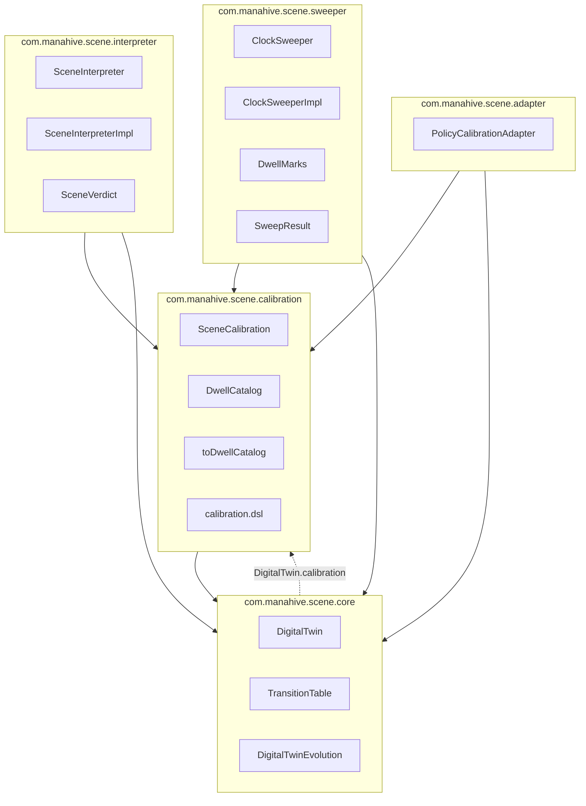

# Scene Domain — Sub-Context Map

**Last updated:** 2026-08-22  
**Module:** `engines/scene-engine/scene-domain`  
**Related:** [complete analysis](codebases/complete%20analysis.md), [diseno](diseno.md)

---

## 1. Sub-Contexts (Evans)

Five sub-contexts within `scene-domain`, expressed as Kotlin packages:



| Sub-context | Ubiquitous language | Responsibility |
|-------------|---------------------|----------------|
| **core** | Digital twin, FSM table, evolution | Pure domain model — entities, VOs, fold |
| **calibration** | Scene calibration, dwell catalog | Compiled business rules configuration |
| **interpreter** | Scene verdict | Observation → credible facts |
| **sweeper** | Dwell marks, sweep result | Time-based monitoring |
| **adapter** | Policy bridge | Politica Engine → Scene Engine |

---

## 2. Type → Package Inventory

| Type | Package |
|------|---------|
| `DigitalTwin`, `SignalHealth` | `core` |
| `TransitionTable` | `core` |
| `DigitalTwin.evolve()` | `core` |
| `SceneCalibration` | `calibration` |
| `DwellCatalog`, `SceneCalibration.toDwellCatalog()` | `calibration` |
| `@SceneDsl`, `calibration {}`, `dwellCatalog {}`, `transitionTable {}` | `calibration.dsl` |
| `SceneInterpreter`, `SceneInterpreterImpl`, `SceneVerdict` | `interpreter` |
| `ClockSweeper`, `ClockSweeperImpl` | `sweeper` |
| `DwellMarks`, `DwellMarkKey`, `SweepResult` | `sweeper` |
| `PolicyCalibration.toSceneCalibration()` | `adapter` |

`DwellThreshold` remains in `platform/contracts` — not a scene-domain type.

---

## 3. Dependency Rules

1. **core** has no dependencies on interpreter, sweeper, or adapter.
2. **calibration** depends only on **core** (via `TransitionTable` in `SceneCalibration`).
3. **interpreter** and **sweeper** are siblings — they never import each other.
4. **adapter** depends on **core** + **calibration**; it converts external policy into scene types.
5. Test helpers (`buildTwin`, `buildCalibration`, `SceneTestDsl`) live in `src/test`, not `main`.

### Intentional exception: `DigitalTwin.calibration`

`DigitalTwin` (core) carries an optional `SceneCalibration?` snapshot (SE-15). This creates a **core → calibration** edge so per-resident dwell thresholds travel with the twin. `ClockSweeperImpl` reads it:

```kotlin
val catalog = twin.calibration?.toDwellCatalog() ?: thresholds
```

Within the single Gradle module this is acceptable. A future split into Gradle submodules would require resolving this edge (e.g. external calibration lookup).

### Derived Value: `toDwellCatalog()`

The extension lives in **calibration** (source side). The catalog is computed from calibration, never stored independently (Fowler: Derived Value).

---

## 4. What This Enables

- **Clearer language** — calibration vs interpreter vs sweeper are distinct concepts in code
- **Independent specs** — each sub-context has focused test files
- **Bounded context map** — mirrors external integration points (Politica → adapter, perception → interpreter)
- **Future enforcement** — packages can become Gradle modules + Konsist rules when needed

---

## 5. Test layout

Tests mirror the same sub-context packages:

| Package | Specs |
|---------|-------|
| `core` | DigitalTwin evolution, calibration on twin, TransitionTable |
| `calibration` | DwellCatalog, SceneCalibration from Politica |
| `interpreter` | SceneInterpreter pipeline specs, PersonState, ObservationKind mapping |
| `sweeper` | ClockSweeper dwell/signal specs |
| `adapter` | Politica → Scene integration |
| `integration` | Cross-component scenarios (La caída de las 03:00) |
| `support` | Shared test DSL (`SceneTestDsl`, `SceneInterpreterDsl`) |

---

## 6. Out of Scope (future)

- Gradle submodules (`scene-core`, `scene-calibration`, …)
- Konsist / ArchUnit dependency tests
