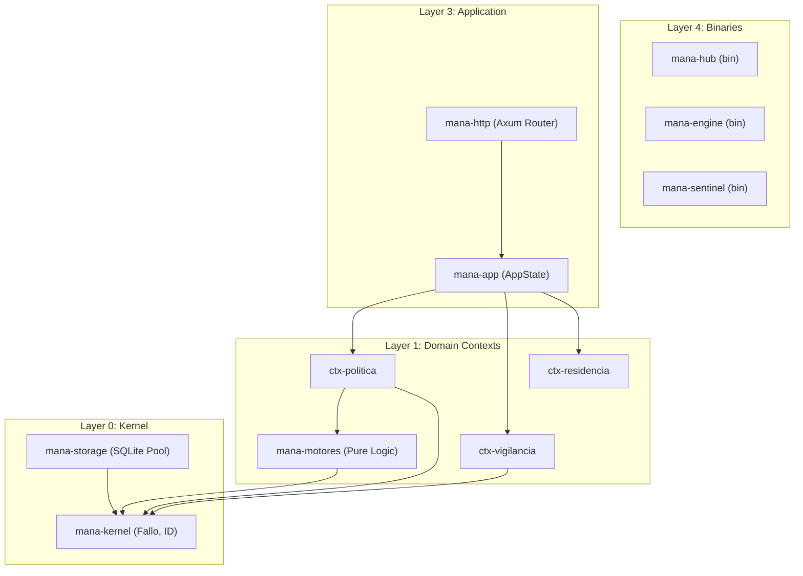
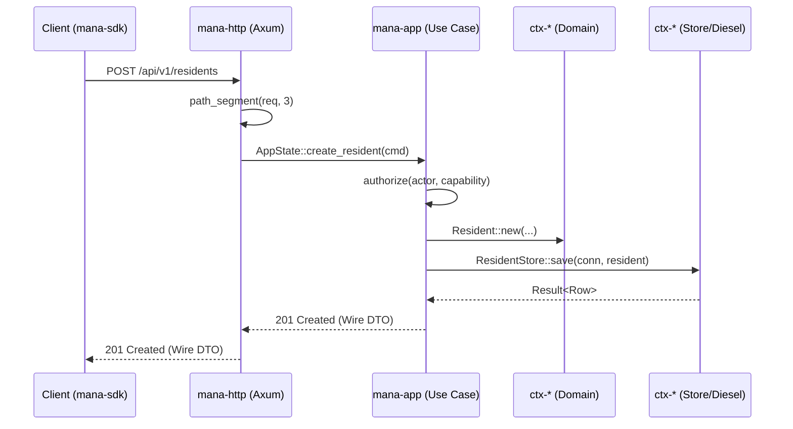

# System Architecture

Relevant source files

- 
- 
- 
- 
- 
- 
- 
- 
- 
- 
- 
- 
- 
- 
- 
- 
- 
- 
- 
- 

The **hubp** system is designed as a modular monolith organized into a four-binary topology. It serves as a **System of Record (SoR)** for clinical and security monitoring, utilizing a distributed event mesh powered by NATS JetStream to coordinate stateless workers with a central persistent API.

## 1. Topology and Binaries

The system consists of four distinct production binaries, each serving a specific role in the event-processing pipeline. While they share a single codebase (workspace), they are deployed as independent processes that communicate via NATS or HTTP.

|Binary|Role|State|Primary Transport|
|---|---|---|---|
|`mana-hub`|HTTP API Server & Persistence|**Stateful** (SQLite)|HTTP (8780) + NATS|
|`mana-engine`|DigitalTwin & FSM Engine|Stateless|Pure NATS|
|`mana-sentinel`|Rule Evaluation & Incidents|Stateless|NATS + Hub HTTP|
|`mana-vigilancia`|Notification Processing|Stateless|NATS + Hub HTTP|

### Data Flow Overview

The system follows a reactive pipeline where sensor data is transformed into clinical alerts through a series of asynchronous steps:

1. **Perception**: Edge devices publish to `evt_perception`.
2. **Scene Analysis**: `mana-engine` processes perception into `evt_scene` (e.g., "Resident left bed").
3. **Evaluation**: `mana-sentinel` evaluates `evt_scene` against policies and publishes `evt_notif`.
4. **Delivery**: `mana-vigilancia` processes notifications and delivers them to staff.
5. **Persistence**: `mana-hub` subscribes to all streams to maintain the immutable audit log and current state in SQLite.

**Sources:** [README.md7-33](https://github.com/pbaalerta-wq/hubp/blob/cc2edd14/README.md?plain=1#L7-L33) [docs/reference/architecture.md27-34](https://github.com/pbaalerta-wq/hubp/blob/cc2edd14/docs/reference/architecture.md?plain=1#L27-L34) [docs/arquitectura/memoria-diseno28-50](https://github.com/pbaalerta-wq/hubp/blob/cc2edd14/docs/arquitectura/memoria-diseno#L28-L50)

---

## 2. NATS JetStream Event Mesh

NATS JetStream serves as the communication backbone, providing "at-least-once" delivery guarantees. This allows workers to remain stateless; they can be restarted at any time and will re-process the stream from their last acknowledged position.

### Core Streams

|Stream Topic|Producer|Primary Consumer|Purpose|
|---|---|---|---|
|`evt_perception`|Edge/Sensors|`mana-engine`|Raw analytical events from IA cells.|
|`evt_scene`|`mana-engine`|`mana-sentinel`|High-level state transitions (DigitalTwin).|
|`evt_notif`|`mana-sentinel`|`mana-vigilancia`|Pending alerts and escalations.|
|`evt_policy`|`mana-hub`|All Workers|Broadcasts of configuration/policy changes.|

**Sources:** [docs/reference/architecture.md36-46](https://github.com/pbaalerta-wq/hubp/blob/cc2edd14/docs/reference/architecture.md?plain=1#L36-L46) [docs/funcional/north-star.md84-88](https://github.com/pbaalerta-wq/hubp/blob/cc2edd14/docs/funcional/north-star.md?plain=1#L84-L88)

---

## 3. Dependency Layer Model

The workspace is organized into 32 crates across five conceptual layers. The architecture enforces a strict **Directed Acyclic Graph (DAG)**: dependencies only flow downward.

### Layered Structure

- **Layer 0 (Kernel)**: Foundational primitives (`mana-kernel`, `mana-storage`).
- **Layer 1 (Domain)**: The 11 Bounded Contexts (`ctx-*`) and pure engines (`mana-motores`, `mana-engine-v2`).
- **Layer 2 (Services)**: Infrastructure abstractions (`mana-nats`, `mana-observation`).
- **Layer 3 (Application)**: Coordination and Transport (`mana-app`, `mana-http`).
- **Layer 4 (Binaries)**: The entry points (`mana-hub`, `mana-sentinel`, etc.).

### Logical Component Map

**Sources:** [docs/reference/crate-map.md5-112](https://github.com/pbaalerta-wq/hubp/blob/cc2edd14/docs/reference/crate-map.md?plain=1#L5-L112) [docs/reference/architecture.md48-67](https://github.com/pbaalerta-wq/hubp/blob/cc2edd14/docs/reference/architecture.md?plain=1#L48-L67)

---

## 4. Architectural Invariants

The system enforces several "build-breaking" rules to prevent architectural erosion, primarily managed by the `xtask` tool.

### The "No Cross-Context" Rule

A `ctx-*` crate must never declare another `ctx-*` crate as a dependency in its `Cargo.toml`. This ensures that bounded contexts remain isolated.

- **Enforcement**: `cargo run -p xtask -- verificar-contextos` [README.md60](https://github.com/pbaalerta-wq/hubp/blob/cc2edd14/README.md?plain=1#L60-L60)
- **Coordination**: All logic requiring data from multiple contexts must reside in `mana-app` [docs/arquitectura/memoria-diseno135-146](https://github.com/pbaalerta-wq/hubp/blob/cc2edd14/docs/arquitectura/memoria-diseno#L135-L146)
- **References**: Contexts refer to each other only via opaque IDs (e.g., `ResidentId`), never via database joins [docs/reference/architecture.md73-77](https://github.com/pbaalerta-wq/hubp/blob/cc2edd14/docs/reference/architecture.md?plain=1#L73-L77)

### Pure Logic Engines

Business rules are separated into "Pure" crates that are forbidden from performing I/O (no Diesel, no Network).

- **`mana-motores`**: Contains the `evaluar` function for alarms and `recomendar` for policy. It only depends on `mana-kernel` [docs/arquitectura/motores.md30-39](https://github.com/pbaalerta-wq/hubp/blob/cc2edd14/docs/arquitectura/motores.md?plain=1#L30-L39)
- **`mana-engine-v2`**: Manages the `DigitalTwin` and `PersonState` FSM. It is I/O-free to allow for deterministic testing via "scenes" [docs/arquitectura/mana-engine.md48-75](https://github.com/pbaalerta-wq/hubp/blob/cc2edd14/docs/arquitectura/mana-engine.md?plain=1#L48-L75)

### The 'rutas.toml' Contract

The `mana-hub` binary uses a central `rutas.toml` file to define all valid HTTP endpoints.

- **Validation**: During startup, `mana-http` validates that every route marked as `sirve = "rust"` has a corresponding handler registered in the `HubState` [crates/mana-http/src/routes.rs191-210](https://github.com/pbaalerta-wq/hubp/blob/cc2edd14/crates/mana-http/src/routes.rs#L191-L210)
- **Node Retirement**: As of F9, the system no longer supports falling back to the legacy Node.js implementation; `Serve::Node` entries cause a startup failure [crates/mana-http/src/routes.rs119-121](https://github.com/pbaalerta-wq/hubp/blob/cc2edd14/crates/mana-http/src/routes.rs#L119-L121)

**Sources:** [docs/arquitectura/memoria-diseno123-146](https://github.com/pbaalerta-wq/hubp/blob/cc2edd14/docs/arquitectura/memoria-diseno#L123-L146) [docs/arquitectura/motores.md30-43](https://github.com/pbaalerta-wq/hubp/blob/cc2edd14/docs/arquitectura/motores.md?plain=1#L30-L43) [README.md156-166](https://github.com/pbaalerta-wq/hubp/blob/cc2edd14/README.md?plain=1#L156-L166)

---

## 5. Implementation Detail: The Operational Loop

The "Lazo Operativo" (Operational Loop) describes how the system bridges the gap between different contexts in `mana-app`.

### Event vs. Clock Time

The architecture distinguishes between two types of triggers:

1. **Event Time**: Reactive logic triggered by `POST /internal/v1/events`. Handled by the `HydrationPort` in engines [docs/arquitectura/mana-engine.md97-101](https://github.com/pbaalerta-wq/hubp/blob/cc2edd14/docs/arquitectura/mana-engine.md?plain=1#L97-L101)
2. **Clock Time**: Logic triggered by the passage of time (e.g., "Resident out of bed for > 20 mins"). This is managed by the `mana-engine` scan loop, which emits `SceneEvent`s when timers expire [docs/arquitectura/lazo-operativo.md67-89](https://github.com/pbaalerta-wq/hubp/blob/cc2edd14/docs/arquitectura/lazo-operativo.md?plain=1#L67-L89)

### Request Lifecycle

**Sources:** [crates/mana-http/src/lib.rs184-192](https://github.com/pbaalerta-wq/hubp/blob/cc2edd14/crates/mana-http/src/lib.rs#L184-L192) [docs/arquitectura/memoria-diseno150-165](https://github.com/pbaalerta-wq/hubp/blob/cc2edd14/docs/arquitectura/memoria-diseno#L150-L165) [docs/arquitectura/lazo-operativo.md38-65](https://github.com/pbaalerta-wq/hubp/blob/cc2edd14/docs/arquitectura/lazo-operativo.md?plain=1#L38-L65)

### On this page

- [System Architecture](https://deepwiki.com/pbaalerta-wq/hubp/1.2-system-architecture#system-architecture)
- [1. Topology and Binaries](https://deepwiki.com/pbaalerta-wq/hubp/1.2-system-architecture#1-topology-and-binaries)
- [Data Flow Overview](https://deepwiki.com/pbaalerta-wq/hubp/1.2-system-architecture#data-flow-overview)
- [2. NATS JetStream Event Mesh](https://deepwiki.com/pbaalerta-wq/hubp/1.2-system-architecture#2-nats-jetstream-event-mesh)
- [Core Streams](https://deepwiki.com/pbaalerta-wq/hubp/1.2-system-architecture#core-streams)
- [3. Dependency Layer Model](https://deepwiki.com/pbaalerta-wq/hubp/1.2-system-architecture#3-dependency-layer-model)
- [Layered Structure](https://deepwiki.com/pbaalerta-wq/hubp/1.2-system-architecture#layered-structure)
- [Logical Component Map](https://deepwiki.com/pbaalerta-wq/hubp/1.2-system-architecture#logical-component-map)
- [4. Architectural Invariants](https://deepwiki.com/pbaalerta-wq/hubp/1.2-system-architecture#4-architectural-invariants)
- [The "No Cross-Context" Rule](https://deepwiki.com/pbaalerta-wq/hubp/1.2-system-architecture#the-no-cross-context-rule)
- [Pure Logic Engines](https://deepwiki.com/pbaalerta-wq/hubp/1.2-system-architecture#pure-logic-engines)
- [The 'rutas.toml' Contract](https://deepwiki.com/pbaalerta-wq/hubp/1.2-system-architecture#the-rutastoml-contract)
- [5. Implementation Detail: The Operational Loop](https://deepwiki.com/pbaalerta-wq/hubp/1.2-system-architecture#5-implementation-detail-the-operational-loop)
- [Event vs. Clock Time](https://deepwiki.com/pbaalerta-wq/hubp/1.2-system-architecture#event-vs-clock-time)
- [Request Lifecycle](https://deepwiki.com/pbaalerta-wq/hubp/1.2-system-architecture#request-lifecycle)

