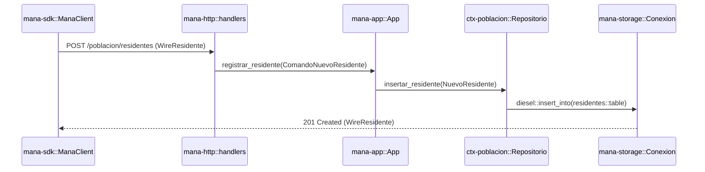
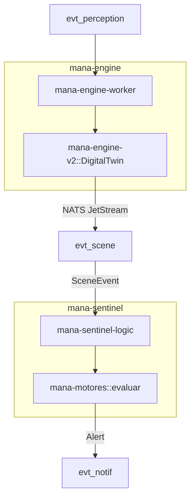

# Crate Map and Dependency Graph

Relevant source files

- 
- 
- 
- 
- 
- 
- 
- 
- 
- 
- 
- 
- 
- 
- 
- 
- 
- 
- 
- 
- 
- 
- 
- 
- 
- 
- 
- 
- 
- 
- 
- 
- 

This page provides a comprehensive reference of the 32 workspace crates that comprise the mana-hub system. The architecture follows a strict Directed Acyclic Graph (DAG) enforced by `xtask` to ensure modularity, prevent circular dependencies, and maintain clear boundaries between domain logic and infrastructure.

## Architectural Layers

The workspace is organized into seven distinct layers, ranging from zero-dependency primitives to deployable binaries.

### Layer 1: Kernel & Infrastructure

The foundation of the system. These crates provide the shared vocabulary and low-level utilities used by every other crate.

- **`mana-kernel`**: The zero-dependency root. Defines `Instante` (time), `Fallo` (error types), `Id` (typed identifiers), and the `Retirable` trait [crates/mana-kernel/Cargo.toml1-10](https://github.com/pbaalerta-wq/hubp/blob/cc2edd14/crates/mana-kernel/Cargo.toml#L1-L10)
- **`mana-storage`**: Encapsulates SQLite persistence using Diesel and `r2d2`. It provides the `Conexion` type and connection pooling logic [crates/mana-storage/Cargo.toml1-10](https://github.com/pbaalerta-wq/hubp/blob/cc2edd14/crates/mana-storage/Cargo.toml#L1-L10)
- **`mana-wire`**: Defines the Data Transfer Objects (DTOs) for the HTTP API. This crate is shared between the server (`mana-http`) and the SDK (`mana-sdk`) [crates/mana-wire/Cargo.toml1-13](https://github.com/pbaalerta-wq/hubp/blob/cc2edd14/crates/mana-wire/Cargo.toml#L1-L13)

### Layer 2: Bounded Contexts (`ctx-*`)

These crates contain the core business logic, database schemas, and migrations for specific sub-domains. Each `ctx-*` crate is prohibited from depending on another `ctx-*` crate to prevent domain entanglement.

|Crate|Responsibility|
|---|---|
|**`ctx-identidad`**|Users, RBAC roles, and session management [crates/ctx-identidad/Cargo.toml1-15](https://github.com/pbaalerta-wq/hubp/blob/cc2edd14/crates/ctx-identidad/Cargo.toml#L1-L15)|
|**`ctx-auditoria`**|Append-only audit logs for all mutations [crates/ctx-auditoria/Cargo.toml1-15](https://github.com/pbaalerta-wq/hubp/blob/cc2edd14/crates/ctx-auditoria/Cargo.toml#L1-L15)|
|**`ctx-residencia`**|Facility hierarchy (Facility, Wing, Room, Bed) [crates/ctx-residencia/Cargo.toml1-14](https://github.com/pbaalerta-wq/hubp/blob/cc2edd14/crates/ctx-residencia/Cargo.toml#L1-L14)|
|**`ctx-poblacion`**|Resident lifecycle and bed assignments [crates/ctx-poblacion/Cargo.toml1-15](https://github.com/pbaalerta-wq/hubp/blob/cc2edd14/crates/ctx-poblacion/Cargo.toml#L1-L15)|
|**`ctx-politica`**|Alarm catalog and policy resolution logic [crates/ctx-politica/Cargo.toml1-15](https://github.com/pbaalerta-wq/hubp/blob/cc2edd14/crates/ctx-politica/Cargo.toml#L1-L15)|
|**`ctx-vigilancia`**|Alert state machine and notification delivery [crates/ctx-vigilancia/Cargo.toml1-15](https://github.com/pbaalerta-wq/hubp/blob/cc2edd14/crates/ctx-vigilancia/Cargo.toml#L1-L15)|
|**`ctx-cobertura`**|Staff assignments to wings and shift schedules [crates/ctx-cobertura/Cargo.toml1-15](https://github.com/pbaalerta-wq/hubp/blob/cc2edd14/crates/ctx-cobertura/Cargo.toml#L1-L15)|
|**`ctx-cuidado`**|Care rounds, tasks, and clinical notes [crates/ctx-cuidado/Cargo.toml1-15](https://github.com/pbaalerta-wq/hubp/blob/cc2edd14/crates/ctx-cuidado/Cargo.toml#L1-L15)|
|**`ctx-historia`**|Incident detection records and clinical history [crates/ctx-historia/Cargo.toml1-15](https://github.com/pbaalerta-wq/hubp/blob/cc2edd14/crates/ctx-historia/Cargo.toml#L1-L15)|
|**`ctx-evidence`**|Video clip metadata and evidence timelines [crates/ctx-evidence/Cargo.toml1-15](https://github.com/pbaalerta-wq/hubp/blob/cc2edd14/crates/ctx-evidence/Cargo.toml#L1-L15)|
|**`ctx-streams`**|Camera stream registrations and ROI regions [crates/ctx-streams/Cargo.toml1-15](https://github.com/pbaalerta-wq/hubp/blob/cc2edd14/crates/ctx-streams/Cargo.toml#L1-L15)|

### Layer 3: Observation & Engines

Pure logic crates that handle state transitions and rule evaluation without direct database access.

- **`mana-observation`**: Manages sensor event logs and the `BedState` hot projection [crates/mana-observation/Cargo.toml1-15](https://github.com/pbaalerta-wq/hubp/blob/cc2edd14/crates/mana-observation/Cargo.toml#L1-L15)
- **`mana-engine-v2`**: The DigitalTwin FSM. Manages `PersonState` transitions (e.g., InBed, OutOfBed) [crates/mana-engine-v2/Cargo.toml1-14](https://github.com/pbaalerta-wq/hubp/blob/cc2edd14/crates/mana-engine-v2/Cargo.toml#L1-L14)
- **`mana-motores`**: The stateless alarm evaluator. Implements the `evaluar` function for policy rules [crates/mana-motores/Cargo.toml1-13](https://github.com/pbaalerta-wq/hubp/blob/cc2edd14/crates/mana-motores/Cargo.toml#L1-L13)

### Layer 4: Application & Transport

The glue layer that orchestrates domain contexts to satisfy API requests.

- **`mana-app`**: The "System of Record" application layer. Coordinates transactions across multiple `ctx-*` crates (e.g., updating a resident and logging an audit entry) [crates/mana-app/Cargo.toml1-20](https://github.com/pbaalerta-wq/hubp/blob/cc2edd14/crates/mana-app/Cargo.toml#L1-L20)
- **`mana-http`**: The Axum-based web server. Maps HTTP routes to `mana-app` use cases and handles DTO conversion via `mana-wire` [crates/mana-http/Cargo.toml1-24](https://github.com/pbaalerta-wq/hubp/blob/cc2edd14/crates/mana-http/Cargo.toml#L1-L24)

### Layer 5: Workers & Messaging

Infrastructure for event-driven processing via NATS JetStream.

- **`mana-nats`**: Generic NATS broker and subscriber wrappers [crates/mana-nats/Cargo.toml1-15](https://github.com/pbaalerta-wq/hubp/blob/cc2edd14/crates/mana-nats/Cargo.toml#L1-L15)
- **`mana-engine-worker`**: The consumer for `evt_perception` that drives the DigitalTwin.
- **`mana-sentinel`**: The worker that evaluates policies against scene events and manages the incident lifecycle [crates/mana-sentinel/Cargo.toml1-20](https://github.com/pbaalerta-wq/hubp/blob/cc2edd14/crates/mana-sentinel/Cargo.toml#L1-L20)
- **`mana-vigilancia-worker`**: Handles alert escalations and dwell-time sweeps.

### Layer 6: Clients & SDK

Tools for interacting with the Hub from external processes.

- **`mana-sdk`**: The official Rust client for the Hub API [crates/mana-sdk/Cargo.toml1-18](https://github.com/pbaalerta-wq/hubp/blob/cc2edd14/crates/mana-sdk/Cargo.toml#L1-L18)
- **`mana-hub-client`**: A specialized internal client used by workers to call back into the Hub.
- **`mana-cli`**: Command-line interface for system administration [crates/mana-cli/Cargo.toml1-15](https://github.com/pbaalerta-wq/hubp/blob/cc2edd14/crates/mana-cli/Cargo.toml#L1-L15)

### Layer 7: Binaries

The four deployable entry points.

- **`bins/mana-hub`**: The main API server [bins/mana-hub/Cargo.toml1-15](https://github.com/pbaalerta-wq/hubp/blob/cc2edd14/bins/mana-hub/Cargo.toml#L1-L15)
- **`bins/mana-engine`**: The DigitalTwin worker process [bins/mana-engine/Cargo.toml1-15](https://github.com/pbaalerta-wq/hubp/blob/cc2edd14/bins/mana-engine/Cargo.toml#L1-L15)
- **`bins/mana-sentinel`**: The policy evaluation process [bins/mana-sentinel/Cargo.toml1-15](https://github.com/pbaalerta-wq/hubp/blob/cc2edd14/bins/mana-sentinel/Cargo.toml#L1-L15)
- **`bins/mana-vigilancia`**: The alert management process [bins/mana-vigilancia/Cargo.toml1-15](https://github.com/pbaalerta-wq/hubp/blob/cc2edd14/bins/mana-vigilancia/Cargo.toml#L1-L15)

## Dependency Graph

The following diagram illustrates the flow of dependencies. Higher layers depend on lower layers, but never vice-versa.

### System Hierarchy Diagram

**Sources:** [Cargo.toml1-39](https://github.com/pbaalerta-wq/hubp/blob/cc2edd14/Cargo.toml#L1-L39) [crates/mana-http/Cargo.toml1-24](https://github.com/pbaalerta-wq/hubp/blob/cc2edd14/crates/mana-http/Cargo.toml#L1-L24) [crates/mana-sentinel/Cargo.toml1-20](https://github.com/pbaalerta-wq/hubp/blob/cc2edd14/crates/mana-sentinel/Cargo.toml#L1-L20)

## Code Entity Mapping

This section bridges the gap between architectural names and the actual code symbols used for implementation.

### Request Flow: API to Database

The following diagram tracks a request (e.g., creating a resident) through the code entities.

**Sources:** [crates/mana-http/Cargo.toml7-16](https://github.com/pbaalerta-wq/hubp/blob/cc2edd14/crates/mana-http/Cargo.toml#L7-L16) [crates/mana-sdk/Cargo.toml11-18](https://github.com/pbaalerta-wq/hubp/blob/cc2edd14/crates/mana-sdk/Cargo.toml#L11-L18) [crates/ctx-poblacion/Cargo.toml7-15](https://github.com/pbaalerta-wq/hubp/blob/cc2edd14/crates/ctx-poblacion/Cargo.toml#L7-L15)

### Event Flow: Sensor to Alert

The following diagram tracks a sensor event through the engine and sentinel layers.

**`evt_perception` → `mana-engine-worker` → `DigitalTwin` → NATS JetStream → `evt_scene` → `mana-sentinel-logic` → `mana-motores::evaluar` → `evt_notif`**.

**Sources:** [crates/mana-nats/Cargo.toml1-15](https://github.com/pbaalerta-wq/hubp/blob/cc2edd14/crates/mana-nats/Cargo.toml#L1-L15) [crates/mana-engine-v2/Cargo.toml1-14](https://github.com/pbaalerta-wq/hubp/blob/cc2edd14/crates/mana-engine-v2/Cargo.toml#L1-L14) [crates/mana-motores/Cargo.toml1-13](https://github.com/pbaalerta-wq/hubp/blob/cc2edd14/crates/mana-motores/Cargo.toml#L1-L13) [crates/mana-sentinel/Cargo.toml9-12](https://github.com/pbaalerta-wq/hubp/blob/cc2edd14/crates/mana-sentinel/Cargo.toml#L9-L12)

## DAG Enforcement

The workspace uses a custom tool, `xtask`, to enforce the dependency rules. The primary rule is **No Cross-Context Dependencies**: a crate prefixed with `ctx-` cannot depend on another crate prefixed with `ctx-`.

If `ctx-poblacion` needs data from `ctx-residencia` (e.g., to verify a bed exists), it must not link to `ctx-residencia`. Instead:

1. The **Application Layer** (`mana-app`) fetches the data from both contexts and performs the join/validation.
2. The **Database Layer** uses shared foreign keys but migrations are owned by the specific context that defines the table.

This enforcement ensures that bounded contexts can be tested in isolation and prevents the "big ball of mud" architecture.

**Sources:** [Cargo.toml1-39](https://github.com/pbaalerta-wq/hubp/blob/cc2edd14/Cargo.toml#L1-L39) [crates/mana-app/Cargo.toml1-25](https://github.com/pbaalerta-wq/hubp/blob/cc2edd14/crates/mana-app/Cargo.toml#L1-L25)

### On this page

- [Crate Map and Dependency Graph](https://deepwiki.com/pbaalerta-wq/hubp/1.3-crate-map-and-dependency-graph#crate-map-and-dependency-graph)
- [Architectural Layers](https://deepwiki.com/pbaalerta-wq/hubp/1.3-crate-map-and-dependency-graph#architectural-layers)
- [Layer 1: Kernel & Infrastructure](https://deepwiki.com/pbaalerta-wq/hubp/1.3-crate-map-and-dependency-graph#layer-1-kernel-infrastructure)
- [Layer 2: Bounded Contexts (`ctx-*`)](https://deepwiki.com/pbaalerta-wq/hubp/1.3-crate-map-and-dependency-graph#layer-2-bounded-contexts-ctx-)
- [Layer 3: Observation & Engines](https://deepwiki.com/pbaalerta-wq/hubp/1.3-crate-map-and-dependency-graph#layer-3-observation-engines)
- [Layer 4: Application & Transport](https://deepwiki.com/pbaalerta-wq/hubp/1.3-crate-map-and-dependency-graph#layer-4-application-transport)
- [Layer 5: Workers & Messaging](https://deepwiki.com/pbaalerta-wq/hubp/1.3-crate-map-and-dependency-graph#layer-5-workers-messaging)
- [Layer 6: Clients & SDK](https://deepwiki.com/pbaalerta-wq/hubp/1.3-crate-map-and-dependency-graph#layer-6-clients-sdk)
- [Layer 7: Binaries](https://deepwiki.com/pbaalerta-wq/hubp/1.3-crate-map-and-dependency-graph#layer-7-binaries)
- [Dependency Graph](https://deepwiki.com/pbaalerta-wq/hubp/1.3-crate-map-and-dependency-graph#dependency-graph)
- [System Hierarchy Diagram](https://deepwiki.com/pbaalerta-wq/hubp/1.3-crate-map-and-dependency-graph#system-hierarchy-diagram)
- [Code Entity Mapping](https://deepwiki.com/pbaalerta-wq/hubp/1.3-crate-map-and-dependency-graph#code-entity-mapping)
- [Request Flow: API to Database](https://deepwiki.com/pbaalerta-wq/hubp/1.3-crate-map-and-dependency-graph#request-flow-api-to-database)
- [Event Flow: Sensor to Alert](https://deepwiki.com/pbaalerta-wq/hubp/1.3-crate-map-and-dependency-graph#event-flow-sensor-to-alert)
- [DAG Enforcement](https://deepwiki.com/pbaalerta-wq/hubp/1.3-crate-map-and-dependency-graph#dag-enforcement)

