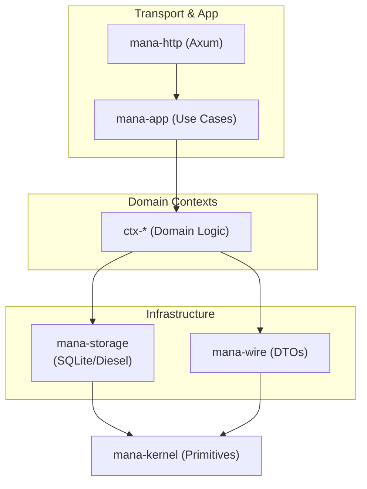
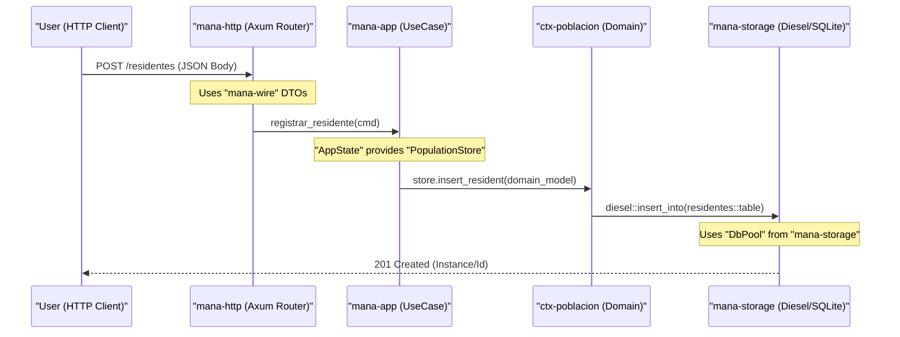

# Core Infrastructure

Relevant source files

- 
- 
- 
- 
- 
- 
- 
- 
- 

The **mana-hub** system relies on a tiered infrastructure designed to decouple domain logic from transport and persistence details. These foundational crates provide the primitives, storage abstractions, and communication contracts used by all 11 bounded contexts.

### Architectural Overview

The infrastructure is organized into a dependency-directed stack where the **Kernel** sits at the bottom (zero dependencies) and the **HTTP Layer** sits at the top.

**Transport & App → Domain Contexts → Infrastructure → mana-kernel**

**Sources:** [crates/mana-kernel/src/lib.rs1](https://github.com/pbaalerta-wq/hubp/blob/cc2edd14/crates/mana-kernel/src/lib.rs#L1-L1) | [crates/mana-app/src/state.rs74-89](https://github.com/pbaalerta-wq/hubp/blob/cc2edd14/crates/mana-app/src/state.rs#L74-L89)

---

### 2.1 mana-kernel: Shared Primitives

The `mana-kernel` crate defines the universal vocabulary of the system. It is strictly business-logic-free and contains only types that must be shared across every layer, including external clients.

Key components include:

- **Typed IDs**: The `Id<K>` struct uses `PhantomData` to prevent mixing identifiers (e.g., passing a `ResidentId` where a `RoomId` is expected) [crates/mana-kernel/src/lib.rs23-27](https://github.com/pbaalerta-wq/hubp/blob/cc2edd14/crates/mana-kernel/src/lib.rs#L23-L27)
- **Instante**: A wrapper around `DateTime<Utc>` that enforces RFC3339 serialization with millisecond precision and a trailing `Z` [crates/mana-kernel/src/lib.rs89-95](https://github.com/pbaalerta-wq/hubp/blob/cc2edd14/crates/mana-kernel/src/lib.rs#L89-L95)
- **Fallo**: A standardized error vocabulary (e.g., `NotFound`, `Conflict`, `Forbidden`) used to maintain contract consistency with legacy Node.js services [crates/mana-kernel/src/lib.rs176-190](https://github.com/pbaalerta-wq/hubp/blob/cc2edd14/crates/mana-kernel/src/lib.rs#L176-L190)

For details, see [mana-kernel: Shared Primitives](https://deepwiki.com/pbaalerta-wq/hubp/2.1-mana-kernel:-shared-primitives).

**Sources:** [crates/mana-kernel/src/lib.rs1-253](https://github.com/pbaalerta-wq/hubp/blob/cc2edd14/crates/mana-kernel/src/lib.rs#L1-L253)

---

### 2.2 mana-storage: SQLite Persistence Layer

The `mana-storage` crate manages the lifecycle of the SQLite database. It provides the `DbPool` based on `r2d2` and configures the database for high-performance concurrent access.

- **Persistence**: Uses `Diesel` ORM for type-safe queries [crates/mana-storage/Cargo.toml8](https://github.com/pbaalerta-wq/hubp/blob/cc2edd14/crates/mana-storage/Cargo.toml#L8-L8)
- **Decentralized Migrations**: While `mana-storage` provides the `build_pool` utility, each `ctx-*` crate owns its own migrations, which are executed during `AppState` initialization [crates/mana-app/src/state.rs172-184](https://github.com/pbaalerta-wq/hubp/blob/cc2edd14/crates/mana-app/src/state.rs#L172-L184)

For details, see [mana-storage: SQLite Persistence Layer](https://deepwiki.com/pbaalerta-wq/hubp/2.2-mana-storage:-sqlite-persistence-layer).

**Sources:** [crates/mana-storage/Cargo.toml1-10](https://github.com/pbaalerta-wq/hubp/blob/cc2edd14/crates/mana-storage/Cargo.toml#L1-L10) | [crates/mana-app/src/state.rs122-126](https://github.com/pbaalerta-wq/hubp/blob/cc2edd14/crates/mana-app/src/state.rs#L122-L126)

---

### 2.3 mana-wire and HTTP Contract

The `mana-wire` crate contains the Data Transfer Objects (DTOs) used for API communication. This layer ensures that internal domain models can evolve independently of the public API.

- **DTO Isolation**: All types in `mana-wire` implement `Serialize` and `Deserialize` [crates/mana-wire/Cargo.toml9-10](https://github.com/pbaalerta-wq/hubp/blob/cc2edd14/crates/mana-wire/Cargo.toml#L9-L10)
- **Contract First**: The system follows an OpenAPI specification, where `mana-wire` structs represent the JSON shapes defined in the contract.

For details, see [mana-wire and HTTP Contract](https://deepwiki.com/pbaalerta-wq/hubp/2.3-mana-wire-and-http-contract).

**Sources:** [crates/mana-wire/Cargo.toml1-13](https://github.com/pbaalerta-wq/hubp/blob/cc2edd14/crates/mana-wire/Cargo.toml#L1-L13)

---

### 2.4 mana-app and mana-http: Application and Transport Layers

These crates handle the request lifecycle and orchestrate cross-context operations.

- **AppState**: The `AppState` struct acts as the central registry, holding handles to all context `Store` objects, the `DigitalTwin`, and the NATS broker [crates/mana-app/src/state.rs92-110](https://github.com/pbaalerta-wq/hubp/blob/cc2edd14/crates/mana-app/src/state.rs#L92-L110)
- **Transaction Management**: `AppState` provides a `transaction` method that allows multiple context stores to participate in a single SQLite transaction [crates/mana-app/src/state.rs62-89](https://github.com/pbaalerta-wq/hubp/blob/cc2edd14/crates/mana-app/src/state.rs#L62-L89)
- **Sync/Async Boundary**: Since SQLite/Diesel are synchronous, the application layer manages `spawn_blocking` calls to ensure the Axum executor is not stalled.

For details, see [mana-app and mana-http: Application and Transport Layers](https://deepwiki.com/pbaalerta-wq/hubp/2.4-mana-app-and-mana-http:-application-and-transport-layers).

**Sources:** [crates/mana-app/src/state.rs92-161](https://github.com/pbaalerta-wq/hubp/blob/cc2edd14/crates/mana-app/src/state.rs#L92-L161)

---

### Entity Mapping: Request to Persistence

This diagram illustrates how a natural language request ("Register a resident") maps to specific code entities across the infrastructure layers.

**Sources:** [crates/mana-app/src/state.rs92-104](https://github.com/pbaalerta-wq/hubp/blob/cc2edd14/crates/mana-app/src/state.rs#L92-L104) | [crates/mana-kernel/src/lib.rs23-27](https://github.com/pbaalerta-wq/hubp/blob/cc2edd14/crates/mana-kernel/src/lib.rs#L23-L27) | [crates/mana-storage/Cargo.toml8-10](https://github.com/pbaalerta-wq/hubp/blob/cc2edd14/crates/mana-storage/Cargo.toml#L8-L10)

### On this page

- [Core Infrastructure](https://deepwiki.com/pbaalerta-wq/hubp/2-core-infrastructure#core-infrastructure)
- [Architectural Overview](https://deepwiki.com/pbaalerta-wq/hubp/2-core-infrastructure#architectural-overview)
- [2.1 mana-kernel: Shared Primitives](https://deepwiki.com/pbaalerta-wq/hubp/2-core-infrastructure#21-mana-kernel-shared-primitives)
- [2.2 mana-storage: SQLite Persistence Layer](https://deepwiki.com/pbaalerta-wq/hubp/2-core-infrastructure#22-mana-storage-sqlite-persistence-layer)
- [2.3 mana-wire and HTTP Contract](https://deepwiki.com/pbaalerta-wq/hubp/2-core-infrastructure#23-mana-wire-and-http-contract)
- [2.4 mana-app and mana-http: Application and Transport Layers](https://deepwiki.com/pbaalerta-wq/hubp/2-core-infrastructure#24-mana-app-and-mana-http-application-and-transport-layers)
- [Entity Mapping: Request to Persistence](https://deepwiki.com/pbaalerta-wq/hubp/2-core-infrastructure#entity-mapping-request-to-persistence)

