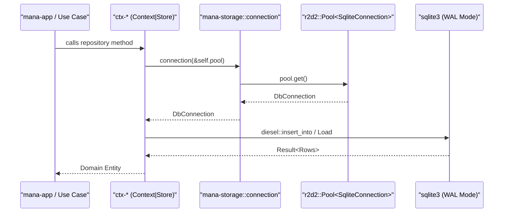
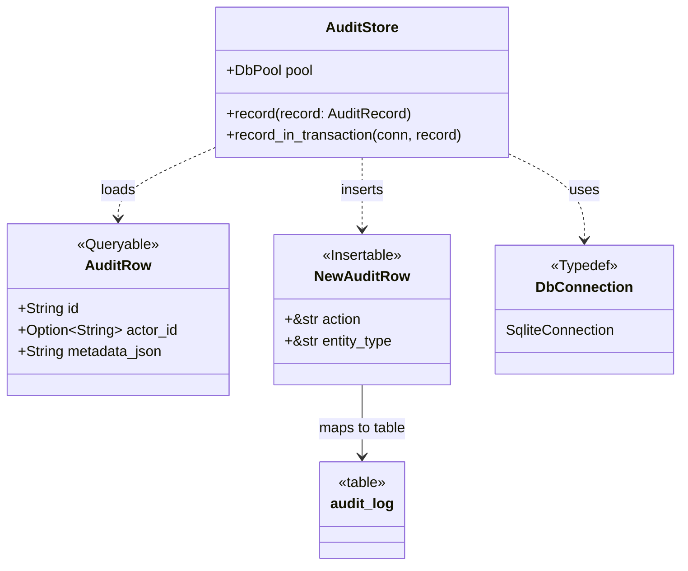

# mana-storage: SQLite Persistence Layer

Relevant source files

- 
- 
- 
- 
- 
- 
- 
- 
- 
- 
- 
- 
- 
- 
- 
- 
- 
- 
- 
- 
- 
- 
- 
- 
- 
- 
- 
- 
- 
- 
- 

The `mana-storage` crate provides the centralized infrastructure for data persistence across the `mana-hub` ecosystem. It encapsulates the SQLite connection lifecycle, ORM integration via Diesel, and a decentralized migration mechanism that allows bounded contexts to manage their own schemas while sharing a unified database file.

## Connection Management and Pool Configuration

The system utilizes `r2d2` for connection pooling and `diesel` for type-safe SQL interaction. The primary entry point for establishing a database connection is `build_pool`, which configures the SQLite environment for high-concurrency performance.

### PRAGMA and WAL Mode

To support concurrent reads and writes—essential for the Hub's event-driven architecture—the storage layer configures SQLite with specific performance-oriented PRAGMAs:

- **WAL Mode (Write-Ahead Logging):** Enables multiple readers to operate simultaneously with a single writer.
- **Synchronous = NORMAL:** Balances durability and performance by reducing fsync calls in WAL mode.
- **Foreign Keys:** Explicitly enabled to enforce referential integrity across context tables.

### Data Flow: Connection Acquisition

The following diagram illustrates how an application component acquires a connection through the storage layer.

**Diagram: Connection Lifecycle**

- **Sources:** [crates/mana-storage/src/lib.rs1-50](https://github.com/pbaalerta-wq/hubp/blob/cc2edd14/crates/mana-storage/src/lib.rs#L1-L50) [crates/ctx-auditoria/src/store.rs4-54](https://github.com/pbaalerta-wq/hubp/blob/cc2edd14/crates/ctx-auditoria/src/store.rs#L4-L54)

## Decentralized Migration Strategy

Unlike monolithic architectures with a single migration folder, `mana-hub` employs a decentralized strategy. Each `ctx-*` crate owns its specific database schema and migration scripts.

### The Migration Lifecycle

1. **Crate Ownership:** Each context (e.g., `ctx-residencia`, `ctx-identidad`) contains a `migrations/` directory with `up.sql` and `down.sql` files.
2. **Embedding:** Contexts use the `diesel_migrations::embed_migrations!` macro to compile SQL scripts into the binary.
3. **Execution:** During system startup, the `mana-hub` binary iterates through all registered contexts and calls their respective `run_migrations` functions.

### Migration Implementation Example

A context store typically exposes a migration function that delegates to `mana-storage::run_migrations`.

|Context|Migration File Example|Purpose|
|---|---|---|
|`ctx-identidad`|`0001_identity/up.sql`|Users, Roles, and Sessions [crates/ctx-identidad/migrations/0001_identity/up.sql1-10](https://github.com/pbaalerta-wq/hubp/blob/cc2edd14/crates/ctx-identidad/migrations/0001_identity/up.sql#L1-L10)|
|`ctx-residencia`|`0003_residencia/up.sql`|Facilities, Wings, Rooms, Beds [crates/ctx-residencia/migrations/0003_residencia/up.sql1-10](https://github.com/pbaalerta-wq/hubp/blob/cc2edd14/crates/ctx-residencia/migrations/0003_residencia/up.sql#L1-L10)|
|`ctx-auditoria`|`0002_audit/up.sql`|Append-only Audit Log [crates/ctx-auditoria/migrations/0002_audit/up.sql1-10](https://github.com/pbaalerta-wq/hubp/blob/cc2edd14/crates/ctx-auditoria/migrations/0002_audit/up.sql#L1-L10)|

- **Sources:** [crates/ctx-auditoria/src/store.rs12-46](https://github.com/pbaalerta-wq/hubp/blob/cc2edd14/crates/ctx-auditoria/src/store.rs#L12-L46) [crates/ctx-residencia/migrations/0003_residencia/up.sql1-5](https://github.com/pbaalerta-wq/hubp/blob/cc2edd14/crates/ctx-residencia/migrations/0003_residencia/up.sql#L1-L5) [crates/ctx-poblacion/migrations/0005_poblacion/down.sql1-6](https://github.com/pbaalerta-wq/hubp/blob/cc2edd14/crates/ctx-poblacion/migrations/0005_poblacion/down.sql#L1-L6)

## Diesel ORM Integration

The Hub uses Diesel for mapping database rows to Rust structures. Each context maintains a `schema.rs` (often auto-generated or manually curated) and defines `Queryable` and `Insertable` structs.

### Transaction Management

Transactions are handled at the Store level. The `mana-storage` layer provides the underlying `DbConnection` (an alias for `SqliteConnection`), which supports the `.transaction()` block.

**Code Entity Mapping: Audit Persistence** The following diagram maps the `ctx-auditoria` persistence logic to the underlying storage entities.

**Diagram: Entity to Storage Mapping**

- **Sources:** [crates/ctx-auditoria/src/store.rs15-42](https://github.com/pbaalerta-wq/hubp/blob/cc2edd14/crates/ctx-auditoria/src/store.rs#L15-L42) [crates/ctx-auditoria/src/store.rs53-91](https://github.com/pbaalerta-wq/hubp/blob/cc2edd14/crates/ctx-auditoria/src/store.rs#L53-L91)

## Key Persistence Conventions

To maintain consistency across the 34+ tables in the system, the following conventions are enforced within the SQL migrations and Diesel mappings:

1. **Typed IDs:** Primary keys are stored as `TEXT` and mapped to `mana_kernel::Id<T>`.
2. **Timestamps:** Stored as `TEXT` in RFC3339 format, mapped to the `Instante` type in `mana-kernel`.
3. **JSON Metadata:** Complex or dynamic data (like audit metadata or alarm configurations) is stored in `TEXT` columns and serialized/deserialized using `serde_json`.
4. **Logical Deletion:** The "Retirement" pattern uses `retired_at` (timestamp) and `retired_by` (actor ID) columns instead of physical `DELETE` operations where audit trails are required.
5. **Index Naming:** Indices follow the `idx_[table]_[columns]` convention for clarity during debugging.

### Summary of Storage Crates

|Crate|Role|Key Dependencies|
|---|---|---|
|`mana-storage`|Core persistence logic, pool management, and migration runner.|`diesel`, `r2d2`, `libsqlite3`|
|`ctx-*`|Individual contexts defining their own `migrations/` and `schema.rs`.|`mana-storage`, `diesel`|
|`mana-kernel`|Provides the `Instante` and `Id` types used in models.|`chrono`, `serde`|

- **Sources:** [crates/mana-storage/Cargo.toml1-10](https://github.com/pbaalerta-wq/hubp/blob/cc2edd14/crates/mana-storage/Cargo.toml#L1-L10) [crates/mana-kernel/Cargo.toml1-10](https://github.com/pbaalerta-wq/hubp/blob/cc2edd14/crates/mana-kernel/Cargo.toml#L1-L10) [crates/ctx-auditoria/src/store.rs65-77](https://github.com/pbaalerta-wq/hubp/blob/cc2edd14/crates/ctx-auditoria/src/store.rs#L65-L77)

### On this page

- [mana-storage: SQLite Persistence Layer](https://deepwiki.com/pbaalerta-wq/hubp/2.2-mana-storage:-sqlite-persistence-layer#mana-storage-sqlite-persistence-layer)
- [Connection Management and Pool Configuration](https://deepwiki.com/pbaalerta-wq/hubp/2.2-mana-storage:-sqlite-persistence-layer#connection-management-and-pool-configuration)
- [PRAGMA and WAL Mode](https://deepwiki.com/pbaalerta-wq/hubp/2.2-mana-storage:-sqlite-persistence-layer#pragma-and-wal-mode)
- [Data Flow: Connection Acquisition](https://deepwiki.com/pbaalerta-wq/hubp/2.2-mana-storage:-sqlite-persistence-layer#data-flow-connection-acquisition)
- [Decentralized Migration Strategy](https://deepwiki.com/pbaalerta-wq/hubp/2.2-mana-storage:-sqlite-persistence-layer#decentralized-migration-strategy)
- [The Migration Lifecycle](https://deepwiki.com/pbaalerta-wq/hubp/2.2-mana-storage:-sqlite-persistence-layer#the-migration-lifecycle)
- [Migration Implementation Example](https://deepwiki.com/pbaalerta-wq/hubp/2.2-mana-storage:-sqlite-persistence-layer#migration-implementation-example)
- [Diesel ORM Integration](https://deepwiki.com/pbaalerta-wq/hubp/2.2-mana-storage:-sqlite-persistence-layer#diesel-orm-integration)
- [Transaction Management](https://deepwiki.com/pbaalerta-wq/hubp/2.2-mana-storage:-sqlite-persistence-layer#transaction-management)
- [Key Persistence Conventions](https://deepwiki.com/pbaalerta-wq/hubp/2.2-mana-storage:-sqlite-persistence-layer#key-persistence-conventions)
- [Summary of Storage Crates](https://deepwiki.com/pbaalerta-wq/hubp/2.2-mana-storage:-sqlite-persistence-layer#summary-of-storage-crates)

