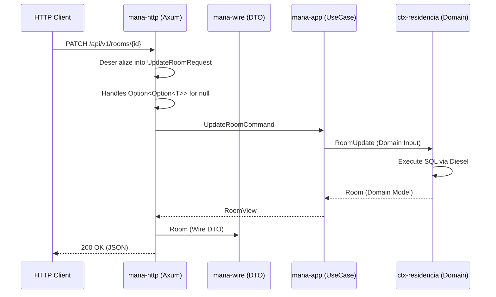
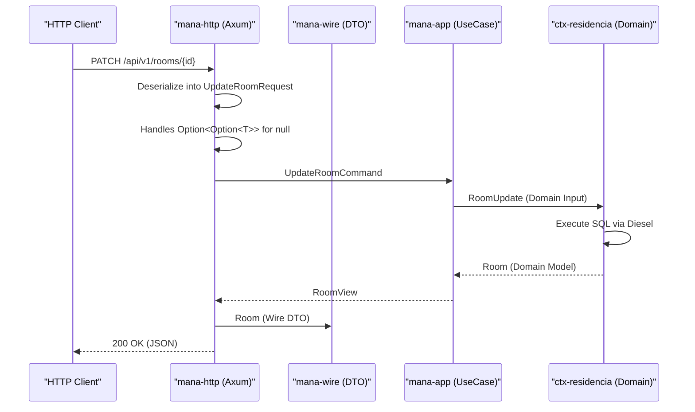

# mana-wire and HTTP Contract

Relevant source files

- [](https://github.com/pbaalerta-wq/hubp/blob/cc2edd14/crates/ctx-residencia/src/estructura/mod.rs)
- [](https://github.com/pbaalerta-wq/hubp/blob/cc2edd14/crates/mana-app/src/residencia.rs)
- [](https://github.com/pbaalerta-wq/hubp/blob/cc2edd14/crates/mana-sdk/src/residencia.rs)
- [](https://github.com/pbaalerta-wq/hubp/blob/cc2edd14/crates/mana-sdk/src/streams.rs)
- [](https://github.com/pbaalerta-wq/hubp/blob/cc2edd14/crates/mana-wire/src/lib.rs)
- [](https://github.com/pbaalerta-wq/hubp/blob/cc2edd14/docs/contrato/modulos/cobertura.yaml)
- [](https://github.com/pbaalerta-wq/hubp/blob/cc2edd14/docs/contrato/modulos/cuidado.yaml)
- [](https://github.com/pbaalerta-wq/hubp/blob/cc2edd14/docs/contrato/modulos/identidad.yaml)
- [](https://github.com/pbaalerta-wq/hubp/blob/cc2edd14/docs/contrato/modulos/observacion.yaml)
- [](https://github.com/pbaalerta-wq/hubp/blob/cc2edd14/docs/contrato/modulos/politica.yaml)
- [](https://github.com/pbaalerta-wq/hubp/blob/cc2edd14/docs/contrato/modulos/residencia.yaml)
- [](https://github.com/pbaalerta-wq/hubp/blob/cc2edd14/docs/contrato/modulos/vigilancia.yaml)
- [](https://github.com/pbaalerta-wq/hubp/blob/cc2edd14/docs/contrato/openapi.yaml)
- [](https://github.com/pbaalerta-wq/hubp/blob/cc2edd14/rutas.toml)

This section documents the communication interface of the `mana-hub` system. The contract is defined through a hand-written OpenAPI specification, which is then implemented using the `mana-wire` crate to provide strongly-typed Data Transfer Objects (DTOs) for the HTTP transport layer.

## The Hand-Written Contract

Unlike many frameworks that generate OpenAPI from code, this codebase treats the contract as the primary source of truth. The contract is maintained manually in YAML files within `docs/contrato/` [docs/contrato/openapi.yaml1-7](https://github.com/pbaalerta-wq/hubp/blob/cc2edd14/docs/contrato/openapi.yaml#L1-L7)

### OpenAPI Structure

The contract is modularized into functional areas, reflecting the Bounded Contexts of the system:

- **Root Specification**: `docs/contrato/openapi.yaml` acts as the entry point, referencing sub-modules [docs/contrato/openapi.yaml23-145](https://github.com/pbaalerta-wq/hubp/blob/cc2edd14/docs/contrato/openapi.yaml#L23-L145)
- **Context Modules**: Individual files like `residencia.yaml`, `politica.yaml`, and `vigilancia.yaml` define the paths and schemas for specific domains [docs/contrato/modulos/residencia.yaml1-7](https://github.com/pbaalerta-wq/hubp/blob/cc2edd14/docs/contrato/modulos/residencia.yaml#L1-L7) [docs/contrato/modulos/politica.yaml1-7](https://github.com/pbaalerta-wq/hubp/blob/cc2edd14/docs/contrato/modulos/politica.yaml#L1-L7) [docs/contrato/modulos/vigilancia.yaml1-5](https://github.com/pbaalerta-wq/hubp/blob/cc2edd14/docs/contrato/modulos/vigilancia.yaml#L1-L5)

### `rutas.toml` Binding

The `rutas.toml` file serves as a registry that maps HTTP endpoints defined in the OpenAPI contract to their implementation status and context ownership [rutas.toml1-6](https://github.com/pbaalerta-wq/hubp/blob/cc2edd14/rutas.toml#L1-L6) It allows the system to track which routes are served by the Rust implementation versus legacy components.

|Field|Description|
|---|---|
|`id`|Unique identifier for the route (e.g., `auth.login.post`)|
|`metodo`|HTTP Method (GET, POST, PATCH, etc.)|
|`patron`|URL pattern (e.g., `/api/v1/auth/login`)|
|`contexto`|The Bounded Context owning this logic (e.g., `identidad`)|
|`sirve`|Implementation target, typically `rust`|

**Sources:** [docs/contrato/openapi.yaml1-145](https://github.com/pbaalerta-wq/hubp/blob/cc2edd14/docs/contrato/openapi.yaml#L1-L145) [rutas.toml1-335](https://github.com/pbaalerta-wq/hubp/blob/cc2edd14/rutas.toml#L1-L335)

---

## mana-wire: The DTO Layer

The `mana-wire` crate contains the manual implementation of the DTOs defined in the OpenAPI contract [crates/mana-wire/src/lib.rs1](https://github.com/pbaalerta-wq/hubp/blob/cc2edd14/crates/mana-wire/src/lib.rs#L1-L1) This crate is strictly for serialization/deserialization and contains no business logic.

### Separation of Concerns

The system maintains a strict separation between the "Wire" models and the "Domain" models:

1. **Domain Models**: Defined in `ctx-*` crates (e.g., `Facility` in `ctx-residencia`).
2. **App Views/Commands**: Defined in `mana-app` (e.g., `FacilityView` in `mana-app/src/residencia.rs`) [crates/mana-app/src/residencia.rs98-102](https://github.com/pbaalerta-wq/hubp/blob/cc2edd14/crates/mana-app/src/residencia.rs#L98-L102)
3. **Wire DTOs**: Defined in `mana-wire` (e.g., `Facility` struct with `Serialize`) [crates/mana-wire/src/lib.rs89-93](https://github.com/pbaalerta-wq/hubp/blob/cc2edd14/crates/mana-wire/src/lib.rs#L89-L93)

### Implementation Diagram: Contract to Code

This diagram illustrates how a single logical entity (a Facility) is represented across different layers of the system.

**Sources:** [docs/contrato/modulos/residencia.yaml48](https://github.com/pbaalerta-wq/hubp/blob/cc2edd14/docs/contrato/modulos/residencia.yaml#L48-L48) [crates/mana-wire/src/lib.rs89-93](https://github.com/pbaalerta-wq/hubp/blob/cc2edd14/crates/mana-wire/src/lib.rs#L89-L93) [crates/mana-app/src/residencia.rs98-102](https://github.com/pbaalerta-wq/hubp/blob/cc2edd14/crates/mana-app/src/residencia.rs#L98-L102) [crates/ctx-residencia/src/estructura/mod.rs](https://github.com/pbaalerta-wq/hubp/blob/cc2edd14/crates/ctx-residencia/src/estructura/mod.rs)

---

## The Nullable Field PATCH Pattern

A critical challenge in HTTP PATCH operations is distinguishing between:

1. A field that is **missing** (should not be updated).
2. A field that is **explicitly null** (should be cleared in the database).

`mana-wire` solves this using a nested `Option` pattern and custom deserializers.

### Implementation: `UpdateUserRequest`

In `UpdateUserRequest`, the `job_title` field is defined as `Option<Option<String>>` [crates/mana-wire/src/lib.rs55-56](https://github.com/pbaalerta-wq/hubp/blob/cc2edd14/crates/mana-wire/src/lib.rs#L55-L56)

- `None`: Field missing from JSON $\rightarrow$ Do not update.
- `Some(None)`: Field is `null` in JSON $\rightarrow$ Set database column to `NULL`.
- `Some(Some(val))`: Field has value in JSON $\rightarrow$ Update database to `val`.

### Deserialization Logic

The `deserialize_nullable_string` function handles the conversion from JSON `null` to `Some(None)` [crates/mana-wire/src/lib.rs61-66](https://github.com/pbaalerta-wq/hubp/blob/cc2edd14/crates/mana-wire/src/lib.rs#L61-L66)

```
fn deserialize_nullable_string<'de, D>(deserializer: D) -> Result<Option<Option<String>>, D::Error>
where
    D: Deserializer<'de>,
{
    Ok(Some(Option::<String>::deserialize(deserializer)?))
}
```

**Sources:** [crates/mana-wire/src/lib.rs52-66](https://github.com/pbaalerta-wq/hubp/blob/cc2edd14/crates/mana-wire/src/lib.rs#L52-L66)

---

## Data Flow: Request Lifecycle

The following diagram bridges the gap between the HTTP transport and the internal Rust entities.

### Key Mapping Entities

- **Request DTOs**: Use `#[serde(deny_unknown_fields)]` to ensure strict contract adherence [crates/mana-wire/src/lib.rs10-51](https://github.com/pbaalerta-wq/hubp/blob/cc2edd14/crates/mana-wire/src/lib.rs#L10-L51)
- **Response DTOs**: Often wrap lists in named objects (e.g., `UsersResponse` containing `users: Vec<AdminUser>`) to allow for future metadata expansion [crates/mana-wire/src/lib.rs79-81](https://github.com/pbaalerta-wq/hubp/blob/cc2edd14/crates/mana-wire/src/lib.rs#L79-L81)
- **Tree Structures**: Complex hierarchies like the `FacilityTree` are flattened in the database but composed into deep JSON structures in `mana-wire` for frontend consumption [crates/mana-wire/src/lib.rs140-167](https://github.com/pbaalerta-wq/hubp/blob/cc2edd14/crates/mana-wire/src/lib.rs#L140-L167)




**Sources:** [crates/mana-wire/src/lib.rs10-167](https://github.com/pbaalerta-wq/hubp/blob/cc2edd14/crates/mana-wire/src/lib.rs#L10-L167) [crates/mana-app/src/residencia.rs52-270](https://github.com/pbaalerta-wq/hubp/blob/cc2edd14/crates/mana-app/src/residencia.rs#L52-L270) [rutas.toml324-328](https://github.com/pbaalerta-wq/hubp/blob/cc2edd14/rutas.toml#L324-L328)


### On this page

- [mana-wire and HTTP Contract](https://deepwiki.com/pbaalerta-wq/hubp/2.3-mana-wire-and-http-contract#mana-wire-and-http-contract)
- [The Hand-Written Contract](https://deepwiki.com/pbaalerta-wq/hubp/2.3-mana-wire-and-http-contract#the-hand-written-contract)
- [OpenAPI Structure](https://deepwiki.com/pbaalerta-wq/hubp/2.3-mana-wire-and-http-contract#openapi-structure)
- [`rutas.toml` Binding](https://deepwiki.com/pbaalerta-wq/hubp/2.3-mana-wire-and-http-contract#rutastoml-binding)
- [mana-wire: The DTO Layer](https://deepwiki.com/pbaalerta-wq/hubp/2.3-mana-wire-and-http-contract#mana-wire-the-dto-layer)
- [Separation of Concerns](https://deepwiki.com/pbaalerta-wq/hubp/2.3-mana-wire-and-http-contract#separation-of-concerns)
- [Implementation Diagram: Contract to Code](https://deepwiki.com/pbaalerta-wq/hubp/2.3-mana-wire-and-http-contract#implementation-diagram-contract-to-code)
- [The Nullable Field PATCH Pattern](https://deepwiki.com/pbaalerta-wq/hubp/2.3-mana-wire-and-http-contract#the-nullable-field-patch-pattern)
- [Implementation: `UpdateUserRequest`](https://deepwiki.com/pbaalerta-wq/hubp/2.3-mana-wire-and-http-contract#implementation-updateuserrequest)
- [Deserialization Logic](https://deepwiki.com/pbaalerta-wq/hubp/2.3-mana-wire-and-http-contract#deserialization-logic)
- [Data Flow: Request Lifecycle](https://deepwiki.com/pbaalerta-wq/hubp/2.3-mana-wire-and-http-contract#data-flow-request-lifecycle)
- [Key Mapping Entities](https://deepwiki.com/pbaalerta-wq/hubp/2.3-mana-wire-and-http-contract#key-mapping-entities)

