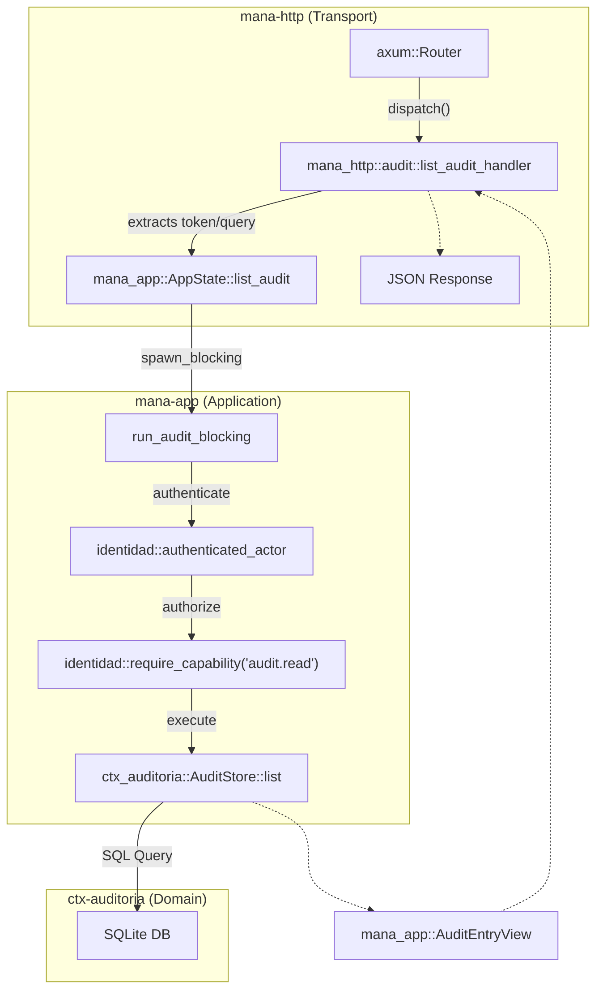

# mana-app and mana-http: Application and Transport Layers

Relevant source files

- 
- 
- 
- 
- 
- 
- 
- 
- 
- 
- 
- 
- 
- 
- 
- 
- 
- 
- 
- 
- 
- 

This page describes the orchestration and transport layers of the Hub. Together, they manage the lifecycle of an HTTP request, from its arrival at the Axum router to the execution of complex business logic that spans multiple domain contexts.

## The Request Lifecycle

The Hub follows a strict flow where the transport layer (`mana-http`) handles the "outer" concerns (HTTP verbs, path parsing, serialization) and delegates the "inner" business logic to the application layer (`mana-app`).

### Data Flow Diagram

The following diagram illustrates how a request for an audit log entry flows through the system entities.

**Request Flow: Audit Log Retrieval**

**Sources:** [crates/mana-http/src/lib.rs194-201](https://github.com/pbaalerta-wq/hubp/blob/cc2edd14/crates/mana-http/src/lib.rs#L194-L201) [crates/mana-app/src/auditoria.rs34-74](https://github.com/pbaalerta-wq/hubp/blob/cc2edd14/crates/mana-app/src/auditoria.rs#L34-L74) [docs/funcional/modulos/mana-app.md16-21](https://github.com/pbaalerta-wq/hubp/blob/cc2edd14/docs/funcional/modulos/mana-app.md?plain=1#L16-L21)

---

## mana-http: Transport Layer

`mana-http` serves as the entry point for all external communication. It is built on the **Axum** framework and uses a specialized `RouteTable` to manage the transition from the legacy Node.js implementation to the Rust Hub.

### The Route Table (`rutas.toml`)

The system uses a central inventory defined in `rutas.toml` [crates/mana-http/src/routes.rs7](https://github.com/pbaalerta-wq/hubp/blob/cc2edd14/crates/mana-http/src/routes.rs#L7-L7) This table determines if a route is served by the Rust Hub or if it was previously a Node.js fallback (retired in F9) [crates/mana-http/src/routes.rs69-72](https://github.com/pbaalerta-wq/hubp/blob/cc2edd14/crates/mana-http/src/routes.rs#L69-L72)

Key components:

- **`Serve` Enum**: Distinguishes between `Rust` and `Node` handlers [crates/mana-http/src/routes.rs12-15](https://github.com/pbaalerta-wq/hubp/blob/cc2edd14/crates/mana-http/src/routes.rs#L12-L15)
- **`dispatch` function**: A centralized Axum fallback that matches incoming requests against the `RouteTable` and routes them to the appropriate `RustHandler` [crates/mana-http/src/lib.rs194-216](https://github.com/pbaalerta-wq/hubp/blob/cc2edd14/crates/mana-http/src/lib.rs#L194-L216)
- **`path_segment`**: A utility to reliably extract parameters from the URI path based on fixed indices, ensuring consistency across different handlers [crates/mana-http/src/lib.rs184-192](https://github.com/pbaalerta-wq/hubp/blob/cc2edd14/crates/mana-http/src/lib.rs#L184-L192)

**Sources:** [crates/mana-http/src/routes.rs17-26](https://github.com/pbaalerta-wq/hubp/blob/cc2edd14/crates/mana-http/src/routes.rs#L17-L26) [crates/mana-http/src/lib.rs119-129](https://github.com/pbaalerta-wq/hubp/blob/cc2edd14/crates/mana-http/src/lib.rs#L119-L129) [crates/mana-http/src/lib.rs184-192](https://github.com/pbaalerta-wq/hubp/blob/cc2edd14/crates/mana-http/src/lib.rs#L184-L192)

---

## mana-app: Application Layer

`mana-app` is the only crate allowed to import multiple `ctx-*` crates [docs/funcional/modulos/mana-app.md5-6](https://github.com/pbaalerta-wq/hubp/blob/cc2edd14/docs/funcional/modulos/mana-app.md?plain=1#L5-L6) Its primary responsibilities are cross-context coordination, capability-based authorization, and managing the sync/async boundary.

### AppState and Stores

The `AppState` struct holds the "Stores" for every context. This allows `mana-app` to perform atomic operations across domains, such as assigning a bed (which involves `ctx-poblacion`, `ctx-residencia`, and `ctx-auditoria`) [docs/funcional/modulos/mana-app.md94-101](https://github.com/pbaalerta-wq/hubp/blob/cc2edd14/docs/funcional/modulos/mana-app.md?plain=1#L94-L101)

### Command-View Pattern

To keep the domain logic pure and the transport layer decoupled, `mana-app` uses:

- **Commands**: Simple structs representing the intent and input data (e.g., `CreateAgregadoCommand`) [docs/project/guia-onboarding-contexto.md225-227](https://github.com/pbaalerta-wq/hubp/blob/cc2edd14/docs/project/guia-onboarding-contexto.md?plain=1#L225-L227)
- **Views**: Plain Data Transfer Objects (DTOs) that are serializable to JSON for the `mana-wire` layer (e.g., `AuditEntryView`) [crates/mana-app/src/auditoria.rs22-32](https://github.com/pbaalerta-wq/hubp/blob/cc2edd14/crates/mana-app/src/auditoria.rs#L22-L32)

### Authorization: Capability-Based

Authorization is not checked at the HTTP level but inside `mana-app` use cases. It uses the `AuthenticatedActor` read model:

1. **`required_token`**: Extracts and validates the Bearer token [crates/mana-app/src/auditoria.rs40](https://github.com/pbaalerta-wq/hubp/blob/cc2edd14/crates/mana-app/src/auditoria.rs#L40-L40)
2. **`require_capability`**: Verifies if the actor possesses the specific string-based permission (e.g., `master.structure.write`) before proceeding [crates/mana-app/src/auditoria.rs47](https://github.com/pbaalerta-wq/hubp/blob/cc2edd14/crates/mana-app/src/auditoria.rs#L47-L47)

**Sources:** [docs/funcional/modulos/mana-app.md5-10](https://github.com/pbaalerta-wq/hubp/blob/cc2edd14/docs/funcional/modulos/mana-app.md?plain=1#L5-L10) [docs/funcional/modulos/mana-app.md73-81](https://github.com/pbaalerta-wq/hubp/blob/cc2edd14/docs/funcional/modulos/mana-app.md?plain=1#L73-L81) [crates/mana-app/src/auditoria.rs40-47](https://github.com/pbaalerta-wq/hubp/blob/cc2edd14/crates/mana-app/src/auditoria.rs#L40-L47)

---

## Technical Implementation Details

### The Async/Sync Boundary

Since the underlying persistence layer (Diesel/SQLite) is synchronous, `mana-app` must protect the Axum async runtime from blocking. Every database-heavy operation is wrapped in `tokio::task::spawn_blocking` [docs/funcional/modulos/mana-app.md82-86](https://github.com/pbaalerta-wq/hubp/blob/cc2edd14/docs/funcional/modulos/mana-app.md?plain=1#L82-L86)

**Entity Mapping: Sync/Async Boundary**

**Sources:** [crates/mana-app/src/auditoria.rs85-91](https://github.com/pbaalerta-wq/hubp/blob/cc2edd14/crates/mana-app/src/auditoria.rs#L85-L91) [docs/funcional/modulos/mana-app.md82-86](https://github.com/pbaalerta-wq/hubp/blob/cc2edd14/docs/funcional/modulos/mana-app.md?plain=1#L82-L86)

### Error Mapping: AppFailure

Errors from individual contexts (e.g., `ResidenceError`, `PoblacionError`) are converted into a unified `AppFailure` type [crates/mana-app/src/error.rs16-20](https://github.com/pbaalerta-wq/hubp/blob/cc2edd14/crates/mana-app/src/error.rs#L16-L20) This struct maps domain-specific errors to the `mana-kernel::Fallo` vocabulary, which determines the final HTTP status code (e.g., `Fallo::Conflict` becomes `409 Conflict`) [crates/mana-app/src/error.rs81-82](https://github.com/pbaalerta-wq/hubp/blob/cc2edd14/crates/mana-app/src/error.rs#L81-L82)

|Domain Error|AppFailure (Fallo)|Typical HTTP Code|
|---|---|---|
|`NotFound`|`Fallo::NotFound`|404|
|`Conflict`|`Fallo::Conflict`|409|
|`Validation`|`Fallo::ValidationError`|400|
|`DieselError`|`Fallo::InternalError`|500|

**Sources:** [crates/mana-app/src/error.rs16-20](https://github.com/pbaalerta-wq/hubp/blob/cc2edd14/crates/mana-app/src/error.rs#L16-L20) [crates/mana-app/src/error.rs71-76](https://github.com/pbaalerta-wq/hubp/blob/cc2edd14/crates/mana-app/src/error.rs#L71-L76) [crates/mana-app/src/error.rs80-82](https://github.com/pbaalerta-wq/hubp/blob/cc2edd14/crates/mana-app/src/error.rs#L80-L82)

### Transaction Coordination

`mana-app` coordinates complex mutations by opening a single SQLite transaction and passing the connection to multiple context stores. This ensures that if an audit log entry fails to write, the associated business mutation (like discharging a resident) is also rolled back [docs/funcional/modulos/mana-app.md60-69](https://github.com/pbaalerta-wq/hubp/blob/cc2edd14/docs/funcional/modulos/mana-app.md?plain=1#L60-L69)

**Sources:** [docs/funcional/modulos/mana-app.md60-69](https://github.com/pbaalerta-wq/hubp/blob/cc2edd14/docs/funcional/modulos/mana-app.md?plain=1#L60-L69) [docs/funcional/modulos/mana-app.md113-117](https://github.com/pbaalerta-wq/hubp/blob/cc2edd14/docs/funcional/modulos/mana-app.md?plain=1#L113-L117)

### On this page

- [mana-app and mana-http: Application and Transport Layers](https://deepwiki.com/pbaalerta-wq/hubp/2.4-mana-app-and-mana-http:-application-and-transport-layers#mana-app-and-mana-http-application-and-transport-layers)
- [The Request Lifecycle](https://deepwiki.com/pbaalerta-wq/hubp/2.4-mana-app-and-mana-http:-application-and-transport-layers#the-request-lifecycle)
- [Data Flow Diagram](https://deepwiki.com/pbaalerta-wq/hubp/2.4-mana-app-and-mana-http:-application-and-transport-layers#data-flow-diagram)
- [mana-http: Transport Layer](https://deepwiki.com/pbaalerta-wq/hubp/2.4-mana-app-and-mana-http:-application-and-transport-layers#mana-http-transport-layer)
- [The Route Table (`rutas.toml`)](https://deepwiki.com/pbaalerta-wq/hubp/2.4-mana-app-and-mana-http:-application-and-transport-layers#the-route-table-rutastoml)
- [mana-app: Application Layer](https://deepwiki.com/pbaalerta-wq/hubp/2.4-mana-app-and-mana-http:-application-and-transport-layers#mana-app-application-layer)
- [AppState and Stores](https://deepwiki.com/pbaalerta-wq/hubp/2.4-mana-app-and-mana-http:-application-and-transport-layers#appstate-and-stores)
- [Command-View Pattern](https://deepwiki.com/pbaalerta-wq/hubp/2.4-mana-app-and-mana-http:-application-and-transport-layers#command-view-pattern)
- [Authorization: Capability-Based](https://deepwiki.com/pbaalerta-wq/hubp/2.4-mana-app-and-mana-http:-application-and-transport-layers#authorization-capability-based)
- [Technical Implementation Details](https://deepwiki.com/pbaalerta-wq/hubp/2.4-mana-app-and-mana-http:-application-and-transport-layers#technical-implementation-details)
- [The Async/Sync Boundary](https://deepwiki.com/pbaalerta-wq/hubp/2.4-mana-app-and-mana-http:-application-and-transport-layers#the-asyncsync-boundary)
- [Error Mapping: AppFailure](https://deepwiki.com/pbaalerta-wq/hubp/2.4-mana-app-and-mana-http:-application-and-transport-layers#error-mapping-appfailure)
- [Transaction Coordination](https://deepwiki.com/pbaalerta-wq/hubp/2.4-mana-app-and-mana-http:-application-and-transport-layers#transaction-coordination)

