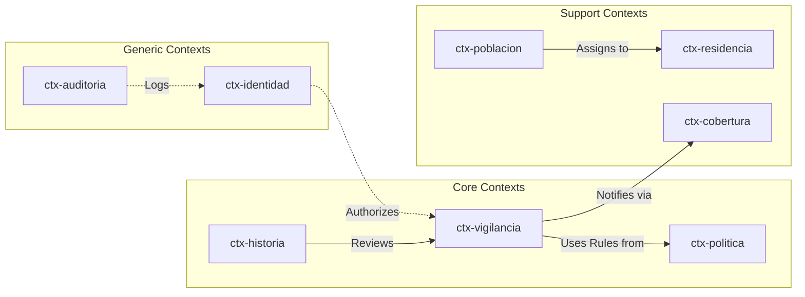

# Bounded Contexts

Relevant source files

- 
- 
- 
- 
- 
- 
- 
- 
- 
- 
- 

The domain logic of the **mana-hub** system is partitioned into 11 distinct **Bounded Contexts** (`ctx-*`). Each context represents a specific boundary of language, ownership, and consistency. These contexts are implemented as independent Rust crates within the `crates/` directory, ensuring that business rules are decoupled from transport and persistence layers.

### Architectural Rules

The following rules govern the design and implementation of every bounded context:

1. **Single Ownership**: Every database table in the system belongs to exactly one context [docs/contextos/README.md7-9](https://github.com/pbaalerta-wq/hubp/blob/cc2edd14/docs/contextos/README.md?plain=1#L7-L9)
2. **No Cross-Context Imports**: A `ctx-*` crate cannot depend on another `ctx-*` crate. Cross-context coordination is performed exclusively by `mana-app` [docs/contextos/ctx-identidad.md77-79](https://github.com/pbaalerta-wq/hubp/blob/cc2edd14/docs/contextos/ctx-identidad.md?plain=1#L77-L79)
3. **Encapsulated Persistence**: Each context owns its Diesel schema and migrations [docs/funcional/modelo-dominio/README.md47-48](https://github.com/pbaalerta-wq/hubp/blob/cc2edd14/docs/funcional/modelo-dominio/README.md?plain=1#L47-L48)
4. **Classification**: Contexts are classified as `core` (differentiating logic), `support` (facility/staff management), or `generic` (identity/audit) [crates/PLANTILLA-CONTEXTO.md25-27](https://github.com/pbaalerta-wq/hubp/blob/cc2edd14/crates/PLANTILLA-CONTEXTO.md?plain=1#L25-L27)

### Context Map: Language to Code

The following diagram bridges the natural language domain concepts to their specific code implementations and primary data entities.

**Domain to Code Entity Mapping**

**Sources:** [docs/funcional/README.md35-43](https://github.com/pbaalerta-wq/hubp/blob/cc2edd14/docs/funcional/README.md?plain=1#L35-L43) [docs/contextos/README.md13-21](https://github.com/pbaalerta-wq/hubp/blob/cc2edd14/docs/contextos/README.md?plain=1#L13-L21) [docs/funcional/modelo-dominio/README.md19-27](https://github.com/pbaalerta-wq/hubp/blob/cc2edd14/docs/funcional/modelo-dominio/README.md?plain=1#L19-L27)

---

### 3.1 Identity and Audit

**Crates:** `ctx-identidad`, `ctx-auditoria`

These contexts provide the generic foundation for security and accountability. `ctx-identidad` manages `users` and their `auth_sessions`, handling Argon2 password hashing and capability-based authorization [crates/ctx-identidad/Cargo.toml8-18](https://github.com/pbaalerta-wq/hubp/blob/cc2edd14/crates/ctx-identidad/Cargo.toml#L8-L18) `ctx-auditoria` provides an append-only `audit_log` that records every mutation in the system, typically executed within the same transaction as the domain change [docs/funcional/README.md65-67](https://github.com/pbaalerta-wq/hubp/blob/cc2edd14/docs/funcional/README.md?plain=1#L65-L67)

For details, see [Identity and Audit (ctx-identidad, ctx-auditoria)](https://deepwiki.com/pbaalerta-wq/hubp/3.1-identity-and-audit-\(ctx-identidad-ctx-auditoria\)).

**Sources:** [docs/contextos/README.md13-14](https://github.com/pbaalerta-wq/hubp/blob/cc2edd14/docs/contextos/README.md?plain=1#L13-L14) [crates/ctx-identidad/Cargo.toml1-19](https://github.com/pbaalerta-wq/hubp/blob/cc2edd14/crates/ctx-identidad/Cargo.toml#L1-L19)

---

### 3.2 Facility Structure

**Crate:** `ctx-residencia`

This context manages the physical hierarchy of the care facility. It defines the relationship between `facilities`, `wings`, `rooms`, and `beds`. It also handles the `wing_planograms` for spatial visualization and `room_privacy_configs` for masking sensitive areas [docs/funcional/modelo-dominio/README.md21](https://github.com/pbaalerta-wq/hubp/blob/cc2edd14/docs/funcional/modelo-dominio/README.md?plain=1#L21-L21)

For details, see [Facility Structure (ctx-residencia)](https://deepwiki.com/pbaalerta-wq/hubp/3.2-facility-structure-\(ctx-residencia\)).

**Sources:** [docs/funcional/README.md17](https://github.com/pbaalerta-wq/hubp/blob/cc2edd14/docs/funcional/README.md?plain=1#L17-L17) [docs/contextos/README.md15](https://github.com/pbaalerta-wq/hubp/blob/cc2edd14/docs/contextos/README.md?plain=1#L15-L15)

---

### 3.3 Population and Residents

**Crate:** `ctx-poblacion`

Manages the lifecycle of people receiving care. It tracks `residents` and their temporal `resident_bed_assignments`. A key invariant in this context is the 1-to-1 occupancy rule: a bed cannot have two active residents, and a resident cannot be in two beds simultaneously [docs/funcional/modelo-dominio/README.md22](https://github.com/pbaalerta-wq/hubp/blob/cc2edd14/docs/funcional/modelo-dominio/README.md?plain=1#L22-L22)

For details, see [Population and Residents (ctx-poblacion)](https://deepwiki.com/pbaalerta-wq/hubp/3.3-population-and-residents-\(ctx-poblacion\)).

**Sources:** [docs/funcional/README.md18](https://github.com/pbaalerta-wq/hubp/blob/cc2edd14/docs/funcional/README.md?plain=1#L18-L18) [crates/ctx-poblacion/Cargo.toml1-15](https://github.com/pbaalerta-wq/hubp/blob/cc2edd14/crates/ctx-poblacion/Cargo.toml#L1-L15)

---

### 3.4 Coverage and Care

**Crates:** `ctx-cobertura`, `ctx-cuidado`

`ctx-cobertura` manages staff organization, including `staff_groups` and `facility_shifts`. It tracks `unit_shift_coverages` to determine which group is responsible for a wing at any given minute [docs/funcional/modelo-dominio/README.md23](https://github.com/pbaalerta-wq/hubp/blob/cc2edd14/docs/funcional/modelo-dominio/README.md?plain=1#L23-L23) `ctx-cuidado` handles the operational side of care, including `rounds`, `round_tasks`, and `care_notes` [docs/funcional/README.md20](https://github.com/pbaalerta-wq/hubp/blob/cc2edd14/docs/funcional/README.md?plain=1#L20-L20)

For details, see [Coverage and Care (ctx-cobertura, ctx-cuidado)](https://deepwiki.com/pbaalerta-wq/hubp/3.4-coverage-and-care-\(ctx-cobertura-ctx-cuidado\)).

**Sources:** [docs/contextos/README.md17-18](https://github.com/pbaalerta-wq/hubp/blob/cc2edd14/docs/contextos/README.md?plain=1#L17-L18) [crates/ctx-cuidado/Cargo.toml1-15](https://github.com/pbaalerta-wq/hubp/blob/cc2edd14/crates/ctx-cuidado/Cargo.toml#L1-L15)

---

### 3.5 Alarm Policy

**Crate:** `ctx-politica`

This context defines the "rules of engagement" for the surveillance system. It manages the `AlarmCatalog` (defined in TOML) and the temporal `alarm_profile_versions`. It allows for a hierarchy of overrides (Global → Wing → Resident) and supports an "autopilot" mode for automated sensitivity adjustments [docs/funcional/README.md22](https://github.com/pbaalerta-wq/hubp/blob/cc2edd14/docs/funcional/README.md?plain=1#L22-L22)

For details, see [Alarm Policy (ctx-politica)](https://deepwiki.com/pbaalerta-wq/hubp/3.5-alarm-policy-\(ctx-politica\)).

**Sources:** [docs/contextos/README.md20](https://github.com/pbaalerta-wq/hubp/blob/cc2edd14/docs/contextos/README.md?plain=1#L20-L20) [crates/ctx-politica/Cargo.toml1-18](https://github.com/pbaalerta-wq/hubp/blob/cc2edd14/crates/ctx-politica/Cargo.toml#L1-L18)

---

### 3.6 Surveillance and Alerts

**Crate:** `ctx-vigilancia`

The core operational context of the system. It manages the `alerts` aggregate and its state machine transitions (`Open` → `Acknowledged` → `Attending` → `Resolved`). It also tracks `notification_deliveries` to ensure staff are notified via the appropriate channels and handles the escalation logic if alerts are not attended to within set thresholds [docs/funcional/modelo-dominio/README.md27](https://github.com/pbaalerta-wq/hubp/blob/cc2edd14/docs/funcional/modelo-dominio/README.md?plain=1#L27-L27)

For details, see [Surveillance and Alerts (ctx-vigilancia)](https://deepwiki.com/pbaalerta-wq/hubp/3.6-surveillance-and-alerts-\(ctx-vigilancia\)).

**Sources:** [docs/funcional/README.md23](https://github.com/pbaalerta-wq/hubp/blob/cc2edd14/docs/funcional/README.md?plain=1#L23-L23) [crates/ctx-vigilancia/Cargo.toml1-17](https://github.com/pbaalerta-wq/hubp/blob/cc2edd14/crates/ctx-vigilancia/Cargo.toml#L1-L17)

---

### 3.7 Clinical History and Evidence

**Crates:** `ctx-historia`, `ctx-evidence`

These contexts manage the long-term clinical record. `ctx-historia` handles `incident_detections` and the `incident_reviews` performed by clinical staff [docs/funcional/modelo-dominio/README.md25](https://github.com/pbaalerta-wq/hubp/blob/cc2edd14/docs/funcional/modelo-dominio/README.md?plain=1#L25-L25) `ctx-evidence` stores the raw data supporting these incidents, including `timelines` and `clip_windows` for video playback [docs/funcional/modelo-dominio/README.md28](https://github.com/pbaalerta-wq/hubp/blob/cc2edd14/docs/funcional/modelo-dominio/README.md?plain=1#L28-L28)

For details, see [Clinical History and Evidence (ctx-historia, ctx-evidence)](https://deepwiki.com/pbaalerta-wq/hubp/3.7-clinical-history-and-evidence-\(ctx-historia-ctx-evidence\)).

**Sources:** [docs/funcional/README.md21](https://github.com/pbaalerta-wq/hubp/blob/cc2edd14/docs/funcional/README.md?plain=1#L21-L21) [docs/contextos/README.md19](https://github.com/pbaalerta-wq/hubp/blob/cc2edd14/docs/contextos/README.md?plain=1#L19-L19)

---

### Context Inter-dependency and Data Flow

While contexts are isolated at the crate level, they interact through the `mana-app` layer to fulfill complex use cases.

**High-Level Context Interaction**

**Sources:** [docs/funcional/README.md58-64](https://github.com/pbaalerta-wq/hubp/blob/cc2edd14/docs/funcional/README.md?plain=1#L58-L64) [docs/funcional/modelo-dominio/README.md42-49](https://github.com/pbaalerta-wq/hubp/blob/cc2edd14/docs/funcional/modelo-dominio/README.md?plain=1#L42-L49)

### On this page

- [Bounded Contexts](https://deepwiki.com/pbaalerta-wq/hubp/3-bounded-contexts#bounded-contexts)
- [Architectural Rules](https://deepwiki.com/pbaalerta-wq/hubp/3-bounded-contexts#architectural-rules)
- [Context Map: Language to Code](https://deepwiki.com/pbaalerta-wq/hubp/3-bounded-contexts#context-map-language-to-code)
- [3.1 Identity and Audit](https://deepwiki.com/pbaalerta-wq/hubp/3-bounded-contexts#31-identity-and-audit)
- [3.2 Facility Structure](https://deepwiki.com/pbaalerta-wq/hubp/3-bounded-contexts#32-facility-structure)
- [3.3 Population and Residents](https://deepwiki.com/pbaalerta-wq/hubp/3-bounded-contexts#33-population-and-residents)
- [3.4 Coverage and Care](https://deepwiki.com/pbaalerta-wq/hubp/3-bounded-contexts#34-coverage-and-care)
- [3.5 Alarm Policy](https://deepwiki.com/pbaalerta-wq/hubp/3-bounded-contexts#35-alarm-policy)
- [3.6 Surveillance and Alerts](https://deepwiki.com/pbaalerta-wq/hubp/3-bounded-contexts#36-surveillance-and-alerts)
- [3.7 Clinical History and Evidence](https://deepwiki.com/pbaalerta-wq/hubp/3-bounded-contexts#37-clinical-history-and-evidence)
- [Context Inter-dependency and Data Flow](https://deepwiki.com/pbaalerta-wq/hubp/3-bounded-contexts#context-inter-dependency-and-data-flow)
