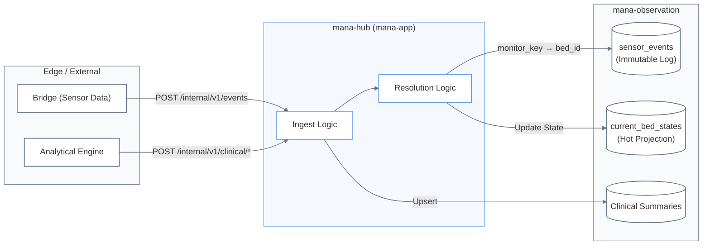

# Observation and Sensor Pipeline

Relevant source files

- 
- 
- 
- 
- 
- 
- 
- 
- 
- 
- 
- 
- 
- 

The **Observation and Sensor Pipeline** is the system of record for all external evidence provided by sensors and analytical engines. It manages the lifecycle of raw sensor data, real-time bed state projections, and clinical daily summaries.

Unlike other `ctx-*` crates, `mana-observation` is a **data lifecycle subsystem**, not a business bounded context [docs/funcional/casos-uso/observacion.md3-9](https://github.com/pbaalerta-wq/hubp/blob/cc2edd14/docs/funcional/casos-uso/observacion.md?plain=1#L3-L9) It focuses on high-volume ingestion, idempotency, and operational projections, keeping these concerns separate from the clinical and facility registries.

## Pipeline Architecture

The pipeline bridges the gap between the physical world (identified by `monitor_key`) and the clinical world (identified by `bed_id` and `resident_id`).

_Sources: [crates/mana-app/src/observation.rs40-105](https://github.com/pbaalerta-wq/hubp/blob/cc2edd14/crates/mana-app/src/observation.rs#L40-L105) [docs/funcional/casos-uso/observacion.md37-60](https://github.com/pbaalerta-wq/hubp/blob/cc2edd14/docs/funcional/casos-uso/observacion.md?plain=1#L37-L60)_

### Key Architectural Rules

1. **Isolation**: No `ctx-*` crate is allowed to depend on `mana-observation`. This prevents the observation projection from becoming a "backdoor" for cross-context coupling [docs/funcional/casos-uso/observacion.md11-14](https://github.com/pbaalerta-wq/hubp/blob/cc2edd14/docs/funcional/casos-uso/observacion.md?plain=1#L11-L14)
2. **Resolution Obligation**: Sensors identify themselves via `monitor_key`. The hub must resolve this to a `bed_id` using `ctx-residencia` and to a `resident_id` using `ctx-poblacion` [crates/mana-observation/src/evidence/mod.rs15-29](https://github.com/pbaalerta-wq/hubp/blob/cc2edd14/crates/mana-observation/src/evidence/mod.rs#L15-L29)
3. **Idempotency**: All ingestion endpoints use a `source_event_id` or `source_record_id` to ensure that retries do not result in duplicate data or incorrect state transitions [docs/funcional/modelo-dominio/observacion.md99-101](https://github.com/pbaalerta-wq/hubp/blob/cc2edd14/docs/funcional/modelo-dominio/observacion.md?plain=1#L99-L101)

---

## Sensor Events and Bed State Projections

The system maintains an immutable log of every sensor message received and a "hot" projection of the current state for every bed.

- **`sensor_events`**: An append-only table storing the raw data, including a `payload_json` blob for forward compatibility with new sensor features [crates/mana-observation/src/schema.rs1-17](https://github.com/pbaalerta-wq/hubp/blob/cc2edd14/crates/mana-observation/src/schema.rs#L1-L17)
- **`current_bed_states`**: A high-performance projection used for the Monitoring Board. It tracks the current `state`, `substate`, and `sleeping` status.
- **Freshness**: The system distinguishes between `Live`, `Stale`, and `Offline` states based on the `updated_at` timestamp, rather than persisting a status string that could become outdated [docs/funcional/modelo-dominio/observacion.md63-71](https://github.com/pbaalerta-wq/hubp/blob/cc2edd14/docs/funcional/modelo-dominio/observacion.md?plain=1#L63-L71)

For details on the state machine and resolution logic, see **[Sensor Events and Bed State Projections](https://deepwiki.com/pbaalerta-wq/hubp/4.1-sensor-events-and-bed-state-projections)**.

---

## Clinical Summaries

Analytical engines provide daily summaries for Sleep, Mobility, and Bathroom activity. These are treated as evidence rather than registry records.

|Summary Type|Key Metrics|Invariants|
|---|---|---|
|**Sleep**|Calm/Restless mins, Wakes, Exits|`wake_count >= bed_exit_count`|
|**Mobility**|Walking mins, Transfers, Distance|`walking_minutes <= out_of_bed_minutes`|
|**Bathroom**|Visit counts, Night visits, Duration|`night_visit_count <= visit_count`|

Summaries are unique per `(resident_id, observed_on)`. Re-ingesting a summary for the same day replaces the existing record to allow for analytical recalibrations [crates/mana-observation/src/summaries/sqlite.rs16-21](https://github.com/pbaalerta-wq/hubp/blob/cc2edd14/crates/mana-observation/src/summaries/sqlite.rs#L16-L21)

For details on the clinical data models and validation rules, see **[Clinical Summaries (Sleep, Mobility, Bathroom)](https://deepwiki.com/pbaalerta-wq/hubp/4.2-clinical-summaries-\(sleep-mobility-bathroom\))**.

---

## Video Streams and Regions

Managed by `ctx-streams`, this layer handles the spatial and networking aspects of visual observation.

- **Stream Registration**: Mapping physical `stream_key` identifiers to Rooms.
- **Privacy Regions**: Defining polygon coordinates within a stream's field of view that must be obscured.
- **Audited Peeking**: The Hub does not proxy video; it authorizes access and logs a `room.peeked` event in the audit trail [docs/funcional/casos-uso/observacion.md148-159](https://github.com/pbaalerta-wq/hubp/blob/cc2edd14/docs/funcional/casos-uso/observacion.md?plain=1#L148-L159)

For details on stream configuration and ROI (Region of Interest) management, see **[Video Streams and Regions (ctx-streams)](https://deepwiki.com/pbaalerta-wq/hubp/4.3-video-streams-and-regions-\(ctx-streams\))**.

---

## Code Entity Map

|Logical Entity|Code Symbol|File Path|
|---|---|---|
|**Event Ingestion**|`IngestEventCommand`|[crates/mana-app/src/observation.rs43-54](https://github.com/pbaalerta-wq/hubp/blob/cc2edd14/crates/mana-app/src/observation.rs#L43-L54)|
|**Resolution Enum**|`Resolution`|[crates/mana-observation/src/evidence/mod.rs21-29](https://github.com/pbaalerta-wq/hubp/blob/cc2edd14/crates/mana-observation/src/evidence/mod.rs#L21-L29)|
|**Bed State View**|`BedStateView`|[crates/mana-app/src/observation.rs133-144](https://github.com/pbaalerta-wq/hubp/blob/cc2edd14/crates/mana-app/src/observation.rs#L133-L144)|
|**Sleep Ingest**|`upsert_sleep`|[crates/mana-observation/src/summaries/sqlite.rs73-76](https://github.com/pbaalerta-wq/hubp/blob/cc2edd14/crates/mana-observation/src/summaries/sqlite.rs#L73-L76)|
|**Schema Definition**|`sensor_events`|[crates/mana-observation/src/schema.rs1-18](https://github.com/pbaalerta-wq/hubp/blob/cc2edd14/crates/mana-observation/src/schema.rs#L1-L18)|
|**SDK Client**|`ManaClient::ingest_event`|[crates/mana-sdk/src/observacion.rs243-247](https://github.com/pbaalerta-wq/hubp/blob/cc2edd14/crates/mana-sdk/src/observacion.rs#L243-L247)|

**Sources:**

- `crates/mana-observation/src/evidence/mod.rs`
- `crates/mana-observation/src/summaries/sqlite.rs`
- `crates/mana-app/src/observation.rs`
- `docs/funcional/modelo-dominio/observacion.md`
- `docs/funcional/casos-uso/observacion.md`

### On this page

- [Observation and Sensor Pipeline](https://deepwiki.com/pbaalerta-wq/hubp/4-observation-and-sensor-pipeline#observation-and-sensor-pipeline)
- [Pipeline Architecture](https://deepwiki.com/pbaalerta-wq/hubp/4-observation-and-sensor-pipeline#pipeline-architecture)
- [Key Architectural Rules](https://deepwiki.com/pbaalerta-wq/hubp/4-observation-and-sensor-pipeline#key-architectural-rules)
- [Sensor Events and Bed State Projections](https://deepwiki.com/pbaalerta-wq/hubp/4-observation-and-sensor-pipeline#sensor-events-and-bed-state-projections)
- [Clinical Summaries](https://deepwiki.com/pbaalerta-wq/hubp/4-observation-and-sensor-pipeline#clinical-summaries)
- [Video Streams and Regions](https://deepwiki.com/pbaalerta-wq/hubp/4-observation-and-sensor-pipeline#video-streams-and-regions)
- [Code Entity Map](https://deepwiki.com/pbaalerta-wq/hubp/4-observation-and-sensor-pipeline#code-entity-map)
