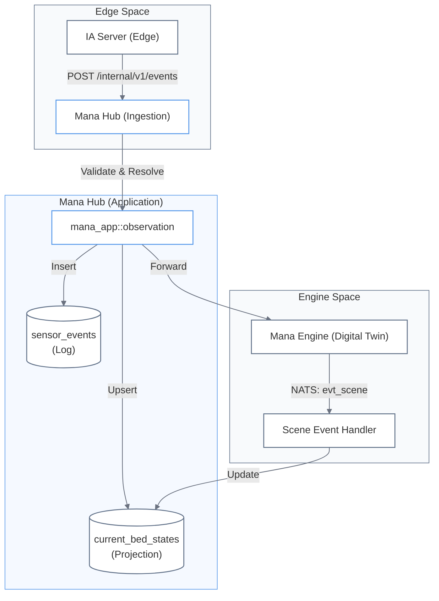
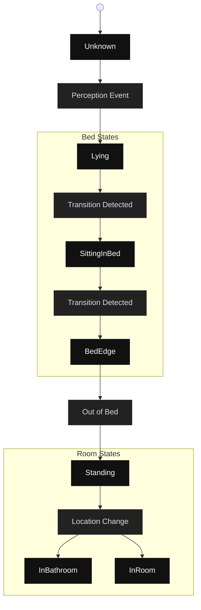

# Sensor Events and Bed State Projections

Relevant source files

- 
- 
- 
- 
- 
- 
- 
- 
- 
- 
- 
- 
- 
- 
- 
- 
- 
- 
- 
- 

This page documents the **Observation Subsystem**, which handles the lifecycle of raw sensor data and the operational projection of bed states. Unlike business-bounded contexts (`ctx-*`), Observation is a data lifecycle subsystem focused on high-volume evidence persistence and low-latency state read models [docs/contextos/observacion.md1-4](https://github.com/pbaalerta-wq/hubp/blob/cc2edd14/docs/contextos/observacion.md?plain=1#L1-L4)

## System Overview

The pipeline transforms raw detector observations (**Perception Events**) into a structured, immutable log (**Sensor Events**) and a "hot" operational view (**Current Bed States**).

### Data Flow Architecture

Sources: [docs/contextos/observacion-v2.md15-50](https://github.com/pbaalerta-wq/hubp/blob/cc2edd14/docs/contextos/observacion-v2.md?plain=1#L15-L50) [docs/specs/scene-event.md303-315](https://github.com/pbaalerta-wq/hubp/blob/cc2edd14/docs/specs/scene-event.md?plain=1#L303-L315)

---

## Sensor Events (Immutable Log)

The `sensor_events` table serves as the system's evidence store. Every event accepted by the Hub is immutable [docs/funcional/modelo-dominio/observacion.md11-13](https://github.com/pbaalerta-wq/hubp/blob/cc2edd14/docs/funcional/modelo-dominio/observacion.md?plain=1#L11-L13)

### Data Model and Resolution

The Hub receives a `monitor_key` from the edge, which it must resolve into a `bed_id` and `resident_id` using the `ctx-residencia` and `ctx-poblacion` contexts [docs/funcional/modelo-dominio/observacion.md36-38](https://github.com/pbaalerta-wq/hubp/blob/cc2edd14/docs/funcional/modelo-dominio/observacion.md?plain=1#L36-L38)

|Code Entity|Description|File|
|---|---|---|
|`sensor_events`|Table storing raw evidence.|[crates/mana-observation/src/schema.rs1-18](https://github.com/pbaalerta-wq/hubp/blob/cc2edd14/crates/mana-observation/src/schema.rs#L1-L18)|
|`Resolution`|Enum representing if an event was linked to a bed.|[crates/mana-observation/src/evidence/mod.rs29-34](https://github.com/pbaalerta-wq/hubp/blob/cc2edd14/crates/mana-observation/src/evidence/mod.rs#L29-L34)|
|`unresolved_events`|Count of events with `monitor_key` but no active bed binding.|[crates/mana-app/src/observation.rs223-224](https://github.com/pbaalerta-wq/hubp/blob/cc2edd14/crates/mana-app/src/observation.rs#L223-L224)|

**Invariants:**

- **Idempotency:** The `source_event_id` ensures that retries from the bridge return `200 OK` with `duplicate: true` without creating new records [docs/funcional/casos-uso/observacion.md20-21](https://github.com/pbaalerta-wq/hubp/blob/cc2edd14/docs/funcional/casos-uso/observacion.md?plain=1#L20-L21)
- **Timestamps:** `occurred_at` comes from the sensor; `received_at` is assigned by the Hub upon arrival [docs/funcional/casos-uso/observacion.md23](https://github.com/pbaalerta-wq/hubp/blob/cc2edd14/docs/funcional/casos-uso/observacion.md?plain=1#L23-L23)
- **Resolution:** If a `monitor_key` is not bound to a bed, the event is saved with `Resolution::Unresolved` [docs/funcional/modelo-dominio/observacion.md30-34](https://github.com/pbaalerta-wq/hubp/blob/cc2edd14/docs/funcional/modelo-dominio/observacion.md?plain=1#L30-L34)

---

## Current Bed States (Hot Projection)

The `current_bed_states` table is a high-performance projection used by the **Monitoring Board** and **Resident Current State** views. It is **not** a source of truth; it is fully reconstructible from the event log [docs/funcional/modelo-dominio/observacion.md47-48](https://github.com/pbaalerta-wq/hubp/blob/cc2edd14/docs/funcional/modelo-dominio/observacion.md?plain=1#L47-L48)

### State Management Logic

Sources: [docs/specs/scene-event.md105-124](https://github.com/pbaalerta-wq/hubp/blob/cc2edd14/docs/specs/scene-event.md?plain=1#L105-L124) [docs/specs/scene-event.md129-142](https://github.com/pbaalerta-wq/hubp/blob/cc2edd14/docs/specs/scene-event.md?plain=1#L129-L142)

### Key Properties

- **`state_since` Semantics:** This timestamp only updates when the `PersonState` FSM transitions. Repeating the same state in consecutive events does not reset the clock [docs/funcional/casos-uso/observacion.md27-28](https://github.com/pbaalerta-wq/hubp/blob/cc2edd14/docs/funcional/casos-uso/observacion.md?plain=1#L27-L28)
- **Clear-on-Reassignment:** When a resident is discharged or moved, the projection for that `bed_id` is atomically cleared in the same transaction as the `BedAssignment` update [docs/funcional/casos-uso/observacion.md32-33](https://github.com/pbaalerta-wq/hubp/blob/cc2edd14/docs/funcional/casos-uso/observacion.md?plain=1#L32-L33)
- **Resolution Enum:** Consumers are forced to handle `Unresolved` states via the `Resolution` enum rather than checking for nulls [docs/funcional/modelo-dominio/observacion.md39-43](https://github.com/pbaalerta-wq/hubp/blob/cc2edd14/docs/funcional/modelo-dominio/observacion.md?plain=1#L39-L43)

---

## Freshness and Health

Freshness is a derived state calculated at read-time, never persisted in the database [docs/funcional/modelo-dominio/observacion.md55-57](https://github.com/pbaalerta-wq/hubp/blob/cc2edd14/docs/funcional/modelo-dominio/observacion.md?plain=1#L55-L57)

### Freshness States (`Freshness` Enum)

Defined in [crates/mana-observation/src/state/mod.rs](https://github.com/pbaalerta-wq/hubp/blob/cc2edd14/crates/mana-observation/src/state/mod.rs):

1. **`NotObserved`**: Bed exists but has never reported an event (likely missing `monitor_key`).
2. **`Live`**: Last update within the "Live" threshold.
3. **`Stale`**: Last update exceeds the "Live" threshold but is within "Offline" limits.
4. **`Offline`**: Sensor has stopped communicating for an extended period [docs/funcional/modelo-dominio/observacion.md65-71](https://github.com/pbaalerta-wq/hubp/blob/cc2edd14/docs/funcional/modelo-dominio/observacion.md?plain=1#L65-L71)

---

## Implementation Details

### Data Access Layer

The `mana-observation` crate uses Diesel for SQLite persistence.

|Table|Diesel Schema|Source|
|---|---|---|
|`sensor_events`|`sensor_events`|[crates/mana-observation/src/schema.rs1-18](https://github.com/pbaalerta-wq/hubp/blob/cc2edd14/crates/mana-observation/src/schema.rs#L1-L18)|
|`current_bed_states`|`current_bed_states`|[crates/mana-observation/src/schema.rs20-33](https://github.com/pbaalerta-wq/hubp/blob/cc2edd14/crates/mana-observation/src/schema.rs#L20-L33)|
|`scene_events`|`scene_events`|[crates/mana-observation/src/schema.rs37-51](https://github.com/pbaalerta-wq/hubp/blob/cc2edd14/crates/mana-observation/src/schema.rs#L37-L51)|

### API Endpoints (Application Layer)

The `mana-app` crate implements the cross-context logic required to resolve IDs.

- **Ingest Event:** `POST /internal/v1/events` calls `IngestEventCommand` [crates/mana-app/src/observation.rs43-54](https://github.com/pbaalerta-wq/hubp/blob/cc2edd14/crates/mana-app/src/observation.rs#L43-L54)
- **Resident State:** `GET /api/v1/residents/{id}/current-state` returns `CurrentStateView` [crates/mana-app/src/observation.rs156-160](https://github.com/pbaalerta-wq/hubp/blob/cc2edd14/crates/mana-app/src/observation.rs#L156-L160)
- **Monitoring Board:** `GET /api/v1/wings/{id}/board` aggregates data into `BoardView` [crates/mana-app/src/observation.rs218-224](https://github.com/pbaalerta-wq/hubp/blob/cc2edd14/crates/mana-app/src/observation.rs#L218-L224)

### Scene Event Handling

In the V2 architecture, the Hub processes `SceneEvent` objects emitted by `mana-engine-v2` to update projections.

|Step|Function|File|
|---|---|---|
|**Validation**|`SceneEventHandler::validate`|[docs/design/hub-scene-event-handler.md71-94](https://github.com/pbaalerta-wq/hubp/blob/cc2edd14/docs/design/hub-scene-event-handler.md?plain=1#L71-L94)|
|**Update Projection**|`SceneEventHandler::update_bed_state`|[docs/design/hub-scene-event-handler.md100-118](https://github.com/pbaalerta-wq/hubp/blob/cc2edd14/docs/design/hub-scene-event-handler.md?plain=1#L100-L118)|
|**Persistence**|`SceneEventHandler::persist_event`|[docs/design/hub-scene-event-handler.md123-136](https://github.com/pbaalerta-wq/hubp/blob/cc2edd14/docs/design/hub-scene-event-handler.md?plain=1#L123-L136)|

Sources: [docs/design/hub-scene-event-handler.md34-66](https://github.com/pbaalerta-wq/hubp/blob/cc2edd14/docs/design/hub-scene-event-handler.md?plain=1#L34-L66) [docs/contextos/observacion-v2.md100-101](https://github.com/pbaalerta-wq/hubp/blob/cc2edd14/docs/contextos/observacion-v2.md?plain=1#L100-L101)

### On this page

- [Sensor Events and Bed State Projections](https://deepwiki.com/pbaalerta-wq/hubp/4.1-sensor-events-and-bed-state-projections#sensor-events-and-bed-state-projections)
- [System Overview](https://deepwiki.com/pbaalerta-wq/hubp/4.1-sensor-events-and-bed-state-projections#system-overview)
- [Data Flow Architecture](https://deepwiki.com/pbaalerta-wq/hubp/4.1-sensor-events-and-bed-state-projections#data-flow-architecture)
- [Sensor Events (Immutable Log)](https://deepwiki.com/pbaalerta-wq/hubp/4.1-sensor-events-and-bed-state-projections#sensor-events-immutable-log)
- [Data Model and Resolution](https://deepwiki.com/pbaalerta-wq/hubp/4.1-sensor-events-and-bed-state-projections#data-model-and-resolution)
- [Current Bed States (Hot Projection)](https://deepwiki.com/pbaalerta-wq/hubp/4.1-sensor-events-and-bed-state-projections#current-bed-states-hot-projection)
- [State Management Logic](https://deepwiki.com/pbaalerta-wq/hubp/4.1-sensor-events-and-bed-state-projections#state-management-logic)
- [Key Properties](https://deepwiki.com/pbaalerta-wq/hubp/4.1-sensor-events-and-bed-state-projections#key-properties)
- [Freshness and Health](https://deepwiki.com/pbaalerta-wq/hubp/4.1-sensor-events-and-bed-state-projections#freshness-and-health)
- [Freshness States (`Freshness` Enum)](https://deepwiki.com/pbaalerta-wq/hubp/4.1-sensor-events-and-bed-state-projections#freshness-states-freshness-enum)
- [Implementation Details](https://deepwiki.com/pbaalerta-wq/hubp/4.1-sensor-events-and-bed-state-projections#implementation-details)
- [Data Access Layer](https://deepwiki.com/pbaalerta-wq/hubp/4.1-sensor-events-and-bed-state-projections#data-access-layer)
- [API Endpoints (Application Layer)](https://deepwiki.com/pbaalerta-wq/hubp/4.1-sensor-events-and-bed-state-projections#api-endpoints-application-layer)
- [Scene Event Handling](https://deepwiki.com/pbaalerta-wq/hubp/4.1-sensor-events-and-bed-state-projections#scene-event-handling)

