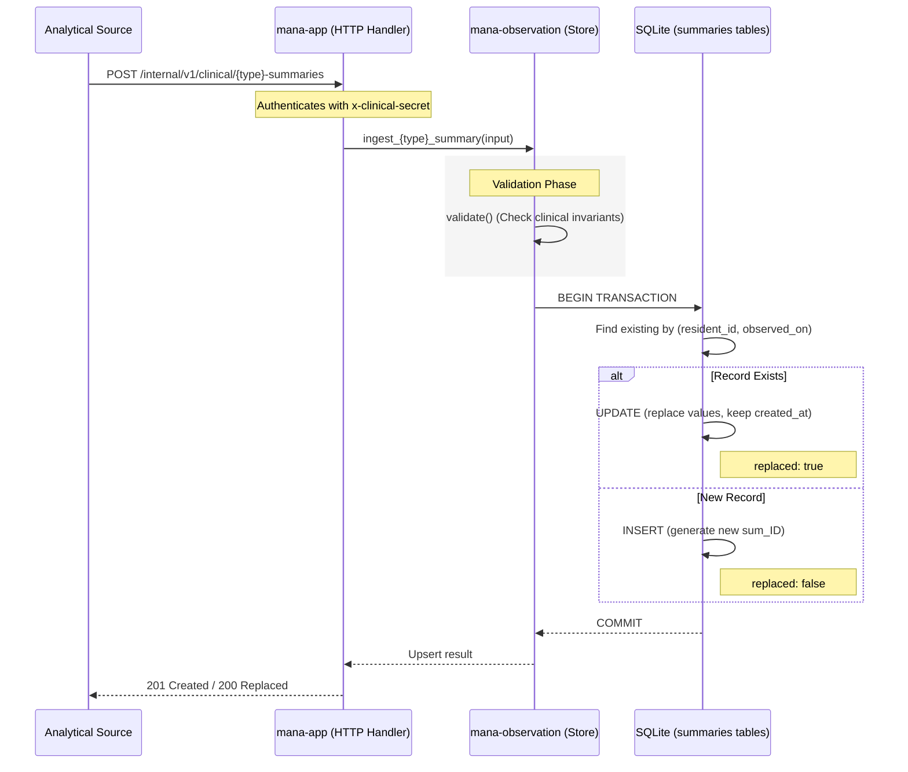

# Clinical Summaries (Sleep, Mobility, Bathroom)

Relevant source files

- 
- 
- 
- 
- 
- 
- 
- 
- 
- 
- 
- 
- 
- 
- 
- 
- 
- 
- 

Clinical summaries are daily analytical aggregates produced by an external perception engine. They provide high-level insights into a resident's physiological and behavioral patterns over a 24-hour period. Unlike sensor events, which are immutable logs of raw evidence, summaries are subject to **upsert semantics**, where re-ingestion for the same resident and date replaces the previous record to allow for analytical recalculations [docs/funcional/modelo-dominio/observacion.md82-84](https://github.com/pbaalerta-wq/hubp/blob/cc2edd14/docs/funcional/modelo-dominio/observacion.md?plain=1#L82-L84)

## System Architecture and Data Flow

Summaries are managed by the `mana-observation` subsystem. While they are persisted in the Hub's SQLite database for API consumption, the subsystem is architecturally isolated from core business logic to ensure that analytical volume does not impact transactional performance [docs/funcional/casos-uso/observacion.md5-9](https://github.com/pbaalerta-wq/hubp/blob/cc2edd14/docs/funcional/casos-uso/observacion.md?plain=1#L5-L9)

### Data Ingestion Flow

The following diagram illustrates the ingestion process from the external analytical source to the Hub's persistence layer.

**Summary Ingestion Lifecycle**

**Sources:** [docs/contrato/modulos/observacion.yaml46-98](https://github.com/pbaalerta-wq/hubp/blob/cc2edd14/docs/contrato/modulos/observacion.yaml#L46-L98) [crates/mana-observation/src/summaries/sqlite.rs73-127](https://github.com/pbaalerta-wq/hubp/blob/cc2edd14/crates/mana-observation/src/summaries/sqlite.rs#L73-L127) [docs/funcional/casos-uso/observacion.md111-123](https://github.com/pbaalerta-wq/hubp/blob/cc2edd14/docs/funcional/casos-uso/observacion.md?plain=1#L111-L123)

---

## Summary Types and Invariants

The system supports three distinct summary types, each with specific clinical validation rules enforced at the domain level in `crates/mana-observation/src/summaries/mod.rs`.

### 1. Sleep Summary (`sleep_summaries`)

Tracks nocturnal rest patterns.

- **Key Fields:** `calm_minutes`, `restless_minutes`, `awake_minutes`, `out_of_bed_minutes`, `bed_exit_count`, `wake_count` [crates/mana-observation/src/schema.rs69-87](https://github.com/pbaalerta-wq/hubp/blob/cc2edd14/crates/mana-observation/src/schema.rs#L69-L87)
- **Invariants:**
    - `wake_count >= bed_exit_count`: Leaving the bed implies having woken up [crates/mana-observation/src/summaries/mod.rs105-110](https://github.com/pbaalerta-wq/hubp/blob/cc2edd14/crates/mana-observation/src/summaries/mod.rs#L105-L110)
    - Total minutes must not exceed 1440 (one day) [crates/mana-observation/src/summaries/mod.rs115-119](https://github.com/pbaalerta-wq/hubp/blob/cc2edd14/crates/mana-observation/src/summaries/mod.rs#L115-L119)

### 2. Mobility Summary (`mobility_summaries`)

Tracks movement and transfers.

- **Key Fields:** `in_bed_minutes`, `out_of_bed_minutes`, `out_of_sight_minutes`, `walking_minutes`, `distance_meters`, `transfer_count` [crates/mana-observation/src/schema.rs89-108](https://github.com/pbaalerta-wq/hubp/blob/cc2edd14/crates/mana-observation/src/schema.rs#L89-L108)
- **Invariants:**
    - `walking_minutes <= out_of_bed_minutes`: Walking is a subset of being out of bed [crates/mana-observation/src/summaries/mod.rs160-165](https://github.com/pbaalerta-wq/hubp/blob/cc2edd14/crates/mana-observation/src/summaries/mod.rs#L160-L165)
    - Total minutes must not exceed 1440 [crates/mana-observation/src/summaries/mod.rs167-171](https://github.com/pbaalerta-wq/hubp/blob/cc2edd14/crates/mana-observation/src/summaries/mod.rs#L167-L171)

### 3. Bathroom Summary (`bathroom_summaries`)

Tracks bathroom usage and assistance needs.

- **Key Fields:** `visit_count`, `night_visit_count`, `assisted_count`, `total_minutes`, `longest_visit_minutes` [crates/mana-observation/src/schema.rs111-128](https://github.com/pbaalerta-wq/hubp/blob/cc2edd14/crates/mana-observation/src/schema.rs#L111-L128)
- **Invariants:**
    - `night_visit_count <= visit_count` [crates/mana-observation/src/summaries/mod.rs202-206](https://github.com/pbaalerta-wq/hubp/blob/cc2edd14/crates/mana-observation/src/summaries/mod.rs#L202-L206)
    - `assisted_count <= visit_count` [crates/mana-observation/src/summaries/mod.rs202-206](https://github.com/pbaalerta-wq/hubp/blob/cc2edd14/crates/mana-observation/src/summaries/mod.rs#L202-L206)
    - `longest_visit_minutes <= total_minutes` [crates/mana-observation/src/summaries/mod.rs207-211](https://github.com/pbaalerta-wq/hubp/blob/cc2edd14/crates/mana-observation/src/summaries/mod.rs#L207-L211)

---

## Technical Implementation Details

### Provenance Metadata

Every summary must include a `Provenance` object. This requirement ensures that clinical data can be audited to determine which model produced the numbers and the associated confidence level [crates/mana-observation/src/summaries/mod.rs23-31](https://github.com/pbaalerta-wq/hubp/blob/cc2edd14/crates/mana-observation/src/summaries/mod.rs#L23-L31)

|Field|Description|
|---|---|
|`source`|The system/engine that generated the summary.|
|`model_version`|The specific version of the analytical model.|
|`confidence`|A value between 0.0 and 1.0.|
|`provenance_json`|Opaque JSON for additional source-specific metadata.|

**Sources:** [crates/mana-observation/src/summaries/mod.rs33-56](https://github.com/pbaalerta-wq/hubp/blob/cc2edd14/crates/mana-observation/src/summaries/mod.rs#L33-L56)

### Persistence and Idempotency

The system uses a `source_record_id` as an idempotency key to prevent duplicate processing from the same source. The database schema enforces a unique constraint on `(resident_id, observed_on)` to ensure only one summary of each type exists per resident per day [docs/funcional/modelo-dominio/observacion.md109](https://github.com/pbaalerta-wq/hubp/blob/cc2edd14/docs/funcional/modelo-dominio/observacion.md?plain=1#L109-L109)

**Entity Mapping**

**Sources:** [crates/mana-observation/src/summaries/sqlite.rs34-53](https://github.com/pbaalerta-wq/hubp/blob/cc2edd14/crates/mana-observation/src/summaries/sqlite.rs#L34-L53) [crates/mana-observation/src/summaries/mod.rs76-87](https://github.com/pbaalerta-wq/hubp/blob/cc2edd14/crates/mana-observation/src/summaries/mod.rs#L76-L87) [crates/mana-observation/src/lib.rs9-15](https://github.com/pbaalerta-wq/hubp/blob/cc2edd14/crates/mana-observation/src/lib.rs#L9-L15)

### Read Models and Derived Metrics

The API does not store calculated fields like "Sleep Efficiency" or "Average Visit Duration". Instead, these are calculated at runtime by the `mana-app` layer during the read operation. This prevents data inconsistency if the underlying columns are updated [docs/funcional/modelo-dominio/observacion.md86-96](https://github.com/pbaalerta-wq/hubp/blob/cc2edd14/docs/funcional/modelo-dominio/observacion.md?plain=1#L86-L96)

- **Sleep Efficiency:** `calm_minutes / (calm + restless + awake)`. Returns `null` if no time was spent in bed [docs/funcional/modelo-dominio/observacion.md91](https://github.com/pbaalerta-wq/hubp/blob/cc2edd14/docs/funcional/modelo-dominio/observacion.md?plain=1#L91-L91)
- **Average Bathroom Visit:** `total_minutes / visit_count` [docs/funcional/modelo-dominio/observacion.md92](https://github.com/pbaalerta-wq/hubp/blob/cc2edd14/docs/funcional/modelo-dominio/observacion.md?plain=1#L92-L92)

**Sources:** [docs/funcional/casos-uso/observacion.md143-146](https://github.com/pbaalerta-wq/hubp/blob/cc2edd14/docs/funcional/casos-uso/observacion.md?plain=1#L143-L146) [docs/funcional/modelo-dominio/observacion.md86-96](https://github.com/pbaalerta-wq/hubp/blob/cc2edd14/docs/funcional/modelo-dominio/observacion.md?plain=1#L86-L96)

### On this page

- [Clinical Summaries (Sleep, Mobility, Bathroom)](https://deepwiki.com/pbaalerta-wq/hubp/4.2-clinical-summaries-\(sleep-mobility-bathroom\)#clinical-summaries-sleep-mobility-bathroom)
- [System Architecture and Data Flow](https://deepwiki.com/pbaalerta-wq/hubp/4.2-clinical-summaries-\(sleep-mobility-bathroom\)#system-architecture-and-data-flow)
- [Data Ingestion Flow](https://deepwiki.com/pbaalerta-wq/hubp/4.2-clinical-summaries-\(sleep-mobility-bathroom\)#data-ingestion-flow)
- [Summary Types and Invariants](https://deepwiki.com/pbaalerta-wq/hubp/4.2-clinical-summaries-\(sleep-mobility-bathroom\)#summary-types-and-invariants)
- [1. Sleep Summary (`sleep_summaries`)](https://deepwiki.com/pbaalerta-wq/hubp/4.2-clinical-summaries-\(sleep-mobility-bathroom\)#1-sleep-summary-sleep_summaries)
- [2. Mobility Summary (`mobility_summaries`)](https://deepwiki.com/pbaalerta-wq/hubp/4.2-clinical-summaries-\(sleep-mobility-bathroom\)#2-mobility-summary-mobility_summaries)
- [3. Bathroom Summary (`bathroom_summaries`)](https://deepwiki.com/pbaalerta-wq/hubp/4.2-clinical-summaries-\(sleep-mobility-bathroom\)#3-bathroom-summary-bathroom_summaries)
- [Technical Implementation Details](https://deepwiki.com/pbaalerta-wq/hubp/4.2-clinical-summaries-\(sleep-mobility-bathroom\)#technical-implementation-details)
- [Provenance Metadata](https://deepwiki.com/pbaalerta-wq/hubp/4.2-clinical-summaries-\(sleep-mobility-bathroom\)#provenance-metadata)
- [Persistence and Idempotency](https://deepwiki.com/pbaalerta-wq/hubp/4.2-clinical-summaries-\(sleep-mobility-bathroom\)#persistence-and-idempotency)
- [Read Models and Derived Metrics](https://deepwiki.com/pbaalerta-wq/hubp/4.2-clinical-summaries-\(sleep-mobility-bathroom\)#read-models-and-derived-metrics)

