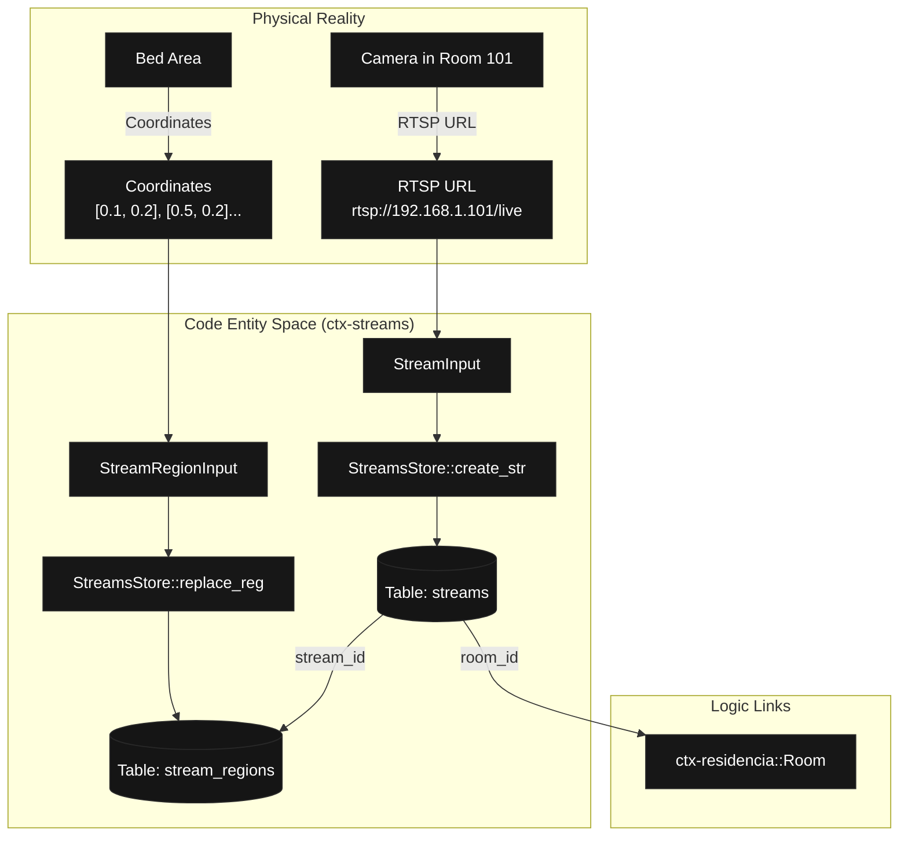

# Video Streams and Regions (ctx-streams)

Relevant source files

- [](https://github.com/pbaalerta-wq/hubp/blob/cc2edd14/crates/ctx-identidad/migrations/0001_identity/up.sql)
- [](https://github.com/pbaalerta-wq/hubp/blob/cc2edd14/crates/ctx-identidad/src/schema.rs)
- [](https://github.com/pbaalerta-wq/hubp/blob/cc2edd14/crates/ctx-streams/migrations/0015_streams/up.sql)
- [](https://github.com/pbaalerta-wq/hubp/blob/cc2edd14/crates/ctx-streams/src/lib.rs)
- [](https://github.com/pbaalerta-wq/hubp/blob/cc2edd14/crates/ctx-streams/src/schema.rs)
- [](https://github.com/pbaalerta-wq/hubp/blob/cc2edd14/crates/ctx-streams/src/streams/repo.rs)
- [](https://github.com/pbaalerta-wq/hubp/blob/cc2edd14/crates/ctx-streams/src/streams/sqlite.rs)
- [](https://github.com/pbaalerta-wq/hubp/blob/cc2edd14/crates/mana-sdk/scenes/streams-blueprint.json)

The `ctx-streams` context manages the registration of video sources and the definition of spatial Regions of Interest (ROI) within those video frames. It provides the spatial metadata necessary for the vision engines to map 2D coordinates to semantic locations like beds, bathrooms, or hallways.

## Purpose and Scope

`ctx-streams` acts as the bridge between the physical facility hierarchy and the computer vision pipeline. While `ctx-residencia` defines the logical existence of a room, `ctx-streams` defines the specific sensors (cameras) observing that room and the polygonal boundaries that classify areas within the camera's field of view.

Key responsibilities include:

- **Stream Registration**: Managing `stream_key` identifiers (typically RTSP URLs) and their association with `Room` entities.
- **Spatial Definition**: Storing polygonal regions defined by normalized coordinates.
- **Region Classification**: Categorizing regions into semantic types (e.g., `bed`, `bathroom`, `exit`) that drive alarm logic.
- **Privacy Integration**: Providing the foundation for masking regions in sensitive areas.

## Data Model

The context relies on two primary tables: `streams` and `stream_regions`.

### Streams

A stream represents a single video source. It is bound to a `room_id` and must have a unique `stream_key` per active room to prevent ingestion collisions.

|Field|Type|Description|
|---|---|---|
|`id`|`TEXT`|Primary Key (ULID).|
|`room_id`|`TEXT`|Foreign key to the room in `ctx-residencia`.|
|`stream_key`|`TEXT`|Unique identifier for the stream source (e.g., RTSP URL).|
|`active`|`INTEGER`|Boolean flag (1 for active, 0 for retired).|

### Stream Regions

Regions are polygons defined within a stream's coordinate space.

|Field|Type|Description|
|---|---|---|
|`id`|`TEXT`|Primary Key (ULID).|
|`stream_id`|`TEXT`|Reference to the parent stream.|
|`region_type`|`TEXT`|Enum: `bathroom`, `hallway`, `exit`, `bed`, `furniture`, `person`, `object`.|
|`points`|`TEXT`|JSON-serialized array of normalized coordinates `[[x1, y1], [x2, y2], ...]`.|
|`is_static`|`INTEGER`|Indicates if the region is fixed (e.g., a bed) or dynamic.|

**Sources**:

- `crates/ctx-streams/src/schema.rs:1-30`
- `crates/ctx-streams/migrations/0015_streams/up.sql:1-32`

## Implementation Detail

### Coordinate Serialization

Polygonal points are stored as a JSON string in the SQLite database. The `SqliteConnection` implementation of `StreamsRepo` handles the serialization and deserialization of these points using `serde_json`.

- **Validation**: Points must be validated before storage to ensure they form a valid polygon (at least 3 points). [crates/ctx-streams/src/lib.rs14](https://github.com/pbaalerta-wq/hubp/blob/cc2edd14/crates/ctx-streams/src/lib.rs#L14-L14)
- **Parsing**: The `parse_points` and `serialize_points` functions manage the conversion between `Vec<(f64, f64)>` and the database `TEXT` field. [crates/ctx-streams/src/streams/sqlite.rs80-86](https://github.com/pbaalerta-wq/hubp/blob/cc2edd14/crates/ctx-streams/src/streams/sqlite.rs#L80-L86)

### Uniqueness and Constraints

The system enforces stream uniqueness through a partial unique index in the database:

```
CREATE UNIQUE INDEX streams_active_room_key_idx    ON streams (room_id, stream_key)    WHERE active = 1;
```

[crates/ctx-streams/migrations/0015_streams/up.sql13-15](https://github.com/pbaalerta-wq/hubp/blob/cc2edd14/crates/ctx-streams/migrations/0015_streams/up.sql#L13-L15)

The `region_type` is strictly enforced via a `CHECK` constraint, ensuring only recognized semantic zones are processed by the engines. [crates/ctx-streams/migrations/0015_streams/up.sql20-22](https://github.com/pbaalerta-wq/hubp/blob/cc2edd14/crates/ctx-streams/migrations/0015_streams/up.sql#L20-L22)

### Natural Language to Code Mapping (Data Flow)

This diagram illustrates how a physical camera setup is translated into the `ctx-streams` domain entities.

"Physical to Code Mapping: Stream Registration"



**Sources**:

- `crates/ctx-streams/src/lib.rs:44-56`
- `crates/ctx-streams/src/streams/sqlite.rs:105-131`

## Stream and Region Management

The `StreamsStore` provides the primary interface for managing these entities. It supports both standalone operations and operations within an existing transaction to facilitate cross-context atomicity (e.g., when setting up a room and its streams simultaneously).

### Key Functions

- `create_stream`: Registers a new camera source. [crates/ctx-streams/src/lib.rs44](https://github.com/pbaalerta-wq/hubp/blob/cc2edd14/crates/ctx-streams/src/lib.rs#L44-L44)
- `replace_regions`: A bulk operation that deletes existing regions for a stream and inserts a new set. This is the preferred way to update ROIs to ensure consistency. [crates/ctx-streams/src/lib.rs109](https://github.com/pbaalerta-wq/hubp/blob/cc2edd14/crates/ctx-streams/src/lib.rs#L109-L109)
- `update_region`: Updates the geometry or metadata of a single specific region. [crates/ctx-streams/src/lib.rs149](https://github.com/pbaalerta-wq/hubp/blob/cc2edd14/crates/ctx-streams/src/lib.rs#L149-L149)

### Region Types and Staticity

The `StreamRegionType` determines how the vision engines interpret detections within that area. For instance, a detection in a `bathroom` region might trigger a different dwell-time policy than one in a `hallway`.

The `is_static` flag [crates/ctx-streams/src/streams/sqlite.rs98](https://github.com/pbaalerta-wq/hubp/blob/cc2edd14/crates/ctx-streams/src/streams/sqlite.rs#L98-L98) is automatically derived from the region type: types like `bed` and `furniture` are generally static, whereas `person` regions (if used for dynamic tracking) are not.

### Integration with Facility Tree

The facility hierarchy (Facility -> Wing -> Room) integrates streams into its "Tree" view. When fetching a facility tree, the system joins room data with their associated streams and regions to provide a complete spatial map of the facility.

**Sources**:

- `crates/ctx-streams/src/lib.rs:27-188`
- `crates/mana-sdk/scenes/streams-blueprint.json:194-204`

## Interaction Sequence

The following diagram shows the interaction between the application layer and the persistence layer when defining regions for a camera.

"Code Entity Space: Region Definition Sequence"

**Sources**:

- `crates/ctx-streams/src/lib.rs:109-128`
- `crates/ctx-streams/src/streams/sqlite.rs:168-207`
- `crates/ctx-streams/src/streams/repo.rs:29-34`


### On this page

- [Video Streams and Regions (ctx-streams)](https://deepwiki.com/pbaalerta-wq/hubp/4.3-video-streams-and-regions-\(ctx-streams\)#video-streams-and-regions-ctx-streams)
- [Purpose and Scope](https://deepwiki.com/pbaalerta-wq/hubp/4.3-video-streams-and-regions-\(ctx-streams\)#purpose-and-scope)
- [Data Model](https://deepwiki.com/pbaalerta-wq/hubp/4.3-video-streams-and-regions-\(ctx-streams\)#data-model)
- [Streams](https://deepwiki.com/pbaalerta-wq/hubp/4.3-video-streams-and-regions-\(ctx-streams\)#streams)
- [Stream Regions](https://deepwiki.com/pbaalerta-wq/hubp/4.3-video-streams-and-regions-\(ctx-streams\)#stream-regions)
- [Implementation Detail](https://deepwiki.com/pbaalerta-wq/hubp/4.3-video-streams-and-regions-\(ctx-streams\)#implementation-detail)
- [Coordinate Serialization](https://deepwiki.com/pbaalerta-wq/hubp/4.3-video-streams-and-regions-\(ctx-streams\)#coordinate-serialization)
- [Uniqueness and Constraints](https://deepwiki.com/pbaalerta-wq/hubp/4.3-video-streams-and-regions-\(ctx-streams\)#uniqueness-and-constraints)
- [Natural Language to Code Mapping (Data Flow)](https://deepwiki.com/pbaalerta-wq/hubp/4.3-video-streams-and-regions-\(ctx-streams\)#natural-language-to-code-mapping-data-flow)
- [Stream and Region Management](https://deepwiki.com/pbaalerta-wq/hubp/4.3-video-streams-and-regions-\(ctx-streams\)#stream-and-region-management)
- [Key Functions](https://deepwiki.com/pbaalerta-wq/hubp/4.3-video-streams-and-regions-\(ctx-streams\)#key-functions)
- [Region Types and Staticity](https://deepwiki.com/pbaalerta-wq/hubp/4.3-video-streams-and-regions-\(ctx-streams\)#region-types-and-staticity)
- [Integration with Facility Tree](https://deepwiki.com/pbaalerta-wq/hubp/4.3-video-streams-and-regions-\(ctx-streams\)#integration-with-facility-tree)
- [Interaction Sequence](https://deepwiki.com/pbaalerta-wq/hubp/4.3-video-streams-and-regions-\(ctx-streams\)#interaction-sequence)

