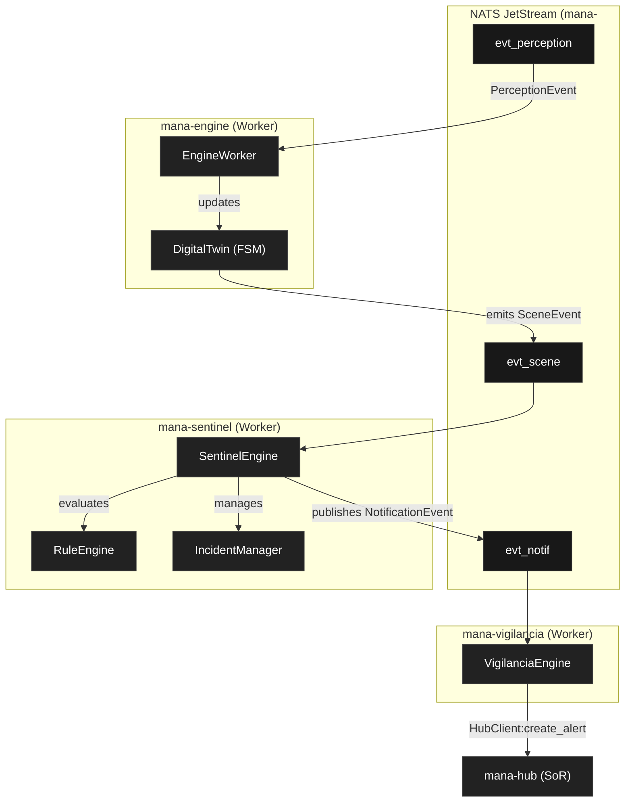

# Engine and Rule Evaluation

Relevant source files

- 
- 
- 
- 
- 
- 
- 
- 

The Hub platform utilizes a distributed, event-driven architecture to process sensor data, maintain stateful digital twins, and evaluate clinical rules. This logic is partitioned into three stateless worker binaries—`mana-engine`, `mana-sentinel`, and `mana-vigilancia`—which communicate via a NATS JetStream event mesh. These workers are powered by "pure" logic engines that are isolated from I/O to ensure determinism and testability.

## Architectural Philosophy: Purity by Construction

A core architectural decision was to move all decision-making logic into the `mana-motores` crate. This crate is strictly prohibited from depending on `mana-storage`, Diesel, or any `ctx-*` domain context [docs/arquitectura/motores.md30-34](https://github.com/pbaalerta-wq/hubp/blob/cc2edd14/docs/arquitectura/motores.md?plain=1#L30-L34) By enforcing this at the compilation level, the engines remain pure functions that transform evidence into decisions without side effects.

### The Engine Lifecycle

Engines operate through a four-stage process managed by the application layer:

1. **Hydration**: `mana-app` or a worker gathers necessary state (Resident profiles, effective policies) from various contexts [docs/arquitectura/motores.md87-97](https://github.com/pbaalerta-wq/hubp/blob/cc2edd14/docs/arquitectura/motores.md?plain=1#L87-L97)
2. **Input**: A complete data structure is passed to the engine.
3. **Motor**: The engine performs pure logic (e.g., `evaluar`, `recomendar`) [docs/arquitectura/motores.md108-111](https://github.com/pbaalerta-wq/hubp/blob/cc2edd14/docs/arquitectura/motores.md?plain=1#L108-L111)
4. **Destillation**: The engine outputs a domain structure (e.g., a new Alert) which the caller then persists [docs/arquitectura/motores.md80-83](https://github.com/pbaalerta-wq/hubp/blob/cc2edd14/docs/arquitectura/motores.md?plain=1#L80-L83)

**Sources:** [docs/arquitectura/motores.md1-115](https://github.com/pbaalerta-wq/hubp/blob/cc2edd14/docs/arquitectura/motores.md?plain=1#L1-L115)

## System Data Flow

The following diagram bridges the natural language concepts of "Detection" and "Alerting" to the specific code entities and event streams that implement them.

### Pipeline: Perception to Notification

**Sources:** [docs/arquitectura/mana-engine.md15-34](https://github.com/pbaalerta-wq/hubp/blob/cc2edd14/docs/arquitectura/mana-engine.md?plain=1#L15-L34) [bins/mana-sentinel/src/main.rs69-82](https://github.com/pbaalerta-wq/hubp/blob/cc2edd14/bins/mana-sentinel/src/main.rs#L69-L82) [bins/mana-vigilancia/src/main.rs44-54](https://github.com/pbaalerta-wq/hubp/blob/cc2edd14/bins/mana-vigilancia/src/main.rs#L44-L54) [crates/mana-vigilancia-worker/src/lib.rs24-32](https://github.com/pbaalerta-wq/hubp/blob/cc2edd14/crates/mana-vigilancia-worker/src/lib.rs#L24-L32)

## Component Overview

### DigitalTwin and State Tracking

The `mana-engine` binary maintains a "Digital Twin" of every bed and resident. This is an in-memory projection that tracks the current physical state (e.g., `InBed`, `Standing`, `OutSide`) and manages temporal logic like dwell timers. It transforms raw `PerceptionEvent` inputs into semantic `SceneEvent` outputs.

For details, see [mana-engine-v2: DigitalTwin and FSM](https://deepwiki.com/pbaalerta-wq/hubp/5.1-mana-engine-v2:-digitaltwin-and-fsm). **Sources:** [docs/arquitectura/mana-engine.md48-75](https://github.com/pbaalerta-wq/hubp/blob/cc2edd14/docs/arquitectura/mana-engine.md?plain=1#L48-L75) [bins/mana-engine/src/main.rs19-24](https://github.com/pbaalerta-wq/hubp/blob/cc2edd14/bins/mana-engine/src/main.rs#L19-L24)

### Alarm Engine and Policy Resolution

The `mana-motores` crate contains the pure logic for evaluating rules against evidence. It handles the `PerfilEfectivo` resolution hierarchy, determining which rules apply to a resident based on their assigned profile, template, or specific overrides. It supports both transition-based rules (e.g., "Left Bed") and permanence-based rules (e.g., "In Bathroom for > 10 mins").

For details, see [mana-motores: Alarm Engine and Policy Resolution](https://deepwiki.com/pbaalerta-wq/hubp/5.2-mana-motores:-alarm-engine-and-policy-resolution). **Sources:** [docs/arquitectura/motores.md103-115](https://github.com/pbaalerta-wq/hubp/blob/cc2edd14/docs/arquitectura/motores.md?plain=1#L103-L115) [bins/mana-sentinel/src/main.rs44-51](https://github.com/pbaalerta-wq/hubp/blob/cc2edd14/bins/mana-sentinel/src/main.rs#L44-L51)

### Sentinel and Incident Management

The `mana-sentinel` worker is responsible for higher-level incident orchestration. It listens to `SceneEvent` streams, categorizes them using the `RuleEngine`, and manages the lifecycle of `Incidents`. It tracks staff presence at the bedside to automatically acknowledge or close incidents and manages the `ClipWindow` for video evidence.

For details, see [mana-sentinel: Rule Evaluation and Incident Management](https://deepwiki.com/pbaalerta-wq/hubp/5.3-mana-sentinel:-rule-evaluation-and-incident-management). **Sources:** [bins/mana-sentinel/src/main.rs105-134](https://github.com/pbaalerta-wq/hubp/blob/cc2edd14/bins/mana-sentinel/src/main.rs#L105-L134) [bins/mana-sentinel/src/main.rs161-187](https://github.com/pbaalerta-wq/hubp/blob/cc2edd14/bins/mana-sentinel/src/main.rs#L161-L187)

### Messaging and Worker Infrastructure

All workers share a common infrastructure provided by `mana-nats`. This includes the `NatsBroker` abstraction for stream interaction and standardized `worker_loop` utilities for graceful shutdown and error handling.

For details, see [NATS JetStream Messaging (mana-nats)](https://deepwiki.com/pbaalerta-wq/hubp/5.4-nats-jetstream-messaging-\(mana-nats\)). **Sources:** [bins/mana-vigilancia/src/main.rs33-58](https://github.com/pbaalerta-wq/hubp/blob/cc2edd14/bins/mana-vigilancia/src/main.rs#L33-L58) [crates/mana-vigilancia-worker/src/lib.rs21-36](https://github.com/pbaalerta-wq/hubp/blob/cc2edd14/crates/mana-vigilancia-worker/src/lib.rs#L21-L36)

## Engine Comparison Table

|Worker|Primary Input Stream|Engine Logic|Primary Output|
|---|---|---|---|
|`mana-engine`|`evt_perception`|`DigitalTwin` (FSM + Timers)|`evt_scene`|
|`mana-sentinel`|`evt_scene`|`RuleEngine` + `IncidentManager`|`evt_notif`|
|`mana-vigilancia`|`evt_notif`|Filter (Category == "alarm")|`ctx-vigilancia` (DB)|

**Sources:** [docs/arquitectura/mana-engine.md84-114](https://github.com/pbaalerta-wq/hubp/blob/cc2edd14/docs/arquitectura/mana-engine.md?plain=1#L84-L114) [bins/mana-sentinel/src/main.rs68-82](https://github.com/pbaalerta-wq/hubp/blob/cc2edd14/bins/mana-sentinel/src/main.rs#L68-L82) [crates/mana-vigilancia-worker/src/lib.rs39-89](https://github.com/pbaalerta-wq/hubp/blob/cc2edd14/crates/mana-vigilancia-worker/src/lib.rs#L39-L89)

### On this page

- [Engine and Rule Evaluation](https://deepwiki.com/pbaalerta-wq/hubp/5-engine-and-rule-evaluation#engine-and-rule-evaluation)
- [Architectural Philosophy: Purity by Construction](https://deepwiki.com/pbaalerta-wq/hubp/5-engine-and-rule-evaluation#architectural-philosophy-purity-by-construction)
- [The Engine Lifecycle](https://deepwiki.com/pbaalerta-wq/hubp/5-engine-and-rule-evaluation#the-engine-lifecycle)
- [System Data Flow](https://deepwiki.com/pbaalerta-wq/hubp/5-engine-and-rule-evaluation#system-data-flow)
- [Pipeline: Perception to Notification](https://deepwiki.com/pbaalerta-wq/hubp/5-engine-and-rule-evaluation#pipeline-perception-to-notification)
- [Component Overview](https://deepwiki.com/pbaalerta-wq/hubp/5-engine-and-rule-evaluation#component-overview)
- [DigitalTwin and State Tracking](https://deepwiki.com/pbaalerta-wq/hubp/5-engine-and-rule-evaluation#digitaltwin-and-state-tracking)
- [Alarm Engine and Policy Resolution](https://deepwiki.com/pbaalerta-wq/hubp/5-engine-and-rule-evaluation#alarm-engine-and-policy-resolution)
- [Sentinel and Incident Management](https://deepwiki.com/pbaalerta-wq/hubp/5-engine-and-rule-evaluation#sentinel-and-incident-management)
- [Messaging and Worker Infrastructure](https://deepwiki.com/pbaalerta-wq/hubp/5-engine-and-rule-evaluation#messaging-and-worker-infrastructure)
- [Engine Comparison Table](https://deepwiki.com/pbaalerta-wq/hubp/5-engine-and-rule-evaluation#engine-comparison-table)
