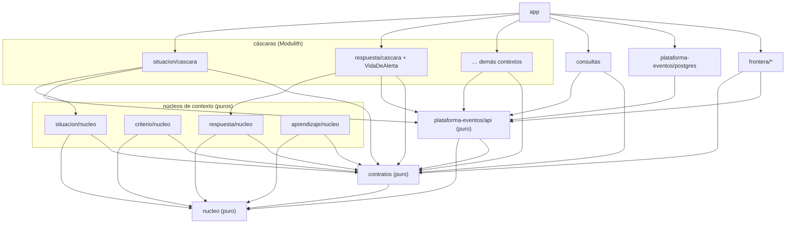

# 07 · El workspace: Gradle, módulos y DSLs

Este documento traduce las decisiones de la sala (01–06) a la forma física del repositorio: módulos Gradle, convention plugins, grafo de dependencias permitido y los DSLs Kotlin que hacen que el diseño se escriba como se piensa. La regla del documento: **cada elección de workspace debe poder citar la decisión de diseño que la obliga**. Lo que no pueda citarla es gusto, y el gusto no compila.

---

## 1. Principios (cada uno cita su decisión)

| Principio de workspace | Decisión que lo obliga |
| --- | --- |
| **Pureza por construcción**: los módulos de núcleo no declaran dependencias; el rol de módulo lo hace imposible, no desaconsejable | P1 ratificado (01, "lo que sobrevive") + contrato de pureza (04 §10) |
| **`contratos` como territorio neutral**: los tipos del lenguaje publicado no pertenecen a ningún contexto | "Ningún contexto del núcleo depende de otro en compilación; se hablan por lenguaje publicado" (02 §5) |
| **No existe módulo `procesos`**: cada process manager vive en la cáscara del contexto que comanda | Objeción 2 (01): un módulo único de coordinación es el orquestador renaciendo |
| **La arquitectura es un plugin**: cuatro roles de módulo en `build-logic`; un módulo declara su rol, jamás su configuración | La regla estructural debe verificarse, no prometerse (02 §5, 04 §10) |
| **El banco de conformidad son test fixtures**: cada puerto publica su kit; todo adaptador lo hereda | Doc 06 §6 |
| **Los DSLs de escenario son producto, no test util**: el simulador y su lenguaje viven en un módulo de main source | Doc 06 §5: "la herramienta con la que el equipo clínico *ve* una regla" |

## 2. El árbol (destino — ver enmienda D9 en el acta 08)

> **Enmienda de la segunda sesión (08 · D9):** este árbol es el **destino documentado**, no el día uno. El repositorio arranca con seis módulos (`build-logic`, `dominio`, `contratos`, `plataforma-eventos`, `servicio`, `simulador`, `app`) y cada extracción hacia este árbol cita su disparador. Los cuatro roles de módulo, el guardián de pureza, el grafo permitido y los DSLs de este documento rigen igual en ambas formas.

```text
registro/
├── settings.gradle.kts
├── gradle/libs.versions.toml            # catálogo único de versiones
├── build-logic/                         # composite build: los 4 roles de módulo
│   └── src/main/kotlin/
│       ├── registro.base.gradle.kts             # toolchain, compilador, cache
│       ├── registro.nucleo-puro.gradle.kts      # rol 1: cero dependencias + guardián
│       ├── registro.contexto.gradle.kts         # rol 2: cáscara Modulith
│       ├── registro.frontera.gradle.kts         # rol 3: adaptadores con IO
│       └── registro.aplicacion.gradle.kts       # rol 4: ensamblaje Boot
│
├── nucleo/                              # PURO · kernel compartido mínimo:
│                                        #   Id<K>, RefEvento, Decider, Decision,
│                                        #   Explicado, VersionMotor, RegistroDeDecision
├── contratos/                           # PURO · lenguaje publicado:
│   ├── src/main/kotlin/                 #   tipos Kotlin de Observacion.v1, HechoDeEscena.v1,
│   │                                    #   CicloDeAlerta.v1, fotos (Censo, Cobertura, Presencia)
│   └── src/main/resources/eventos/      #   *.schema.json + fixtures de TODAS las versiones
│
├── contextos/
│   ├── percepcion/                      # ACL del borde (traducción pura adentro, verificada)
│   ├── situacion/
│   │   ├── nucleo/                      # PURO: GemeloCama, FSM, MotorDeSituacion, MotorDeReloj
│   │   └── cascara/                     # servicio de aplicación, proyecciones, listeners
│   ├── criterio/
│   │   ├── nucleo/                      # PURO: MotorDeCriterio, capas, huella
│   │   └── cascara/                     #   + PM CicloDePropuesta (comanda a criterio)
│   ├── respuesta/
│   │   ├── nucleo/                      # PURO: AlertaDecider, MotorDeRespuesta,
│   │   │                                #   MotorDeEnrutamiento, álgebra de episodios
│   │   └── cascara/                     #   + PM VidaDeAlerta (comanda a Alerta)
│   ├── aprendizaje/
│   │   ├── nucleo/                      # PURO: MotorDeAprendizaje, líneas base
│   │   └── cascara/
│   ├── alojamiento/                     # mutable + auditoría; invariante 1:1 adentro
│   ├── cobertura/
│   ├── cuidado/                         #   + PM EjecucionDeRonda
│   ├── memoria/                         #   + PM CicloDeIncidente
│   └── plataforma/                      # identidad · auditoría (genérico honesto)
│
├── plataforma-eventos/
│   ├── api/                             # PURO: puertos (PuertoLedger, PuertoMarcas,
│   │                                    #   PuertoEntrega, PuertoRegistroDeDecision…)
│   │   └── src/testFixtures/            #   ★ banco de conformidad: suite abstracta por puerto
│   ├── postgres/                        # adaptador real: append optimista, NOTIFY+sondeo,
│   │                                    #   marcas, upcasters, registros_decision
│   └── memoria/                         # adaptador en memoria (tests y simulador)
│
├── consultas/                           # read models cross-context + moviola; solo lee
├── frontera/
│   ├── http/                            # Spring MVC, seguridad, OpenAPI a mano
│   ├── ingesta-nats/                    # borde → hub: dedupe por source_event_id → ledger
│   └── entrega/                         # push / tabletas (transporte del plan)
│
├── analitica/
│   ├── simulador/                       # generador de noches + DSL de escenarios (¡main!)
│   └── compactador/                     # ledger → Parquet; consultas DuckDB
│
├── evaluacion/                          # replay dorado, arnés de sombra, métricas clínicas
└── app/                                 # Topología A: ensambla todo; Modulith verify aquí
```

Veintitantos módulos. No es poco, pero cada uno existe por una frontera que el diseño nombró; ninguno existe "por prolijidad".

## 3. Los cuatro roles de módulo

| Rol (plugin) | Aporta | Prohíbe | Quién lo usa |
| --- | --- | --- | --- |
| `registro.nucleo-puro` | Kotlin, `explicitApi()`, guardián de pureza, Konsist compartido | **Toda dependencia externa.** Solo `:nucleo` y `:contratos` | `nucleo`, `contratos`, los 4 `*/nucleo`, `plataforma-eventos:api` |
| `registro.contexto` | Spring Modulith, spring-jdbc/jOOQ, Testcontainers, suites de test | Depender de otra cáscara de contexto; depender de `frontera/*` | las 10 cáscaras + `consultas` |
| `registro.frontera` | Spring, cliente NATS (jnats), HTTP | Depender de núcleos de contexto (solo `contratos` y puertos) | `frontera/*` |
| `registro.aplicacion` | Spring Boot, ensamblaje, `ApplicationModules.verify()` | — (es el único que ve todo) | `app` |

El plugin base, común a todos:

```kotlin
// build-logic/src/main/kotlin/registro.base.gradle.kts
plugins { kotlin("jvm") }

kotlin {
    jvmToolchain(25)
    compilerOptions {
        allWarningsAsErrors = true
        freeCompilerArgs.addAll("-Xjsr305=strict", "-Xconsistent-data-class-copy-visibility")
    }
}

// Los módulos anidados (contextos/situacion/nucleo) llevan artefacto con nombre completo
base.archivesName = project.path.removePrefix(":").replace(":", "-")

tasks.withType<Test>().configureEach { useJUnitPlatform() }
```

## 4. El guardián de pureza (verificado, no prometido)

El rol `nucleo-puro` hace dos cosas: **no aporta ninguna dependencia** (la pureza gruesa es estructural) y registra un guardián que rompe el build si alguien la agrega. Konsist, cableado por el mismo plugin, caza lo fino que Gradle no ve: `Instant.now()`, `System.currentTimeMillis()`, mutabilidad accidental.

```kotlin
// build-logic/src/main/kotlin/registro.nucleo-puro.gradle.kts
plugins { id("registro.base") }

kotlin { explicitApi() }   // el núcleo es API: cada tipo público es una decisión

val verificarPureza by tasks.registering {
    val externas = configurations.named("runtimeClasspath").map { config ->
        config.allDependencies.filterIsInstance<ExternalModuleDependency>()
            .filterNot { it.group == "org.jetbrains.kotlin" }   // stdlib, nada más
            .map { "${it.group}:${it.name}" }
    }
    doLast {
        check(externas.get().isEmpty()) {
            "Módulo puro con dependencias externas: ${externas.get()} — la pureza es por construcción (04 §10)"
        }
    }
}
tasks.named("check") { dependsOn(verificarPureza) }

dependencies {
    // el contrato de pureza de Konsist, compartido desde :nucleo
    "testImplementation"(testFixtures(project(":nucleo")))
}
```

El test de Konsist vive **una sola vez** en los fixtures de `:nucleo` y todos los núcleos lo heredan:

```kotlin
// nucleo/src/testFixtures/kotlin/ContratoDePureza.kt
abstract class ContratoDePureza(private val paquete: String) {
    @Test fun `sin framework, sin IO, sin reloj implicito`() {
        Konsist.scopeFromPackage(paquete).files.assertFalse { archivo ->
            archivo.hasImport { imp ->
                imp.name.startsWith("org.springframework") ||
                imp.name.startsWith("java.sql") || imp.name.startsWith("java.net") ||
                imp.name.startsWith("io.nats") || imp.name.startsWith("org.jooq")
            } || archivo.text.contains("Instant.now()") ||
                 archivo.text.contains("System.currentTimeMillis()")
        }
    }
}
// en respuesta/nucleo/src/test:  class PurezaDeRespuesta : ContratoDePureza("registro.respuesta")
```

## 5. El grafo permitido



Tres reglas, y las tres las verifica una máquina:

1. **Cáscara → solo su núcleo.** Ninguna cáscara importa el núcleo de otro contexto; se hablan por `contratos` a través del ledger. Lo verifica el grafo Gradle (la dependencia no existe) y Modulith (`ApplicationModules.verify()` en `app`).
2. **Los puros solo ven puros.** `nucleo-puro` lo hace imposible por construcción.
3. **`consultas` no comanda.** No depende de ningún núcleo de contexto: solo de `contratos` y del ledger. Leer no es orquestar (03 §5) — y aquí es literal: no tiene los tipos de comando en su classpath.

## 6. settings y catálogo (extractos)

```kotlin
// settings.gradle.kts
rootProject.name = "registro"
enableFeaturePreview("TYPESAFE_PROJECT_ACCESSORS")
includeBuild("build-logic")

dependencyResolutionManagement {
    repositoriesMode = RepositoriesMode.FAIL_ON_PROJECT_REPOS
    repositories { mavenCentral() }
}

include(":nucleo", ":contratos", ":consultas", ":evaluacion", ":app")
listOf("situacion", "criterio", "respuesta", "aprendizaje").forEach {
    include(":contextos:$it:nucleo", ":contextos:$it:cascara")
}
listOf("percepcion", "alojamiento", "cobertura", "cuidado", "memoria", "plataforma").forEach {
    include(":contextos:$it")
}
include(":plataforma-eventos:api", ":plataforma-eventos:postgres", ":plataforma-eventos:memoria")
include(":frontera:http", ":frontera:ingesta-nats", ":frontera:entrega")
include(":analitica:simulador", ":analitica:compactador")
```

```toml
# gradle/libs.versions.toml (extracto)
[versions]
kotlin = "2.3.x"        # fijar al armar el repo
spring-boot = "4.x"
spring-modulith = "2.x"
konsist = "…"

[libraries]
modulith-starter = { module = "org.springframework.modulith:spring-modulith-starter-jdbc", version.ref = "spring-modulith" }
konsist = { module = "com.lemonappdev:konsist", version.ref = "konsist" }
# …

[bundles]
contexto-test = ["modulith-test", "testcontainers-postgres", "kotest-assertions"]
```

Con los accessors tipados, las dependencias se leen como el diseño: `implementation(projects.contextos.respuesta.nucleo)`.

## 7. Los DSLs de dominio

Tres lenguajes pequeños, cada uno con su `@DslMarker` (los ámbitos no se mezclan por accidente). No son azúcar: son la forma ejecutable de artefactos que el diseño ya nombró.

### 7.1 Escenarios de noche (doc 06 §5) — vive en `analitica/simulador`, main source

```kotlin
@DslMarker annotation class EscenarioDsl

val caidaDeLasTres = escenario("la caída de las 03:00") {
    reloj.arrancaEn("02:50")
    val garcia = residente("García", nivel = Alto)
    cama("12A") ocupadaPor garcia

    alas("03:00:00") { observa(salidaDeCama, confianza = 0.93) }
    alas("03:00:40") { elSensorCalla() }                  // SenalPerdida es un hecho

    tras(5.minutes) {
        entonces { alertaCreada(regla = "permanencia-DePie-5min", severidad = Critica) }
    }
    tras(90.seconds, sinAcuse) {
        entonces { alertaEscalada(aPeldano = 2, causa = SinAcuse) }
    }
    alas("03:04:15") { presenciaStaff(enfermera("R.")) }
    entonces {
        alertaResueltaPorPresencia(segundosHastaStaff = 214)
        registroDeDecision.explica(descartes = vacios)
    }
}
```

El mismo escenario es tres cosas: test de escena en CI (contra `plataforma-eventos/memoria` y reloj virtual), entrada del replay dorado, y la vista "así se habría comportado esta regla" para el equipo clínico. Por eso es main source y no test util.

### 7.2 Dado–cuando–entonces para Deciders (doc 03 §1) — testFixtures de `:nucleo`

La mecánica uniforme de prueba del núcleo, como infix:

```kotlin
AlertaDecider dado listOf(
    Creada(clave, Critica, hechoOrigen),
    EntregaOrdenada(peldano = 1, canal = Push),
) cuando ResolverPorPresencia(presencia, segundosHastaStaff = 214) entonces {
    +ResueltaPorPresencia(presencia, 214)
}

AlertaDecider dado listOf(Creada(clave, Critica, hechoOrigen), ResueltaManual(por, causa)) cuando
    Reconocer(por = enfermera) rechazadoPor MotivoDeRechazo.YaResuelta   // resuelta es absorbente
```

### 7.3 Plantillas de criterio y escaleras (docs 04 §5 y §7) — en `criterio/nucleo` y fixtures

Las plantillas de nivel y las políticas de escalada son datos con forma fija; el DSL los hace legibles por el clínico que los revisa en el PR:

```kotlin
val nivelAlto = plantilla(NivelVigilancia.Alto) {
    regla("permanencia-DePie") { umbral = 5.minutes; severidad = Critica }
    regla("permanencia-EnBanio") { umbral = 15.minutes; severidad = Advertencia }
    ventana("nocturna", desde = "22:00", hasta = "07:00") {
        regla("salida-de-cama") { severidad = Critica }
    }
}

val escaleraNocturna = escalera {
    peldano(rol = EnfermeraDeAla, canal = Push, vencimiento = 90.seconds)
    peldano(rol = EnfermeraDeTurno, canal = TodosLosCanales, vencimiento = 60.seconds)
    terminal(ResponsableDeGuardia + TableroDeSala)   // exigido por tipo: toda escalera termina
}
```

`terminal(...)` no es opcional en el builder — el peldaño que no puede fallar en silencio (04 §7) está garantizado por el tipo, no por revisión de código.

## 8. Suites de test (`jvm-test-suite`)

Cuatro suites nombradas, cableadas por los convention plugins; cada una responde a un artefacto del doc 06:

| Suite | Corre | Contra | Doc |
| --- | --- | --- | --- |
| `test` | unidad: Deciders y motores con dado-cuando-entonces | nada (puro) | 03 §1 |
| `escena` | el banco de escenarios completo | adaptador memoria + reloj virtual | 06 §5 |
| `integracion` | cáscaras, SQL, simulacros de fallo | Testcontainers Postgres | 05 §5 |
| `conformidad` | el kit de cada puerto | cada adaptador real | 06 §6 |

El banco de conformidad como fixtures — la suite abstracta se escribe una vez y cada adaptador la hereda:

```kotlin
// plataforma-eventos/api/src/testFixtures/kotlin/ContratoDeLedger.kt
abstract class ContratoDeLedger {
    abstract fun ledger(): PuertoLedger
    @Test fun `el append con seq esperada equivocada conflictua`() { /* … */ }
    @Test fun `los eventos se leen en orden total de seq_global`() { /* … */ }
    @Test fun `lo anexado es visible solo tras confirmar la TX`() { /* … */ }
}
// postgres:  class LedgerPostgresConforme : ContratoDeLedger() { … Testcontainers … }
// memoria:   class LedgerEnMemoriaConforme : ContratoDeLedger() { … }
```

## 9. Decisiones prácticas ratificadas

- **Toolchain JDK 25 (LTS), Kotlin 2.x, Spring Boot 4, Modulith 2** — el veredicto de stack de v2 sobrevive; el toolchain se fija en `registro.base` y en ningún otro lado.
- **Configuration cache y build cache activados** desde el día cero (`org.gradle.configuration-cache=true`); con ~25 módulos el build incremental es el que se usa mil veces por día.
- **`explicitApi()` solo en los puros.** En el núcleo cada tipo público es API y una decisión; en las cáscaras sería burocracia.
- **Java convive pero no gobierna:** el workspace es Kotlin-first; si un adaptador de frontera llega en Java (un SDK, un driver), vive en `frontera/*` y consume `contratos` — nunca entra a un núcleo, donde los sealed interfaces y la exhaustividad del `when` son el mecanismo de corrección.
- **Nada de `allprojects`/`subprojects`:** toda configuración cruzada viaja por convention plugin. Un módulo se entiende leyendo su `build.gradle.kts` de diez líneas, que dice su rol y sus dependencias — y nada más.

El `build.gradle.kts` de un núcleo, completo, para cerrar con la imagen:

```kotlin
// contextos/respuesta/nucleo/build.gradle.kts — completo, no extracto
plugins { id("registro.nucleo-puro") }
dependencies {
    api(projects.nucleo)
    api(projects.contratos)
}
```

Eso es todo el archivo. Cuando el build de un módulo cabe en cinco líneas, la arquitectura está en los lugares correctos.

---

*Pendiente para la próxima sesión de sala: resuelto en el acta 08 lo relativo al camino evolutivo del workspace (D9). Sigue pendiente: el DDL por contexto (dueño exclusivo de sus tablas y su esquema Postgres), y si `percepcion` amerita núcleo propio cuando la traducción del borde crezca (hoy: traducción pura adentro, Konsist mediante).*
