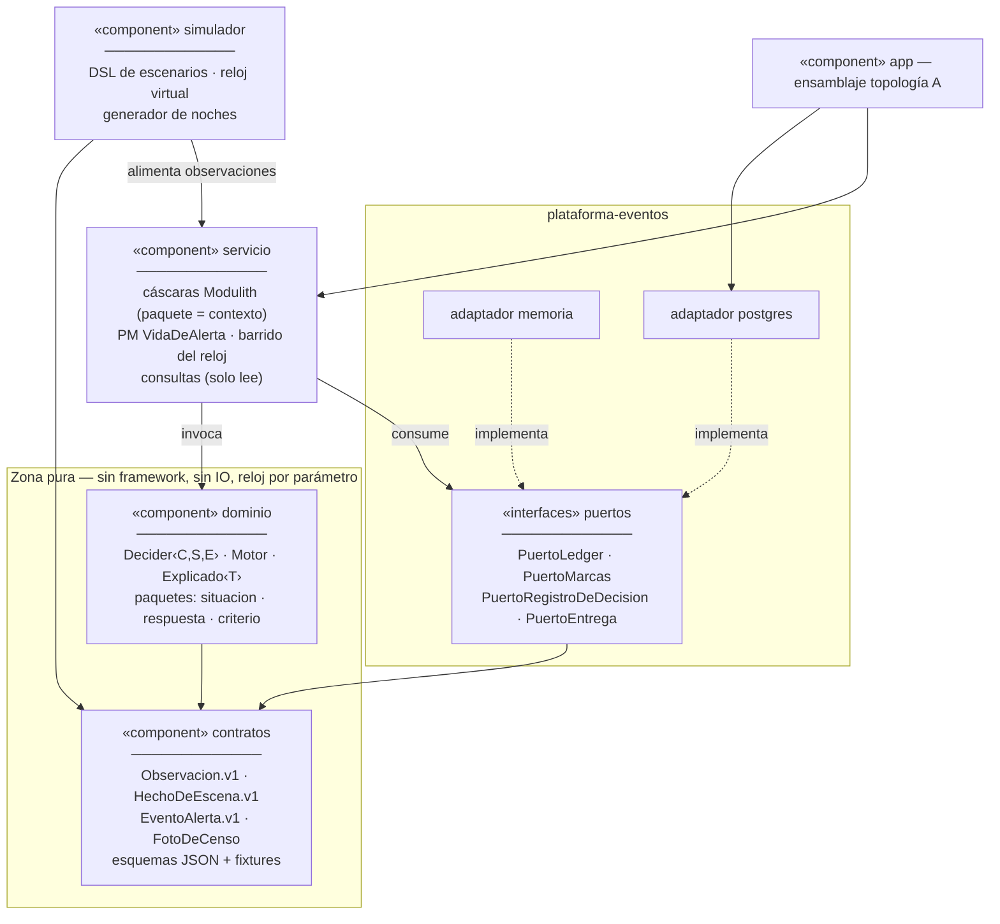
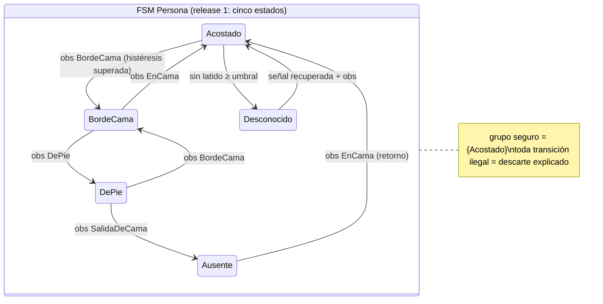
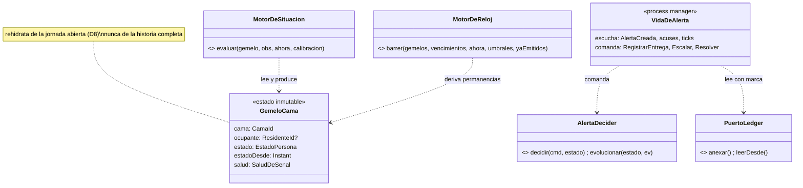

# 09 · Big picture y Sprint 1 — interfaces primero, una noche de punta a punta

**Sesión:** planificación de release. En la mesa: el modelador estratégico, el arquitecto de evolución, la voz de XP (tarjeta–conversación–confirmación, el código lo escribe quien lo escribe y lo revisa un par), y el equipo clínico como **cliente on-site** — porque en XP el cliente escribe los tests de aceptación, y aquí los tests de aceptación son escenarios de noche.

**Protocolo acordado:** vos implementás, la sala revisa. Cada historia entra por PR; la revisión usa la lista del §8. Nada de este documento es código final: son **contratos** (interfaces, tipos, esquemas) y seudocódigo. El primer código real lo escribe el test que falla.

---

## 1. La big picture: seis componentes, y las interfaces son el diseño

El diagrama que ordena todo lo demás. Cada frontera de componente es una interfaz nombrada; ningún componente conoce a otro salvo por ellas. Esto es D9 (seis módulos) dibujado como componentes con sus puertos.



Tres lecturas normativas del diagrama:

1. **La dependencia apunta siempre hacia los contratos y las interfaces**, nunca hacia implementaciones (inversión de dependencias: la cáscara depende del puerto; el adaptador también; ninguno del otro).
2. **`dominio` no conoce los puertos.** Los motores y Deciders reciben datos y devuelven decisiones; ni siquiera saben que existe un ledger. La cáscara es la única que junta ambos mundos.
3. **El simulador es un cliente más del sistema** — entra por la misma puerta que entrará `percepcion` en el release 2. Por eso el esqueleto es honesto: no hay camino privilegiado de test.

## 2. Los contratos del release, en seudocódigo (esto se diseña primero, se implementa después)

XP dice: la interfaz es una promesa barata de cambiar hoy y carísima mañana. Por eso la sala las escribe **antes** del sprint y las revisa como se revisa una API pública. Seudocódigo deliberadamente sin cuerpo:

```text
── contratos (lenguaje publicado) ─────────────────────────────────────────────

Observacion.v1        { fuente: MonitorId, cama: CamaId, clase: ClaseObservacion,
                        confianza: 0..1, ocurridoEn: Instant, sourceEventId: String }
ClaseObservacion      = SalidaDeCama | EnCama | BordeCama | DePie | SinClasificar

HechoDeEscena.v1      = TransicionDetectada(de, a, en)
                      | PermanenciaSuperada(estado, umbral, desde)
                      | PreAvisoDePermanencia(estado, umbral, progreso)
                      | JornadaAbierta(ocupante?, estadoInicial, estadoDesde)   ← D8
                      | JornadaCerrada(resumen)                                 ← D8

EventoAlerta.v1       = Creada(clave, severidad, hechoOrigen)
                      | EntregaOrdenada(peldano, canal)
                      | Escalada(aPeldano, causa)
                      | ResueltaPorPresencia(presencia, segundosHastaStaff)
                      | ResueltaManual(por, causa)

ClaveAlerta           = (cama, regla, episodio)      -- la identidad ES la dedupe

── dominio (formas puras) ─────────────────────────────────────────────────────

Decider<C,S,E>        { inicial: S
                        decidir(comando: C, estado: S): Aceptado(eventos) | Rechazado(motivo)
                        evolucionar(estado: S, evento: E): S }        -- total sobre la historia

Motor                 { version: VersionMotor }      -- semver + huella de build
Explicado<T>          { valor: T, explicacion: [PasoDeExplicacion], descartes: [Descarte] }

MotorDeSituacion      : (gemelo, observacion, ahora, calibracion) → Explicado<VeredictoDeSituacion>
MotorDeReloj          : (gemelos, vencimientos, ahora, umbrales, yaEmitidos) → Explicado<ResultadoDeBarrido>
MotorDeRespuesta      : (hecho, reglas, episodios, ahora) → Explicado<ResultadoDeRespuesta>

── plataforma-eventos.api (puertos, definidos por lo que el consumidor necesita) ──

PuertoLedger          { anexar(flujo, seqEsperada, eventos): Anexado | Conflicto
                        leer(flujo): [EventoConSeq]
                        leerDesde(seqGlobal, limite): [EventoConSeq] }     -- orden total

PuertoMarcas          { marcaDe(consumidor): SeqGlobal
                        avanzar(consumidor, hasta, dentroDeTx) }           -- efecto + marca, una TX

PuertoRegistroDeDecision { registrar(RegistroDeDecision) }                 -- append-only
PuertoEntrega         { entregar(plan.peldano): Acuse }                    -- sprint 1: consola
```

Regla de revisión de contratos: **un puerto se define por lo que su consumidor necesita, no por lo que su implementación ofrece** (el principio de segregación de interfaces dicho en criollo). Si el adaptador Postgres puede hacer algo que ningún consumidor pidió, ese método no existe.

## 3. UML del corazón del release: el gemelo y la alerta

Las dos máquinas de estados que el cliente debe poder leer en la pared. La FSM de la persona arranca **reducida a cinco estados** — los que la caída de las 03:00 necesita; los once del sistema heredado entran cuando una historia los pida (YAGNI, con el catálogo v2 como referencia, no como compromiso).





## 4. Modelo de datos del release — la preferencia de la sala, con su porqué

La pregunta era "¿qué modelo de datos preferís?". Respuesta: **el ledger es el modelo de datos; lo relacional es proyección.** Para los contextos event-sourced no se diseñan tablas de entidades — se diseñan flujos (ya están, doc 03 §3 + D8) y las proyecciones que cada consulta necesita. Cuatro tablas cargan todo el release 1:

```text
eventos               -- el ledger, la única verdad
  (seq_global BIGSERIAL PK, flujo TEXT, seq_flujo INT, tipo TEXT, version INT,
   datos JSONB, ocurrido_en TIMESTAMPTZ, registrado_en TIMESTAMPTZ,
   UNIQUE (flujo, seq_flujo))                    -- control optimista vive acá

marcas_consumidor     -- el cableado interno (05 §1)
  (consumidor TEXT PK, seq_global BIGINT, avanzada_en TIMESTAMPTZ)

registros_decision    -- telemetría de juicio (04 §9), fuera del ledger
  (id PK, motor TEXT, estimulo_seq BIGINT, insumos JSONB, salida JSONB,
   explicacion JSONB, duracion_ms INT)

proy_estado_camas     -- proyección de situacion, dueña: su propio contexto
  (cama TEXT PK, ocupante TEXT?, estado TEXT, estado_desde TIMESTAMPTZ,
   salud_senal TEXT, jornada TEXT, actualizado_seq BIGINT)
```

Lo que **no** hay en el release 1 y es una decisión, no un olvido: tablas de residentes/camas (censo fijo en configuración hasta la épica de `alojamiento`), tablas de usuarios (un actor de prueba), `bandeja_salida` (no hay frontera NATS todavía). Cada tabla futura entrará con la historia que la necesite y con su contexto dueño.

## 5. Release 1 — "La noche vigilada" — y sus épicas

Alcance del release: rebanadas R0–R2 del doc 06 §8. Contextos que se materializan (D7): `situacion` y `respuesta` completos, `criterio` mínimo (plantillas fijas, sin ES todavía — entra en la épica 2). Explícitamente fuera: `percepcion` (el simulador alimenta), `alojamiento` (censo fijo), `aprendizaje`, `memoria`, toda frontera NATS.

| Épica | Frase del cliente | Rebanada | Contextos |
| --- | --- | --- | --- |
| **E1 — El esqueleto que vigila** | "Quiero ver la caída de las 03:00 detectada, alertada y explicada, aunque sea en una consola" | R0 | situacion + respuesta (mínimos) |
| **E2 — El criterio con nombre y apellido** | "Quiero que la regla que disparó cite quién la definió y para quién" | R1 | criterio (ES) |
| **E3 — El sistema que no grita de más** | "Quiero episodios, supresión por presencia y que lo informativo no me interrumpa" | R2 | respuesta completo |

## 6. Sprint 1 (dos semanas) — objetivo y las historias, a lo XP

**Objetivo del sprint (la demo del viernes):** *la caída de las 03:00 corre de punta a punta con reloj virtual: observación sintética → transición → permanencia vencida → alerta → escalada sin acuse → resuelta por presencia — y matar el proceso a mitad del dwell no pierde la alarma. Todo con su registro de decisión legible.*

Formato XP: **tarjeta** (el enunciado), **conversación** (las decisiones que la historia obliga a conversar), **confirmación** (el test de aceptación, que es un escenario o un contrato). El orden es el orden: cada historia deja el sistema andando.

---

**S1 · Los cimientos verifican** — *tamaño S*
Tarjeta: como sala de diseño quiero que el workspace de seis módulos exista con sus cuatro roles, para que la arquitectura sea verificada desde el commit uno.
Conversación: build-logic con los roles del 07 §3; `dominio` con el guardián de pureza activo aunque esté casi vacío.
Confirmación: un import de Spring en `dominio` **rompe el build** (test del guardián); `./gradlew check` verde en repo recién clonado.

**S2 · El ledger habla los dos idiomas** — *tamaño M*
Tarjeta: como cáscara quiero anexar y leer eventos por `PuertoLedger`/`PuertoMarcas`, para que todo lo demás tenga dónde pararse.
Conversación: el banco de conformidad se escribe **primero** (es el test de aceptación del puerto); memoria y Postgres lo heredan; control optimista por `(flujo, seq_flujo)`.
Confirmación: `ContratoDeLedger` y `ContratoDeMarcas` verdes contra ambos adaptadores; el simulacro "consumidor muere antes de avanzar marca" (05 §5) pasa.

**S3 · La forma uniforme del núcleo** — *tamaño S*
Tarjeta: como equipo quiero `Decider` y el DSL dado–cuando–entonces, para que toda pieza del núcleo se pruebe igual.
Conversación: ¿`Decision.Rechazado` lleva datos o solo motivo? (la sala dice: solo motivo tipado — los datos están en el estado).
Confirmación: un Decider de juguete demuestra el ciclo rojo-verde con el DSL; el DSL vive en testFixtures de `dominio`.

**S4 · El gemelo entiende la escena** — *tamaño L*
Tarjeta: como enfermera de ala quiero que una salida de cama real se vuelva `TransicionDetectada`, y que un temblor del sensor no, para confiar en lo que el sistema afirma.
Conversación: FSM de cinco estados (§3); histéresis mínima (una constante por transición, la calibración fina espera); `JornadaAbierta` como primer evento del flujo (D8) — el cierre de jornada NO entra en este sprint.
Confirmación (TDD, en este orden): transición legal emite hecho · ilegal descarta con causa · histéresis no superada descarta con causa · duplicado es no-op · todo con `Explicado` poblado.

**S5 · El reloj patrulla** — *tamaño M*
Tarjeta: como enfermera quiero que "lleva de pie más de 5 minutos" se detecte aunque nadie mire, para que el silencio del pasillo no sea ceguera.
Conversación: permanencia derivada (`ahora − estadoDesde ≥ umbral`), pre-aviso al 80%, idempotencia por (cama, estado, episodio de permanencia); el barrido es una función pura que la cáscara invoca cada tick.
Confirmación: dos ticks seguidos no duplican hechos; un dwell de 5 min con ticks de 5 s emite exactamente un `PreAviso` y una `PermanenciaSuperada`.

**S6 · La alerta vive y escala** — *tamaño L*
Tarjeta: como enfermera de turno quiero que una alerta sin acuse escale al siguiente peldaño sola, para que ninguna caída dependa de que yo tenga el teléfono en la mano.
Conversación: `AlertaDecider` con las transiciones del release (Creada→Enrutada→Entregada→Escalada→Resuelta); escalera fija de dos peldaños + terminal (el `MotorDeEnrutamiento` real es de E3); `VidaDeAlerta` lee el ledger con marca; entrega = `PuertoEntrega` a consola; vencimientos derivados de `EntregaOrdenada.ocurrido_en`.
Confirmación: dado-cuando-entonces cubre la máquina entera incluida "resuelta es absorbente"; el PM escala al vencer y NO escala si hubo acuse.

**S7 · La noche entera, de un tirón** — *tamaño M*
Tarjeta: como equipo clínico quiero leer el escenario "la caída de las 03:00" en el DSL y verlo pasar, para aceptar el comportamiento sin leer Kotlin.
Conversación: primera versión del DSL de escenarios (07 §7.1) con lo que el sprint usa — nada más; reloj virtual; corre contra adaptador memoria.
Confirmación: el escenario del doc 07 §7.1 pasa tal como está escrito; **es la demo del sprint**; su hash queda como primer replay dorado en CI.

**S8 · Matar el proceso no mata la vigilancia** — *tamaño M*
Tarjeta: como director de la residencia quiero que un reinicio a las 03:02 no pierda la alarma de las 03:05, para que la promesa del sistema no dependa del uptime.
Conversación: rehidratación = `JornadaAbierta` + eventos de la jornada + marcas; el primer barrido post-arranque recalcula todo derivado.
Confirmación: el simulacro "proceso muere a mitad de un dwell" (05 §5) automatizado contra Postgres (Testcontainers): la permanencia dispara a tiempo, cero minutos perdidos. **Cierra el objetivo del sprint.**

---

Capacidad estimada: S1+S3 son días; S4 y S6 son el corazón (la mitad del sprint entre las dos); S7+S8 son la red de seguridad que convierte el sprint en plataforma para todos los siguientes. Si el sprint viene apretado, **se recorta S5 a permanencia sin pre-aviso** — jamás se recortan S7/S8: en XP la red de seguridad no es alcance negociable.

## 7. Sprint 2 (borrador, para ver el horizonte)

E2 completa: `criterio.residente.{id}` event-sourced, capas con procedencia, huella referenciada por `registros_decision`, la moviola mínima en `consultas` ("¿por qué sonó?" como join legible). Más el cierre de jornada (`CierreDeJornada`, D8) que S4 dejó pendiente. La demo: *la misma caída de las 03:00, pero la explicación cita "regla permanencia-DePie-5min, capa ventana nocturna, definida por Dra. R."*.

## 8. El protocolo de revisión (vos implementás, la sala revisa)

Cada PR de historia se revisa contra esta lista — y la lista es exhaustiva a propósito: lo que no está acá no es motivo de rechazo, es conversación.

1. **El test llegó primero.** El diff cuenta la historia: confirmación de la tarjeta como test, luego lo mínimo que lo pone verde. PR sin test de aceptación no se revisa.
2. **La pureza es del build, no del revisor.** Si Konsist y el guardián están verdes, la pureza no se discute en el PR.
3. **Ningún tipo público nuevo en `contratos` o en puertos sin nota de diseño** — una línea en el PR que diga qué consumidor lo pidió (§2, regla del consumidor).
4. **Todo `when` sobre sealed sin `else`.** El `else` en un `when` de dominio es una decisión futura escondida.
5. **`Explicado` poblado de verdad** — la explicación que solo repite el nombre de la regla es decorado, no rendición de cuentas.
6. **Los nombres del glosario (02 §2), y solo esos.** Un sinónimo nuevo en código es un bug de lenguaje ubicuo.
7. **Simplicidad a lo XP:** ¿esto se necesita para la tarjeta de esta historia? Si no, se anota como disparador y se borra. La sala prefiere rechazar generalidad especulativa que deuda.

---

*Queda convocada la próxima mesa para cuando el primer PR de S1/S2 esté listo. La sala no pide perfección: pide el test primero, los nombres del glosario y el build verde. Todo lo demás se conversa en el diff.*
