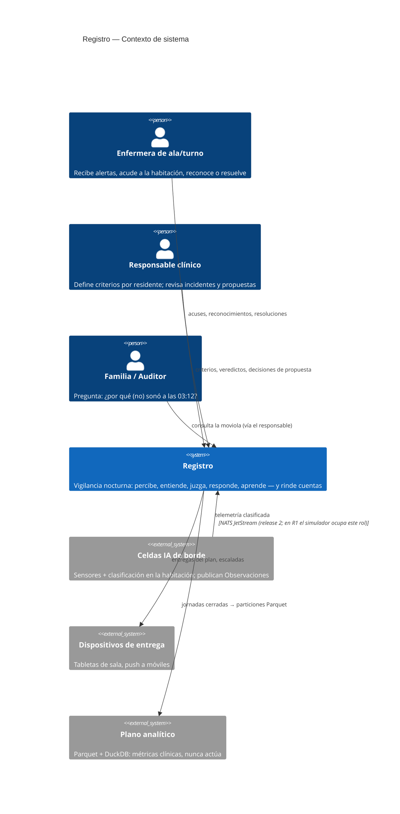
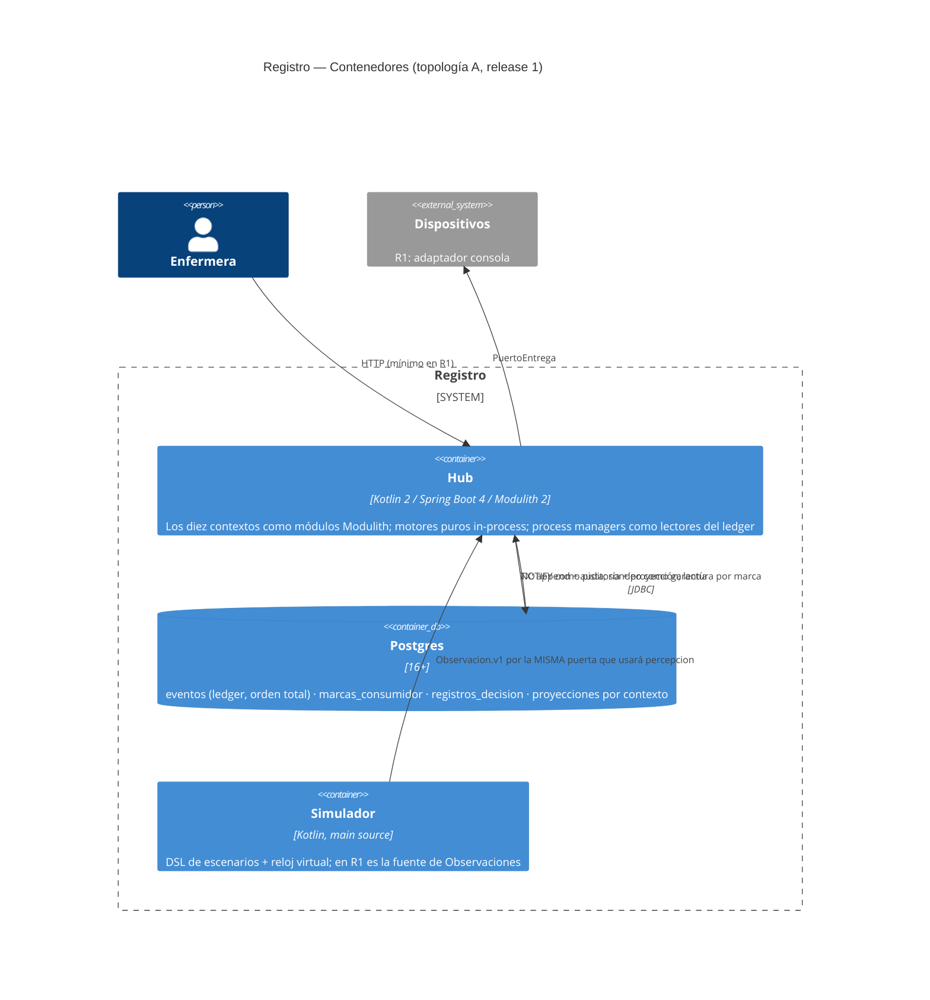
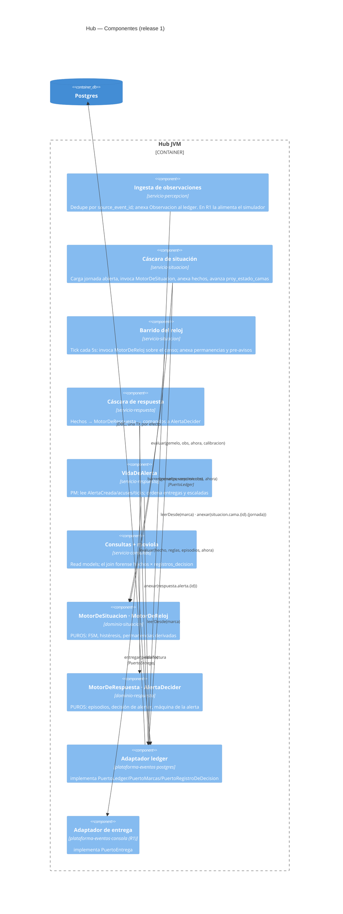
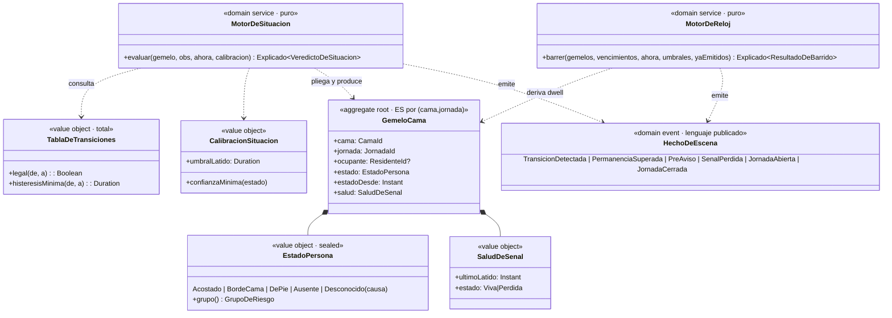
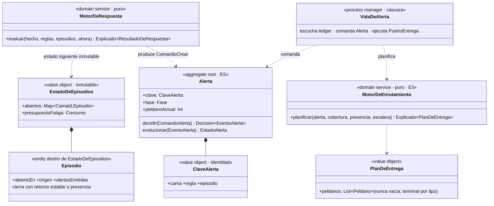
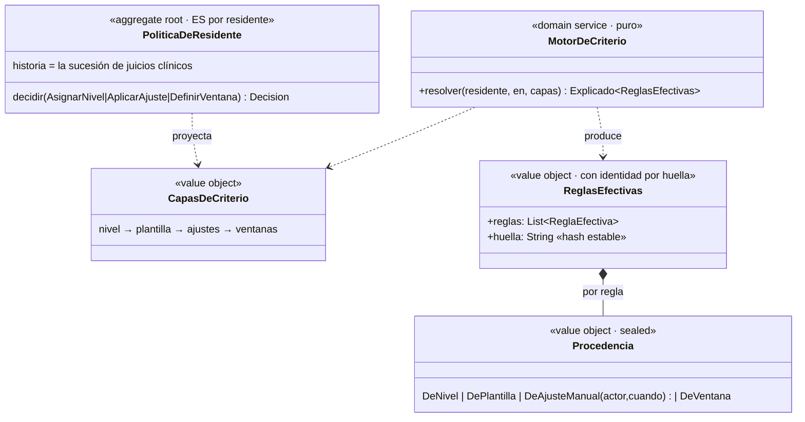

# 10 · El diseño: C4, modelo de dominio, casos de uso y patrones

**Sesión:** la mesa baja de la estrategia al diseño entregable. Este documento es **el** diseño del release 1: los cuatro niveles C4, el modelo de dominio por bounded context con sus fronteras dibujadas, los casos de uso formales con su corte de implementación, y el catálogo de patrones Kotlin/Spring con el estado del arte como vara. El 09 dijo *cuándo* y *en qué orden*; este dice *qué* y *con qué forma*.

---

## 1. C4 — Nivel 1: contexto del sistema

Quién usa el sistema y con qué otros sistemas habla. El release 1 solo materializa lo dibujado en línea sólida; lo punteado existe en el mapa para que ninguna decisión de hoy lo bloquee mañana.



## 2. C4 — Nivel 2: contenedores

La topología A (05 §4): una JVM y una base. La honestidad del diagrama está en lo que **no** hay: sin bus interno, sin caché externa, sin segundo almacén de verdad.



## 3. C4 — Nivel 3: componentes del hub

El nivel que gobierna el sprint. Cada componente nombra su módulo Gradle (D9) y su paquete; las interfaces en las flechas son las del §5.



La regla de lectura del diagrama: **toda flecha entre cáscaras pasa por el ledger** (no hay flecha `ssit → sres`: la cáscara de respuesta *lee* los hechos que la de situación *anexó*). Ese es el desacople real entre bounded contexts — compilan juntos hoy (D9), pero no se llaman jamás.

## 4. C4 — Nivel 4: el modelo de dominio por bounded context

El nivel de clases, que en un diseño DDD es el **modelo de dominio con estereotipos**: agregado, entidad, objeto de valor, servicio de dominio (motor), evento. Un diagrama por contexto del release; la frontera del diagrama ES la frontera del contexto.

### 4.1 `situacion` — el mundo entendido



Decisiones de modelo que la mesa firma: `EstadoPersona` es **sealed con datos** (`Desconocido` lleva su causa — 04 §3); la FSM es un **objeto de valor tabla-total**, no un grafo de objetos con herencia (el estado del arte abandonó el patrón State clásico para FSMs de dominio: la tabla es inspeccionable, serializable y el clínico puede leerla); el gemelo **no tiene setters ni identidad JPA** — es un fold de eventos, e "hidratar" es `eventos.fold(inicial, ::evolucionar)`.

### 4.2 `respuesta` — la decisión de molestar



Decisión de modelo: los **episodios no son agregado** — son estado de decisión del motor, plegable desde los hechos, que viaja como parámetro y vuelve como resultado. Hacerlos agregado (la tentación) duplicaría la verdad que ya está en el flujo del gemelo.

### 4.3 `criterio` — el jurista (entra en Sprint 2, se diseña hoy)



**El corte del release 1 sobre este contexto:** en Sprint 1, `ReglasEfectivas` existe como tipo en `contratos` pero se construye desde una plantilla fija en configuración (huella incluida — la moviola del Sprint 2 ya podrá citarla). El agregado y el motor entran en Sprint 2. Así el contrato no cambia entre sprints; solo cambia quién lo produce. **Ese es el patrón general de corte de la mesa: se congela el contrato, se posterga el productor.**

## 5. Mapa de paquetes y contratos (la tabla que se revisa como API)

```text
dominio/                              (módulo puro — rol nucleo-puro)
└── registro/
    ├── compartido/        Id<K> (value class) · RefEvento · Decider · Decision ·
    │                      Motor · VersionMotor · Explicado · PasoDeExplicacion · Descarte
    ├── situacion/         GemeloCama · EstadoPersona · SaludDeSenal · TablaDeTransiciones ·
    │                      CalibracionSituacion · MotorDeSituacion · MotorDeReloj
    ├── respuesta/         AlertaDecider · EstadoAlerta · ComandoAlerta · ClaveAlerta ·
    │                      Episodio · EstadoDeEpisodios · MotorDeRespuesta · [E3: MotorDeEnrutamiento]
    └── criterio/          [S2: PoliticaDeResidente · MotorDeCriterio · CapasDeCriterio]

contratos/                            (módulo puro)
└── registro/contratos/    Observacion.v1 · HechoDeEscena.v1 · EventoAlerta.v1 ·
                           ReglasEfectivas · JornadaId · resources/eventos/*.schema.json

plataforma-eventos/        api: PuertoLedger · PuertoMarcas · PuertoRegistroDeDecision · PuertoEntrega
                           (+ testFixtures: ContratoDeLedger, ContratoDeMarcas, ContratoDeEntrega)
                           postgres: un adaptador por puerto · memoria: ídem

servicio/                             (módulos Modulith; paquete = contexto)
└── registro/
    ├── percepcion/        IngestaDeObservaciones (dedupe → ledger)
    ├── situacion/         ServicioDeSituacion · BarridoDeReloj · ProyeccionEstadoCamas
    ├── respuesta/         ServicioDeRespuesta · VidaDeAlerta
    └── consultas/         Moviola (join forense) · TableroDeCamas
```

| Contrato (interfaz) | Vive en | Lo consume | Lo produce/implementa | Sprint |
| --- | --- | --- | --- | --- |
| `Decider<C,S,E>` | dominio/compartido | cáscaras, DSL de test, replay | cada agregado ES | S3 |
| `MotorDeSituacion` | dominio/situacion | ServicioDeSituacion | impl pura + versión | S4 |
| `MotorDeReloj` | dominio/situacion | BarridoDeReloj | impl pura | S5 |
| `MotorDeRespuesta` | dominio/respuesta | ServicioDeRespuesta | impl pura | S6 |
| `PuertoLedger` / `PuertoMarcas` | plataforma-eventos.api | todas las cáscaras | postgres, memoria | S2 |
| `PuertoRegistroDeDecision` | plataforma-eventos.api | todas las cáscaras | postgres, memoria | S4 |
| `PuertoEntrega` | plataforma-eventos.api | VidaDeAlerta | consola (R1), push (R2+) | S6 |
| `ReglasEfectivas` (tipo) | contratos | MotorDeRespuesta, moviola | config fija (S1) → MotorDeCriterio (S2) | S6/S2 |

## 6. Casos de uso del release 1 — formales, con su corte

Formato: actor primario · disparador · flujo principal · extensiones · postcondición verificable. Cada UC nombra los componentes del §3 que atraviesa — esa columna **es** el corte de implementación.

**UC-01 · Registrar una observación** — Actor: celda de borde (R1: simulador) · Dispara: llega `Observacion.v1`.
Flujo: (1) ingesta valida contra esquema; (2) dedupe por `source_event_id`; (3) anexa al flujo de observaciones. Ext: duplicada → no-op con `duplicate:true`. Post: la observación tiene `seq_global`; nada más pasó (entender es de otro UC). Componentes: `ing`, `ledg`. Historia: S2/S4.

**UC-02 · Entender la escena** — Actor: el sistema · Dispara: observación nueva en el ledger (marca de `ssit`).
Flujo: (1) cargar gemelo de la jornada abierta; (2) `MotorDeSituacion.evaluar`; (3) anexar hechos + registro de decisión + avanzar proyección, una TX. Ext: transición ilegal / histéresis / confianza → descarte **explicado**, sin hecho. Post: `proy_estado_camas` consistente con el flujo; todo veredicto tiene su `RegistroDeDecision`. Componentes: `ssit`, `msit`, `ledg`. Historia: S4.

**UC-03 · Vigilar la permanencia** — Actor: el reloj · Dispara: tick del barrido (5 s).
Flujo: (1) censo de gemelos desde proyección; (2) `MotorDeReloj.barrer`; (3) anexar `PreAviso`/`PermanenciaSuperada` idempotentes. Ext: reinicio previo → el primer barrido recalcula todo derivado (es el mismo flujo, no uno especial — esa es la elegancia del diseño). Post: un dwell vencido tiene exactamente un hecho. Componentes: `barr`, `msit`, `ledg`. Historia: S5, S8.

**UC-04 · Decidir alertar** — Actor: el sistema · Dispara: `HechoDeEscena` nuevo.
Flujo: (1) resolver `ReglasEfectivas` (R1: plantilla fija con huella); (2) `MotorDeRespuesta.evaluar` con episodios plegados; (3) si `CrearAlerta` → comando al Decider, anexar `AlertaCreada`. Ext: episodio ya alertado → `Nada` explicado; [E3: presencia de staff → supresión con constancia; severidad informativa → digest]. Post: a lo sumo una alerta por `ClaveAlerta`; la decisión (incluida la de NO alertar) quedó registrada. Componentes: `sres`, `mres`, `ledg`. Historia: S6.

**UC-05 · Entregar y escalar** — Actor: VidaDeAlerta · Dispara: `AlertaCreada` o vencimiento de peldaño.
Flujo: (1) plan (R1: escalera fija de dos peldaños + terminal); (2) `RegistrarEntrega` → `PuertoEntrega`; (3) sin acuse al vencer (derivado de `ocurrido_en`) → `Escalar`. Ext: acuse a tiempo → no escala; alerta ya resuelta → comando rechazado (absorbente). Post: la escalera avanzó o terminó; cada paso es un evento. Componentes: `vida`, `ent`, `ledg`. Historia: S6.

**UC-06 · Cerrar el lazo por presencia** — Actor: enfermera (físicamente) · Dispara: `PresenciaStaffDetectada`.
Flujo: (1) VidaDeAlerta correlaciona presencia con alertas abiertas de la cama; (2) `ResolverPorPresencia(segundosHastaStaff)`. Post: la alerta cerró con la métrica que da sentido al sistema entero. Componentes: `vida`, `ledg`. Historia: S7 (en el escenario).

**UC-07 · Explicar una decisión (moviola)** — Actor: responsable clínico · Dispara: "¿por qué (no) sonó a las 03:12?".
Flujo: (1) join hechos × registros_decision por cama y rango; (2) render cronológico citando regla, huella de criterio y descartes. Post: cada afirmación de la respuesta es una fila con `seq`. Componentes: `qry`. Historia: mínima en S7 (salida texto); UI real en Sprint 2.

**UC-08 · Abrir la jornada** — Actor: el sistema · Dispara: hora de apertura configurada (D8).
Flujo: (1) por cada cama: `JornadaAbierta` con estado heredado; (2) los consumidores pasan a leer el flujo nuevo. Post: rehidratar una cama no lee más que su jornada. Componentes: `ssit`, `ledg`. Historia: S4 (apertura); cierre en Sprint 2.

**Trazabilidad épica → UC → historia:** E1 = UC-01..08 en versión mínima (Sprint 1). E2 = UC-04 con criterio real + UC-07 con capas y autores (Sprint 2). E3 = UC-04/05 completos: supresión, fatiga, enrutamiento real (Sprint 3).

## 7. Patrones Kotlin / Spring — el estado del arte, con nombre y lugar

La tabla que evita discusiones en los PRs: qué patrón, dónde, y qué alternativa se descartó a sabiendas.

| Patrón | Dónde | Por qué (y qué se descartó) |
| --- | --- | --- |
| **Puertos y adaptadores (hexagonal)** | toda frontera de IO | El dominio en el centro sin saber de Spring. Descartado: capas anémicas service→repository donde el dominio es un DTO con getters |
| **Decider (ES funcional)** | todo agregado ES | `decidir/evolucionar` puros; el estado del arte de ES en Kotlin/F#/TS. Descartado: agregado OO mutable con `apply()` interno — esconde el fold y complica replay y sombra |
| **ADTs: `sealed interface` + `data class` + `when` exhaustivo** | comandos, eventos, estados, decisiones | El compilador como revisor: un evento nuevo rompe todos los `when` que deben decidir sobre él. Es el motivo por el que Go quedó fuera del núcleo |
| **`value class` para identidades** | `Id<K>`, CamaId, ResidenteId… | Cero costo en runtime, imposible pasar una CamaId donde va ResidenteId. Descartado: String crudo y sufijos en nombres |
| **Objeto de valor tabla-total** | FSM, escaleras, plantillas | Datos inspeccionables antes que jerarquías de clases (patrón State clásico descartado, §4.1) |
| **Process manager con estado durable** | VidaDeAlerta, CierreDeJornada | Coordinación en el tiempo separada de la decisión. Descartado: sagas de framework y el orquestador (objeción 2) |
| **Lector de ledger con marca** | todo consumidor interno | At-least-once + idempotencia por clave nombrada. Descartado: `@TransactionalEventListener`/eventos Modulith como transporte — útiles, pero serían un segundo camino de eventos, y la objeción 3 prohíbe dos verdades |
| **Cáscara transaccional fina** | servicios de aplicación | Una función: cargar-plegar-decidir-anexar en una TX (`TransactionTemplate` explícito antes que `@Transactional` en interfaces — el proxy de Spring no envuelve llamadas internas y ese bug clásico no merece existir) |
| **Constructor injection, cero field injection; beans por contexto** | servicio/* | Modulith detecta fugas entre módulos; los beans de un contexto son `internal` a su paquete |
| **`JdbcClient` + SQL a mano** | adaptadores y proyecciones | El SQL del ledger y las proyecciones es simple y debe leerse. Descartado: JPA/Hibernate (un event store con entidades es pelear contra el framework); jOOQ queda como opción si las consultas crecen |
| **testFixtures como contrato ejecutable** | conformidad de puertos, DSL de test, ContratoDePureza | La suite abstracta es la especificación; el adaptador que la hereda no puede desviarse en silencio |
| **Reloj por parámetro, jamás `Clock` inyectado en el dominio** | todo el núcleo | `ahora: Instant` como argumento es más honesto que un `Clock` bean: el dominio ni sabe que el tiempo avanza solo |

## 8. Lo que la mesa espera del primer PR

El corte está hecho: contratos congelados (§5), UCs con componentes (§6), patrones con nombre (§7). El primer PR que la sala espera es **S2 con el `ContratoDeLedger` escrito antes que cualquier adaptador** — porque si el banco de conformidad nace después del adaptador Postgres, especifica lo que Postgres hace en vez de lo que el ledger promete, y toda la plataforma queda torcida desde el cimiento. Después S3 (la forma uniforme), y de ahí el dominio en TDD puro: S4 → S5 → S6 → S7 → S8.

---

*Enmienda menor que esta sesión deja registrada: el §2 del doc 09 queda subsumido por el §5 de este documento (misma información, aquí con dueño, consumidor y sprint). Ante conflicto, rige el 10.*
