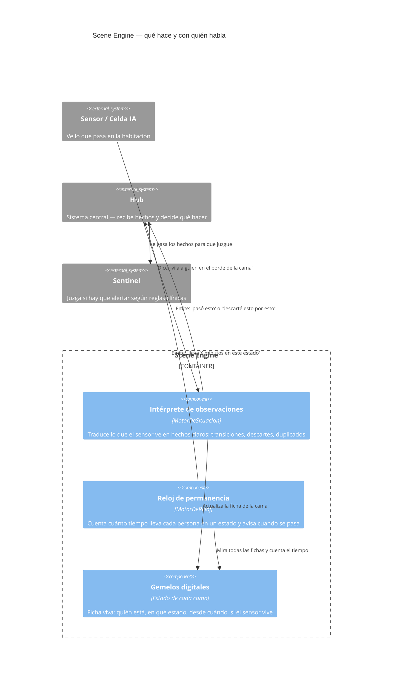
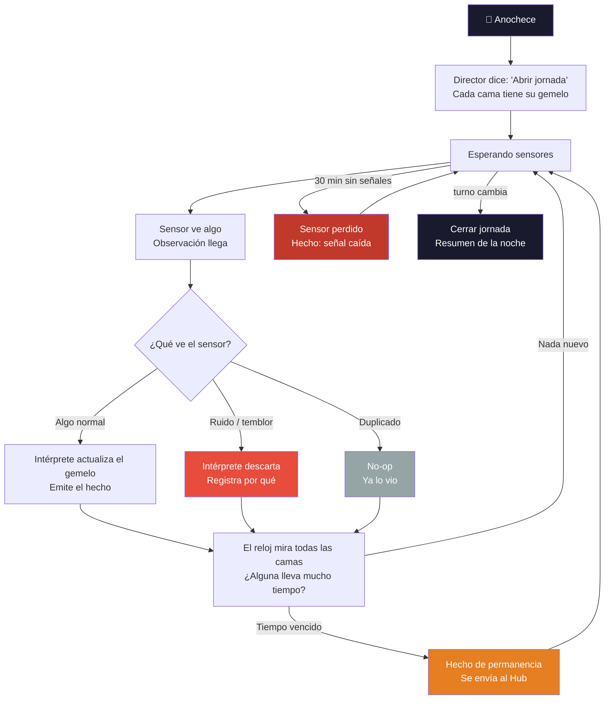
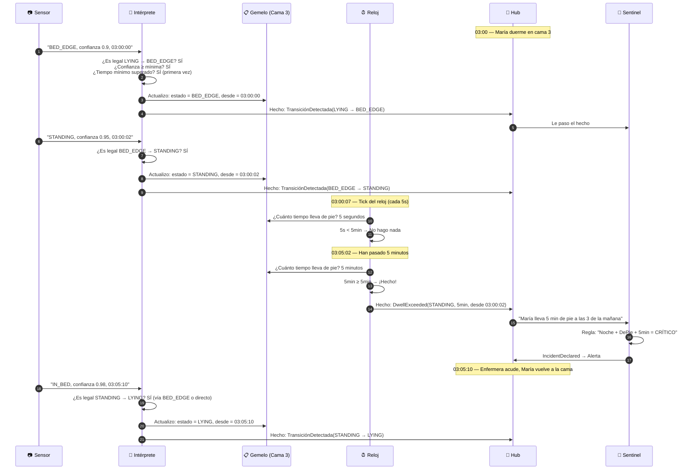
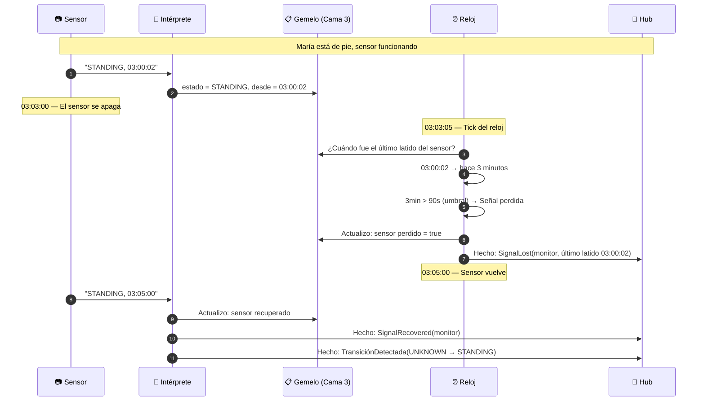
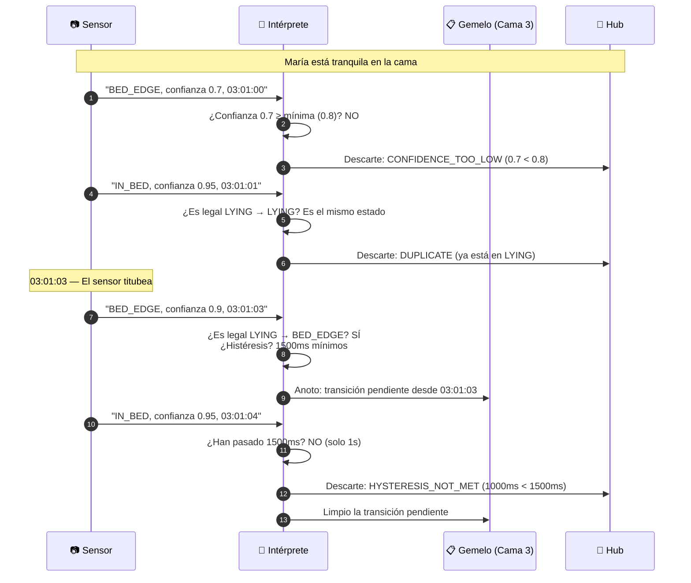
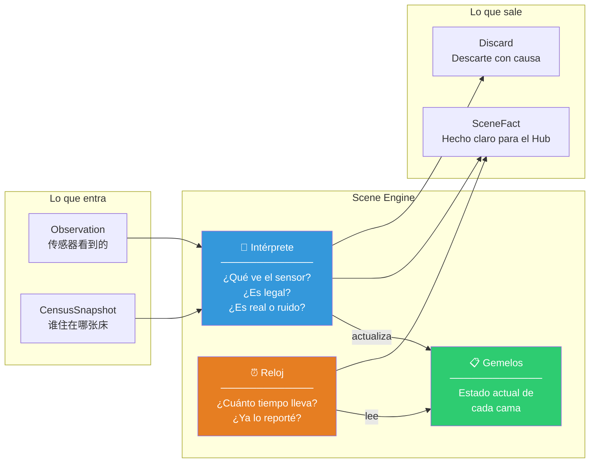

# 12 · Scene Engine — Diseño en lenguaje de geriátrico

**Para quién:** Director del geriátrico, jefa de enfermería, enfermeros de turno.
**Qué lee:** cómo funciona el "ojo que interpreta la habitación", qué hace, qué no hace, y qué pasa cada noche.

---

## 1. El Scene Engine y sus vecinos — quién hace qué



### Tabla de responsabilidades

| Componente | Qué hace | Qué NO hace | Ejemplo |
|------------|----------|-------------|---------|
| **Intérprete** | Traduce sensor → hecho | No decide si alertar | "María pasó de acostada a de pie" |
| **Reloj** | Cuenta tiempo en estado | No conoce reglas clínicas | "Lleva 5 minutos de pie" |
| **Gemelo** | Guarda el estado actual de una cama | No guarda historial | "Cama 3: María, de pie, desde 03:00:02" |

---

## 2. Ciclo de vida de una noche — de punta a punta



---

## 3. Secuencia: la caída de María a las 03:00



---

## 4. Secuencia: el sensor pierde señal



---

## 5. Secuencia: ruido del sensor (temblor)



---

## 6. Pseudocódigo del Intérprete — cómo piensa

```
función interpretar(gemelo, observación, ahora, calibración):

    # 1. ¿La observación es confiable?
    si observación.confianza < calibración.confianzaMínima(observación.tipo):
        return Explicado(
            gemelo sin cambios,
            [],
            [Descarte("confianza baja", CONFIDENCE_TOO_LOW)]
        )

    # 2. ¿El sensor está vivo?
    si gemelo.sensor.perdido:
        # La observación recuperó el sensor
        gemelo = gemelo.conSensorRecuperado()
        hechos = [SignalRecovered(gemelo.sensor)]

    # 3. ¿Es el mismo estado? → no-op
    si observación.tipo == gemelo.estado.kind:
        return Explicado(gemelo, [], [Descarte("duplicado", DUPLICATE)])

    # 4. ¿La transición es legal en la tabla?
    si NO tabla.esLegal(de: gemelo.estado.kind, a: observación.tipo):
        return Explicado(
            gemelo sin cambios,
            [],
            [Descarte("transición ilegal", ILLEGAL_TRANSITION)]
        )

    # 5. ¿Pasó el tiempo mínimo de histéresis?
    tiempoEnEstado = ahora - gemelo.estadoDesde
    mínimoRequerido = tabla.histeresis(de: gemelo.estado.kind, a: observación.tipo)
    si tiempoEnEstado < mínimoRequerido:
        return Explicado(
            gemelo sin cambios,
            [],
            [Descarte("histéresis no superada", HYSTERESIS_NOT_MET)]
        )

    # 6. Todo bien → transición
    nuevoEstado = observación.tipo.aEstado()
    gemelo = gemelo.conEstado(nuevoEstado, desde: ahora)
    hechos = [TransicionDetectada(de: gemelo.estadoAnterior, a: nuevoEstado)]

    return Explicado(gemelo, hechos, [])
```

---

## 7. Pseudocódigo del Reloj — cómo cuenta

```
función barrer(gemelos, ahora, catálogo, marcasEmitidas):

    hechos = []
    marcasNuevas = marcasEmitidas

    para cada gemelo en gemelos:

        # ¿El sensor está vivo?
        si gemelo.sensor.perdido:
            # Ya se emitió el SignalLost, no duplicar
            continuar

        # ¿Cuánto tiempo lleva en este estado?
        duración = ahora - gemelo.estadoDesde

        # ¿Hay un umbral para este estado?
        umbral = catálogo.porEstado[gemelo.estado.kind]
        si umbral == null:
            continuar  # No se vigila permanencia en LYING

        # ¿Ya emití un hecho para este (cama, estado, desde)?
        marca = DwellMarkKey(cama: gemelo.cama, estado: gemelo.estado.kind, desde: gemelo.estadoDesde)
        si marca in marcasEmitidas:
            continuar  # Ya lo reporté

        # ¿Está en pre-aviso? (80% del umbral)
        preUmbral = umbral * 0.8
        si duración >= preUmbral Y duración < umbral:
            hechos.add(DwellWarning(gemelo.estado, umbral, gemelo.estadoDesde))
            marcasNuevas = marcasNuevas + marca(con warning: true)

        # ¿Superó el umbral?
        si duración >= umbral:
            hechos.add(DwellExceeded(gemelo.estado, umbral, gemelo.estadoDesde))
            marcasNuevas = marcasNuevas + marca(con warning: false)

    return Explicado(SweepResult(hechos, marcasNuevas))
```

---

## 8. Los tres escenarios del Sprint 1

### Escenario A: La caída de las 03:00 ✅
```
DADO: María en cama 3, dormida, sensor vivo
CUANDO: sensor ve borde de cama → de pie → 5 minutos de pie
ENTONCES:
  1. TransiciónDetectada(LYING → BED_EDGE)
  2. TransiciónDetectada(BED_EDGE → STANDING)
  3. DwellExceeded(STANDING, 5min)
  → El Hub recibe 3 hechos y puede alertar
```

### Escenario B: La noche tranquila ✅
```
DADO: 30 camas, todas con residentes dormidos
CUANDO: pasan 8 horas sin novedad
ENTONCES:
  1. Cero hechos de transición
  2. Cero hechos de permanencia
  3. El sistema no grita de más
  → Silencio = normalidad
```

### Escenario C: El sensor se apaga ✅
```
DADO: María de pie, sensor vivo
CUANDO: sensor pierde señal por 90 segundos
ENTONCES:
  1. SignalLost(monitor, último latido)
  2. Gemelo pasa a UNKNOWN(SIGNAL_LOST)
  → El sistema dice "no sé qué pasó" en vez de asumir que todo está bien
```

---

## 9. Lo que el Scene Engine NO necesita saber

| No necesita | Por qué |
|-------------|---------|
| El nombre de María | Solo sabe "cama 3 tiene a alguien de pie" |
| Que es de noche | Solo sabe "la observación llegó a las 03:00" |
| Que 5 minutos es grave | Solo sabe "lleva 5 minutos en este estado" — otro decide si es grave |
| Si hay enfermera en el pasillo | Eso lo ve el sensor de staff, y lo suprime el Sentinel |
| Si ya se alertó antes | Eso lo lleva el Sentinel con sus episodios |

---

## 10. Diagrama de componentes con pseudocódigo integrado



---

*Documento de diseño — nivel de geriátrico, no de arquitecto. Cada Diagrama responde a una pregunta que el director o la jefa de enfermería haría.*
