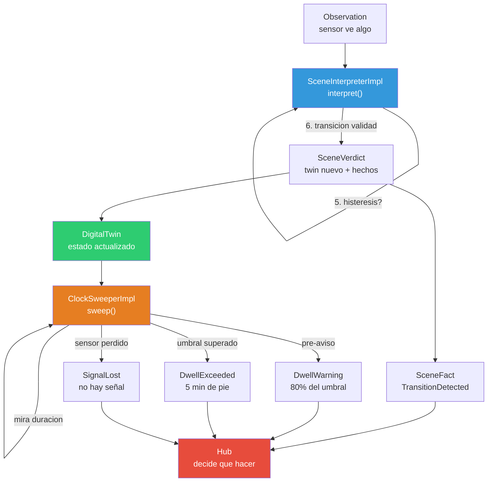

# 13 · Motor de Situacion — Modelo de clases, interfaces y enums

**Mesa:** expertos en diseno de dominio + direccion geriatrica.
**Objetivo:** definir exactamente que clases, interfaces y enums componen el motor de situacion, cuales ya existen y cuales faltan.

---

## 1. Lo que ya tenemos — inventario completo

### platform/domain-kernel (nucleo puro compartido)

| Tipo | Kind | Archivo | Estado |
|------|------|---------|--------|
| `Decider<C,S,E>` | interface | `Decider.kt` | Completo |
| `Decision<E>` | sealed interface | `Decider.kt` | Completo |
| `Engine` | interface | `Engine.kt` | Completo |
| `EngineVersion` | data class | `Engine.kt` | Completo |
| `Explained<T>` | data class | `Engine.kt` | Completo |
| `ExplanationStep` | data class | `Engine.kt` | Completo |
| `Discard` | data class | `Engine.kt` | Completo |
| `DiscardCause` | enum (8 valores) | `Engine.kt` | Completo |
| `BedId` | value class | `Ids.kt` | Completo |
| `ResidentId` | value class | `Ids.kt` | Completo |
| `MonitorId` | value class | `Ids.kt` | Completo |
| `NightId` | value class | `Ids.kt` | Completo |
| `EventRef` | data class | `Ids.kt` | Completo |

### platform/contracts (contratos publicos)

| Tipo | Kind | Archivo | Estado |
|------|------|---------|--------|
| `Observation` | data class | `perception/Observation.kt` | Completo |
| `ObservationKind` | enum (7 valores) | `perception/Observation.kt` | Completo |
| `PersonState` | sealed interface (5 casos) | `scene/PersonState.kt` | Completo |
| `StateKind` | enum (5 valores) | `scene/PersonState.kt` | Completo |
| `RiskGroup` | enum (3 valores) | `scene/PersonState.kt` | Completo |
| `PersonState.kind` | ext property | `scene/PersonState.kt` | Completo |
| `PersonState.riskGroup` | ext property | `scene/PersonState.kt` | Completo |
| `SceneFact` | sealed interface (7 casos) | `scene/SceneFact.kt` | Completo |
| `NightSummary` | data class | `scene/SceneFact.kt` | Completo |

### engines/scene-engine/scene-domain (el motor)

| Tipo | Kind | Archivo | Estado |
|------|------|---------|--------|
| `DigitalTwin` | data class | `DigitalTwin.kt` | Sin evolucionar() |
| `SignalHealth` | data class | `DigitalTwin.kt` | Completo |
| `TransitionTable` | data class | `TransitionTable.kt` | Completo |
| `SceneInterpreter` | interface | `SceneInterpreter.kt` | Solo interfaz, sin impl |
| `SceneVerdict` | data class | `SceneInterpreter.kt` | Completo |
| `SceneCalibration` | data class | `SceneInterpreter.kt` | Completo |
| `ClockSweeper` | interface | `ClockSweeper.kt` | Solo interfaz, sin impl |
| `DwellCatalog` | data class | `ClockSweeper.kt` | Completo |
| `DwellMarks` | data class | `ClockSweeper.kt` | Completo |
| `DwellMarkKey` | data class | `ClockSweeper.kt` | Completo |
| `SweepResult` | data class | `ClockSweeper.kt` | Completo |

---

## 2. Lo que falta — la mesa recomienda

### 2.1 SceneInterpreterImpl — el cerebro que interpreta

```kotlin
class SceneInterpreterImpl(
    private val table: TransitionTable,
    private val minConfidence: Map<StateKind, Double>,
    private val heartbeatTimeout: Duration,
) : SceneInterpreter {

    override val version = EngineVersion(
        name = "scene-interpreter",
        semver = "1.0.0",
        buildFingerprint = "..."
    )

    override fun interpret(
        twin: DigitalTwin,
        observation: Observation,
        now: Instant,
        calibration: SceneCalibration,
    ): Explained<SceneVerdict>
}
```

**Logica (en orden):**

```
1. CONFIANZA
   si observation.confidence < calibration.minConfidence[observation.kind]:
       return Explado(twin, [], [Discard("baja confianza", CONFIDENCE_TOO_LOW)])

2. RECUPERACION DE SENSOR
   si twin.signal.lost AND observation.kind != HEARTBEAT:
       twin = twin.copy(signal = twin.signal.copy(lost = false))
       hechos = [SignalRecovered(twin.bed, twin.night, now, twin.signal.monitor)]
       // seguir evaluando — la observacion tambien puede indicar estado

3. DUPLICADO
   si observation.kind.aPersonState() == twin.state:
       return Explicado(twin, [], [Discard("mismo estado", DUPLICATE)])

4. TRANSICION ILEGAL
   si NO calibration.table.isLegal(twin.state.kind, observation.kind.aPersonState().kind):
       return Explicado(twin, [], [Discard("transicion ilegal", ILLEGAL_TRANSITION)])

5. HYSTERESIS
   duracionEnEstado = Duration.between(twin.stateSince, now)
   minimo = calibration.table.hysteresis(twin.state.kind, observation.kind.aPersonState().kind)
   si duracionEnEstado < minimo:
       return Explicado(twin, [], [Discard("histeresis ${duracionEnEstado} < ${minimo}", HYSTERESIS_NOT_MET)])

6. TRANSICION VALIDA
   nuevoEstado = observation.kind.aPersonState()
   nuevoTwin = twin.copy(
       state = nuevoEstado,
       stateSince = now,
   )
   hecho = TransitionDetected(twin.bed, twin.night, now, twin.state, nuevoEstado)
   paso = ExplanationStep(
       rule = "transition-table",
       observed = "${twin.state.kind} -> ${nuevoEstado.kind}",
       conclusion = "transicion legal aceptada"
   )
   return Explicado(nuevoTwin, [paso], [], [hecho])
```

### 2.2 ClockSweeperImpl — el reloj que cuenta

```kotlin
class ClockSweeperImpl : ClockSweeper {

    override val version = EngineVersion(
        name = "clock-sweeper",
        semver = "1.0.0",
        buildFingerprint = "..."
    )

    override fun sweep(
        twins: Collection<DigitalTwin>,
        now: Instant,
        thresholds: DwellCatalog,
        marks: DwellMarks,
    ): Explained<SweepResult>
}
```

**Logica (por cada gemelo):**

```
PARA CADA twin EN twins:

  1. SENSOR PERDIDO — saltar
     si twin.signal.lost:
         continuar

  2. DURACION EN ESTADO
     duracion = Duration.between(twin.stateSince, now)

  3. ¿HAY UMBRAL PARA ESTE ESTADO?
     umbral = thresholds.byState[twin.state.kind]
     si umbral == null:
         continuar  // No se vigila LYING

  4. ¿YA EMITI PARA ESTE (cama, estado, desde)?
     marca = DwellMarkKey(twin.bed, twin.state.kind, twin.stateSince, warning = false)
     si marca in marks.emitted:
         continuar

  5. PRE-AVISO (80% del umbral)
     preUmbral = umbral * thresholds.warningRatio
     si duracion >= preUmbral AND duracion < umbral:
         marcaWarning = DwellMarkKey(twin.bed, twin.state.kind, twin.stateSince, warning = true)
         si marcaWarning NOT in marks.emitted:
             hechos += DwellWarning(twin.bed, twin.night, now, twin.state, umbral, twin.stateSince)
             marcasNuevas += marcaWarning

  6. UMBRAL SUPERADO
     si duracion >= umbral:
         hechos += DwellExceeded(twin.bed, twin.night, now, twin.state, umbral, twin.stateSince)
         marcasNuevas += marca

  7. HEARTBEAT TIMEOUT
     si Duration.between(twin.signal.lastHeartbeat, now) > thresholds.heartbeatTimeout:
         twin = twin.copy(signal = twin.signal.copy(lost = true))
         hechos += SignalLost(twin.bed, twin.night, now, twin.signal.monitor, twin.signal.lastHeartbeat)

return Explained(SweepResult(hechos, DwellMarks(marcasNuevas)))
```

### 2.3 DigitalTwin.evolucionar() — hidratar desde hechos

```kotlin
fun DigitalTwin.evolucionar(fact: SceneFact): DigitalTwin = when (fact) {
    is NightOpened -> copy(
        occupant = fact.occupant,
        state = fact.initialState,
        stateSince = fact.stateSince,
    )
    is TransitionDetected -> copy(
        state = fact.to,
        stateSince = fact.at,
    )
    is DwellWarning -> this  // No cambia el estado, solo se reporta
    is DwellExceeded -> this
    is StaffPresenceDetected -> this
    is SignalLost -> copy(signal = signal.copy(lost = true))
    is SignalRecovered -> copy(signal = signal.copy(lost = false))
    is NightClosed -> this  // Cierra la jornada
}
```

---

## 3. Modelo de clases completo — lo que la mesa aprueba

```
┌─────────────────────────────────────────────────────────────────────┐
│                    MOTOR DE SITUACION — MODELO                      │
├─────────────────────────────────────────────────────────────────────┤
│                                                                     │
│  ┌─── domain-kernel ───────────────────────────────────────────┐   │
│  │  Engine (interface)                                          │   │
│  │    ├─ version: EngineVersion                                 │   │
│  │                                                             │   │
│  │  EngineVersion (data class)                                  │   │
│  │    ├─ name: String                                           │   │
│  │    ├─ semver: String                                         │   │
│  │    └─ buildFingerprint: String                               │   │
│  │                                                             │   │
│  │  Explained<T> (data class)                                   │   │
│  │    ├─ value: T                                               │   │
│  │    ├─ explanation: List<ExplanationStep>                     │   │
│  │    └─ discards: List<Discard>                                │   │
│  │                                                             │   │
│  │  Discard (data class)                                        │   │
│  │    ├─ subject: String                                        │   │
│  │    └─ cause: DiscardCause                                    │   │
│  │                                                             │   │
│  │  DiscardCause (enum)                                         │   │
│  │    ILLEGAL_TRANSITION | CONFIDENCE_TOO_LOW |                 │   │
│  │    HYSTERESIS_NOT_MET | DUPLICATE | NO_OCCUPANT |            │   │
│  │    STAFF_PRESENT | EPISODE_ALREADY_ALERTED |                 │   │
│  │    FATIGUE_BUDGET_EXCEEDED                                   │   │
│  └─────────────────────────────────────────────────────────────┘   │
│                                                                     │
│  ┌─── contracts ───────────────────────────────────────────────┐   │
│  │  Observation (data class)                                    │   │
│  │    ├─ sourceEventId: String                                  │   │
│  │    ├─ monitor: MonitorId                                     │   │
│  │    ├─ bed: BedId                                             │   │
│  │    ├─ kind: ObservationKind                                  │   │
│  │    ├─ confidence: Double (0..1)                              │   │
│  │    └─ observedAt: Instant                                    │   │
│  │                                                             │   │
│  │  ObservationKind (enum)                                      │   │
│  │    IN_BED | BED_EDGE | STANDING | OUT_OF_ROOM |             │   │
│  │    STAFF_IN_ROOM | HEARTBEAT | UNCLASSIFIED                  │   │
│  │                                                             │   │
│  │  PersonState (sealed interface)                              │   │
│  │    ├─ Lying : PersonState                                    │   │
│  │    ├─ BedEdge : PersonState                                  │   │
│  │    ├─ Standing : PersonState                                 │   │
│  │    ├─ Absent : PersonState                                   │   │
│  │    └─ Unknown(cause: UnknownCause) : PersonState             │   │
│  │                                                             │   │
│  │  StateKind (enum)                                            │   │
│  │    LYING | BED_EDGE | STANDING | ABSENT | UNKNOWN           │   │
│  │                                                             │   │
│  │  RiskGroup (enum)                                            │   │
│  │    SAFE | AT_RISK | UNKNOWN                                  │   │
│  │                                                             │   │
│  │  SceneFact (sealed interface)                                │   │
│  │    ├─ NightOpened(bed, night, at, occupant, initialState,   │   │
│  │    │              stateSince)                                │   │
│  │    ├─ TransitionDetected(bed, night, at, from, to)          │   │
│  │    ├─ DwellWarning(bed, night, at, state, threshold, since) │   │
│  │    ├─ DwellExceeded(bed, night, at, state, threshold, since)│   │
│  │    ├─ StaffPresenceDetected(bed, night, at, staff?)         │   │
│  │    ├─ SignalLost(bed, night, at, monitor, lastHeartbeat)    │   │
│  │    ├─ SignalRecovered(bed, night, at, monitor)              │   │
│  │    └─ NightClosed(bed, night, at, summary)                  │   │
│  └─────────────────────────────────────────────────────────────┘   │
│                                                                     │
│  ┌─── scene-domain ────────────────────────────────────────────┐   │
│  │  DigitalTwin (data class)                                    │   │
│  │    ├─ bed: BedId                                             │   │
│  │    ├─ night: NightId                                         │   │
│  │    ├─ occupant: ResidentId?                                  │   │
│  │    ├─ state: PersonState                                     │   │
│  │    ├─ stateSince: Instant                                    │   │
│  │    └─ signal: SignalHealth                                   │   │
│  │                                                             │   │
│  │  SignalHealth (data class)                                   │   │
│  │    ├─ monitor: MonitorId                                     │   │
│  │    ├─ lastHeartbeat: Instant                                 │   │
│  │    └─ lost: Boolean                                          │   │
│  │                                                             │   │
│  │  TransitionTable (data class)                                │   │
│  │    ├─ legal: Map<(StateKind,StateKind), Duration>            │   │
│  │    ├─ isLegal(from, to): Boolean                             │   │
│  │    ├─ hysteresis(from, to): Duration                         │   │
│  │    └─ RELEASE_1: companion (valores del release 1)          │   │
│  │                                                             │   │
│  │  SceneInterpreter (interface : Engine)                       │   │
│  │    └─ interpret(twin, obs, now, cal) → Expl<SceneVerdict>   │   │
│  │                                                             │   │
│  │  SceneInterpreterImpl (class : SceneInterpreter)  ← NUEVO   │   │
│  │    ├─ table: TransitionTable                                 │   │
│  │    ├─ minConfidence: Map<StateKind, Double>                  │   │
│  │    └─ heartbeatTimeout: Duration                             │   │
│  │                                                             │   │
│  │  SceneVerdict (data class)                                   │   │
│  │    ├─ twin: DigitalTwin                                      │   │
│  │    └─ facts: List<SceneFact>                                 │   │
│  │                                                             │   │
│  │  SceneCalibration (data class)                               │   │
│  │    ├─ table: TransitionTable                                 │   │
│  │    ├─ minConfidence: Map<StateKind, Double>                  │   │
│  │    └─ heartbeatTimeout: Duration                             │   │
│  │                                                             │   │
│  │  ClockSweeper (interface : Engine)                           │   │
│  │    └─ sweep(twins, now, thresholds, marks) → Expl<SweepRes> │   │
│  │                                                             │   │
│  │  ClockSweeperImpl (class : ClockSweeper)  ← NUEVO           │   │
│  │                                                             │   │
│  │  DwellCatalog (data class)                                   │   │
│  │    ├─ byState: Map<StateKind, Duration>                      │   │
│  │    ├─ warningRatio: Double (= 0.8)                           │   │
│  │    └─ postTransitionGrace: Duration (= 10s)                  │   │
│  │                                                             │   │
│  │  DwellMarks (data class)                                     │   │
│  │    └─ emitted: Set<DwellMarkKey>                             │   │
│  │                                                             │   │
│  │  DwellMarkKey (data class)                                   │   │
│  │    ├─ bed: BedId                                             │   │
│  │    ├─ state: StateKind                                       │   │
│  │    ├─ since: Instant                                         │   │
│  │    └─ warning: Boolean                                       │   │
│  │                                                             │   │
│  │  SweepResult (data class)                                    │   │
│  │    ├─ facts: List<SceneFact>                                 │   │
│  │    └─ marks: DwellMarks                                      │   │
│  │                                                             │   │
│  │  DigitalTwin.evolucionar(SceneFact): DigitalTwin  ← NUEVO   │   │
│  └─────────────────────────────────────────────────────────────┘   │
│                                                                     │
└─────────────────────────────────────────────────────────────────────┘
```

---

## 4. Decisiones de la mesa

### 4.1. SceneCalibration vive en scene-domain

**Pregunta:** SceneCalibration tiene minConfidence y heartbeatTimeout. El MeasurementProtocolAdvice dice "no mezclar configuracion de infraestructura con config de negocio". Estos valores son config de negocio (clinica) o de infraestructura (sensor)?

**Decision:** son config del motor — viven en `scene-domain`, no en `contracts`. El hub no los consume; solo el motor los necesita. Si manana el hub quiere saber "que calibracion se uso", lo pregunta al DecisionRecord.

### 4.2. DigitalTwin.evolucionar() como funcion de extension

**Pregunta:** evolucionar() es un metodo del data class o una funcion de extension?

**Decision:** extension function. El data class no debe saber de SceneFact (estaria creando una dependencia circular: scene-domain -> contracts -> scene-domain). La extension vive en scene-domain y importa contracts.

### 4.3. SceneInterpreterImpl recibe calibracion por metodo, no por constructor

**Pregunta:** La calibracion (minConfidence, heartbeatTimeout) cambia por residente o por turno? O es fija?

**Decision:** por ahora es fija (RELEASE_1). Se inyecta por constructor. Si manana cambia por residente, se pasa como parametro a interpret(). El contrato ya lo permite.

### 4.4. ClockSweeperImpl no tiene estado

**Pregunta:** Los DwellMarks son estado mutable. Donde viven?

**Decision:** en la capa de servicio. El sweeper es una funcion pura: recibe marks, devuelve marks nuevos. La capa de servicio guarda los marks en memoria (o en Postgres si persiste reinicios).

### 4.5. ObservationKind.aPersonState() — el mapper

**Pregunta:** Como se traduce IN_BED a PersonState?

**Decision:** una funcion pura en contracts:

```kotlin
fun ObservationKind.toPersonState(): PersonState = when (this) {
    IN_BED -> PersonState.Lying
    BED_EDGE -> PersonState.BedEdge
    STANDING -> PersonState.Standing
    OUT_OF_ROOM -> PersonState.Absent
    HEARTBEAT -> PersonState.Lying  // El heartbeat no cambia estado
    STAFF_IN_ROOM -> PersonState.Lying  // Staff no afecta persona
    UNCLASSIFIED -> PersonState.Unknown(UnknownCause.SCENE)
}
```

---

## 5. Flujo de datos — como se conecta todo



---

## 6. Archivos a crear o modificar

| Archivo | Accion | Contenido |
|---------|--------|-----------|
| `scene-domain/.../SceneInterpreterImpl.kt` | CREAR | Implementacion del interprete |
| `scene-domain/.../ClockSweeperImpl.kt` | CREAR | Implementacion del reloj |
| `scene-domain/.../DigitalTwin.kt` | MODIFICAR | Agregar evolucionar() extension |
| `contracts/.../ObservationKind.kt` | MODIFICAR | Agregar toPersonState() |
| `scene-domain/src/test/.../SceneInterpreterTest.kt` | CREAR | Tests del interprete |
| `scene-domain/src/test/.../ClockSweeperTest.kt` | CREAR | Tests del reloj |
| `scene-domain/src/test/.../DigitalTwinTest.kt` | CREAR | Tests de evolucionar() |

---

## 7. Resumen para la mesa

El motor de situacion tiene **3 componentes puros**:

1. **SceneInterpreter** — traduce senal en hechos. Pregunta: "vi algo, es real o es ruido?"
2. **ClockSweeper** — cuenta tiempo en estado. Pregunta: "lleva demasiado tiempo en este estado?"
3. **DigitalTwin** — ficha de la cama. Respuesta: "estado actual de la cama, ahora mismo"

Los tres son **funciones puras** — no tienen estado, no saben de Spring, no saben de bases de datos. La capa de servicio es la que:
- Guarda los gemelos en memoria
- Llama al interprete cada vez que llega una observacion
- Llama al reloj cada 5 segundos
- Envia los hechos al hub

**Lo que ya existe** cubre el 80% del modelo. Solo faltan 2 implementaciones (SceneInterpreterImpl y ClockSweeperImpl) y 1 funcion (DigitalTwin.evolucionar).
