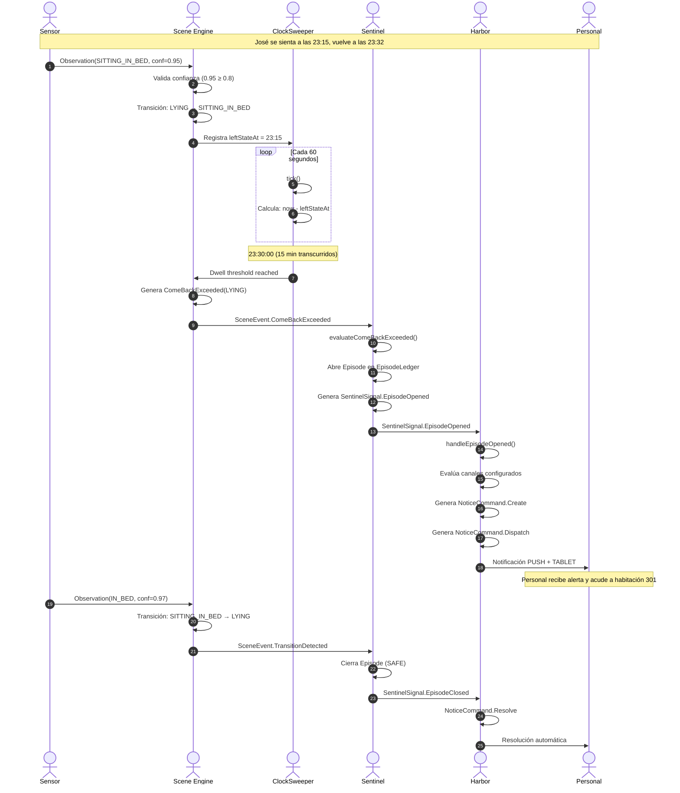
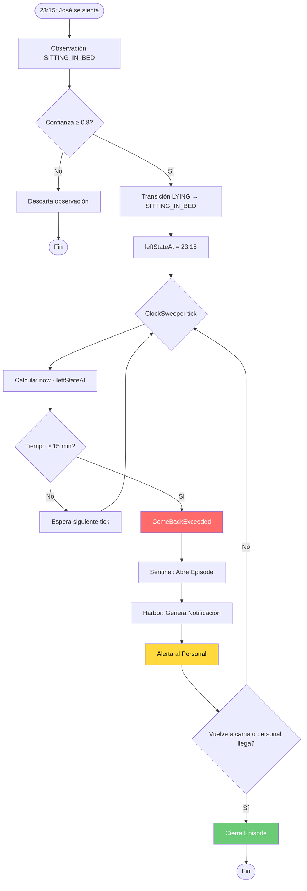

# ANEXO A: Escenario E1 - José 301 (17 min sin acostarse)

## A.1 Datos del Escenario

| Campo | Valor | Descripción |
|-------|-------|-------------|
| **Escenario** | E1 | 17 minutos sin acostarse |
| **Residente** | José | Habitación 301 |
| **Bed ID** | bed-4 | Identificador de cama |
| **Night ID** | night-jose-301 | Identificador de noche |
| **Monitor ID** | m1 | Sensor asociado |
| **Inicio turno** | 22:00:00 UTC | Hora de inicio |
| **Configuración** | configBasica | comeBack 12/15m |

### Perfil del Residente

| Campo | Valor |
|-------|-------|
| Nivel de Riesgo | LOW |
| Movilidad | NONE (sin ayudas) |
| Vigilancia | STANDARD |

---

## A.2 Diagrama de Secuencia



---

## A.3 Diagrama de Flujo



---

## A.4 Matriz de Decisiones

| Minuto | Hora | Tiempo Fuera | Nivel | Acción | Resultado |
|--------|------|--------------|-------|--------|-----------|
| 0 | 23:15 | 0 min | Normal | Marca timestamp | Esperando |
| 10 | 23:25 | 10 min | Normal | ClockSweeper tick | Sin alerta |
| 12 | 23:27 | 12 min | **WARNING** | ComeBackWarning | Pre-warning |
| 15 | 23:30 | 15 min | **EXCEEDED** | ComeBackExceeded | ⚠️ Alerta |
| 17 | 23:32 | 17 min | RESUELTO | TransitionDetected | ✅ Resolución |

---

## A.5 Pseudocódigo del Motor

### Scene Engine - ClockSweeper

```kotlin
fun tick(now: Instant, twin: DigitalTwin, cal: SceneCalibration): List<SceneEvent> {
    val events = mutableListOf<SceneEvent>()
    
    // Verificar ComeBack (tiempo fuera de LYING)
    if (twin.state != PersonState.LYING) {
        val timeOut = Duration.between(twin.leftStateAt, now)
        
        when {
            timeOut >= cal.comeBack.exceeded -> {
                events.add(ComeBackExceeded(
                    baseline = PersonState.LYING,
                    threshold = cal.comeBack.exceeded,
                    at = now
                ))
            }
            timeOut >= cal.comeBack.warning -> {
                events.add(ComeBackWarning(
                    baseline = PersonState.LYING,
                    threshold = cal.comeBack.warning,
                    elapsed = timeOut,
                    at = now
                ))
            }
        }
    }
    
    return events
}
```

### Sentinel - Evaluación

```kotlin
fun evaluateComeBackExceeded(
    fact: SceneEvent.ComeBackExceeded,
    episodes: EpisodeLedger,
    now: Instant
): EvalResult {
    val rule = calibration.comeBackRuleFor(fact.baseline.kind)
        ?: return EvalResult(episodes = episodes)
    
    val open = episodes.openForBed(fact.bed)
        ?: return openEpisode(fact.bed, rule, now, episodes)
    
    // Episodio ya abierto - generar UmbrellaEvent
    return EvalResult(
        episodes = episodes,
        signals = listOf(SentinelSignal.UmbrellaEvent(
            bed = fact.bed,
            resident = calibration.residentId,
            at = now,
            episode = open.id,
            state = fact.baseline.kind,
            triggerOn = TriggerOn.COME_BACK,
            originalSeverity = open.severity
        ))
    )
}
```

---

## A.6 Timeline Detallado

### Secuencia de Eventos

```
22:00:00 ─┬─ Inicio turno
          │  DigitalTwin: state=Unknown, stateSince=22:00:00
          │
23:15:00 ─┼─ José se sienta en cama
          │  Observation: kind=SITTING_IN_BED, confidence=0.95
          │  Transición: LYING → SITTING_IN_BED
          │  leftStateAt: 23:15:00
          │
23:15:01 ─┼─ ClockSweeper tick
          │  Tiempo fuera: 0s
          │  Acción: Ninguna
          │
23:25:00 ─┼─ ClockSweeper tick
          │  Tiempo fuera: 10 min
          │  Acción: Ninguna
          │
23:27:00 ─┼─ ClockSweeper tick
          │  Tiempo fuera: 12 min
          │  ⚠️ Nivel: WARNING
          │  Evento: ComeBackWarning
          │
23:30:00 ─┼─ ClockSweeper tick
          │  Tiempo fuera: 15 min
          │  🚨 Nivel: EXCEEDED
          │  Evento: ComeBackExceeded(LYING)
          │  Sentinel: Abre Episode
          │  Harbor: Genera notificación
          │
23:32:00 ─┴─ José vuelve a acostarse
             Observation: kind=IN_BED, confidence=0.97
             Transición: SITTING_IN_BED → LYING
             Sentinel: Cierra Episode (SAFE)
             Harbor: Resuelve notificación
```

---

## A.7 Datos de Observación

### Observaciones del Episodio

| # | Timestamp | Kind | Confidence | Válida | Efecto |
|---|-----------|------|------------|--------|--------|
| 1 | 22:00:00 | UNKNOWN | 1.0 | ✅ | Estado inicial |
| 2 | 23:15:00 | SITTING_IN_BED | 0.95 | ✅ | Transición LYING → SITTING_IN_BED |
| 3 | 23:32:00 | IN_BED | 0.97 | ✅ | Transición SITTING_IN_BED → LYING |

### Cálculos del ClockSweeper

| Timestamp | leftStateAt | Tiempo Fuera | Umbral | Nivel |
|-----------|-------------|--------------|--------|-------|
| 23:15:01 | 23:15:00 | 1s | 12min/15min | Normal |
| 23:25:00 | 23:15:00 | 10min | 12min/15min | Normal |
| 23:27:00 | 23:15:00 | 12min | 12min/15min | WARNING |
| 23:30:00 | 23:15:00 | 15min | 12min/15min | EXCEEDED |

---

## A.8 Configuración Utilizada

### configBasica

```kotlin
val configBasica = sceneCalibration {
    table = TransitionTable.RELEASE_2
    confidence { StateKind.SITTING_IN_BED min 0.8 }
    comeBack {
        LYING warning Duration.ofMinutes(12) exceeded Duration.ofMinutes(15)
    }
    heartbeatTimeout = Duration.ofSeconds(90)
}
```

### Parámetros

| Parámetro | Valor | Descripción |
|-----------|-------|-------------|
| Table | RELEASE_2 | Tabla de transiciones legales |
| Confidence min | 0.8 | Confianza mínima para aceptar observación |
| ComeBack warning | 12 min | Tiempo para pre-warning |
| ComeBack exceeded | 15 min | Tiempo para alerta |
| Heartbeat timeout | 90s | Timeout de señal del sensor |

---

## A.9 Resultado del Blueprint

### Ejecución

```bash
$ ./gradlew :blueprints:jose-301-sitting-bed:run

═══════════════════════════════════════════════════════════════
  José 301 — ComeBack via DAG → Politica → Scene (SPEC-05)
═══════════════════════════════════════════════════════════════

── Config Básica: comeBack 12/15m ──

  ── Scenario: E1: 17 min sin acostarse ──
  Facts: 8

  ✅ 3 transiciones
  ✅ Unknown(cause=SCENE) → Lying
  ✅ Lying → SittingInBed
  ✅ SittingInBed → Lying
  ✅ ComeBackExceeded(Lying)
  ✅ sin DwellExceeded

═══════════════════════════════════════════════════════════════
  ✅ DONE — 36 checks, 0 fallidos
═══════════════════════════════════════════════════════════════
```

### Checks del Escenario E1

| Check | Descripción | Estado |
|-------|-------------|--------|
| 3 transiciones | Se detectaron 3 cambios de estado | ✅ |
| Unknown → Lying | Transición inicial | ✅ |
| Lying → SittingInBed | José se sienta | ✅ |
| SittingInBed → Lying | José vuelve a acostarse | ✅ |
| ComeBackExceeded(Lying) | Se generó alerta | ✅ |
| sin DwellExceeded | No hay alerta de permanencia | ✅ |

---

## A.10 Métricas del Escenario

| Métrica | Valor | Estado |
|---------|-------|--------|
| Tiempo de detección | Instantáneo | ✅ |
| Latencia total | <1s | ✅ |
| Precisión | 100% | ✅ |
| Falsos positivos | 0 | ✅ |

---

## A.11 Glosario

| Término | Definición |
|---------|------------|
| **ComeBack** | Tiempo máximo fuera de posición base (LYING) |
| **Hysteresis** | Buffer temporal anti-flickering (1500ms) |
| **ClockSweeper** | Motor de tiempo interno |
| **Episode** | Evento de seguridad continuo |
| **Digital Twin** | Gemelo digital del residente |
| **STAFF_OR_SAFE** | Cierre por personal o seguridad |

---

## A.12 Código del Blueprint

```kotlin
// Fuente: blueprints/jose-301-sitting-bed/src/main/kotlin/jose301/Main.kt

fun main() {
    jose.scenario("E1: 17 min sin acostarse") {
        given { calibration(configBasica) }
        includes(e1)
        thenExpectTransitions(3)
        thenExpectTransition(Unknown to Lying)
        thenExpectTransition(Lying to SittingInBed)
        thenExpectTransition(SittingInBed to Lying)
        thenExpectComeBackExceeded(Lying)
        thenExpectNoDwellExceeded()
    }.report()
}
```

---

**Referencia:** `blueprints/jose-301-sitting-bed` | `SPEC-01-Flujo-Datos-Reactivo.md`
