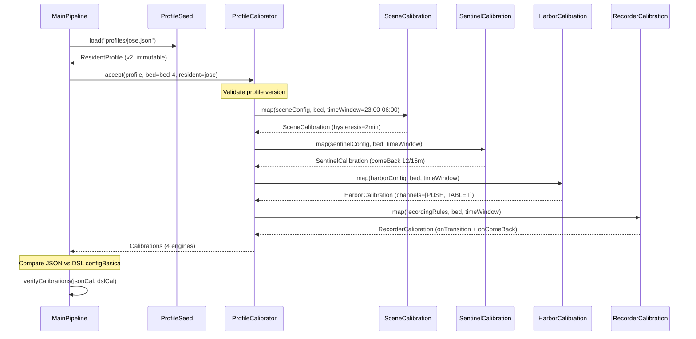
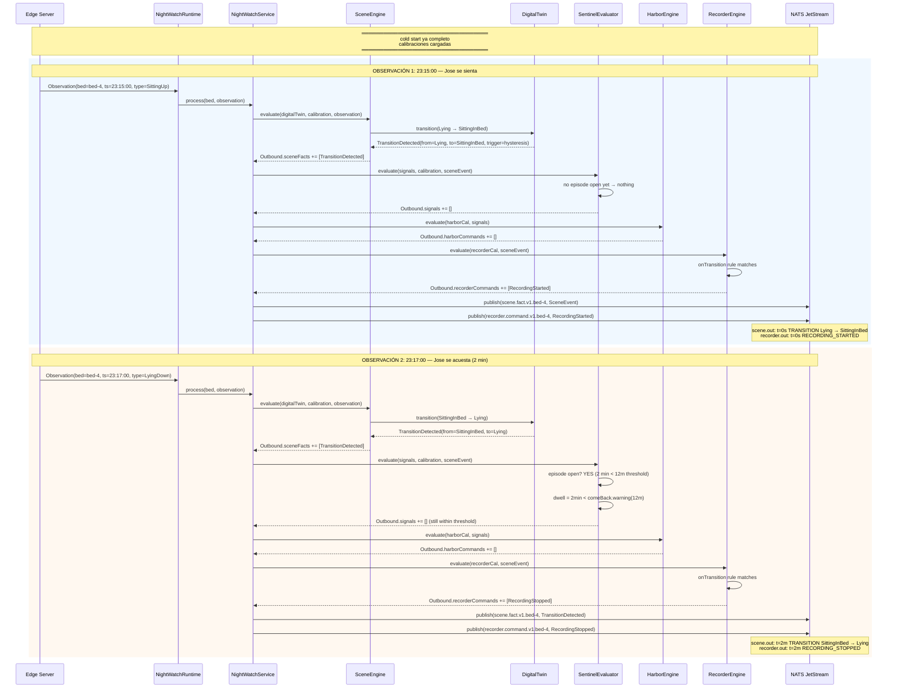
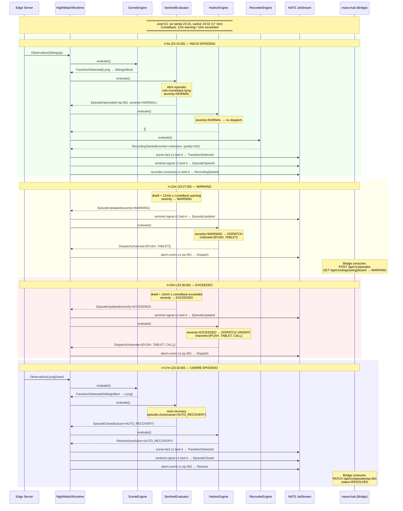
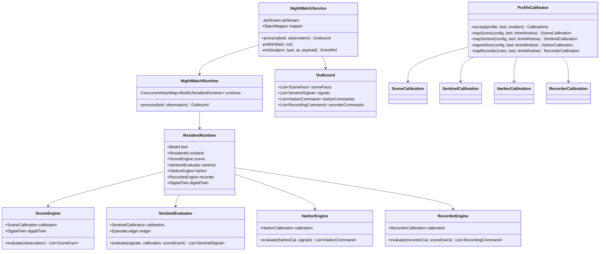
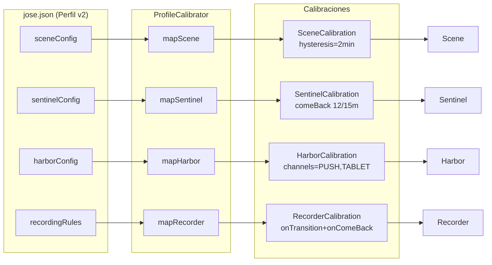
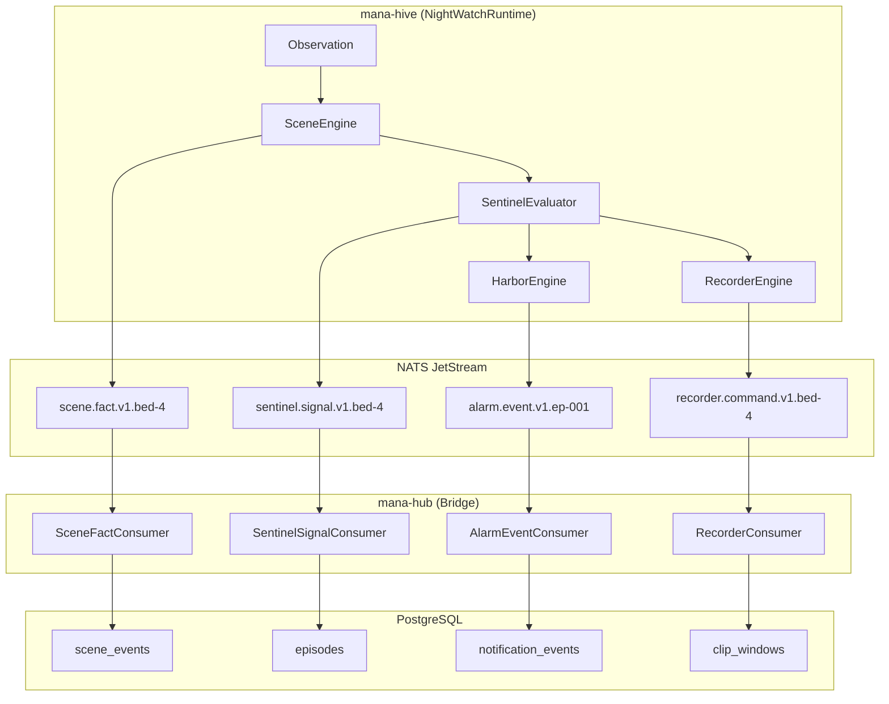

# Diagrama de Secuencia: José E1 — Flujo Completo

## 1. Arranque en Frío (Cold Start)

## 2. Pipeline Completa: Cada Observación

## 3. Escenario E1 Completo: 17 Minutos Sentado

## 4. Diagrama de Clases (Dominio)

## 5. Mapeo JSON → Calibraciones

## 6. Flujo de Eventos: Hive → Hub

