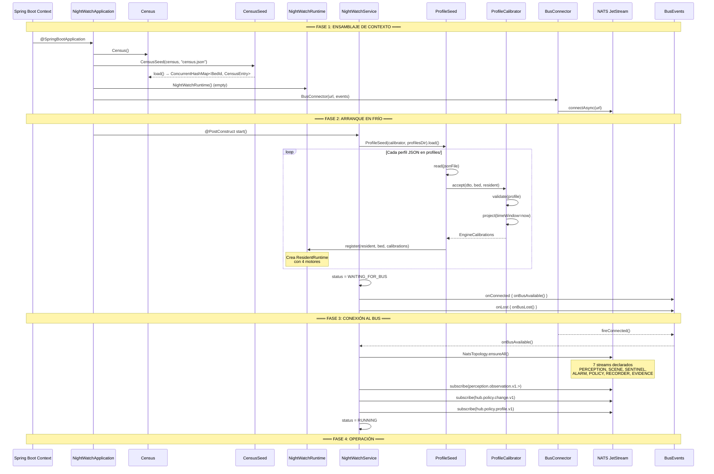
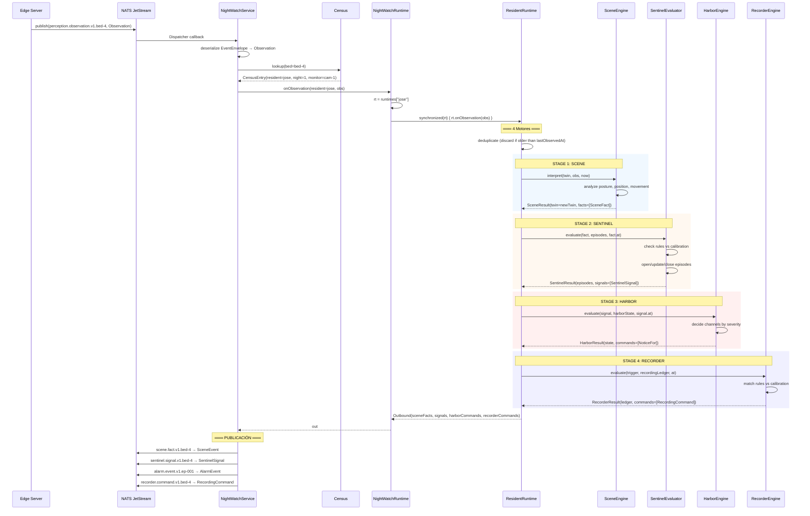
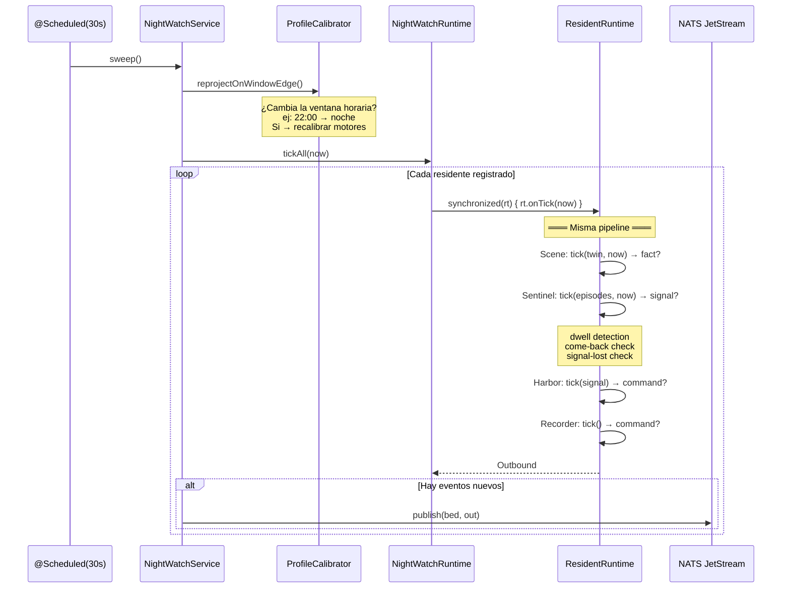
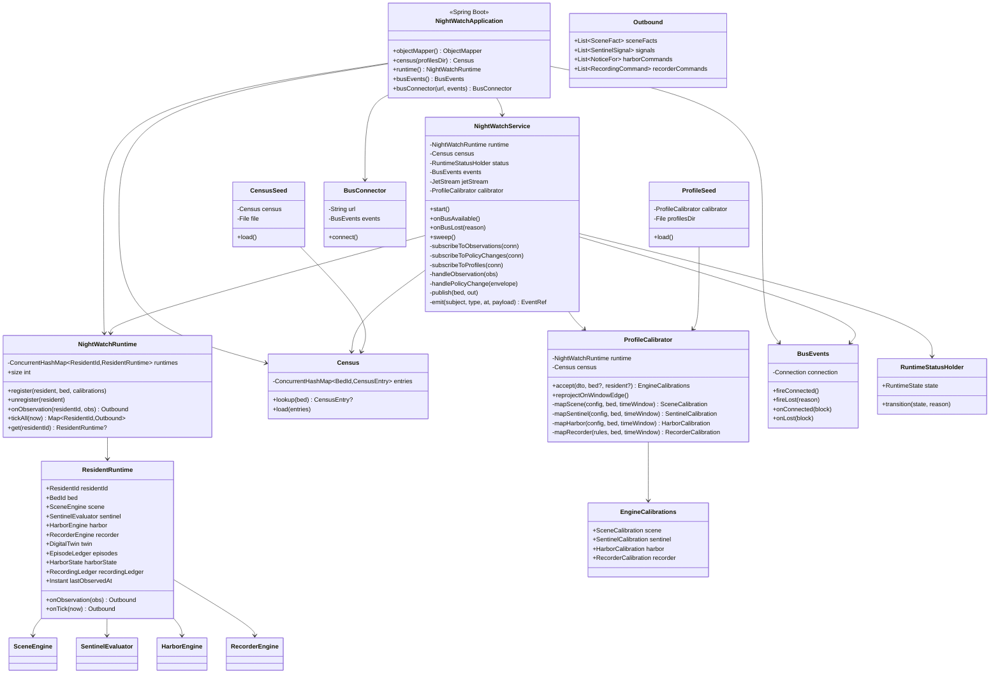
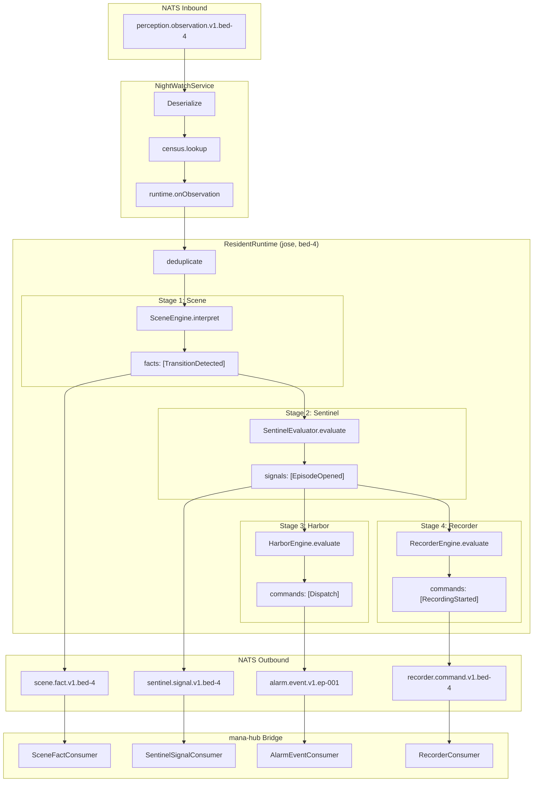

# ANEXO B: NightWatch Application — Flujo Completo

## 1. Ciclo de Vida de la Aplicación

## 2. Ingesta de Observaciones: NATS → Motores → NATS

## 3. Sweep Periódico (Cada 30s)

## 4. Diagrama de Clases: NightWatch Application

## 5. Observación → 4 Motores → Publicación

## 6. José E1: Timeline Completo

```mermaid
gantt
    title José E1: 17 Minutos Sentado
    dateFormat HH:mm
    axisFormat %H:%M
    
    section Sensor
    Observación SittingUp     :milestone, obs1, 23:15, 0h
    Observación LyingDown     :milestone, obs2, 23:32, 0h
    
    section Scene
    Transition Lying→Sitting   :active, scene1, 23:15, 23:17
    Transition Sitting→Lying   :active, scene2, 23:32, 23:32
    
    section Sentinel
    Episode Open (NORMAL)      :active, sent1, 23:15, 23:27
    Episode Updated (WARNING)  :crit, sent2, 23:27, 23:30
    Episode Updated (EXCEEDED) :crit, sent3, 23:30, 23:32
    Episode Closed             :done, sent4, 23:32, 23:32
    
    section Harbor
    No dispatch (NORMAL)       :milestone, h1, 23:15, 0h
    Dispatch PUSH+TABLET       :crit, h2, 23:27, 23:27
    Dispatch PUSH+TABLET+CALL  :crit, h3, 23:30, 23:30
    Resolve AUTO_RECOVERY       :done, h4, 23:32, 23:32
    
    section Recorder
    Recording Started           :active, r1, 23:15, 23:32
    Recording Stopped           :done, r2, 23:32, 23:32
```

